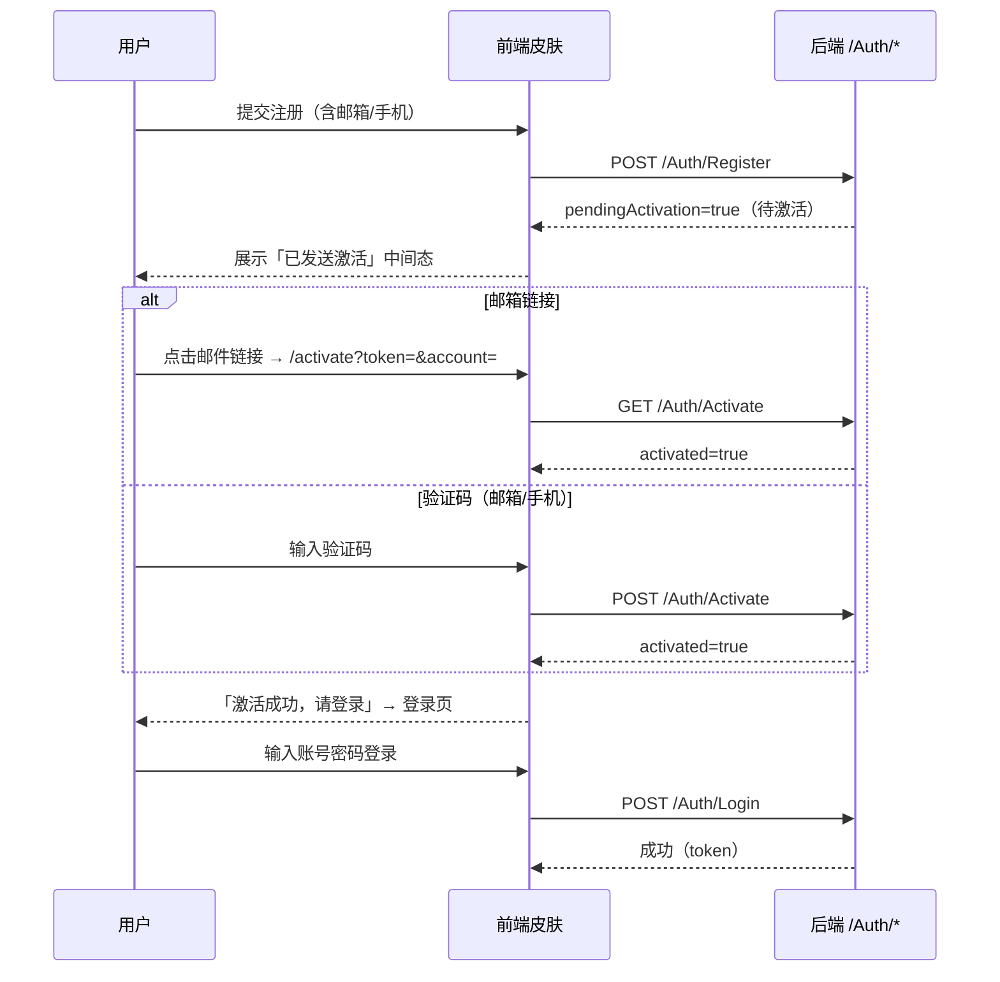

# 邮箱 / 手机验证（账号激活）

> 本文档是魔方**邮箱验证**与**手机验证**业务的权威契约文档，覆盖**三代 API 版**（`NewLife.Cube`）后端端点与各前端皮肤接入规范。
> 对应 GitHub issues：[#112 需要支持邮箱验证](https://github.com/NewLifeX/NewLife.Cube/issues/112)、[#113 需要支持手机验证](https://github.com/NewLifeX/NewLife.Cube/issues/113)。
> 其它前端皮肤（Vue/NaiveUI/ElementUI/React/Angular/Svelte/...）请严格按本文档 §5 接入指南实现。

---

## 1. 业务全景

账号验证解决「注册时确认用户对邮箱 / 手机号的所有权」问题。开启后，新注册账号处于**未激活**状态（`Enable=false`），**不能登录**，必须通过邮箱 / 手机完成激活后方可正常使用。

```
注册（需验证时）
  │  ① 提交注册（含邮箱/手机，必填）
  ▼
创建未激活账号（Enable=false）
  │  ② 发送激活：邮箱=激活链接+验证码 / 手机=短信验证码
  ▼
用户激活
  ├─ 邮箱：点击邮件内激活链接（GET /Auth/Activate） 或 输入邮件验证码（POST /Auth/Activate）
  └─ 手机：输入短信验证码（POST /Auth/Activate）
  ▼
账号激活（Enable=true + MailVerified/MobileVerified=true）→ 可登录
```

配套能力：

| 场景 | 说明 | 入口 |
|------|------|------|
| 重发激活 | 激活邮件/短信丢失或过期，未激活账号重新发送 | `POST /Auth/SendActivateCode`（登录页「未激活？重新发送」） |
| 未激活登录 | 未激活账号登录时明确提示「账号未激活」，而非「密码错误」 | `POST /Auth/Login` |
| 已注册再验证 | 已登录用户（如用户名注册未验证邮箱/手机）补充并验证联系方式 | `POST /Auth/VerifyContact`（安全中心） |
| 推送 | 已验证邮箱/手机后续可用于推送信息 | `NotificationRecord`（短信息表，见 §4.2） |

> **SSO 传递**：SSO 登录暂不向下传递邮箱/手机验证状态（issue 明确暂不做）。

---

## 2. 配置

### 2.1 总开关（CubeSetting）

| 配置 | 类型 | 默认 | 说明 |
|------|------|------|------|
| `RequireMailVerify` | Boolean | false | **是否需要邮箱验证**。开启后注册必须提供邮箱，注册后账号未激活，须激活邮箱才能登录 |
| `RequireMobileVerify` | Boolean | false | **是否需要手机验证**。开启后注册必须提供手机，注册后账号未激活，须激活手机才能登录 |
| `ActivateUrl` | String | 空 | **前端激活页地址**。用于拼邮箱激活链接，如 `https://xxx.com/activate`。为空时后端回退 `请求Host + /activate`（如 `http://localhost:5000/activate`） |

> 两个开关**同时开启**时，注册必须同时提供邮箱和手机，且**两者都激活**后才能登录。
> 开关开启但对应渠道（`EnableMail`/`EnableSms`）未启用或未配置渠道（`MailConfig`/`SmsConfig`）时，激活发送将失败并给出明确错误。

### 2.2 渠道配置（已有，沿用现有机制）

| 配置 | 说明 | 管理位置 |
|------|------|----------|
| `EnableMail` | 邮件渠道总开关 | 系统管理 → 系统配置 |
| `EnableSms` | 短信渠道总开关 | 系统管理 → 系统配置 |
| `MailConfig` | SMTP 服务器/端口/SSL/发件人/账号密码，多租户多渠道 | 系统管理 → 邮件配置 |
| `SmsConfig` | 服务商/AppKey/AppSecret/签名/方案名，多租户多渠道 | 系统管理 → 短信配置 |

> 邮件/短信渠道配置细节见 [`AUTH-验证码服务.md`](AUTH-验证码服务.md)。激活场景复用同一渠道：邮件走 `SendActivate`（激活链接+验证码正文），短信走 `SendActivate`（模板 `100005`，需在服务商侧配置激活短信模板，参数 `code`/`min`）。

---

## 3. API 端点契约

> 统一响应 `ApiResponse<T>`：`code=0` 成功，否则 `message` 为错误说明。

### 3.1 注册（改造）`POST /Auth/Register`

匿名。请求体（`AuthRegisterModel`）与现有注册一致，`category=password/mobile/mail/oauth`：

```json
{
  "category": "password",
  "username": "zhangsan",
  "email": "zhangsan@example.com",
  "mobile": "13800138000",
  "password": "P@ssw0rd",
  "confirmPassword": "P@ssw0rd",
  "code": "123456",
  "captchaId": "",
  "captchaCode": ""
}
```

**开关开启时的行为差异**：

| 条件 | 行为 |
|------|------|
| `RequireMailVerify=true` | 注册必须携带 `email`，否则返回错误「需要邮箱验证，请填写邮箱」 |
| `RequireMobileVerify=true` | 注册必须携带 `mobile`，否则返回错误「需要手机验证，请填写手机号」 |
| 双开关均开启 | 必须同时携带 `email` + `mobile` |
| 需要验证 | 创建**未激活**账号（`Enable=false`），**不自动登录、不下发 token**；向邮箱/手机发送激活；`code`（注册验证码）按现有流程校验 |

**成功响应（需要验证）**：

```json
{
  "code": 0,
  "message": "注册成功，请激活邮箱/手机",
  "data": {
    "pendingActivation": true,
    "channels": ["mail", "sms"],
    "targets": ["zhangsan@example.com", "13800138000"],
    "expireIn": 3600
  }
}
```

| 字段 | 说明 |
|------|------|
| `pendingActivation` | true 表示待激活（前端据此前端跳「已发送激活」中间态） |
| `channels` | 已发送激活的渠道列表：`mail` / `sms` |
| `targets` | 对应渠道的脱敏目标（邮箱/手机号），用于展示 |
| `expireIn` | 激活有效期（秒） |

**成功响应（无需验证，与现有一致）**：

```json
{ "code": 0, "data": { "accessToken": "...", "refreshToken": "..." } }
```

### 3.2 邮箱激活链接 `GET /Auth/Activate?token={token}&account={mail}`

匿名。激活邮件中的链接指向 `{ActivateUrl}?token={token}&account={urlencode(mail)}`，前端 `/activate` 页解析 query 后调用本端点。

**成功**：

```json
{ "code": 0, "data": { "activated": true, "username": "zhangsan" } }
```

**失败**（`code != 0`）：`token` 无效/过期、`account` 与 token 不匹配、账号不存在、账号已激活（幂等返回成功）。

### 3.3 验证码激活 `POST /Auth/Activate`

匿名。邮箱验证码 / 短信验证码通用：

```json
{ "channel": "mail", "account": "zhangsan@example.com", "code": "123456" }
```

| 字段 | 说明 |
|------|------|
| `channel` | `mail` 或 `sms` |
| `account` | 邮箱或手机号 |
| `code` | 邮件/短信中的验证码 |

**成功**：同上 `{ code: 0, data: { activated: true, username } }`。
**失败**：验证码错误/过期、账号不存在、账号已激活（幂等成功）。

### 3.4 重发激活 `POST /Auth/SendActivateCode`

匿名。用于未激活账号重新发送激活邮件/短信（登录页「未激活？重新发送」入口）：

```json
{ "channel": "mail", "account": "zhangsan@example.com" }
```

| 字段 | 说明 |
|------|------|
| `channel` | `mail` 或 `sms` |
| `account` | 邮箱或手机号 |

校验：账号存在且**未激活**（已激活返回「账号已激活，无需重复验证」）；邮箱发送新激活链接+验证码，手机发送新短信验证码；频控沿用现有机制（60 秒/次、IP 5 次/10 分钟，图片验证码场景见 `CaptchaScene & 4`）。

**成功**：

```json
{ "code": 0, "data": { "channel": "mail", "target": "zhangsan@example.com", "expireIn": 3600 } }
```

### 3.5 已登录用户验证/更换联系方式 `POST /Auth/VerifyContact`

需登录（`EntityAuthorize`）。用于安全中心「验证邮箱/验证手机/更换绑定」：

```json
{ "channel": "mail", "account": "new@example.com", "code": "123456" }
```

行为：校验验证码（`action=bind` 场景，通过 `POST /Auth/SendCode` 发送）→ 更新 `Mail`/`Mobile`（与当前不同时）→ 标记 `MailVerified`/`MobileVerified=true`。

**成功**：

```json
{ "code": 0, "data": { "mailVerified": true, "mobileVerified": false } }
```

### 3.6 登录配置下发（改造）`GET /Auth/LoginConfig`

匿名。`register` 对象新增两个字段，前端据此渲染注册表单与提示：

```json
{
  "register": {
    "enabled": true,
    "password": true,
    "sms": true,
    "mail": true,
    "captcha": false,
    "requireMailVerify": false,
    "requireMobileVerify": false
  }
}
```

### 3.7 登录（改造）`POST /Auth/Login`

匿名。未激活账号（`Enable=false`）登录时，返回**明确错误**而非「用户名或密码不正确」：

```json
{ "code": 1, "message": "账号未激活，请先通过邮箱/手机激活后登录" }
```

前端检测到该 message 时展示「未激活？重新发送激活」入口（`POST /Auth/SendActivateCode`）。

### 3.8 用户信息（改造）`GET /Auth/Info`

需登录。`UserInfo` 新增 `mailVerified` / `mobileVerified` 字段，供安全中心展示验证状态：

```json
{
  "code": 0,
  "data": {
    "id": 1,
    "name": "zhangsan",
    "mail": "zhangsan@example.com",
    "mobile": "13800138000",
    "mailVerified": true,
    "mobileVerified": false
  }
}
```

---

## 4. 数据表

### 4.1 验证表 `VerifyCodeRecord`（验证码记录）

复用现有实体（`NewLife.Cube.Entity.VerifyCodeRecord`，连接 `Log`），**无需新增表**。激活场景：

| 字段 | 值 |
|------|-----|
| `Action` | `Activate`（新增场景，与 Login/Reset/Bind/Notify/register 并列） |
| `Channel` | `Mail` / `Sms` |
| `Target` | 邮箱 / 手机号 |
| `Code` | 一次性激活令牌（邮箱）或验证码（邮箱/手机） |
| `UserId` | 注册用户编号 |
| `ExpireTime` | 激活有效期 |
| `VerifyTimes` / `LastVerifyResult` | 激活尝试与结果 |

### 4.2 短信息表 `NotificationRecord`（通知记录）

复用现有实体（`NewLife.Cube.Entity.NotificationRecord`，连接 `Log`），**无需新增表**。已验证邮箱/手机后续推送信息时使用：

| 字段 | 值 |
|------|-----|
| `Channel` | `Mail` / `Sms` / `InApp` / `WxMp` / `DingTalk` / `WeCom` |
| `UserId` | 目标用户 |
| `Target` | 已验证的邮箱 / 手机号 |
| `Action` | `Notify` / `Alert` 等 |

> 推送前应校验目标联系方式已 `MailVerified`/`MobileVerified`，避免向未验证地址推送。

### 4.3 用户表 `User`

XCode.Membership.User（Membership 连接）已有字段：

| 字段 | 说明 |
|------|------|
| `Enable` | false=未激活/禁用；激活成功后置 true |
| `MailVerified` | 邮箱已验证 |
| `MobileVerified` | 手机已验证 |

---

## 5. 前端皮肤接入指南

> 适用所有三代 API 前端皮肤。Vue 皮肤已实现（`NewLife.Cube.Vue`），以下为各皮肤应遵循的统一契约。

### 5.1 注册表单

1. 读取 `GET /Auth/LoginConfig`，按 `register.requireMailVerify` / `register.requireMobileVerify` 决定注册表单：
   - `requireMailVerify=true` → 邮箱**必填**（加红星与提示）
   - `requireMobileVerify=true` → 手机**必填**
   - 两者都 true → 邮箱+手机都必填
2. 用户名/手机/邮箱注册表单沿用现有字段：`category/username/email/mobile/password/confirmPassword/code`；发码按钮调 `POST /Auth/SendCode`（`action=register`）。
3. 提交 `POST /Auth/Register` 后按响应分流：
   - `data.accessToken` 存在 → 注册成功已登录，正常跳转
   - `data.pendingActivation === true` → **注册成功待激活**：展示「激活邮件/短信已发送至 {targets}」中间态，提示用户去激活，并提供「重新发送」（`POST /Auth/SendActivateCode`）

### 5.2 激活页（路由建议 `/activate`，免登录、无布局）

两种激活方式：

1. **邮箱链接直达**：解析 URL `?token={token}&account={mail}` → 调 `GET /Auth/Activate` → 成功显示「激活成功，请登录」并跳登录页；失败显示错误。
2. **验证码激活**：输入框（邮箱/手机 + 验证码 + 发送按钮）→ 调 `POST /Auth/Activate`。发送按钮可复用 `POST /Auth/SendCode`（`action=activate`）或 `POST /Auth/SendActivateCode`。

> `ActivateUrl` 配置的是**皮肤自己的激活页地址**，各皮肤部署时在系统配置中分别配置（如 Vue 配 `https://xxx/activate`）。

### 5.3 登录页

- 登录失败 message 含「未激活」时，展示「未激活？重新发送激活」入口：输入邮箱/手机 → `POST /Auth/SendActivateCode`。

### 5.4 安全中心（已登录用户）

- 从 `GET /Auth/Info` 的 `mailVerified` / `mobileVerified` 展示邮箱/手机验证状态（已验证/未验证徽标）。
- 「验证」入口：`POST /Auth/SendCode`（`action=bind`，channel 对应）发码 → `POST /Auth/VerifyContact` 提交验证码 → 刷新 `GET /Auth/Info`。

### 5.5 时序总览



---

## 6. API vs MVC 差异

| 维度 | 三代 API 版（NewLife.Cube） | MVC 版（NewLife.CubeNC） |
|------|------------------------------|---------------------------|
| 激活端点 | ✅ `AuthController` 提供（§3） | ❌ 不提供页面，后端共享服务能力顺带可用 |
| 前端页面 | ✅ Vue 已实现；本文档供其它皮肤实现 | ❌ 不实现 |
| 配置开关 | ✅ `CubeSetting.RequireMailVerify/RequireMobileVerify` | 共享 `UserService`/渠道服务，配置字段同样生效，但无页面入口 |
| 验证表/短信息表 | 共用 `VerifyCodeRecord` / `NotificationRecord` | 同左 |

---

## 7. 实现参考（后端）

| 组件 | 位置 | 说明 |
|------|------|------|
| `AccountActivateService` | `NewLife.Cube/Services/Auth/` | 注册待激活、激活、重发、VerifyContact 业务逻辑 |
| `AuthController` | `NewLife.Cube/Controllers/AuthController.cs` | 暴露 §3 全部端点（薄封装） |
| `MailService.SendActivate` | `NewLife.Cube/Services/MailService.cs` | 发送激活邮件（链接+验证码），记验证表 |
| `SmsService.SendActivate` | `NewLife.Cube/Services/SmsService.cs` | 发送激活短信（验证码），记验证表 |
| `IMailVerifyCode.SendActivate` / `SmtpMailVerifyCode` | `NewLife.Cube/Services/`（三代 API 原生，二代 MVC 不再包含） | 激活邮件提供者：`ActivateSubjectTemplate`/`ActivateBodyTemplate`，`{link}`/`{code}`/`{expire}` 占位 |
| `ISmsVerifyCode.SendActivate` / `AliyunSmsVerifyCode` | 同上 | 激活短信模板 `100005` |
| `CubeSetting` | `NewLife.Cube/Setting.cs` | 三个新配置项（§2.1） |
| `LoginConfigModel` | `NewLife.CubeNC/ViewModels/LoginConfigModel.cs` | `Register.RequireMailVerify/RequireMobileVerify` 下发 |
| `AuthCacheKeys` | `NewLife.Cube/Services/Auth/AuthCacheKeys.cs` | `SmsActivate*` / `MailActivate*` 缓存前缀 |

---

（完）
