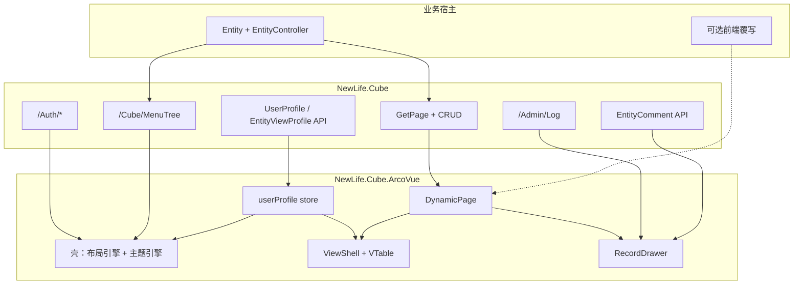

# NewLife.Cube.ArcoVue 企业中后台迁移与产品化方案

> 版本：2026-07-31（修订：MFA 文档出处、能力矩阵、测试要求、功能清单对齐、后端独立任务）  
> 状态：可落地执行稿  
> 适用范围：以 NewLife.Cube（WebAPI）为后端，将 NewLife.Cube.ArcoVue 建设为默认企业中后台皮肤；复用 NewLife.Cube.Vue 能力成果，对接字节官方组件栈，支持用户级呈现配置与 AI（OpenSpec）协作。

---

## 1. 背景与目标

### 1.1 背景

| 现状 | 说明 |
|------|------|
| NewLife.Cube | WebAPI 主线已具备认证、菜单、权限、`GetPage` 元数据驱动 CRUD |
| NewLife.Cube.Vue | 产品能力最完整（Element Plus + 微前端 + Section 覆写），但是默认皮肤之一，非 Arco 栈 |
| NewLife.Cube.ArcoVue | Gen-2 薄皮肤，已能登录/菜单/基础动态 CRUD，深度约为 Vue 的 15%–35% |
| 共享包 `@cube/*` | api-core / auth-logic / page-logic / field-mapping / page-utils 可跨皮肤复用 |

### 1.2 产品目标（必须达成）

1. **零配置自动 CRUD**：宿主仅 `UseArcoVue` 时，内置 Admin/Cube 与新增业务 `EntityController` 自动获得完整管理界面。
2. **飞书式多维数据工作台**：表格（自定义列）/ 树表 / 卡片 / 甘特；记录以**左侧抽屉**编辑，并含修改历史、用户评论。
3. **用户级可配置呈现**：导航布局、主题样式、列表默认视图与列布局等**禁止写死**，按用户（及可选租户/角色默认）配置生效。
4. **现代扁平视觉**：参考苹果 Human Interface / 飞书与 [Arco Design](https://arco.design/) 的扁平、留白、低噪点风格。
5. **业务增量开发模型**：新业务 = 新 .NET 项目 + 实体控制器；仅特殊页覆写前端。
6. **AI 协作可落地**：复用现有 GitHub Copilot 指令；OpenSpec 轻量变更；同时适配 VS Code Copilot 与 Cursor。

### 1.3 非目标（明确不做）

- 不做飞书云 OpenAPI / 多维表格云同步（交互范式对齐，非云产品对接）。
- 不整仓搬运 Cube.Vue 的 Element Plus 组件与微前端工程。
- 不改写已有 `.github/instructions` 组织级指令正文（只增量新增）。
- Cube.Vue 微前端多应用运行时、Cypress 全量套件、Element 主题体系等：见 §3.1 能力矩阵中目标为「➖」的项。

### 1.4 与 [功能清单.md](../功能清单.md) 的关系

本方案是 **SPA-7（ArcoVue）产品化 + 必要后端扩展** 的执行稿，不替代功能清单。对齐约定：

| 功能清单编码 | 与本方案关系 |
|--------------|--------------|
| SPA-1～3、SPA-7、SPA-15 | ArcoVue 宿主嵌入、回退路由、图表；本方案深化 SPA-7 |
| SPA-4 | Cube.Vue：能力对标与验收参照，非迁移源码目标 |
| AUTH-1～12、OAUTH-* | 前端对接；MFA 见 [认证接口设计.md](./认证接口设计.md)（`/Mfa/*`），非 [核心接口架构.md](./核心接口架构.md) 最小集 |
| DATA-1～11、SYS-3、SYS-16～20（LOV） | 元数据 CRUD / 审计 / 值集；ArcoVue 消费这些已有后端 |
| PERM-* | 菜单驱动路由与按钮权限位；数据权限/多租户以后端为准，皮肤透传 |
| **拟新增**（需回写功能清单） | `UserProfile`、`EntityViewProfile`、`EntityComment` — 写入 [Cube.xml](../../NewLife.Cube/Entity/Cube.xml) 后由 XCode 协作指令生成，见 §5.2.1 / §10.2 |

实施时：每个 OpenSpec 变更的 `design.md` 应标注触及的功能清单编码；归档后视情况更新 [功能清单.md](../功能清单.md) 实现/测试列。

---

## 2. 三视角需求

### 2.1 产品视角

| 能力 | 描述 | 优先级 |
|------|------|--------|
| 开箱即用后台 | 登录、菜单、权限、用户/角色/菜单/日志等内置模块可用 | P0 |
| 元数据驱动业务页 | 新实体配置字段与菜单后自动出页 | P0 |
| 多视图工作台 | table / tree / card / gantt 可切换，默认视图可记 | P0 |
| 记录抽屉 | 左抽屉：表单 / 历史 / 评论 | P0 |
| 个性化工作台 | 每用户布局、主题、视图偏好独立 | P0 |
| 覆写扩展 | Section / 整页 / FlowGram 流程页 | P1 |
| 工作流画布 | FlowGram 审批/业务流样例 | P1 |
| 字段级变更 diff | 结构化历史（相对 Log.Remark） | P2 |

**成功标准（产品）：**

- 业务研发零前端即可交付 80% 管理页。
- 不同角色用户打开同一系统，可看到各自布局/主题/默认列表视图。
- 视觉与交互达到「现代扁平、低干扰、高信息密度可控」。

### 2.2 用户视角

| 场景 | 期望体验 |
|------|----------|
| 首次进入 | 清晰品牌区 + 简洁侧栏/顶栏；默认浅色扁平主题，可选深色 |
| 日常列表 | 飞书多维表感觉：工具条干净、视图切换明显、列可拖拽显隐；大数据不卡顿（VTable） |
| 编辑记录 | 左侧抽屉滑入，不丢列表上下文；表单分区清晰；可看历史与评论 |
| 个性化 | 「外观设置」中切换布局（侧栏/顶栏/混合）、主题（浅/深/跟随系统）、密度（舒适/紧凑）；立即生效并记住 |
| 树/项目类数据 | 一键切树表或甘特（有日期字段时）；无能力时禁用并提示原因 |
| 权限不足 | 按钮隐藏或禁用，文案友好，不出现空白报错页 |

**可用性约束：**

- 主操作路径 ≤ 3 次点击到达常用实体。
- 列表首屏有意义内容；空态有引导。
- 动效克制（200–300ms 级），符合扁平产品习惯，避免炫光与厚重阴影。

### 2.3 技术视角

| 维度 | 决策 |
|------|------|
| 后端契约 | 最小集见 [核心接口架构.md](./核心接口架构.md)；MFA 见 [认证接口设计.md](./认证接口设计.md) `/Mfa/*`（AUTH-10）；Profile/Comment 见独立后端任务 |
| UI 栈 | Arco Design Vue（壳/表单）+ VisActor VTable（多维视图）+ FlowGram.AI（流程，后期） |
| 逻辑复用 | `@cube/*`；接线模板优先对照 NaiveUI，能力验收对照 §3.1 矩阵 |
| 呈现配置 | `UserProfile` + `EntityViewProfile`（后端独立交付，前端消费，见 §5 / §10.1） |
| 扩展 | `registerSection` + `apps/` 整页覆写 |
| 协作 | 恢复 `.github` Copilot 指令；OpenSpec（OSC-0000）；测试要求见 §9.3 |
| 测试 | 对齐 `development.instructions.md`：实现功能默认同步补充测试 |

---

## 3. 可行性结论与能力矩阵

**可行。** 迁移本质是「能力对齐 + Arco/VTable 重做 UI + 偏好配置层」，不是复制 Cube.Vue。

| 维度 | 判断 |
|------|------|
| API/认证/菜单 | ArcoVue 已走 `@cube/api-core` / auth-logic；最小集对齐核心接口架构；MFA 对齐认证接口设计 |
| 自动 CRUD | 后端完备；ArcoVue 需接入 `usePageLogic` 并产品化 |
| 多视图/抽屉 | 前端新建；**UserProfile / EntityViewProfile / EntityComment 为 Cube 核心后端扩展**，独立排期 |
| 工作量 | 后端独立 OSC + 前端 M0–M6（约 2–3 个迭代月，视人力浮动） |

**为何接线阶段对标 NaiveUI、能力对标 Cube.Vue：**

- NaiveUI 与 ArcoVue 同为 Gen-2 薄皮肤，DynamicPage / 路由 / FieldMapping 同构，适合做「怎么接」。
- Cube.Vue 是能力与验收清单来源（见下表），Element Plus 实现不可直接搬。

### 3.1 Cube.Vue ↔ ArcoVue 能力矩阵

图例：✅ 完整　🟠 基础/部分　❌ 无　➖ 本方案不做（非目标）

| 能力 | 功能清单/说明 | Cube.Vue | ArcoVue 现状 | 目标 | 优先级 |
|------|---------------|:--------:|:------------:|:----:|:------:|
| 动态 CRUD（GetPage 列表/表单） | DATA-1/4/5/6，SPA-7 | ✅ | 🟠 基础 | ✅ | P0 |
| 菜单驱动路由 + 鉴权守卫 | PERM-3，SPA-1 | ✅ | 🟠 catch-all | ✅ | P0 |
| 登录（密码/验证码/OAuth） | AUTH-2/6/8，OAUTH-1 | ✅ | 🟠 | ✅ | P0 |
| Token 刷新 / 登出 | AUTH-3 | ✅ | 🟠 | ✅ | P0 |
| MFA 二步验证 UI | AUTH-10，`/Mfa/*` | ✅ | ❌ | ✅ | P1 |
| Challenge / 验证码登录增强 | AUTH-4/5 | ✅ | 🟠 | ✅ | P1 |
| 导入导出 | DATA-9 | ✅ | 🟠 | ✅ | P0 |
| 批量删除 | DATA-10 | ✅ | 🟠 | ✅ | P0 |
| 批量其它操作（启用/禁用等） | 工具条扩展 | ✅ | ❌ | 🟠 | P2 |
| 图表 GetChartData | SPA-15 | ✅ | 🟠 | ✅ | P1 |
| 字段控件矩阵（含上传/JSON/富文本等） | DATA-11 等 | 🟠～✅ | 🟠 基础 | ✅ | P0 |
| LOV 选择器 | SYS-16～20 | ✅ | ❌ | ✅ | P1 |
| 多页签 TagsView | 壳 | ✅ | ❌ | ✅ | P0 |
| 多布局（侧/顶/混合）可配置 | → UserProfile | ✅ 多布局 | ❌ 写死 | ✅ 配置化 | P0 |
| 主题/密度/i18n | 壳 | ✅ | 🟠 暗色开关 | ✅ | P0 |
| UserProfile 持久化 | **后端新建** | ➖/局部 | ❌ | ✅ | P0 |
| EntityViewProfile（列/视图） | **后端新建** | ➖/局部 | ❌ | ✅ | P0 |
| VTable 表格+自定义列 | 本方案增强 | 🟠 DOM 表 | ❌ | ✅ | P0 |
| 树表视图 | DATA-3 | 🟠 部分页 | ❌ | ✅ | P0 |
| 卡片视图 | Vue 有未接线 stub | ❌ | ❌ | ✅ | P0 |
| 甘特视图 | 本方案新建 | ❌ | ❌ | ✅ | P0 |
| 左侧记录抽屉 | 本方案 | ❌ 多为弹层 | ❌ | ✅ | P0 |
| 修改历史（Log 筛选） | SYS-3 | 🟠 独立日志页 | ❌ | ✅ 抽屉 Tab | P0 |
| 实体评论 EntityComment | **后端新建** | ❌ | ❌ | ✅ | P0 |
| Section 页面覆写 | Vue skills | ✅ | ❌ | ✅ | P1 |
| apps 自定义业务页 | cube-admin 等 | ✅ | ❌ | 🟠 机制+高频页 | P1 |
| 微前端多应用运行时 | Vue microApp | ✅ | ❌ | ➖ | — |
| FlowGram 工作流画布 | 本方案 | ❌ | ❌ | ✅ 样例 | P1 |
| 字段级变更 diff | 相对 Log | ❌ | ❌ | ➖ 一期 / P2 二期 | P2 |
| 单元/组件测试体系 | Vue Vitest 等 | ✅ | ❌ | ✅ 关键路径 | P0 |
| E2E（Cypress 级） | Vue | ✅ | ❌ | 🟠 冒烟即可 | P2 |
| 嵌入 NuGet / UseArcoVue | SPA-2/3/7 | ✅ UseVue | ✅ | ✅ | P0 |

矩阵随里程碑更新「ArcoVue 现状」列；目标为 ➖ 的项不得在 OSC 中膨胀为必做范围。

---

## 4. 架构设计

### 4.1 总体架构



### 4.2 前端目录（目标）

```
NewLife.Cube.ArcoVue/web/src/
├── api/                      # createCubeApi + userProfile/entityViewProfile/comment/history
├── stores/                   # user / app / tabs / userProfile
├── router/                   # 菜单动态路由 + 守卫 + keep-alive
├── layouts/                  # layout 实现：side / top / mix（由 UserProfile 选择）
├── theme/                    # Design Token + Arco 主题注入（非写死颜色）
├── components/fields/        # FieldInput 矩阵
├── features/
│   ├── multi-view/           # 视图切换编排
│   ├── vtable/               # VTable / Gantt 适配
│   ├── record-drawer/        # 左抽屉三 Tab
│   └── flowgram/             # 工作流（后期）
├── views/dynamic/
├── views/login/
├── views/settings/           # 外观与工作台设置页（读写 UserProfile）
├── apps/                     # 可选整页覆写
└── i18n/
```

### 4.3 官方组件栈分工（强制）

| 层级 | 技术 | 职责 |
|------|------|------|
| 设计系统 / 壳 / 表单 | [Arco Design Vue](https://arco.design/) | 布局容器、导航、页签、登录、抽屉、表单控件、反馈 |
| 多维数据视图 | [VisActor VTable](https://visactor.com/vtable)（+ gantt） | 表格列布局、树表、卡片式布局、甘特；禁止长期以 `a-table` 做主多维表 |
| 工作流 | [FlowGram.AI](https://flowgram.ai/) | 审批/业务流程图（M5） |
| 领域逻辑 | `@cube/*` | API、认证、列表状态机、字段映射 |

---

## 5. 用户呈现配置（核心：禁止硬编码）

导航布局、主题、列表视图等必须走 **配置 → 引擎渲染**，使不同用户可有不同呈现。

### 5.1 配置分层

| 层级 | 作用 | 覆盖关系 |
|------|------|----------|
| 系统默认 | 产品出厂默认（扁平浅色、侧栏布局、表格视图） | 最低 |
| 租户/应用默认（可选） | 企业品牌色、默认布局 | 覆盖系统 |
| 角色默认（可选） | 如运营角色默认紧凑密度 | 覆盖租户 |
| **UserProfile / EntityViewProfile** | 个人最终呈现与实体视图 | **最高** |

读取顺序：`用户 > 角色 > 租户 > 系统`。

### 5.2 对象模型

两个持久化对象分工明确（另加评论实体）：

| 对象 | 作用域 | 职责 |
|------|--------|------|
| **UserProfile** | 按用户一条（或按用户+应用） | 导航布局、主题样式、工作台全局默认 |
| **EntityViewProfile** | 按用户 + 实体（typePath）多条 | 视图类型、列布局、甘特/卡片映射、筛选记忆 |
| **EntityComment** | 按实体记录多条 | 用户评论 |

#### 5.2.1 建模与代码生成（Cube.xml + 已有协作指令）

三个实体**必须**落入魔方实体模型文件，**禁止**手写整份实体类绕过生成器：

| 步骤 | 说明 |
|------|------|
| 1. 改模型 | 在 [`NewLife.Cube/Entity/Cube.xml`](../../NewLife.Cube/Entity/Cube.xml) 的 `<Tables>` 中新增三张 `Table`（沿用文件内 `Option`：`Namespace=NewLife.Cube.Entity`、`ConnName=Cube`、`ModelClass={name}Model` 等） |
| 2. 触发生成 | 按已有 **XCode 协作指令**（`.github/instructions/xcode.instructions.md`，由 `copilot-instructions.md` 路由命中「XCode/实体生成/Model.xml」等信号）：在 `Entity` 目录执行 `xcode` / `xcodetool`，生成实体与 `Models/*Model` |
| 3. API 层 | 生成完成后，再按 **Cube 协作指令**（`cube.instructions.md`）为三实体补齐 API 控制器与测试——同属 **OSC-0002**，**不在 ArcoVue 工程内** |

Agent / Copilot 实施约定：OSC-0002 的 `tasks.md` 首项应为「编辑 Cube.xml（三表）→ 运行实体生成 → 再写三套 API」，`verify.md` 核对生成物与 xml 一致、无大段手写实体骨架。

**Cube.xml 表结构建议（实施时由 Agent 按此写入并微调）：**

| Table | 关键列（示意） | 索引 |
|-------|----------------|------|
| UserProfile | Id；UserId；LayoutJson / ThemeJson / WorkspaceJson（或单一 ProfileJson）；Version；Enable；Create*/Update* | Unique(UserId) |
| EntityViewProfile | Id；UserId；TypePath；View；ColumnsJson；**ViewsJson**；**ActiveViewId**；GanttJson；CardJson；FiltersJson；Version；Create*/Update* | Unique(UserId, TypePath)；命名视图存 ViewsJson |
| EntityComment | Id；Category；LinkId；**ParentId / RootId / ReplyUserId / ReplyUser**；Content；CreateUser/Id/IP/Time；Update* | (Category, LinkId)；ParentId；RootId；CreateUserID |

嵌套配置（layout/theme/columns 等）以 **JSON 文本列** 落库，与 §5.2 逻辑模型对应；API 层序列化为前端 TypeScript 形状。

逻辑模型（API/前端契约，对应上述 JSON 或展开字段）：

```ts
/** 用户级外观与工作台 — 实体 UserProfile */
interface UserProfileDto {
  version: 1
  userId: number | string
  layout: {
    mode: 'side' | 'top' | 'mix'
    siderCollapsed: boolean
    siderWidth: number
    showTabs: boolean
    contentWidth: 'fluid' | 'fixed'
  }
  theme: {
    appearance: 'light' | 'dark' | 'system'
    primaryColor: string
    radius: 'sm' | 'md' | 'lg'
    density: 'comfortable' | 'compact'
    fontScale: 'normal' | 'large'
  }
  workspace: {
    defaultView: 'table' | 'tree' | 'card' | 'gantt'
    pageSize: number
  }
}

/** 实体视图自定义 — 实体 EntityViewProfile；唯一键 userId + typePath */
interface EntityViewProfileDto {
  version: 1
  userId: number | string
  typePath: string
  view: 'table' | 'tree' | 'card' | 'gantt'
  /** 权威：多命名视图 JSON 字符串（ViewsJson） */
  viewsJson?: string
  activeViewId?: string
  columns?: Array<{
    key: string
    visible: boolean
    width?: number
    frozen?: 'left' | 'right' | false
    title?: string
  }>
  gantt?: { startField?: string; endField?: string; titleField?: string }
  card?: { titleField?: string; subtitleField?: string; statusField?: string; coverField?: string }
  filters?: Record<string, unknown>
}
```

### 5.3 存储与 API

| 阶段 | 策略 |
|------|------|
| 前端可先行 | `localStorage`：`cube.arco.userProfile.{userId}`、`cube.arco.entityViewProfile.{userId}.{typePath}` |
| **后端权威** | **OSC-0002**：一次改 **Cube.xml**（三表）并经 XCode 指令生成，再挂齐三套 API；**非 ArcoVue 内实现** |
| 冲突 | 服务端成功拉取后覆盖本地；本地脏写防抖保存（300–500ms） |

**建议 API（由后端 OSC 定稿，名称可按 Cube Area 惯例微调）：**

```
GET    /Cube/UserProfile
PUT    /Cube/UserProfile                 # body: UserProfile 字段子集

GET    /Cube/EntityViewProfile?typePath=Admin/User
PUT    /Cube/EntityViewProfile           # body: EntityViewProfile（含 typePath）
DELETE /Cube/EntityViewProfile?typePath=Admin/User   # 恢复该实体默认视图

GET    /Cube/EntityComment?category=&linkId=&parentId=
POST   /Cube/EntityComment               # body 可含 parentId 表示回复
DELETE /Cube/EntityComment?id=
```

`EntityComment` **同表回复**（不新增表）：`ParentId`（0=顶层）、`RootId`（线程根）、`ReplyUserId` / `ReplyUser`（被回复作者）。`GET` 的 `parentId` 可选：缺省/负数=全部，`0`=仅顶层，`>0`=该父评论的直接回复。

**实现约束：**

- `layouts/*` 只注册实现，**不在路由里写死唯一布局**；根布局读 `userProfile.layout.mode` 动态 `<component :is>`。
- 主题通过 CSS Variables + Arco `ConfigProvider` 注入，**禁止**在业务组件写死主色/背景。
- `DynamicPage` / ViewShell 读当前用户的 `EntityViewProfile`（按 `typePath`）；无则回落 `UserProfile.workspace.defaultView`，再回落系统默认。
- 列布局、视图切换的保存写入 **EntityViewProfile**；外观设置页写入 **UserProfile**。
- 提供「外观设置」页与顶栏快捷入口（主题、密度）；支持「恢复默认」（删或重置对应 Profile）。

### 5.4 与权限的关系

- `UserProfile` 布局/主题属个人配置，不占用菜单权限位。
- `EntityViewProfile` 视图切换不绕过 `canAdd/Edit/Delete/Export/Import`。
- 甘特拖拽改期必须受 `canEdit` 约束。

---

## 6. 视觉与交互规范（苹果 / 飞书扁平风）

### 6.1 设计原则

1. **扁平与层级靠留白/分割线**，避免多层厚重阴影与炫光。
2. **中性背景 + 单一品牌强调色**（默认接近飞书/Arco 蓝；可由 `UserProfile.theme` 覆盖）。
3. **信息密度可调**：舒适 / 紧凑两档，影响表行高、表单项间距。
4. **动效克制**：抽屉/页签切换短时缓动；列表滚动性能优先（Canvas 表）。
5. **图标线性、字重克制**：标题与正文层级清晰，避免装饰性插画挤占首屏。

### 6.2 Design Token（示例，实施时落入 `theme/tokens.css`）

```css
:root {
  --cube-color-bg: #f5f6f7;
  --cube-color-surface: #ffffff;
  --cube-color-border: rgba(0, 0, 0, 0.06);
  --cube-color-text: rgba(0, 0, 0, 0.88);
  --cube-color-text-secondary: rgba(0, 0, 0, 0.45);
  --cube-color-primary: #3370ff; /* 可由用户偏好覆盖 */
  --cube-radius-sm: 6px;
  --cube-radius-md: 8px;
  --cube-space-page: 16px 20px;
  --cube-font: "SF Pro Text", "PingFang SC", "Segoe UI", "Helvetica Neue", Arial, sans-serif;
}
[data-theme="dark"] { /* 对应 token 反色，保持扁平 */ }
```

与 Arco 主题变量映射，保证组件与自研壳一致。

### 6.3 关键界面结构（默认 side 布局）

- 顶栏：产品名/Logo、全局搜索（可后期）、主题切换、用户菜单——扁平、低分隔。
- 侧栏：图标 + 文案；激活态用浅底或左边线，避免厚重选中块。
- 内容区：页签（可关）+ 工具条 + VTable 主舞台。
- 抽屉：自左侧推入（宽度可配，默认 480–640），遮罩轻量。

---

## 7. 多视图与抽屉（飞书多维表范式）

### 7.1 ViewShell

| 视图 | 实现 | 启用条件 |
|------|------|----------|
| table | VTable ListTable + 列布局偏好 | 默认 |
| tree | VTable tree | 实体为树或存在 Parent 字段 / EntityTree 数据 |
| card | VTable 自定义布局或卡片模式 | 配置了 card 字段映射或可自动推断 title |
| gantt | VisActor 甘特 | 存在可映射的起止日期字段 |

视图切换器绑定当前 `typePath` 的 **EntityViewProfile.view**，切换即持久化该 Profile。

### 7.2 左侧 RecordDrawer

| Tab | 数据 | 说明 |
|-----|------|------|
| 表单 | `getDetail` + add/edit fields | 校验、LOV、高级控件；保存刷新视图 |
| 历史 | `GET /Admin/Log?category=&linkid=` | 筛时间/用户/动作；一期展示 Remark |
| 评论 | **新建** EntityComment API | 列表/发表/删（本人或管理员） |

### 7.3 后端新建（评论）

建议 `EntityComment`：`Category`、`LinkId`、`Content`、**ParentId / RootId / ReplyUserId / ReplyUser**（同表回复）、创建人信息等。  
API：`GET/POST/DELETE /Cube/EntityComment`；POST 传 `parentId` 即可回复，不另建回复表。
供所有皮肤复用，不绑死 ArcoVue。

---

## 8. 零配置 CRUD 与业务扩展

### 8.1 自动生成路径

1. 菜单来自 `/Cube/MenuTree`。
2. **B3 叶路由**：有 `url` 的节点扁平 `addRoute` 到 Layout（文件夹不嵌套子路由）；`props: { type, authId }`；优先 `apps/*/src/views/**/index.vue` 整页覆写，否则 `DynamicPage`。
3. **DynamicPage** 为薄宿主：解析 Section `DefaultListPage` 覆写，否则挂载 **DefaultList** 微内核（GetPage → fieldControl → 列表/搜索/LOV → **右侧**抽屉）。
4. 点击行打开 **右侧 RecordDrawer**（`placement="right"`；表单 / 历史 / 评论预留）；微内核**不读**布局/主题 store（契约隔离）。
5. 多视图 ViewShell / VTable 由后续 OSC-0005+ 在 Section 上替换表格实现。

### 8.2 业务侧日常开发

1. 新建业务类库/宿主，引用 `NewLife.Cube`、`NewLife.Cube.ArcoVue`。
2. 实体 + `EntityController` / `EntityTreeController`，配置 List/Form 字段与菜单。
3. `AddCube` / `UseCube` / `UseArcoVue`。
4. 默认零前端；需要时：
   - **Section 覆写**：Search / Toolbar / View / DrawerTabs
   - **整页覆写**：`apps/{biz}/...`
   - **流程页**：FlowGram 画布

### 8.3 Cube.Vue 成果复用边界

| 复用 | 重写 |
|------|------|
| `@cube/*`、菜单路由思想、LOV/密码规则等逻辑、Section 概念、能力清单 | 全部 Element Plus UI、Vue `core/views`、旧 layout 壳 |

---

## 9. AI 协作与 OpenSpec（Copilot + Cursor）

### 9.1 资产位置与复用原则

| 原则 | 说明 |
|------|------|
| 组织资产 | 优先**编排** NewLife.Skills 已有 instructions / skills / agents，**不改**其正文 |
| 增量资产 | **暂不**写入 NewLife.Skills；统一放在 [`NewLife.Cube.ArcoVue/openspec/`](../../NewLife.Cube.ArcoVue/openspec/) |
| Cube 仓 `.github` | 仍可从 `origin/x-master` **原样恢复**指令副本（若本机未安装 Skills）；禁止为 ArcoVue 改写已有 instructions 正文 |
| Cube.Vue/skills | 仅作行为对照；执行 Arco 时禁止照抄 Element Plus |

### 9.2 轻量变更结构与状态机

变更根目录：`NewLife.Cube.ArcoVue/openspec/`。编号 **OSC-0000** 按落地顺序严格递增，禁止为依赖预留空洞号。

```
NewLife.Cube.ArcoVue/openspec/
├── README.md
├── agents/                   # 薄壳编排 Agent（openspec-*）
├── harness/lessons.md
└── changes/
    ├── OSC-0002 后端三实体/   # 命名：OSC-00xx + 空格 + 简洁中文描述
    │   ├── status.md         # 状态机（必选）
    │   ├── proposal.md / design.md / tasks.md / verify.md / retro.md
    │   └── ui/               # 可选
    └── archive/
        └── OSC-0001 协作基线与通路/
```

进行中与归档目录均使用 **`OSC-00xx <简洁中文描述>`**（禁止仅编号或英文 slug）。

| 产物 | 必选 |
|------|------|
| `status.md` | **是** |
| proposal / design / tasks / verify / retro | **是** |
| `ui/` | **否**（有 UI/UX 才建） |

**状态流转：**

```
Draft → Accepted → Implementing → Validating → Done
  ↘ Rejected
```

| 状态 | 含义 | 阶段 | 推进方 |
|------|------|------|--------|
| `Draft` | 草案已创建 | 创建后 | `openspec-create` |
| `Accepted` | 已批准，允许执行 | 批准后 | `openspec-approve`（通过时） |
| `Rejected` | 批准未通过 / 明确拒绝 | 批准分支 | `openspec-approve`（不通过或「拒绝 OSC-」） |
| `Implementing` | 执行中（含测试） | **执行** | `openspec-apply` |
| `Validating` | 验收中/验收通过待复盘 | **验收** | `openspec-verify`（进入验收写 Validating；通过后保持 Validating 直至复盘，或注明 checklist passed） |
| `Done` | 已复盘归档 | **复盘** | `openspec-retro` |

说明：执行阶段状态名为 **`Implementing`**（不再使用 InProgress）。验收阶段为 **`Validating`**。终态为 **`Done`**（不再使用 Archived/Verified）。

**硬门禁：**

- 仅当 `status` 为 `Accepted`（首次执行）或 `Implementing`（续跑）时，才允许 `openspec-apply` 改业务代码。
- `Draft` / `Rejected` / `Validating` / `Done` 禁止执行（`Validating` 未通过需回到 Implementing 修复时，由 verify 明确回写 Implementing）。
- **测试与构建（强制）：** 凡本 OSC 触及**前端或后端代码**修改：
  1. **执行（Implementing）**：必须按 `dev-loop` **跑单元测试**（并同步补测）；不得以「无业务逻辑」跳过跑测（仅纯文档 / 纯 OpenSpec 文案变更可在 proposal 声明 N/A）。
  2. **验收（Validating）**：**本阶段新增的单元测试必须全部通过**；相关工程 **构建成功且无错误抛出**。任一项失败 → 验收不通过，回写 `Implementing`。

批准**不手写**：用户说「批准 OSC-0001」「推进 OSC-0001 到 Accepted」时，由 `openspec-approve` 自动更新 `status.md`。不通过或「拒绝 OSC-0001」→ `Rejected`。

### 9.3 五阶段薄壳 Agent（编排 NewLife.Skills）

路径：`NewLife.Cube.ArcoVue/openspec/agents/`，命名 `openspec-*`。薄壳只做编排与写 OSC 产物；实现委托 Skills。

| 阶段 | Agent | 触发示例 | 编排的 NewLife.Skills | 状态动作 |
|------|-------|----------|----------------------|----------|
| **创建** | `openspec-create` | `创建 OSC-0001：…` | development + `development-process` | → `Draft` |
| **批准** | `openspec-approve` | `批准 OSC-0001` / `推进 OSC-0001 到 Accepted` | 对照方案矩阵/清单/依赖 | 通过 → `Accepted`；不通过/拒绝 → `Rejected` |
| **执行** | `openspec-apply` | `执行 OSC-0001` | 先校验 Accepted；委托 **dev-loop**（**含单元测试**） | → `Implementing` |
| **验收** | `openspec-verify` | `验收 OSC-0001` | ① implementation-audit → ② code-review → ③ doc-sync；**核对本阶段新增单测全过 + 构建无错误** | → `Validating`；失败可回 `Implementing` |
| **复盘** | `openspec-retro` | `复盘 OSC-0001` | development-process 回顾 | 归档 → `Done` |

不设独立测试 Agent。确有需要再新增 Agent。

### 9.4 五件套中的测试要求

对齐 Skills 的 development / `testing-strategy` 与 `dev-loop`：proposal/design/tasks/verify/retro 均须含测试相关段落。

| 场景 | 执行阶段 | 验收阶段 |
|------|----------|----------|
| 改前端和/或后端代码 | 必须跑相关单元测试；实现功能默认同步补测 | **本 OSC 新增单测全部通过**；`dotnet build` / `pnpm build`（触及侧）**无错误** |
| 仅文档 / 仅 openspec 文案 | proposal 可写测试 N/A | 无强制单测；仍核对文档 AC |

最低水位：后端 XUnitTest；Arco 逻辑 Vitest；UI 关键路径自动化或 verify 冒烟（冒烟**不能替代**上述单元测试与构建门禁）。

### 9.5 design.md 必含：核心文档影响

| 文档路径 | 影响类型 | 说明 |
|----------|----------|------|
| NewLife.Cube.ArcoVue/web/README.md | 新增/修改/无 | … |
| NewLife.Cube.ArcoVue/web/docs/** | … | … |
| Doc/Api/内置前端皮肤.md 等 | … | … |
| Doc/功能清单.md | 若新增后端能力 | 回写编码与测试列 |
| Doc/Api/核心接口架构.md | 若新增 API | 补路径；MFA 交叉引用认证接口设计 |

`openspec-apply` 必须按表改文档；`openspec-verify` 经 doc-sync 核对。

### 9.6 双工具入口

| 工具 | 入口 |
|------|------|
| VS Code Copilot | 安装 NewLife.Skills；使用 openspec/agents 薄壳 + 触发语；批准用语自动改 status |
| Cursor | 读 NewLife.Cube.ArcoVue/openspec/README.md；同等状态机门禁 |
| 未来 Agent | 只认 openspec README + status.md + 五壳职责 |

---

## 10. 分期里程碑与验收

工作拆为两条线：**Cube 核心后端（独立 OSC）** 与 **ArcoVue 前端（依赖后端接口就绪）**。前端可用 localStorage 先行，但总验收以服务端 Profile/Comment 为准。

### 10.1 编号与切片原则

1. **顺序递增**：按计划落地次序编号 `OSC-0001`、`OSC-0002`…，不预留 0010 段给后端。  
2. **依赖在前**：被依赖的 Cube 后端变更排在消费方前端变更之前。  
3. **范围适中**：单 OSC 聚焦一条可验收主线（例如「只做 UserProfile API」或「只做 VTable 表格+列布局」）；四视图、抽屉三 Tab 等拆开，避免一个变更塞满整个里程碑。

### 10.2 后端独立任务（NewLife.Cube，排在消费方之前）

以下为 **Cube 核心扩展**，单独 OSC、单独测、回写功能清单与核心接口架构；**禁止**塞进 ArcoVue UI 变更顺带实现。

**统一建模路径（单一变更 OSC-0002）：** 编辑 [`NewLife.Cube/Entity/Cube.xml`](../../NewLife.Cube/Entity/Cube.xml) 一次加入三表 → **xcode.instructions / Agent** 生成实体与 Model → **cube.instructions** 补齐三套 API 与测试（见 §5.2.1）。

| OSC | 交付物 | 范围控制 | 测试最低要求 |
|-----|--------|----------|--------------|
| **OSC-0002** | Cube.xml：**UserProfile** + **EntityViewProfile** + **EntityComment** → 生成 → 三套 API | 仅 NewLife.Cube + 测试/文档；**不含**任何 ArcoVue UI | XUnitTest 覆盖三实体：鉴权、读写、唯一约束、Comment 按 category+linkId |

### 10.3 前端与协作里程碑（对应顺序 OSC）

### M0 — 协作基线与通路 → **OSC-0001**

- 落地 `NewLife.Cube.ArcoVue/openspec/`（五壳 Agent + harness；见 §9）；用 `openspec-create` 建 OSC-0001。
- ArcoVue 代理 `/Auth` + `/Mfa`；`UseArcoVue` 冒烟；依赖 spike 写入 design。
- **出口：** 状态机可跑通「创建→批准→…」；登录通路通。

### M1 — 零配置 CRUD → **OSC-0003**（加宽 A2；可与 OSC-0002 并行，评论 Tab 合并顺序 0002 优先）

- 动态路由 B3、`DynamicPage` + Cube.Vue 同构微内核（fieldControl / LOV / Section·apps / 树表 / GetChartData / **右侧**抽屉表单+历史）。
- Arco 本地控件适配；Vitest 关键路径。
- **不含**布局引擎/主题持久化/多页签产品化（→ OSC-0004）；**不含** VTable 多视图（→ OSC-0005+）。
- **出口：** 冒烟 Admin/User·Role·Menu·Log；元数据 CRUD + LOV/树/图表/覆写/抽屉可用。

### M2 — 壳 + 消费 UserProfile → **OSC-0004**（依赖 **OSC-0002**）

- 布局/主题/密度/页签 + 外观设置；对接 UserProfile。
- **不含** VTable 多视图。
- **出口（OSC-0004）：** ArcoVue `RootLayout` 动态 `side`/`top`/`mix`；主题 `light`/`dark`/`system` + 密度；TagsView；`/settings/appearance`；`GET/PUT /Cube/UserProfile`（线缆字段 `layoutJson`/`themeJson`/`workspaceJson`）；CRUD 微内核不读壳偏好。

### M3a — VTable 表格 + 列布局 → **OSC-0005**（依赖 **OSC-0002**）

- ListTable、列显隐/顺序/宽度/左冻结、表头排序、写 EntityViewProfile。
- **多命名视图**（仅 `table`）：`ViewsJson` + `ActiveViewId`；默认种子「默认列表」（兼容旧种子「列表」）。
- **不含** tree/card/gantt 类型切换（下一号）；列表扁平（树启发式已移除）。
- **出口（OSC-0005）：** DefaultList 主表为 VTable；命名视图工具条 + 字段设置；`GET/PUT/DELETE /Cube/EntityViewProfile`。

### M3b — 树 / 卡片 / 甘特 → **OSC-0006**（依赖 OSC-0005）

- 三视图与字段映射；可选 ui/。

### M4a — 左抽屉表单 + Log 历史 → **OSC-0007**

- 编辑/历史 Tab；**不含**评论（下一号）。

### M4b — 评论 Tab → **OSC-0008**（依赖 **OSC-0002** + OSC-0007）

- 消费 EntityComment。

### M5 — FlowGram 样例 → **OSC-0009**

- 单一样例 + 文档；不扩平台级流程引擎。

### M6 — 硬化 → **OSC-0010**（收口）

- 矩阵现状列、功能清单回写、冒烟、harness；无大功能开发。

### 总验收清单

- [ ] 仅 `UseArcoVue`：Admin + 新业务实体自动 CRUD  
- [x] **OSC-0002** 三实体后端已合并且带 XUnitTest  
- [x] 布局/主题来自 UserProfile（OSC-0004）；列表视图/列来自 EntityViewProfile（→ OSC-0005+）  
- [ ] 四视图 + 左抽屉三 Tab；评论走 EntityComment  
- [ ] §3.1 矩阵 P0 目标达成（或书面豁免）  
- [ ] 功能清单可追溯；各 OSC 含测试设计与 verify 记录  
- [ ] OSC 编号连续、依赖方编号大于被依赖方  

---

## 11. 风险与缓解

| 风险 | 缓解 |
|------|------|
| 硬编码回潮 | Code Review / rule：禁止写死 layout/theme；UserProfile 读取单测 |
| 后端与前端耦在同一 OSC | §10.1 强制拆分；前端可先 localStorage，总验收等 API |
| `/Mfa` 与核心接口架构不一致 | 代理仍转发；文档交叉引用；认证细节以认证接口设计为准 |
| VTable 集成复杂 | 单一 `features/vtable` 适配层 |
| 有实现无测试 | §9.3 五件套强制测试段落；CI 跑相关用例 |
| 文档/功能清单漂移 | design 影响表 + 功能清单回写任务 |
| 旧 Copilot 指令被改 | 白名单只增不改 |

---

## 12. 核心文档同步清单（实施时维护）

| 文档 | 用途 |
|------|------|
| [NewLife.Cube.ArcoVue/web/README.md](../../NewLife.Cube.ArcoVue/web/README.md) | 皮肤开发入口 |
| [`NewLife.Cube/Entity/Cube.xml`](../../NewLife.Cube/Entity/Cube.xml) | 三实体 Table 定义（生成源） |
| 拟建 `NewLife.Cube.ArcoVue/web/docs/` | Pref 消费、多视图、覆写、测试约定 |
| [内置前端皮肤.md](./内置前端皮肤.md) | SPA-7 能力矩阵 |
| [前端对接指南.md](./前端对接指南.md) | Profile / Comment 对接 |
| [核心接口架构.md](./核心接口架构.md) | 高级接口：UserProfile、EntityViewProfile、EntityComment；**建议**增加 MFA → 认证接口设计 交叉引用 |
| [认证接口设计.md](./认证接口设计.md) | `/Mfa/*` 权威定义（AUTH-10） |
| [功能清单.md](../功能清单.md) | 新增 Profile/Comment 编码；更新 SPA-7/测试列 |
| 根 README 皮肤表/端口 | 若脚本或默认皮肤变化 |

---

## 13. 附录：首批 OpenSpec 变更顺序表

按 **落地顺序连续编号**；被依赖项在前。每号必选五件套（§9.3）；有界面则加 `ui/`。单号范围见「范围」列，避免回潮成「大而全」变更。

| 编号 | 主题 | 范围（控制） | 依赖 |
|------|------|--------------|------|
| OSC-0001 | 协作基线：openspec 五壳就绪、代理 `/Auth` `/Mfa`、核心接口架构 MFA 交叉引用 | 无业务功能大改 | — |
| OSC-0002 | 后端三实体：**UserProfile** + **EntityViewProfile** + **EntityComment**（Cube.xml → xcode → 三套 API） | 仅 NewLife.Cube + 测试/文档；无 Arco UI | — |
| OSC-0003 | ArcoVue **零配置 CRUD 微内核**（B3 路由 + DynamicPage + fieldControl/LOV/树/图表/Section·apps + **右侧**抽屉表单/历史） | 不含壳主题/TagsView；不含 VTable；评论 Tab 预留 | OSC-0001；评论接线软依赖 0002 |
| OSC-0004 | 布局/主题引擎 + **消费** UserProfile | 不含 VTable | OSC-0002 |
| OSC-0005 | VTable **表格** + 列布局 + **消费** EntityViewProfile | 不含 tree/card/gantt；可替换 0003 默认 a-table Section | OSC-0002、建议 OSC-0003 |
| OSC-0006 | 卡片 / 甘特等视图增强（树表基础能力已在 0003） | 不含抽屉 | OSC-0005 |
| OSC-0007 | 记录抽屉 **增强**（历史筛选 UX 等；右侧表单骨架已在 0003） | 不含评论 | OSC-0003 |
| OSC-0008 | 抽屉评论 Tab + **消费** EntityComment | 仅评论链路 | OSC-0002、OSC-0003/0007 |
| OSC-0009 | FlowGram 单一样例 | 不扩流程平台 | — |
| OSC-0010 | 收口：矩阵/功能清单/冒烟/harness | 无新功能 | 建议前述 P0 已完成 |

后续能力（LOV、MFA UI、Section/apps 等）自 **OSC-0011** 起顺延新增，仍保持「依赖在前、一号一事」。

---

## 14. 小结

本方案将 NewLife.Cube.ArcoVue 定位为 **WebAPI 版企业中后台默认皮肤**；协作增量在 **`NewLife.Cube.ArcoVue/openspec/`**（五壳 `openspec-*` 编排 NewLife.Skills；状态 `Draft → Accepted → Implementing → Validating → Done`，分支 `Rejected`；仅 Accepted/Implementing 可执行；触及前后端代码须跑单测，验收须本阶段新增单测全过且构建无错误；验收固定 audit→review→doc-sync）；三实体 OSC-0002 写入 Cube.xml 生成；编号严格递增。
