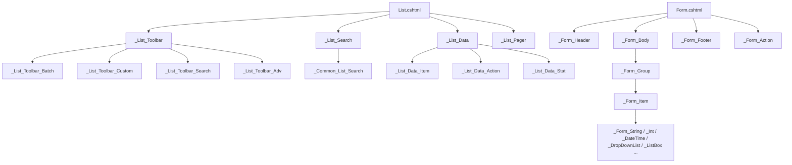

# 第14章 视图体系

> 本章介绍魔方的 Razor 视图体系，包括视图覆写机制、嵌入式资源和常用视图模板。
> 
> 视图体系是魔方页面展示的核心，理解它有助于进行页面定制。

---

## 14.1 Razor 视图体系概述

### 视图文件结构

魔方的视图文件遵循 ASP.NET Core MVC 的标准结构：

```
Areas/
└── Admin/
    └── Views/
        ├── _ViewImports.cshtml
        ├── _ViewStart.cshtml
        ├── Shared/
        │   ├── _Layout.cshtml
        │   ├── _Layout_Header.cshtml
        │   ├── _Layout_Footer.cshtml
        │   ├── _Left.cshtml
        │   ├── _List_Toolbar.cshtml
        │   ├── _List_Search.cshtml
        │   ├── _List_Data.cshtml
        │   ├── _Form_Header.cshtml
        │   ├── _Form_Body.cshtml
        │   └── _Form_Item.cshtml
        ├── User/
        │   ├── Index.cshtml
        │   ├── Form.cshtml
        │   └── Detail.cshtml
        └── Product/
            ├── Index.cshtml
            └── Form.cshtml
```

### 视图查找顺序

魔方通过 `ThemeViewLocationExpander` 扩展 Razor 视图引擎的查找路径，按以下优先级从高到低查找视图（`{Theme}` 由 `CubeSetting.Current.Theme` 决定，默认 `ACE`）：

1. `Areas/{Area}/Views/{Controller}_{Theme}/{Action}.cshtml` — 控制器×主题
2. `Areas/{Area}/Views/{Controller}/{Action}.cshtml` — 控制器
3. `Areas/{Area}/Views/{Theme}/{Action}.cshtml` — 区域×主题
4. `Areas/{Area}/Views/Shared/{Action}.cshtml` — 区域共享
5. `Views/{Theme}/{Action}.cshtml` — 应用×主题
6. `Views/Shared/{Action}.cshtml` — 应用共享
7. 魔方程序集嵌入资源（兜底）

分片视图（如 `_List_Search`、`_Form_Item`）使用同一套查找顺序：在控制器目录放同名分片即可"局部覆盖"，在 Shared 目录放同名分片即为全局兜底。查找过程与命中详情可借助[视图解析诊断工具](#1463-视图解析诊断工具)查看。

---

## 14.2 视图覆写机制

### 子项目同路径覆盖

在子项目中创建同名视图文件即可覆盖魔方默认视图：

```
MyWebApp/                          # 子项目
└── Areas/
    └── Admin/
        └── Views/
            └── User/
                └── Index.cshtml   # 覆盖默认用户列表页
```

### 覆写示例

覆盖产品列表页：

```csharp
// 1. 创建目录结构
// Areas/Admin/Views/Product/Index.cshtml

// 2. 编写自定义视图
@model Pager
@{
    ViewBag.Title = "产品管理";
}

<div class="content-wrapper">
    <section class="content-header">
        <h1>@ViewBag.Title</h1>
    </section>
    
    <section class="content">
        <!-- 自定义内容 -->
        @Html.Partial("_List_Toolbar")
        @Html.Partial("_List_Search")
        @Html.Partial("_List_Data")
    </section>
</div>
```

---

## 14.3 嵌入式资源（CubeEmbeddedFileProvider）

### 嵌入式资源原理

魔方将默认视图作为嵌入式资源打包在 DLL 中：

```csharp
// 注册嵌入式资源提供程序
services.Configure<RazorViewEngineOptions>(options =>
{
    options.FileProviders.Add(new CubeEmbeddedFileProvider(typeof(CubeService).Assembly));
});
```

### 主题皮肤的嵌入式资源

各主题皮肤包同样使用嵌入式资源：

```csharp
// AdminLTE 主题
options.FileProviders.Add(new CubeEmbeddedFileProvider(typeof(AdminLTEModule).Assembly));

// Tabler 主题
options.FileProviders.Add(new CubeEmbeddedFileProvider(typeof(TablerModule).Assembly));
```

---

## 14.4 常用视图模板

### 列表页（List.cshtml）

```html
@model Pager
@{
    var page = Model;
    var fields = ViewBag.Fields as IList<DataField>;
    var list = ViewBag.Page as IList<IEntity>;
}

<div class="box">
    <!-- 工具栏 -->
    @Html.Partial("_List_Toolbar")
    
    <!-- 搜索区 -->
    @Html.Partial("_List_Search")
    
    <!-- 数据表格 -->
    <div class="box-body table-responsive no-padding">
        <table class="table table-hover">
            <thead>
                <tr>
                    <th><input type="checkbox" id="checkAll" /></th>
                    @foreach (var field in fields)
                    {
                        <th>@field.DisplayName</th>
                    }
                    <th>操作</th>
                </tr>
            </thead>
            <tbody>
                @foreach (var entity in list)
                {
                    <tr>
                        <td><input type="checkbox" name="keys" value="@entity["Id"]" /></td>
                        @foreach (var field in fields)
                        {
                            <td>@field.GetValue(entity)</td>
                        }
                        <td>
                            <a href="Edit/@entity["Id"]">编辑</a>
                            <a href="Delete/@entity["Id"]" onclick="return confirm('确定删除？')">删除</a>
                        </td>
                    </tr>
                }
            </tbody>
        </table>
    </div>
    
    <!-- 分页 -->
    @Html.Partial("_List_Pager")
</div>
```

### 表单页（Form.cshtml / AddForm / EditForm）

```html
@model IEntity
@{
    var entity = Model;
    var fields = ViewBag.Fields as IList<DataField>;
}

<form action="@(entity.IsNullKey ? "Insert" : "Update")" method="post">
    @Html.AntiForgeryToken()
    
    @if (!entity.IsNullKey)
    {
        <input type="hidden" name="Id" value="@entity["Id"]" />
    }
    
    <div class="box-body">
        @foreach (var field in fields)
        {
            @Html.Partial("_Form_Item", new { Field = field, Entity = entity })
        }
    </div>
    
    <div class="box-footer">
        <button type="submit" class="btn btn-primary">保存</button>
        <a href="Index" class="btn btn-default">返回</a>
    </div>
</form>
```

### 详情页（Detail.cshtml）

```html
@model IEntity
@{
    var entity = Model;
    var fields = ViewBag.Fields as IList<DataField>;
}

<div class="box">
    <div class="box-header">
        <h3 class="box-title">详情</h3>
    </div>
    
    <div class="box-body">
        <table class="table table-bordered">
            @foreach (var field in fields)
            {
                <tr>
                    <th style="width: 200px;">@field.DisplayName</th>
                    <td>@field.GetValue(entity)</td>
                </tr>
            }
        </table>
    </div>
    
    <div class="box-footer">
        <a href="Edit/@entity["Id"]" class="btn btn-primary">编辑</a>
        <a href="Index" class="btn btn-default">返回</a>
    </div>
</div>
```

### 树形列表（ListTree.cshtml）

```html
@model Pager
@{
    var tree = ViewBag.Tree as IList<IEntity>;
}

<div class="box">
    <div class="box-body">
        <ul class="tree-view">
            @await Html.PartialAsync("_TreeNode", tree)
        </ul>
    </div>
</div>

@* _TreeNode.cshtml *@
@model IList<IEntity>
@foreach (var node in Model)
{
    <li>
        <span>@node["Name"]</span>
        @if (node["Childs"] is IList<IEntity> children && children.Count > 0)
        {
            <ul>
                @await Html.PartialAsync("_TreeNode", children)
            </ul>
        }
    </li>
}
```

---

## 14.5 视图分片架构

> 魔方 MVC 版的核心设计：**把列表页/表单页拆成大量小分片，主视图按约定装配；每个分片都可在任意粒度被局部覆盖**。理解分片体系，才能精准定位"改哪里"。

### 14.5.1 分片理念

- **抽取共性**：工具栏、分页、搜索框、表单控件渲染等公共逻辑只实现一次，全系统复用。
- **数据驱动**：分片大多基于 `ViewBag` 元数据（`Factory`/`Page`/`Fields`/`SearchFields`/`PageSetting`）渲染。因此**大多数定制不需要碰视图**，只需配置 `ListFields`/`FormFields`/`SearchFields`，视图自动跟随。
- **局部覆盖**：分片覆盖是元数据表达不了时的最后手段，可在任意粒度（全局/区域/控制器/主题）生效。
- **全局兜底**：`Views/Shared/` 中的分片是最低优先级的默认实现；下游放同名物理文件即覆盖。

### 14.5.2 列表页分片地图

| 分片 | 职责 | 数据契约 |
|------|------|----------|
| `List.cshtml` | 列表页主视图，装配工具栏/搜索/数据/分页 | `ViewBag.Factory/Page/Fields/PageSetting/Charts` |
| `ListTree.cshtml` | 树形列表主视图 | 同上，装配 `_ListTree_Data` |
| `_List_Toolbar` | 工具栏容器 | `ViewBag.PageSetting` |
| `_List_Toolbar_Batch` | 批量删除按钮 | `PageSetting.EnableBatch` |
| `_List_Toolbar_Custom` | 自定义按钮区 | — |
| `_List_Toolbar_Search` | 关键字搜索框（Q） | `Pager` |
| `_List_Toolbar_Adv` | 高级菜单（导出/导入/删除/备份） | `ViewBag.User`、`Pager`、`SysConfig.Develop` |
| `_List_Search` | 搜索区，默认委托 `_Common_List_Search` | `ViewBag.Factory/Page` |
| `_Common_List_Search` | 通用搜索表单（按 `SearchFields` 渲染） | `ViewBag.SearchFields/Factory/Page` |
| `_List_Data` | 数据表格（表头+行） | `ViewBag.Fields/PageSetting`、`Model` |
| `_List_Data_Item` | 单个单元格 | `EntityField` |
| `_List_Data_Action` | 操作列（编辑/删除/恢复） | `IEntity`、`PageSetting`、权限 |
| `_List_Data_Stat` | 统计行 | `IEntity` |
| `_List_Pager` / `_List_Pager1` | 分页 | `Pager` |
| `_ListTree_Data` | 树形数据 | — |

### 14.5.3 表单页分片地图

| 分片 | 职责 | 数据契约 |
|------|------|----------|
| `Form.cshtml` | 表单页主视图，装配 `_Form_Header/Body/Footer/Action` | `Model`(IEntity)、`ViewBag.Fields` |
| `AddForm.cshtml` / `EditForm.cshtml` | 新增/编辑表单入口 | 委托 `Form.cshtml` |
| `Detail.cshtml` | 详情页主视图，复用 `_Form_Body/Footer` | `Model`(IEntity)、`ViewBag.Fields` |
| `ObjectForm.cshtml` | 配置类表单 | — |
| `_Form_Header` | 状态消息条 | `ViewBag.StatusMessage`、ModelState |
| `_Form_Body` | 表单主体，按字段分组渲染 | `ViewBag.Fields`、`FormField.GroupView` |
| `_Form_Footer` | 表单底部 | — |
| `_Form_Action` | 提交/取消按钮 | `Model`(IEntity)、权限 |
| `_Form_Group` | 字段组容器，按类型分发 | `EntityField` |
| `_Form_Item` | 单字段渲染（label+input），按 DataSource/ItemType 分发 | `EntityField`、`ViewBag.Fields` |
| `_Form_String` / `_Form_Int` / `_Form_Double` / `_Form_Decimal` / `_Form_Boolean` / `_Form_DateTime` | 基础类型输入控件 | `ItemModel` |
| `_Form_BigText` / `_Form_Html` / `_Form_Markdown` / `_Form_Editor` | 大文本/富文本 | `ItemModel` |
| `_Form_DropDownList` / `_Form_ListBox` | 单选/多选 | `ListBoxModel` |
| `_Form_File` / `_Form_Image` / `_Form_Map` | 文件/图片/地图 | `ItemModel` |
| `_Area1` ~ `_Area4` | 省市区级联 | `EntityField` / 字符串 |

### 14.5.4 其它公共分片

| 分片 | 职责 |
|------|------|
| `_Layout.cshtml` / `_Layout_Header` / `_Layout_Footer` / `_Layout_Nav` | 全局布局与分段 |
| `_Left` / `_Left_Item` / `_Navbar` | 侧边栏与导航（主题目录） |
| `_DateRange` | 时间范围搜索 |
| `_Enable` | 启用开关 |
| `_SelectUser` / `_SelectDepartment` | 选择用户/部门 |
| `_ECharts` | 图表 |
| `_AiAssistant` / `_AiDiagnoseModal` | AI 助手 |
| `_Icon_Arrow` / `_Icon_Boolean` | 图标 |

### 14.5.5 装配链



### 14.5.6 使用部分视图

```html
<!-- 引用部分视图 -->
@Html.Partial("_List_Toolbar")

<!-- 带参数的部分视图 -->
@Html.Partial("_Form_Item", new { Field = field, Entity = entity })

<!-- 异步部分视图 -->
@await Html.PartialAsync("_List_Data", Model)
```

---

## 14.6 覆盖优先级与排查

### 14.6.1 完整覆盖优先级

`ThemeViewLocationExpander` 在 Razor 默认查找路径中按位置插入主题路径，最终覆盖优先级（从高到低）：

| 优先级 | 路径 | 作用域 | 仓库真实示例 |
|--------|------|--------|--------------|
| 1 | `Areas/{Area}/Views/{Controller}_{Theme}/{Action}.cshtml` | 控制器×主题 | `Areas/Admin/Views/Db_layui/`、`File_layui/`、`Index_layui/` |
| 2 | `Areas/{Area}/Views/{Controller}/{Action}.cshtml` | 控制器 | `Areas/Admin/Views/User/_List_Search.cshtml` |
| 3 | `Areas/{Area}/Views/{Theme}/{Action}.cshtml` | 区域×主题 | `Areas/Admin/Views/layui/_Object_Nav.cshtml` |
| 4 | `Areas/{Area}/Views/Shared/{Action}.cshtml` | 区域共享 | `Areas/Admin/Views/Shared/_User_Nav.cshtml` |
| 5 | `Views/{Theme}/{Action}.cshtml` | 应用×主题 | `Views/ACE/_Layout.cshtml`、`Views/layui/List.cshtml` |
| 6 | `Views/Shared/{Action}.cshtml` | 应用共享（默认兜底） | `Views/Shared/_List_*.cshtml`、`_Form_*.cshtml` |
| 7 | 魔方程序集嵌入资源 | 框架兜底 | DLL 内编译视图 |

**常见覆盖场景速查**：

| 想定制什么 | 覆盖哪个分片 | 放哪里 |
|------------|--------------|--------|
| 某个控制器的搜索区 | `_List_Search.cshtml` | `Areas/{Area}/Views/{Controller}/` |
| 某区域的搜索区 | `_List_Search.cshtml` | `Areas/{Area}/Views/Shared/` |
| 全系统搜索区 | `_List_Search.cshtml` | `Views/Shared/` |
| 操作列按钮 | `_List_Data_Action.cshtml` | 对应作用域 |
| 工具栏/导出菜单 | `_List_Toolbar*.cshtml` | 对应作用域 |
| 表单控件渲染 | `_Form_*.cshtml` | 对应作用域 |
| 页面布局 | `_Layout.cshtml` | `Views/{Theme}/` |
| 导航分片 | 自定义分片名 | 通过 `PageSetting.NavView` 指定 |

> 布局提示：`List.cshtml`/`Form.cshtml`/`Detail.cshtml`/`ListTree.cshtml` 内部强制 `Layout = "~/Views/{Theme}/_Layout.cshtml"`，避免下游自定义 Layout 串扰魔方内部页。

### 14.6.2 覆盖不生效排查清单

覆盖视图不生效时，按以下顺序排查：

1. **路径是否正确**：确认文件放在 7 级优先级中的目标层级，且目录名（区域/控制器/主题）与请求完全一致（大小写敏感）。
2. **文件名是否一致**：分片名必须与 `Html.PartialAsync("...")` 引用名一致；嵌入资源中 `-`/`@` 会映射为 `_`。
3. **是否被更高优先级遮蔽**：同名文件若存在于更高优先级层级（如控制器×主题、主题目录），会遮蔽你的覆盖。
4. **主题是否匹配**：覆盖放在 `Views/{Theme}/` 时，确认 `CubeSetting.Theme` 与该目录名一致。
5. **是否被嵌入资源遮蔽**：物理文件优先级高于嵌入资源，一般不会发生；确认文件确实编译进项目（`Content` 项存在）。
6. **是否缓存**：Razor 视图查找有缓存，开发期改动视图后刷新页面即可；修改视图引擎相关代码需重启。

### 14.6.3 视图解析诊断工具

魔方内置**视图解析诊断页**（仅开发模式 + 系统管理员可见），入口有两个：

- 直接访问 `/Cube/ViewTrace`；
- 任意列表页"高级"菜单（开发模式 + 系统管理员时可见）中的"视图解析诊断"。

输入区域/控制器/视图/主题，即可查看：

- 理论候选路径（7 级优先级）；
- 物理文件是否存在（是否放对了位置）；
- 视图引擎实际查找的完整位置列表与命中结果（真实渲染所使用的视图）。

用于快速定位"覆盖不生效"是路径错误、命名错误还是被更高优先级遮蔽。

> 实现说明：候选路径生成逻辑（`ViewLocationHelper`）与视图引擎的 `ThemeViewLocationExpander` **共享同一套主题插入规则**（单一事实源），保证诊断展示与实际渲染一致，不会漂移。

---

## 14.7 架构评价与改进建议

### 14.7.1 优点

1. **任意粒度的局部定制**：从改一个单元格/按钮（`_List_Data_Item`/`_List_Data_Action`）到改搜索区（`_List_Search`）到换整页，都能精准覆盖，互不干扰。
2. **抽取共性、避免重复**：工具栏、分页、搜索、表单控件渲染只写一次，全系统复用；主题只需覆盖自己不同的分片。
3. **数据驱动降低成本**：绝大多数场景配置字段即完成，不写视图代码，对使用者友好。
4. **主题体系天然融合**：`{Theme}` 目录与 Shared 目录同构，主题定制 = 覆盖同名分片，ACE/layui 共用同一套机制。
5. **嵌入资源 + 物理回退**：默认视图打进 DLL，下游放同名物理文件即可覆盖，无需改包升级。

### 14.7.2 痛点

1. **分片多、命名靠约定**：Shared 下 60+ 分片，靠 `_List_*`/`_Form_*` 前缀约定而非强制，新手难以定位"改搜索该覆盖哪个文件"。
2. **ViewBag 隐式契约**：`_List_*` 系列依赖 `ViewBag.Factory/Page/Fields` 魔法字符串，覆盖时拿错数据编译期无保护（`_Form_*` 已用 `EntityField`/`ItemModel` 强类型，`_List_*` 仍是 ViewBag）。
3. **7 级回退 → "幽灵覆盖"难排查**：覆盖不生效时难以得知实际命中了哪个文件。
4. **字符串装配无静态检查**：`PartialAsync("_List_Search")` 拼写错误、分片被删，编译不报错。
5. **主题职责漂移**：`Views/layui/List.cshtml` 直接内置整页，与"分片装配"哲学不一致，同一逻辑在 ACE/layui 有两套实现。
6. **拷贝式覆盖随版本漂移**：下游复制分片后，魔方升级该分片的新特性无法自动获得。

### 14.7.3 改进建议（分级）

| 优先级 | 建议 | 状态 |
|--------|------|------|
| 文档化 | 分片全地图 + 数据契约 + 覆盖排查清单（本章） | ✅ 已落地 |
| 低风险代码 | 视图解析诊断工具（`/Cube/ViewTrace`，含列表页高级菜单入口） | ✅ 已落地 |
| 低风险代码 | 主题插入规则单一事实源（`ThemeViewLocationExpander` 与 `ViewLocationHelper` 共享） | ✅ 已落地 |
| 中风险 | 分片命名规范强制、`_List_*` 强类型 ViewModel 化 | 待评估 |
| 远期 | ViewComponent/TagHelper 组件化、覆盖引用追踪 | 待评估 |

---

## 视图继承与复用

### 使用 Layout

```html
@{
    Layout = "~/Areas/Admin/Views/Shared/_Layout.cshtml";
}
```

### 定义 Section

```html
<!-- _Layout.cshtml -->
<head>
    @RenderSection("Styles", required: false)
</head>
<body>
    @RenderBody()
    @RenderSection("Scripts", required: false)
</body>

<!-- 子视图 -->
@section Styles {
    <link href="custom.css" rel="stylesheet" />
}

@section Scripts {
    <script src="custom.js"></script>
}
```

---

## 本章小结

通过本章学习，你应该掌握了：

1. **视图结构**：Areas/Views 的目录组织
2. **视图覆写**：7 级覆盖优先级机制
3. **嵌入式资源**：理解默认视图的加载方式
4. **常用模板**：列表页、表单页、详情页的结构
5. **视图分片**：分片地图、装配链与数据契约
6. **覆盖排查**：覆盖不生效时的排查清单与诊断工具

**下一步**：

- 学习 [自定义列表页](DATA-自定义列表页.md) 进行列表页定制
- 了解 [自定义表单页](DATA-自定义表单页.md) 的表单定制

---

## 参考资源

- [魔方从零开始 VS2022+NET8+MVC（下）](https://newlifex.com/cube/cube_zero_start_vs2022_net8_mvc_02)
