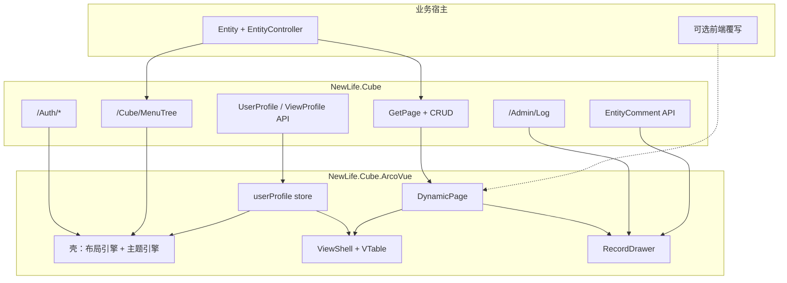

# NewLife.Cube.ArcoVue 企业中后台迁移与产品化方案

> 版本：2026-08-02（修订：看板分组字段取值修复；`EntityViewProfile`→`ViewProfile` 前后端统一重构；§8 收敛为「固定 CRUD 容器 + 有限用户运行时自定义」）
> 版本：2026-08-19（复审：§3.1 矩阵现状列按代码实测刷新；§10.4 差距表补 OSC-26081903c0 启停/填色/AI 浮窗）
> 版本：2026-08-21（增补 §8.5：自定义工作台、页面仪表盘与流程引擎；改写 §5.1 / §8.2 与「搜索 / 一张图 / FlowGram 样例」终态表述。口径与 [架构分享-预读.md](./架构分享-预读.md) 一致）
> 状态：可落地执行稿  
> 适用范围：以 NewLife.Cube（WebAPI）为后端，将 NewLife.Cube.ArcoVue 建设为默认企业中后台皮肤；复用 NewLife.Cube.Vue 能力成果，对接字节官方组件栈，支持用户级呈现配置与 AI（OpenSpec）协作。

---

## 1. 背景与目标

### 1.1 背景

| 现状 | 说明 |
|------|------|
| NewLife.Cube | WebAPI 主线已具备认证、菜单、权限、`GetPage` 元数据驱动 CRUD |
| NewLife.Cube.Vue | 产品能力最完整（Element Plus + 微前端 + Section 覆写），但是默认皮肤之一，非 Arco 栈 |
| NewLife.Cube.ArcoVue | Gen-2 薄皮肤，已能登录/菜单/基础动态 CRUD，深度约为 Vue 的 15%–35% |
| 共享包 `@cube/*` | api-core / auth-logic / page-logic / field-mapping / page-utils 可跨皮肤复用 |

### 1.2 产品目标（必须达成）

1. **零配置自动 CRUD**：宿主仅 `UseArcoVue` 时，内置 Admin/Cube 与新增业务 `EntityController` 自动获得完整管理界面。
2. **飞书式多维数据工作台**：表格（自定义列）/ 树表 / 卡片 / 甘特；记录以**右侧抽屉**编辑（飞书多维表为左侧记录栏，本实现按 §8.1 契约用右侧），并含修改历史、用户评论。
3. **可配置呈现**：导航布局、主题、列表默认视图与列布局等**禁止写死**。实体视图按个人 > 全局模板 > 系统默认；**首页工作台**按 **用户 > 主角色 > 系统默认**（不做租户层工作台）。
4. **现代扁平视觉**：参考苹果 Human Interface / 飞书与 [Arco Design](https://arco.design/) 的扁平、留白、低噪点风格。
5. **业务增量开发模型**：新业务 = 新 .NET 项目 + 实体控制器；仅特殊页覆写前端。
6. **AI 协作可落地**：复用现有 GitHub Copilot 指令；OpenSpec 轻量变更；同时适配 VS Code Copilot 与 Cursor。

### 1.3 非目标（明确不做）

- 不做飞书云 OpenAPI / 多维表格云同步（交互范式对齐，非云产品对接）。
- 不整仓搬运 Cube.Vue 的 Element Plus 组件与微前端工程。
- 不改写已有 `.github/instructions` 组织级指令正文（只增量新增）。
- Cube.Vue 微前端多应用运行时、Cypress 全量套件、Element 主题体系等：见 §3.1 能力矩阵中目标为「➖」的项。
- 不做整页画布、第三方 Widget 市场、用户脚本公式；洞察槽内允许跨实体**平台部件**（须授权查询），见 §8.5。
- 不做把 FlowGram 当流程执行器、不让浏览器跑流程；运行时若立项则在 Cube 独立模块。
- 不做租户层首页工作台；实体 ViewProfile 首期仍无角色层（与首页分层分开）。
- 演化后不再保留独立「搜索」产品面（SearchDrawer / `Q` / 预定义查询），见 §8.5.4。

### 1.4 与 [功能清单.md](../功能清单.md) 的关系

本方案是 **SPA-7（ArcoVue）产品化 + 必要后端扩展** 的执行稿，不替代功能清单。对齐约定：

| 功能清单编码 | 与本方案关系 |
|--------------|--------------|
| SPA-1～3、SPA-7、SPA-15 | ArcoVue 宿主嵌入、回退路由、图表；本方案深化 SPA-7 |
| SPA-4 | Cube.Vue：能力对标与验收参照，非迁移源码目标 |
| AUTH-1～12、OAUTH-* | 前端对接；MFA 见 [认证接口设计.md](./认证接口设计.md)（`/Mfa/*`），非 [核心接口架构.md](./核心接口架构.md) 最小集 |
| DATA-1～11、SYS-3、SYS-16～20（LOV） | 元数据 CRUD / 审计 / 值集；ArcoVue 消费这些已有后端 |
| PERM-* | 菜单驱动路由与按钮权限位；数据权限/多租户以后端为准，皮肤透传 |
| **拟新增**（需回写功能清单） | `UserProfile`、`ViewProfile`、`EntityComment` — 写入 [Cube.xml](../../NewLife.Cube/Entity/Cube.xml) 后由 XCode 协作指令生成，见 §5.2.1 / §10.2 |

实施时：每个 OpenSpec 变更的 `design.md` 应标注触及的功能清单编码；归档后视情况更新 [功能清单.md](../功能清单.md) 实现/测试列。

---

## 2. 三视角需求

### 2.1 产品视角

| 能力 | 描述 | 优先级 |
|------|------|--------|
| 开箱即用后台 | 登录、菜单、权限（角色抽屉授权树已接线，不改容器模型）、用户/角色/菜单/日志等内置模块可用 | P0 |
| 元数据驱动业务页 | 新实体配置字段与菜单后自动出页 | P0 |
| 多视图工作台 | table / tree / card / gantt 可切换，默认视图可记 | P0 |
| 记录抽屉 | 右抽屉：表单 / 历史 / 评论 | P0 |
| 个性化工作台 | 壳：布局/主题；首页槽位：用户 > 主角色 > 系统 | P0 |
| 实体页小仪表盘 | InsightPanel：指标卡 / 只读迷你看板 / 筛选联动；可绑已授权其它实体 | P1 |
| 查询收口 | 只留筛选构建器，条件必须后端查询；退役搜索抽屉与预定义查询 | P1 |
| 覆写扩展 | Section / 整页；流程设计器页（非执行器） | P1 |
| 流程引擎 | Cube 独立模块：定义 / 实例 / 待办；FlowGram 仅设计器 | P1 |
| 字段级变更 diff | 结构化历史（相对 Log.Remark） | P2 |

**成功标准（产品）：**

- 业务研发零前端即可交付 80% 管理页。
- 不同用户打开同一系统，壳与首页工作台按用户覆盖主角色；实体列表视图仍按个人覆盖全局模板。
- 视觉与交互达到「现代扁平、低干扰、高信息密度可控」。

### 2.2 用户视角

| 场景 | 期望体验 |
|------|----------|
| 首次进入 | 清晰品牌区 + 简洁侧栏/顶栏；默认浅色扁平主题，可选深色 |
| 日常列表 | 飞书多维表感觉：工具条干净、视图切换明显、列可拖拽显隐；大数据不卡顿（VTable） |
| 编辑记录 | 右侧抽屉滑入，不丢列表上下文；表单分区清晰；可看历史与评论 |
| 个性化 | 「外观设置」中切换布局（侧栏/顶栏/混合）、主题（浅/深/跟随系统）、密度（舒适/紧凑）；立即生效并记住 |
| 树/项目类数据 | 一键切树表或甘特（有日期字段时）；无能力时禁用并提示原因 |
| 权限不足 | 按钮隐藏或禁用，文案友好，不出现空白报错页 |

**可用性约束：**

- 主操作路径 ≤ 3 次点击到达常用实体。
- 列表首屏有意义内容；空态有引导。
- 动效克制（200–300ms 级），符合扁平产品习惯，避免炫光与厚重阴影。

### 2.3 技术视角

| 维度 | 决策 |
|------|------|
| 后端契约 | 最小集见 [核心接口架构.md](./核心接口架构.md)；MFA 见 [认证接口设计.md](./认证接口设计.md) `/Mfa/*`（AUTH-10）；Profile/Comment 见独立后端任务 |
| UI 栈 | Arco Design Vue（壳/表单）+ VisActor VTable（多维视图）+ FlowGram.AI（流程**设计器**，运行时见 §8.5.5） |
| 逻辑复用 | `@cube/*`；接线模板优先对照 NaiveUI，能力验收对照 §3.1 矩阵 |
| 呈现配置 | `UserProfile` + `ViewProfile`（后端独立交付，前端消费，见 §5 / §10.1） |
| 扩展 | `registerSection` + `apps/` 整页覆写 |
| 协作 | 恢复 `.github` Copilot 指令；OpenSpec（`openspec/`，新号 `OSC-YYMMDDxxxx`）；测试要求见 §9.3 |
| 测试 | 对齐 `development.instructions.md`：实现功能默认同步补充测试 |

---

## 3. 可行性结论与能力矩阵

**可行。** 迁移本质是「能力对齐 + Arco/VTable 重做 UI + 偏好配置层」，不是复制 Cube.Vue。

| 维度 | 判断 |
|------|------|
| API/认证/菜单 | ArcoVue 已走 `@cube/api-core` / auth-logic；最小集对齐核心接口架构；MFA 对齐认证接口设计 |
| 自动 CRUD | 后端完备；ArcoVue 需接入 `usePageLogic` 并产品化 |
| 多视图/抽屉 | 前端新建；**UserProfile / ViewProfile / EntityComment 为 Cube 核心后端扩展**，独立排期 |
| 工作量 | 后端独立 OSC + 前端 M0–M6（约 2–3 个迭代月，视人力浮动） |

**为何接线阶段对标 NaiveUI、能力对标 Cube.Vue：**

- NaiveUI 与 ArcoVue 同为 Gen-2 薄皮肤，DynamicPage / 路由 / FieldMapping 同构，适合做「怎么接」。
- Cube.Vue 是能力与验收清单来源（见下表），Element Plus 实现不可直接搬。

### 3.1 Cube.Vue ↔ ArcoVue 能力矩阵

图例：✅ 完整　🟠 基础/部分　❌ 无　➖ 本方案不做（非目标）

| 能力 | 功能清单/说明 | Cube.Vue | ArcoVue 现状 | 目标 | 优先级 |
|------|---------------|:--------:|:------------:|:----:|:------:|
| 动态 CRUD（GetPage 列表/表单） | DATA-1/4/5/6，SPA-7 | ✅ | ✅ | ✅ | P0 |
| 菜单驱动路由 + 鉴权守卫 | PERM-3，SPA-1 | ✅ | ✅ | ✅ | P0 |
| 登录（密码/验证码/OAuth） | AUTH-2/6/8，OAUTH-1 | ✅ | ✅ | ✅ | P0 |
| Token 刷新 / 登出 | AUTH-3 | ✅ | ✅ | ✅ | P0 |
| MFA 二步验证 UI | AUTH-10，`/Mfa/*` | ✅ | ✅（登录二步屏 + 安全设置开启/关闭，`/Mfa/*`） | ✅ | P1 |
| Challenge / 验证码登录增强 | AUTH-4/5 | ✅ | ✅（needChallenge + getChallenge 加密提交 + 图形验证码） | ✅ | P1 |
| 导入导出 | DATA-9 | ✅ | ✅ | ✅ | P0 |
| 批量删除 | DATA-10 | ✅ | ✅ | ✅ | P0 |
| 批量其它操作（启用/禁用等） | 工具条扩展 | ✅ | ✅（OSC-26081903c0 高级菜单批量启用/禁用；批量改字段见 e483） | 🟠 | P2 |
| ListField.Url / dataAction 自定义链接 | 单元格 + 操作列分流 | ✅（Bootstrap 单元格 / Metronic 更多） | ✅（OSC-2608178bdb 方案 E） | 🟢 | Done |
| 图表 GetChartData | SPA-15 | ✅ | ✅（OSC-2608280e9e：洞察槽 Widget 协议 + 迷你图平台模板；GetChartData 仅旧 insight 合成） | ✅ | P1 |
| 字段控件矩阵（含上传/JSON/富文本等） | DATA-11 等 | 🟠～✅ | ✅（20+ 控件，FieldInput） | ✅ | P0 |
| LOV 选择器 | SYS-16～20 | ✅ | ✅（LovSelect + lov-api） | ✅ | P1 |
| 多页签 TagsView | 壳 | ✅ | ✅ | ✅ | P0 |
| 多布局（侧/顶/混合）可配置 | → UserProfile | ✅ 多布局 | ✅ 配置化（RootLayout 动态组件） | ✅ 配置化 | P0 |
| 主题/密度/i18n | 壳 | ✅ | 🟠 主题/密度/预置色板 ✅（OSC-0017）；i18n ❌ | ✅ | P0 |
| UserProfile 持久化 | **后端新建** | ➖/局部 | ✅（localStorage + 后端双通道；`workspace.defaultView/pageSize` 已消费：无 ViewProfile 回落默认视图、页面级 PageSize，OSC-0012） | ✅ | P0 |
| ViewProfile（列/视图） | **后端新建** | ➖/局部 | ✅（直接后端权威：命名视图/列/sort/chrome/mapping + 筛选记忆 + 受限表单布局 FormJson + 全局只读模板 + 实体级预定义查询，OSC-0012~0016） | ✅ | P0 |
| VTable 表格+自定义列 | 本方案增强 | 🟠 DOM 表 | ✅ | ✅ | P0 |
| 树表视图 | DATA-3 | 🟠 部分页 | ✅（treeBuilder 组装 + VTable hierarchy） | ✅ | P0 |
| 卡片视图 | Vue 有未接线 stub | ❌ | ✅（CardList/RecordCard） | ✅ | P0 |
| 甘特视图 | 本方案新建 | ❌ | ✅ 只读（vtable-gantt 计划/实际双条重叠对比 + 任务条定位图标 + 表宽拖拽持久化 + 固定色，OSC-0019；无拖拽写回） | ✅ | P0 |
| 右侧记录抽屉 | 本方案 | ❌ 多为弹层 | ✅ 右抽屉（表单/历史/评论全接线，OSC-0008） | ✅ | P0 |
| 修改历史（Log 筛选） | SYS-3 | 🟠 独立日志页 | ✅（抽屉内 timeline，无分页/无 diff） | ✅ 抽屉 Tab | P0 |
| 实体评论 EntityComment | **后端新建** | ❌ | ✅（OSC-0008 接线：api-core comment API + 抽屉评论 Tab 顶层/回复/删除本人） | ✅ | P0 |
| Section 页面覆写 | Vue skills | ✅ | ✅ 机制（useSections，仅 `_demo` 案例） | ✅ | P1 |
| apps 自定义业务页 | cube-admin 等 | ✅ | 🟠 机制 + `_demo` + Admin/Db、Admin/File 专用页（detectPageKind custom） | 🟠 机制+高频页 | P1 |
| 微前端多应用运行时 | Vue microApp | ✅ | ➖（未做） | ➖ | — |
| FlowGram 工作流画布 | 本方案 | ❌ | ❌（未做） | ✅ 设计器；运行时见 §8.5.5 | P1 |
| 字段级变更 diff | 相对 Log | ❌ | ❌ | ➖ 一期 / P2 二期 | P2 |
| 单元/组件测试体系 | Vue Vitest 等 | ✅ | 🟠（逻辑单测 495 用例全过；组件测试仍缺） | ✅ 关键路径 | P0 |
| E2E（Cypress 级） | Vue | ✅ | 🟠 Playwright 冒烟 3 spec（认证/实体表单/对象主页，OSC-2608139feb） | 🟠 冒烟即可 | P2 |
| 嵌入 NuGet / UseArcoVue | SPA-2/3/7 | ✅ UseVue | ✅ | ✅ | P0 |

> **实体自动化 ≠ 流程引擎 ≠ FlowGram。** OSC-260815fa86 已交付线性「自动化」（GraphJson + C# `AutomationExecutor`）。FlowGram 只做设计器；审批/待办运行时若立项则在 Cube `IModule`（§8.5.5），**禁止**把自动化实现成浏览器画布执行器。

> 注：以上「ArcoVue 现状」列已于 2026-08-18 对照代码复审刷新（OSC-0001~0019 与 OSC-2608 号全部归档后）。刷新依据见 §10.4 审查结论。

矩阵随里程碑更新「ArcoVue 现状」列；目标为 ➖ 的项不得在 OSC 中膨胀为必做范围。

---

## 4. 架构设计

### 4.1 总体架构



### 4.2 前端目录（目标）

```
NewLife.Cube.ArcoVue/web/src/
├── api/                      # createCubeApi + userProfile/viewProfile/comment/history
├── stores/                   # user / app / tabs / userProfile
├── router/                   # 菜单动态路由 + 守卫 + keep-alive
├── layouts/                  # layout 实现：side / top / mix（由 UserProfile 选择）
├── theme/                    # Design Token + Arco 主题注入（非写死颜色）
├── components/fields/        # FieldInput 矩阵
├── features/
│   ├── multi-view/           # 视图切换编排
│   ├── vtable/               # VTable / Gantt 适配
│   ├── record-drawer/        # 右抽屉三 Tab
│   └── flowgram/             # 工作流（后期）
├── views/dynamic/
├── views/login/
├── views/settings/           # 外观与工作台设置页（读写 UserProfile）
├── apps/                     # 可选整页覆写
└── i18n/
```

### 4.3 官方组件栈分工（强制）

| 层级 | 技术 | 职责 |
|------|------|------|
| 设计系统 / 壳 / 表单 | [Arco Design Vue](https://arco.design/) | 布局容器、导航、页签、登录、抽屉、表单控件、反馈 |
| 多维数据视图 | [VisActor VTable](https://visactor.com/vtable)（+ gantt） | 表格列布局、树表、卡片式布局、甘特；禁止长期以 `a-table` 做主多维表 |
| 工作流设计器 | [FlowGram.AI](https://flowgram.ai/) | 只读写流程定义；运行时禁止放在浏览器（§8.5.5） |
| 领域逻辑 | `@cube/*` | API、认证、列表状态机、字段映射 |

---

## 5. 用户呈现配置（核心：禁止硬编码）

导航布局、主题、列表视图等必须走 **配置 → 引擎渲染**，使不同用户可有不同呈现。

### 5.1 配置分层

两套读取顺序，不要混用。

| 对象 | 读取顺序 | 说明 |
|------|----------|------|
| **首页工作台**（平台槽位） | **用户 > 主角色 > 系统默认** | 已拍板。用户 `UserProfile.workspace` 有有效槽位配置则整份采用，改角色默认不覆盖已个性化用户。角色层只看会员体系 **主角色**（`RoleId`），附加 `RoleIds` 不合并。管理员写角色工作台；用户只写自己的 Profile。聚合 API 按当前用户解析后下发。**不做租户层工作台。** |
| **实体视图**（ViewProfile） | **个人 > 全局模板（UserId=0）> 系统默认** | 已交付（OSC-0014）。**不做角色层**，除非另立。 |
| 壳布局 / 主题 | 仍走 UserProfile 个人配置 | 与首页槽位同实体，但字段不同 |

壳与首页槽位都在 UserProfile 上；角色工作台建议挂 Role 扩展 JSON 或独立 RoleWorkspace，避免用 `UserId=0` 模板表硬塞角色维。详情见 §8.5.2。

### 5.2 对象模型

两个持久化对象分工明确（另加评论实体）：

| 对象 | 作用域 | 职责 |
|------|--------|------|
| **UserProfile** | 按用户一条（或按用户+应用） | 导航布局、主题样式、工作台全局默认 |
| **ViewProfile** | 按用户 + 实体（typePath）多条 | 视图类型、列布局、甘特/卡片映射、筛选记忆 |
| **EntityComment** | 按实体记录多条 | 用户评论 |

#### 5.2.1 建模与代码生成（Cube.xml + 已有协作指令）

三个实体**必须**落入魔方实体模型文件，**禁止**手写整份实体类绕过生成器：

| 步骤 | 说明 |
|------|------|
| 1. 改模型 | 在 [`NewLife.Cube/Entity/Cube.xml`](../../NewLife.Cube/Entity/Cube.xml) 的 `<Tables>` 中新增三张 `Table`（沿用文件内 `Option`：`Namespace=NewLife.Cube.Entity`、`ConnName=Cube`、`ModelClass={name}Model` 等） |
| 2. 触发生成 | 按已有 **XCode 协作指令**（`.github/instructions/xcode.instructions.md`，由 `copilot-instructions.md` 路由命中「XCode/实体生成/Model.xml」等信号）：在 `Entity` 目录执行 `xcode` / `xcodetool`，生成实体与 `Models/*Model` |
| 3. API 层 | 生成完成后，再按 **Cube 协作指令**（`cube.instructions.md`）为三实体补齐 API 控制器与测试——同属 **OSC-0002**，**不在 ArcoVue 工程内** |

Agent / Copilot 实施约定：OSC-0002 的 `tasks.md` 首项应为「编辑 Cube.xml（三表）→ 运行实体生成 → 再写三套 API」，`verify.md` 核对生成物与 xml 一致、无大段手写实体骨架。

**Cube.xml 表结构建议（实施时由 Agent 按此写入并微调）：**

| Table | 关键列（示意） | 索引 |
|-------|----------------|------|
| UserProfile | Id；UserId；LayoutJson / ThemeJson / WorkspaceJson（或单一 ProfileJson）；Version；Enable；Create*/Update* | Unique(UserId) |
| ViewProfile | Id；UserId；TypePath；View；ColumnsJson；**ViewsJson**；**ActiveViewId**；GanttJson；CardJson；FiltersJson；QueriesJson；**FormJson**；**DashboardJson**（演化，§8.5.3）；Version；Create*/Update* | Unique(UserId, TypePath)；命名视图存 ViewsJson；`UserId=0` 为全局只读模板；FormJson 存受限表单布局；QueriesJson 为 OSC-0016 预定义查询（**演化退役**，§8.5.4）；DashboardJson 为实体级页面仪表盘，不跟命名视图走 |
| EntityComment | Id；Category；LinkId；**ParentId / RootId / ReplyUserId / ReplyUser**；Content；CreateUser/Id/IP/Time；Update* | (Category, LinkId)；ParentId；RootId；CreateUserID |

嵌套配置（layout/theme/columns 等）以 **JSON 文本列** 落库，与 §5.2 逻辑模型对应；API 层序列化为前端 TypeScript 形状。

逻辑模型（API/前端契约，对应上述 JSON 或展开字段）：

```ts
/** 用户级外观与工作台 — 实体 UserProfile */
interface UserProfileDto {
  version: 1
  userId: number | string
  layout: {
    mode: 'side' | 'top' | 'mix'
    siderCollapsed: boolean
    siderWidth: number
    showTabs: boolean
    contentWidth: 'standard' | 'wide' | 'fluid' // 旧 fixed → standard
  }
  theme: {
    appearance: 'light' | 'dark' | 'system'
    primaryColor: string
    radius: 'sm' | 'md' | 'lg'
    density: 'comfortable' | 'compact'
    fontScale: 'normal' | 'large'
  }
  workspace: {
    defaultView: 'table' | 'tree' | 'card' | 'kanban' | 'calendar' | 'gantt'
    pageSize: number
  }
}

/** 命名视图内类型映射（存于 ViewsJson，不写 ganttJson/cardJson） */
type ViewMapping =
  | { kind: 'card'; titleField: string; imageField?: string; layout: 'standard' | 'large' | 'row' }
  | { kind: 'kanban'; groupField: string; titleField: string; imageField?: string }
  | { kind: 'gantt'; startField: string; endField: string; titleField: string; colorField?: string }
  | { kind: 'calendar'; startField: string; endField?: string; titleField: string; colorField?: string }

/** 实体视图自定义 — 实体 ViewProfile；唯一键 userId + typePath */
interface ViewProfileDto {
  version: 1
  userId: number | string
  typePath: string
  view: 'table' | 'tree' | 'card' | 'kanban' | 'calendar' | 'gantt'
  /** 权威：多命名视图 JSON 字符串（ViewsJson）；元素含 mapping? */
  viewsJson?: string
  activeViewId?: string
  columns?: Array<{
    key: string
    visible: boolean
    width?: number
    frozen?: 'left' | 'right' | false
    title?: string
  }>
  /** 预留列；OSC-0006 前端不读写，映射以 NamedView.mapping 为准 */
  gantt?: { startField?: string; endField?: string; titleField?: string }
  card?: { titleField?: string; subtitleField?: string; statusField?: string; coverField?: string }
  /** 仅字段顺序、显隐与元数据 Category 分组的折叠偏好；不改变字段类型、校验、权限 */
  form?: {
    fields?: Record<string, { visible?: boolean; order?: number }>
    collapsedGroups?: string[]
  }
  filters?: Record<string, unknown>
}
```

### 5.3 存储与 API

| 阶段 | 策略 |
|------|------|
| 前端可先行 | `localStorage`：`cube.arco.userProfile.{userId}`、`cube.arco.viewProfile.{userId}.{typePath}` |
| **后端权威** | **OSC-0002**：一次改 **Cube.xml**（三表）并经 XCode 指令生成，再挂齐三套 API；**非 ArcoVue 内实现** |
| 冲突 | 服务端成功拉取后覆盖本地；本地脏写防抖保存（300–500ms） |

**建议 API（由后端 OSC 定稿，名称可按 Cube Area 惯例微调）：**

```
GET    /Cube/UserProfile
PUT    /Cube/UserProfile                 # body: UserProfile 字段子集

GET    /Cube/ViewProfile?typePath=Admin/User
PUT    /Cube/ViewProfile           # body: ViewProfile（含 typePath）
DELETE /Cube/ViewProfile?typePath=Admin/User   # 恢复该实体默认视图

GET    /Cube/ViewProfile/Template?typePath=Admin/User
PUT    /Cube/ViewProfile/Template  # 仅管理员；服务端固定 UserId=0
DELETE /Cube/ViewProfile/Template?typePath=Admin/User

GET    /Cube/EntityComment?category=&linkId=&parentId=
POST   /Cube/EntityComment               # body 可含 parentId 表示回复
DELETE /Cube/EntityComment?id=
```

`EntityComment` **同表回复**（不新增表）：`ParentId`（0=顶层）、`RootId`（线程根）、`ReplyUserId` / `ReplyUser`（被回复作者）。`GET` 的 `parentId` 可选：缺省/负数=全部，`0`=仅顶层，`>0`=该父评论的直接回复。

**实现约束：**

- `layouts/*` 只注册实现，**不在路由里写死唯一布局**；根布局读 `userProfile.layout.mode` 动态 `<component :is>`。
- 主题通过 CSS Variables + Arco `ConfigProvider` 注入，**禁止**在业务组件写死主色/背景。
- `DynamicPage` / ViewShell 读当前用户的 `ViewProfile`（按 `typePath`）；后续模板能力按 §8.2.4 将个人配置与 `UserId=0` 模板字段级合并；无则回落 `UserProfile.workspace.defaultView`，再回落系统默认。
- 列布局、视图切换的保存写入 **ViewProfile**；外观设置页写入 **UserProfile**。
- 提供「外观设置」页与顶栏快捷入口（主题、密度）；支持「恢复默认」（删或重置对应 Profile）。

### 5.4 与权限的关系

- `UserProfile` 布局/主题属个人配置，不占用菜单权限位。
- `ViewProfile` 视图切换不绕过 `canAdd/Edit/Delete/Export/Import`。
- 甘特拖拽改期必须受 `canEdit` 约束。

---

## 6. 视觉与交互规范（苹果 / 飞书扁平风）

### 6.1 设计原则

1. **扁平与层级靠留白/分割线**，避免多层厚重阴影与炫光。
2. **中性背景 + 单一品牌强调色**（默认接近飞书/Arco 蓝；可由 `UserProfile.theme` 覆盖）。
3. **信息密度可调**：舒适 / 紧凑两档，影响表行高、表单项间距。
4. **动效克制**：抽屉/页签切换短时缓动；列表滚动性能优先（Canvas 表）。
5. **图标线性、字重克制**：标题与正文层级清晰，避免装饰性插画挤占首屏。

### 6.2 Design Token（示例，实施时落入 `theme/tokens.css`）

```css
:root {
  --cube-color-bg: #f5f6f7;
  --cube-color-surface: #ffffff;
  --cube-color-border: rgba(0, 0, 0, 0.06);
  --cube-color-text: rgba(0, 0, 0, 0.88);
  --cube-color-text-secondary: rgba(0, 0, 0, 0.45);
  --cube-color-primary: #3370ff; /* 可由用户偏好覆盖 */
  --cube-radius-sm: 6px;
  --cube-radius-md: 8px;
  --cube-space-page: 16px 20px;
  --cube-font: "SF Pro Text", "PingFang SC", "Segoe UI", "Helvetica Neue", Arial, sans-serif;
}
[data-theme="dark"] { /* 对应 token 反色，保持扁平 */ }
```

与 Arco 主题变量映射，保证组件与自研壳一致。

### 6.3 关键界面结构（默认 side 布局）

- 顶栏：产品名/Logo、全局搜索（可后期）、主题切换、用户菜单——扁平、低分隔。
- 侧栏：图标 + 文案；激活态用浅底或左边线，避免厚重选中块。
- 内容区：页签（可关）+ 工具条 + VTable 主舞台。
- 抽屉：自右侧推入（宽度可配，默认 480–640），遮罩轻量。

---

## 7. 多视图与抽屉（飞书多维表范式）

### 7.1 ViewShell

| 视图 | 实现 | 启用条件 |
|------|------|----------|
| table | VTable ListTable + 列布局偏好 | 默认 |
| tree | VTable tree | 实体为树或存在 Parent 字段 / EntityTree 数据（扁平列表由 treeBuilder 自动组装） |
| card | 卡片流（CardList/RecordCard） | 配置了 card 字段映射或可自动推断 title |
| kanban | 看板只读分列（KanbanBoard） | 存在可分组字段（枚举/布尔/选项） |
| calendar | 月历视图（CalendarMonth） | 存在 DateTime 字段作为开始日期 |
| gantt | VisActor 甘特（只读，无拖拽写回） | 存在可映射的起止日期字段 |

> 6 种视图均已落地（OSC-0006）；「看板/甘特/日历无拖拽写回」为设计内「不做」项，见 §10.4。

视图切换器绑定当前 `typePath` 的 **ViewProfile.view**，切换即持久化该 Profile。

### 7.2 右侧 RecordDrawer

| Tab | 数据 | 说明 |
|-----|------|------|
| 表单 | `getDetail` + add/edit fields | 校验、LOV、高级控件；保存刷新视图 |
| 历史 | `GET /Admin/Log?category=&linkid=` | 筛时间/用户/动作；一期展示 Remark |
| 评论 | **新建** EntityComment API | 列表/发表/删（本人或管理员） |

### 7.3 后端新建（评论）

建议 `EntityComment`：`Category`、`LinkId`、`Content`、**ParentId / RootId / ReplyUserId / ReplyUser**（同表回复）、创建人信息等。  
API：`GET/POST/DELETE /Cube/EntityComment`；POST 传 `parentId` 即可回复，不另建回复表。
供所有皮肤复用，不绑死 ArcoVue。

---

## 8. 零配置 CRUD 与业务扩展

### 8.1 自动生成路径

1. 菜单来自 `/Cube/MenuTree`。
2. **B3 叶路由**：有 `url` 的节点扁平 `addRoute` 到 Layout（文件夹不嵌套子路由）；`props: { type, authId }`；优先 `apps/*/src/views/**/index.vue` 整页覆写，否则 `DynamicPage`。
3. **DynamicPage** 为薄宿主：解析 Section `DefaultListPage` 覆写，否则挂载 **DefaultList** 微内核（GetPage → fieldControl → 列表/搜索/LOV → **右侧**抽屉）。
4. 点击行打开 **右侧 RecordDrawer**（`placement="right"`；表单 / 历史 / 评论）；微内核**不读**布局/主题 store（契约隔离）。
5. 多视图 ViewShell / VTable 已由 **OSC-0005/0006** 落地（6 视图 + 命名视图 Tab + 配置抽屉）；在此基础上向「视图/表单容器 + 用户运行时自定义」演进，见 §8.2。

### 8.2 固定视图/表单容器与有限用户运行时自定义（飞书应用模式）

> 研究依据：飞书帮助中心「应用模式」及其列表、标签页、尺寸文档。飞书的应用页可以自由编排跨表组件；其前提是完整的数据源、页面、权限和自动化平台。ArcoVue 的定位是 **Cube 的默认 CRUD 皮肤**，而非低代码平台，因此只借鉴“同源数据多种呈现、配置与使用分离、用户可恢复默认”的体验，不复制整页画布与第三方组件市场。洞察槽内的页面级小仪表盘、首页工作台与流程引擎见 **§8.5**（演化目标）；本节 8.2.2–8.2.6 先记录 **e483 已交付上限**，避免把现状写成终点。

#### 8.2.1 评审结论与边界

| 飞书能力 | 本方案处理 | 原因 |
|----------|------------|------|
| 同一数据源的列表、卡片、详情、筛选、排序 | **采用**：复用命名视图、6 类视图、右侧 RecordDrawer | 当前 `DefaultList` 已具备，用户收益直接 |
| 固定区域展示统计/图表 | **已交付有限采用**；**演化**为页面级小仪表盘（§8.5.3） | e483：`GetList.stat` + 一张 `insight.chartOption`；第一期改为指标卡 / 只读迷你看板 / 筛选联动 |
| 字段显示与表单组织 | **采用**：仅顺序、显隐、按现有 Category 分组折叠 | 不改变 Cube 元数据、字段控件、校验和权限 |
| 管理员发布默认界面 | **采用**：每实体一个全局只读模板，个人可覆盖 | 实体视图不做角色层；**首页工作台**按用户 > 主角色（§5.1 / §8.5.2） |
| 任意整页画布、拖拽增删页面区块、嵌套标签页、第三方 Widget | **不做** | 会新增 Widget 生命周期、布局引擎、移动端和性能问题 |
| 跨实体文本/图片/按钮块、用户脚本、浏览器跑流程 | **不做** | 脱离 GetPage 与 Cube 权限契约 |
| 洞察槽内跨实体平台部件 | **演化允许**（§8.5.3） | 每张源表走已授权 GetList；禁止前端拼 SQL |

#### 8.2.2 容器契约（复用而非重建）

每个实体路由默认仍是一个固定的 **DefaultList 容器**：

1. `GetPage` 是字段、权限、表单和统计的唯一元数据来源；`GetList`、`GetDetail` 与 CRUD API 仍是唯一数据/写入通道。
2. 容器固定顺序为：可选**洞察槽** → 命名视图 Tab/工具栏 → 当前数据视图 → 分页 → 右侧 `RecordDrawer`。不允许用户新增、删除、拖动或嵌套**页面**区块；只允许在洞察槽**内部**增删/排序平台部件（§8.5.3）。
3. **已交付（OSC-260819e483）**：洞察区统计标签与一张图表（`insight.showStat` / `showChart`）；`chartOption` 写在当前 NamedView；数据来自当前列表，保存时不写入 `series.data`/`dataset.source`。开发者 `OnGetChartData` 非空仍优先。搜索由工具栏「搜索」打开的 `SearchDrawer` 承载；InsightPanel 不含搜索表单。**此为已交付上限，不是演化终点**——演化见 §8.5.3 / §8.5.4。
4. NamedView 继续承载 table/tree/card/kanban/calendar/gantt 的列、映射、排序和工具栏外观；现有 `widthMode` / `heightMode` 只表示当前视图的容器尺寸，不升级为通用 Widget 尺寸系统。**看板视图 ≠ InsightPanel**：前者是六视图之一，只呈现当前实体当前筛选；后者是页面级小仪表盘。

#### 8.2.3 受限配置模型

| 配置 | 存储 | 允许用户改变 | 明确禁止 |
|------|------|--------------|----------|
| 命名视图 | `ViewsJson` / `ActiveViewId` / `ColumnsJson` | 视图类型、列显隐/顺序/宽度/标题、排序、已有 mapping/chrome | 自定义 SQL、跨实体数据源、绕过字段权限 |
| 筛选记忆 | `FiltersJson` | 当前实体筛选条件，保存为该命名视图默认（演化后为**唯一**查询入口） | 用户脚本/SQL；把筛选当成数据权限 |
| 洞察区（已交付） | `ViewsJson` 中当前 NamedView 的 `insight` | `showStat` / `showChart`；可选一张 `chartOption` | option 内脚本/函数、把列表快照写进 Profile |
| 页面仪表盘（演化） | ViewProfile 实体级 `DashboardJson` | 平台部件：指标卡、只读迷你看板；可绑已授权 `sourceTypePath` | 第三方 Widget、迷你表格/多图（第一期不做）、拖拽写回 |
| 表单布局 | **`FormJson`** | add/edit/detail 的字段顺序、显隐、按 GetPage `Category` 的分组折叠 | 新字段、字段类型/控件、默认值、校验、必填、权限、提交动作 |

`FormJson` 仅是前端呈现偏好；字段是否存在、是否可编辑、是否必填以及提交载荷仍由 GetPage 与 `prepareSubmitPayload` 判定。配置中出现已删除字段时静默忽略；元数据中新字段按所属分组追加且默认可见，保证升级后仍能操作。

#### 8.2.4 模板与优先级

实体 ViewProfile 仍是两层（OSC-0014 已交付），**不做角色/租户模板**：

1. **个人 ViewProfile**：`UserId = 当前用户`，可编辑，优先级最高。
2. **全局只读模板**：`UserId = 0`，由具备管理权限的管理员发布；普通用户仅可“基于模板开始自定义”，首次保存时创建个人 Profile。
3. **系统默认**：没有模板或个人配置时，由 GetPage 和 `seedDefaultView` 生成。

读取为“个人配置覆盖模板，模板覆盖系统默认”的字段级合并。首页工作台分层见 §5.1 / §8.5.2，不要套用本小节。

开发者扩展优先级保持不变：整页 `apps/*/index.vue` 覆写直接接管页面；未整页覆写时，Section 可局部替换容器插槽；只有默认容器才消费上述用户配置。业务覆写不必兼容通用配置协议，避免运行时互相干扰。

#### 8.2.5 实施切片（评论接线后）

| OSC | 内容 | 出口 |
|-----|------|------|
| OSC-0012 | 筛选记忆 + 单一洞察区 | `FiltersJson` 按命名视图保存；`insight.showStat`/`showChart` 双开关独立（可同时），始终使用当前实体与筛选条件 |
| OSC-0013 | 受限表单布局 | ViewProfile 增 `FormJson`；RecordDrawer 支持字段顺序、显隐、Category 分组折叠与恢复默认 |
| OSC-0014 | 全局只读模板 | `UserId=0` 模板读写 API、权限与审计；个人覆盖/恢复模板；不做角色、租户与协同编辑 |
| OSC-0015 | 筛选构建器 + 多级分组 | **已交付**：条件组保存到 `NamedView.filter`；e483 起可下推 `viewFilter`，无法下推则忽略服务端过滤（前端当前页兜底，**已知限制**）。**演化**：必须后端查询，禁止假筛选，见 §8.5.4 |
| OSC-0016 | 通用查询 + 预定义查询 | **已交付**：`SearchDrawer` + `QueriesJson`。**演化退役**：不再保留独立搜索与预定义查询，见 §8.5.4 |

#### 8.2.6 验收与非目标

- 新实体仍只需实体 + `EntityController` + 菜单即可获得完整页面；没有任何 Profile 时与当前行为一致。
- 用户可以保存一个命名视图的筛选、洞察展示和表单呈现；恢复默认后回落全局模板或系统默认。
- 管理员发布模板后，未个性化用户立即使用；已个性化用户不被覆盖。
- 图表（OSC-260819e483 **已交付**）：当前 NamedView 允许持久化**一张**用户 ECharts option（`insight.chartOption`，≤32KB）；数据来自当前列表；开发者 `OnGetChartData` 非空仍优先。**演化**见 §8.5.3，单图保留兼容，不当第一期主交付。
- 查找展示沿用现有 `MapField` / `DataSourceMap` / `lovCode` 字段配置（`fetchBatchLabel` 已接线），不新增查找协议；只读公式使用 C# 扩展属性（与 Map 扩展同类），禁止用户 JS/SQL、双向写回。
- 不新增整页画布、第三方 Widget 注册表、页内标签容器、跨实体文本/图片/按钮块、用户脚本公式。洞察槽跨实体平台部件、首页槽位、流程运行时按 §8.5 立项，不混进本小节的「已交付验收」。

### 8.5 自定义工作台、页面仪表盘与流程引擎

> 2026-08-21 产品口径。L0 仍是零配置实体 CRUD（§8.1–8.2）。往上只加三类后端，不要并成「再做一个飞书」。实现另开 OSC；值集消费契约（含 `entity:` ListData）未收口前，跨实体选表与仪表盘实现应一并看待。口径长文见 [架构分享-预读.md](./架构分享-预读.md)。

三条产品边界必须分开：

| 表面 | 对标 | 不是什么 |
|------|------|----------|
| **看板视图** | 飞书看板视图 | DefaultList **六视图之一**；只呈现当前实体、当前筛选；列=分组字段；只读、无拖拽写回。不承担跨表看数。 |
| **InsightPanel** | 飞书仪表盘（缩小版） | 挂在实体页**固定洞察槽**，不是独立菜单、不是整页画布。每 `typePath` 一份配置；平台部件可绑**已授权**其它实体。 |
| **首页工作台** | 「我的工作台」 | 平台槽位（待办、快捷入口、KPI）。今日 Index/Main 是监控页，不是这份工作台。 |

```
DefaultList 固定容器
  InsightPanel（页面仪表盘：指标卡 / 只读迷你看板）
  → 命名视图与工具栏（查询入口只留筛选）
  → 六视图（含看板视图）
  → 分页 → 右侧 RecordDrawer

数据：当前实体 GetList ──筛选联动──► 仪表盘部件
      其它 typePath 授权 GetList ──────────► 仪表盘部件
```

用户不能增删整页区块；只在洞察槽内部增删、排序平台部件。

#### 8.5.1 分层（后端已有 vs 要补）

| 层 | 内容 |
|----|------|
| L0 实体内核 | GetPage / CRUD / 行级权限 / 值集。缺：字段级 ACL（写入与导出对称）。 |
| L1 呈现 | UserProfile 壳；ViewProfile 命名视图；**首页槽位用户>主角色**；**Insight DashboardJson**。 |
| L2 协作 | 实体自动化（线性 GraphJson + `AutomationExecutor`）；站内信 Inbox。 |
| L3 流程引擎（待建） | 定义、实例、待办任务；FlowGram **仅设计器**。 |

基础设施（认证、RBAC、多租户、`IModule`、通知、AI）复用，不平行造会话。

#### 8.5.2 首页工作台：用户 > 主角色（已拍板）

不是 Widget 市场：槽位由平台注册。读取**整份**配置（与「已个性化不覆盖」同构）：

1. 用户 `UserProfile.workspace` 有有效首页槽位 → 用用户的。
2. 否则主角色（`RoleId`）上的工作台 JSON → 用角色的；`RoleIds` 附加角色不参与、不合并。
3. 否则系统默认槽位枚举。

写入：用户只写自己的 UserProfile；角色工作台仅管理员写。聚合 API（待办数、快捷菜单、授权内 KPI）按当前用户解析后下发，前端不自己选角色。与 Db/进程监控页分离。不做租户层。

#### 8.5.3 页面仪表盘 Widget 协议（OSC-2608280e9e）

洞察槽是 **Widget 运行时**，不是单图开关。配置落 `ViewProfile.DashboardJson`（实体级，与 `ViewsJson` 分域；个人有效整份 > 模板 UserId=0 > 未配置）。

| 部件 | 数据 | 约束 |
|------|------|------|
| 指标卡 `metricCard` | `POST /Cube/Widget/Query` aggregate（count/sum/avg/min/max） | 源 `typePath` 须 Detail；禁止 SQL/脚本 |
| 迷你图表 `miniChart` | 同上；平台模板 sparkline/line/bar/pie（时间分桶：SQLite/MySQL/SQLServer/PostgreSQL） | 禁止把用户自由 ECharts option 当新编 |
| 迷你看板 `miniKanban` | Query `mode=list` + `KanbanBoard compact` | **洞察槽本号暂缓**（Catalog/PUT/Host 禁用）；留给首页工作台 OSC；协议与 compact 渲染器仍保留 |
| 筛选联动 | 宿主 **筛选构建器** `hostFilter`；不绑 SearchDrawer | 同源 AND；跨实体须 `linkFilter`，无映射则「未联动」 |

协议：`ICubeWidget` + `registerWidget`（C# 扫描 named；Vue `features/widget/registry.ts`）。聚合走 Query，禁止前端 N×GetList。上限 12 张 / 64KiB。`PUT dashboardJson: ""` 清除个人域并继承模板；显式 `{"version":1,"widgets":[]}` 表示用户清空、不继承。旧 `NamedView.insight` 仅在 DashboardJson 未配置时只读合成（`legacyChart` 禁止 PUT）。首页工作台不在本号。视图分享：embed 短令牌（`LoadToken` 接受非 JWT + Url 白名单）。

安全：每部件单独鉴权 + `DataPermission` + 租户 Where（与 CreateWhere 同等）；无法翻译的 extraFilter → 400。Sources 只含 Detail 实体。未知 kind 占位；Query 403 → 锁卡，不跳登录。

#### 8.5.4 查询演化：只留筛选，全部走后端（已拍板）

| 今日双轨 | 演化 |
|----------|------|
| `SearchDrawer` + `Q` / `dtStart`/`dtEnd` / GetPage `Search` 字段 + `QueriesJson` 预定义查询 | **取消**独立搜索产品面；预定义查询**一并去掉**（不改成已存筛选） |
| `NamedView.filter` / `viewFilter`：能下推则并入查询，不能则忽略服务端、只滤当前页 | **唯一入口**；条件必须编译成后端 Where；无法翻译则拒绝或提示，**禁止**当前页假筛选 |

翻页、导出、统计、Insight 部件、看板视图共用同一结果集。`GetList` 以结构化筛选为权威参数。GetPage `Search` 分区改为可筛字段元数据，值集远程候选仍给筛选控件。筛选不是权限：`DataPermission` 与租户 Where 先于用户筛选。

#### 8.5.5 流程引擎 ≠ 实体自动化

| | 实体自动化（已有） | 流程引擎（要补） |
|--|-------------------|------------------|
| 触发 | 增删改 / 定时 / 按钮 / Webhook | 人工提交、节点到达、超时 |
| 状态 | 跑完即终态 | 实例持久化：进行中 / 驳回 / 撤销 |
| 人 | notify | 待办：候选人、认领、转办、会签 |
| 图 | 线性 GraphJson | 网关/分支/回退；设计器可用 FlowGram |
| 与实体 | OnUpdate 钩子入队 | 绑定 `typePath+id`；节点锁字段（依赖字段级权限） |

企微 `ApprovalInfo` 只是 OAuth 补卡 DTO，不是魔方审批引擎。最小集合建议独立 `IModule`：定义 JSON（禁止任意 SQL）、实例、任务（与 Inbox 打通）、服务端状态机 + Job 超时。未引用模块时皮肤隐藏待办槽与设计器入口（能力探测类似 `GetAiConfig`）。OSC-0010 从「样例页」升级为「设计器对接定义 API」，仍不是把自动化换成画布执行器。

#### 8.5.6 建议立项切分

首页「用户 > 主角色」规则已定，不再作为拍板题。实现建议另开 OSC（可与仪表盘、查询收口合并或拆开，由委员会按 [架构分享-开场.md](./架构分享-开场.md) 拍板第 4～5 条决定）。

### 8.3 业务侧日常开发

1. 新建业务类库/宿主，引用 `NewLife.Cube`、`NewLife.Cube.ArcoVue`。
2. 实体 + `EntityController` / `EntityTreeController`，配置 List/Form 字段与菜单。
3. `AddCube` / `UseCube` / `UseArcoVue`。
4. 默认零前端；需要时：
   - **Section 覆写**：Search / Toolbar / View / DrawerTabs
   - **整页覆写**：`apps/{biz}/...`
   - **流程页**：未引入流程模块时无入口；引入后走平台待办页或整页覆写，FlowGram 只出现在设计器，不当 DefaultList 内嵌执行器

### 8.4 Cube.Vue 成果复用边界

| 复用 | 重写 |
|------|------|
| `@cube/*`、菜单路由思想、LOV/密码规则等逻辑、Section 概念、能力清单 | 全部 Element Plus UI、Vue `core/views`、旧 layout 壳 |

---

## 9. AI 协作与 OpenSpec（Copilot + Cursor）

### 9.1 资产位置与复用原则

| 原则 | 说明 |
|------|------|
| 组织资产 | 优先**编排** NewLife.Skills 已有 instructions / skills / agents，**不改**其正文 |
| 增量资产 | **暂不**写入 NewLife.Skills；统一放在 [`NewLife.Cube.ArcoVue/openspec/`](../../NewLife.Cube.ArcoVue/openspec/) |
| Cube 仓 `.github` | 仍可从 `origin/x-master` **原样恢复**指令副本（若本机未安装 Skills）；禁止为 ArcoVue 改写已有 instructions 正文 |
| Cube.Vue/skills | 仅作行为对照；执行 Arco 时禁止照抄 Element Plus |

### 9.2 轻量变更结构与状态机

变更根目录：`NewLife.Cube.ArcoVue/openspec/`。

**新变更编号 `OSC-YYMMDDxxxx`**（`YYMMDD` = 创建日 Asia/Shanghai；`xxxx` = 4 位随机小写 hex，紧接日期、中间无 `-`）。创建时在 `changes/` 与 `archive/` 查前缀唯一；冲突则重抽 hex。**禁止** `max+1`、按落地顺序递增、为依赖预留空洞号。历史 `OSC-0001` … `OSC-0019` 永不改名。

```
NewLife.Cube.ArcoVue/openspec/
├── README.md
├── agents/                   # 薄壳编排 Agent（openspec-*）
├── harness/lessons.md
└── changes/
    ├── OSC-260813c3e9 页面TS抽离与协作编号/  # 新号：OSC-YYMMDDxxxx + 空格 + 中文简述
    │   ├── status.md
    │   ├── proposal.md / design.md / tasks.md / verify.md / retro.md
    │   └── ui/               # 可选
    ├── OSC-0018 实体界面自定义设计方案/       # 历史 OSC-00xx 豁免
    └── archive/
        └── OSC-0001 协作基线与通路/
```

进行中与归档目录均使用 **`{OSC-ID} <简洁中文描述>`**（禁止仅编号或英文 slug）。

| 产物 | 必选 |
|------|------|
| `status.md` | **是** |
| proposal / design / tasks / verify / retro | **是** |
| `ui/` | **否**（有 UI/UX 才建） |

**状态流转：**

```
Draft → Accepted → Implementing → Validating → Done
  ↘ Rejected
```

| 状态 | 含义 | 阶段 | 推进方 |
|------|------|------|--------|
| `Draft` | 草案已创建 | 创建后 | `openspec-create` |
| `Accepted` | 已批准，允许执行 | 批准后 | `openspec-approve`（通过时） |
| `Rejected` | 批准未通过 / 明确拒绝 | 批准分支 | `openspec-approve`（不通过或「拒绝 OSC-」） |
| `Implementing` | 执行中（含测试） | **执行** | `openspec-apply` |
| `Validating` | 验收中/验收通过待复盘 | **验收** | `openspec-verify`（进入验收写 Validating；通过后保持 Validating 直至复盘，或注明 checklist passed） |
| `Done` | 已复盘归档 | **复盘** | `openspec-retro` |

说明：执行阶段状态名为 **`Implementing`**（不再使用 InProgress）。验收阶段为 **`Validating`**。终态为 **`Done`**（不再使用 Archived/Verified）。

**硬门禁：**

- 仅当 `status` 为 `Accepted`（首次执行）或 `Implementing`（续跑）时，才允许 `openspec-apply` 改业务代码。
- `Draft` / `Rejected` / `Validating` / `Done` 禁止执行（`Validating` 未通过需回到 Implementing 修复时，由 verify 明确回写 Implementing）。
- **测试与构建（强制）：** 凡本 OSC 触及**前端或后端代码**修改：
  1. **执行（Implementing）**：必须按 `dev-loop` **跑单元测试**（并同步补测）；不得以「无业务逻辑」跳过跑测（仅纯文档 / 纯 OpenSpec 文案变更可在 proposal 声明 N/A）。
  2. **验收（Validating）**：**本阶段新增的单元测试必须全部通过**；相关工程 **构建成功且无错误抛出**。任一项失败 → 验收不通过，回写 `Implementing`。

批准**不手写**：用户说「批准 OSC-0001」「推进 OSC-0001 到 Accepted」时，由 `openspec-approve` 自动更新 `status.md`。不通过或「拒绝 OSC-0001」→ `Rejected`。

### 9.3 五阶段薄壳 Agent（编排 NewLife.Skills）

路径：`NewLife.Cube.ArcoVue/openspec/agents/`，命名 `openspec-*`。薄壳只做编排与写 OSC 产物；实现委托 Skills。

| 阶段 | Agent | 触发示例 | 编排的 NewLife.Skills | 状态动作 |
|------|-------|----------|----------------------|----------|
| **创建** | `openspec-create` | `创建 OSC-0001：…` | development + `development-process` | → `Draft` |
| **批准** | `openspec-approve` | `批准 OSC-0001` / `推进 OSC-0001 到 Accepted` | 对照方案矩阵/清单/依赖 | 通过 → `Accepted`；不通过/拒绝 → `Rejected` |
| **执行** | `openspec-apply` | `执行 OSC-0001` | 先校验 Accepted；委托 **dev-loop**（**含单元测试**） | → `Implementing` |
| **验收** | `openspec-verify` | `验收 OSC-0001` | ① implementation-audit → ② code-review → ③ doc-sync；**核对本阶段新增单测全过 + 构建无错误** | → `Validating`；失败可回 `Implementing` |
| **复盘** | `openspec-retro` | `复盘 OSC-0001` | development-process 回顾 | 归档 → `Done` |

不设独立测试 Agent。确有需要再新增 Agent。

### 9.4 五件套中的测试要求

对齐 Skills 的 development / `testing-strategy` 与 `dev-loop`：proposal/design/tasks/verify/retro 均须含测试相关段落。

| 场景 | 执行阶段 | 验收阶段 |
|------|----------|----------|
| 改前端和/或后端代码 | 必须跑相关单元测试；实现功能默认同步补测 | **本 OSC 新增单测全部通过**；`dotnet build` / `pnpm build`（触及侧）**无错误** |
| 仅文档 / 仅 openspec 文案 | proposal 可写测试 N/A | 无强制单测；仍核对文档 AC |

最低水位：后端 XUnitTest；Arco 逻辑 Vitest；UI 关键路径自动化或 verify 冒烟（冒烟**不能替代**上述单元测试与构建门禁）。

### 9.5 design.md 必含：核心文档影响

| 文档路径 | 影响类型 | 说明 |
|----------|----------|------|
| NewLife.Cube.ArcoVue/web/README.md | 新增/修改/无 | … |
| NewLife.Cube.ArcoVue/web/docs/** | … | … |
| Doc/Api/内置前端皮肤.md 等 | … | … |
| Doc/功能清单.md | 若新增后端能力 | 回写编码与测试列 |
| Doc/Api/核心接口架构.md | 若新增 API | 补路径；MFA 交叉引用认证接口设计 |

`openspec-apply` 必须按表改文档；`openspec-verify` 经 doc-sync 核对。

### 9.6 双工具入口

| 工具 | 入口 |
|------|------|
| VS Code Copilot | 安装 NewLife.Skills；使用 openspec/agents 薄壳 + 触发语；批准用语自动改 status |
| Cursor | 读 NewLife.Cube.ArcoVue/openspec/README.md；同等状态机门禁 |
| 未来 Agent | 只认 openspec README + status.md + 五壳职责 |

---

## 10. 分期里程碑与验收

工作拆为两条线：**Cube 核心后端（独立 OSC）** 与 **ArcoVue 前端（依赖后端接口就绪）**。前端可用 localStorage 先行，但总验收以服务端 Profile/Comment 为准。

### 10.1 编号与切片原则

1. **禁止抢号**：新变更用 `OSC-YYMMDDxxxx` 随机后缀，不按 `max+1`、不为 FlowGram 等预留空洞号。历史 `OSC-0001` … `OSC-0019` 保持原号。依赖关系写在 proposal「依赖」表，不用编号大小表达先后。  
2. **依赖在前**：被依赖的 Cube 后端变更须已 `Done`（或联调条件已满足）后，消费方前端变更才可批准执行。  
3. **范围适中**：单 OSC 聚焦一条可验收主线（例如「只做 UserProfile API」或「只做 VTable 表格+列布局」）；四视图、抽屉三 Tab 等拆开，避免一个变更塞满整个里程碑。

### 10.2 后端独立任务（NewLife.Cube，排在消费方之前）

以下为 **Cube 核心扩展**，单独 OSC、单独测、回写功能清单与核心接口架构；**禁止**塞进 ArcoVue UI 变更顺带实现。

**统一建模路径（单一变更 OSC-0002）：** 编辑 [`NewLife.Cube/Entity/Cube.xml`](../../NewLife.Cube/Entity/Cube.xml) 一次加入三表 → **xcode.instructions / Agent** 生成实体与 Model → **cube.instructions** 补齐三套 API 与测试（见 §5.2.1）。

| OSC | 交付物 | 范围控制 | 测试最低要求 |
|-----|--------|----------|--------------|
| **OSC-0002** ✅ 已完成 | Cube.xml：**UserProfile** + **ViewProfile** + **EntityComment** → 生成 → 三套 API | 仅 NewLife.Cube + 测试/文档；**不含**任何 ArcoVue UI | XUnitTest 覆盖三实体：鉴权、读写、唯一约束、Comment 按 category+linkId |

### 10.3 前端与协作里程碑（对应顺序 OSC）

### M0 — 协作基线与通路 → **OSC-0001** ✅ 已完成

- 落地 `NewLife.Cube.ArcoVue/openspec/`（五壳 Agent + harness；见 §9）；用 `openspec-create` 建 OSC-0001。
- ArcoVue 代理 `/Auth` + `/Mfa`；`UseArcoVue` 冒烟；依赖 spike 写入 design。
- **出口：** 状态机可跑通「创建→批准→…」；登录通路通。

### M1 — 零配置 CRUD → **OSC-0003** ✅ 已完成（加宽 A2；可与 OSC-0002 并行，评论 Tab 合并顺序 0002 优先）

- 动态路由 B3、`DynamicPage` + Cube.Vue 同构微内核（fieldControl / LOV / Section·apps / 树表 / GetChartData / **右侧**抽屉表单+历史）。
- Arco 本地控件适配；Vitest 关键路径。
- **不含**布局引擎/主题持久化/多页签产品化（→ OSC-0004）；**不含** VTable 多视图（→ OSC-0005+）。
- **出口：** 冒烟 Admin/User·Role·Menu·Log；元数据 CRUD + LOV/树/图表/覆写/抽屉可用。

### M2 — 壳 + 消费 UserProfile → **OSC-0004** ✅ 已完成（依赖 **OSC-0002**）

- 布局/主题/密度/页签 + 外观设置；对接 UserProfile。
- **不含** VTable 多视图。
- **出口（OSC-0004）：** ArcoVue `RootLayout` 动态 `side`/`top`/`mix`；主题 `light`/`dark`/`system` + 密度；TagsView；`/settings/appearance`；`GET/PUT /Cube/UserProfile`（线缆字段 `layoutJson`/`themeJson`/`workspaceJson`）；CRUD 微内核不读壳偏好。

### M3a — VTable 表格 + 列布局 → **OSC-0005** ✅ 已完成（依赖 **OSC-0002**）

- ListTable、列显隐/顺序/宽度/左冻结、表头排序、写 ViewProfile。
- **多命名视图**（仅 `table`）：`ViewsJson` + `ActiveViewId`；默认种子「默认列表」（兼容旧种子「列表」）。
- **不含** tree/card/gantt 类型切换（下一号）；列表扁平（树启发式已移除）。
- **出口（OSC-0005）：** DefaultList 主表为 VTable；命名视图工具条 + 字段设置；`GET/PUT/DELETE /Cube/ViewProfile`。

### M3b — 多视图类型 + Tab 工作台 → **OSC-0006** ✅ 已完成（依赖 OSC-0005）

- `ViewKind`：`table | tree | card | kanban | calendar | gantt`；`NamedView.mapping` 存类型映射。
- Tab + `···` + `+` 新建（门禁：无树元数据禁止创建 tree）；配置抽屉「列表区」按类型替换。
- 看板只读分列；日历开始必选/结束可选；看板/日历/甘特 GetList 大 pageSize（约 200–500）。
- 卡片/看板左下操作与表一致：有权则详情+编辑+删除。
- **出口（OSC-0006）：** ViewTabsToolbar + Card/Kanban/Calendar/Gantt 舞台；映射只写 `viewsJson`。
- **OSC-0006 增补（已并入）：** 树形组装工具 `treeBuilder`（ParentID/id、Path/ParentPath 组装）+ 修复 VTable `hierarchyExpandLevel`（≥2 根节点才默认展开）。

### M4a — Log 历史增强 → **OSC-0008 已实现**

- 编辑/历史 Tab 随 OSC-0003 落地（右抽屉）；OSC-0008 增强：历史 Tab **分页（20/页）+ 操作类型筛选（新增/更新/删除）+ 展示增强**（绝对时间、操作人、成功/失败徽章、Remark 换行）。
- **字段 diff 未做**：`Log` 无结构化字段变更数据（`WriteLog("Update", entity)` 仅写实体 ToString），需后端记录变更字段另起变更。

### M4b — 评论 Tab → **OSC-0008 已实现**（依赖 **OSC-0002** + OSC-0003）

- 消费 EntityComment。后端 OSC-0002 已就绪（`GET/POST/DELETE /Cube/EntityComment`，同表回复）：api-core 增 `createCommentApi`（`cubeApi.comment.*`）+ `RecordDrawer` 评论 Tab 真实实现（顶层 + 一层回复缩进、发表/回复/删除本人）。

### M5 — 流程设计器 → **OSC-0010**（口径 2026-08-21 修订）

- **实体自动化已由 OSC-260815fa86 交付**（GraphJson + C# 执行器）。不得把自动化实现成 FlowGram 运行时。
- 本里程碑：FlowGram **设计器**对接流程定义 API（无模块则隐藏入口）。运行时（实例/待办/驳回）属独立流程模块，见 §8.5.5，不藏在皮肤样例页里。

### M6 — 硬化 → **OSC-0011**（收口）

- 矩阵现状列、功能清单回写、冒烟、harness；无大功能开发。另清理 §10.4 所列占位/死代码。

### 总验收清单（2026-08-02 刷新；2026-08-18 复审）

- [x] 仅 `UseArcoVue`：Admin + 新业务实体自动 CRUD  
- [x] **OSC-0002** 三实体后端已合并且带 XUnitTest  
- [x] 布局/主题来自 UserProfile（OSC-0004）；列表视图/列来自 ViewProfile（OSC-0005+）  
- [x] 六视图（table/tree/card/kanban/calendar/gantt）✅；右抽屉表单/历史 ✅；**评论 Tab 已随 OSC-0008 接线**
- [ ] §3.1 矩阵 P0 目标：大部分达成；残留缺口 = i18n、组件测试（2026-08-18 复审确认仍缺，未做书面豁免）
- [x] 功能清单可追溯；各 OSC 含测试设计与 verify 记录（21 个已归档 OSC 均有 verify.md 与测试；功能清单已回写 OSC 编号）  
- [x] OSC 编号连续（0001~0006 已归档）、依赖方编号大于被依赖方  

### 10.4 代码审查结论（2026-08-02；2026-08-18 复审）

对照本方案对 NewLife.Cube.ArcoVue 全量代码审查（OSC-0001~0006 归档后），「ArcoVue 现状」列已按实测刷新（§3.1）。**2026-08-18 复审**（OSC-0001~0019 与 OSC-2608 号全部归档后）再次按代码实测刷新矩阵与差距表。

**达成度高**：零配置 CRUD、6 视图工作台（table/tree/card/kanban/calendar/gantt）、UserProfile 双通道消费（布局/主题/密度）、ViewProfile 直接后端权威（命名视图/列/sort/chrome/mapping）、apps 两级覆写（整页+Section）、树形组装与 VTable hierarchy，均落地并带单测。**2026-08-18 实测：55 spec / 495 用例全过 + Playwright E2E 3 spec**。

**差距与后续规划**：

| # | 差距 | 定位 | 建议后续 |
|---|------|:---:|----------|
| 1 | ~~评论 Tab 前端未接线~~（OSC-0008 已接线：api-core comment API + RecordDrawer 评论 Tab） | P0 | ✅ 已解决 |
| 2 | ~~`UserProfile.workspace.defaultView / pageSize` 已建模未消费~~（OSC-0012：无 ViewProfile 时回落默认视图；页面级 PageSize 已按 typePath 接入，旧全局值仅作种子） | P0 | ✅ 已解决 |
| 3 | ~~筛选记忆未持久化（filtersJson 预留未用；分组为占位）~~（OSC-0012：仅保存当前实体、当前命名视图的搜索条件；不做通用数据范围引擎。OSC-0015：筛选构建器条件组保存到 `NamedView.filter` 纯前端过滤；多级分组 ≤3 字段保存到 `NamedView.group`，table 用 VTable 原生 groupBy、树视图不允许分组） | P1 | ✅ 已解决 |
| 4 | 列 frozen 仅 left/false，无 right（2026-08-18 复审仍未做） | P1 | 补充右冻结 |
| 5 | 首页工作台角色层未实现（§5.1 / §8.5.2 已定为用户>主角色；实体 ViewProfile 仍无角色层） | P1 | 角色工作台存储 + 聚合 API；与实体视图角色层分开 |
| 6 | 组件测试缺失（仅纯逻辑单测；2026-08-18 复审：495 单测全过但组件测试仍为 0） | P1 | `@vue/test-utils` + happy-dom 覆盖关键组件 |
| 7 | ~~table/tree 分组入口 `Message.info` 占位~~（OSC-0015 已实现 GroupPopover 多级分组；排序走表头，工具栏排序按钮已移除）、`NamedViewsToolbar.vue` 无引用（2026-08-18 复审仍未清理） | P2 | 清理或实现 |
| 8 | `ListTable` 树列标记排除条件写 `__check`（实际复选框列为 `__checked`），showCheckbox+hierarchy 同时开启时 tree:true 可能标错列（2026-08-18 复审仍未修） | P2 | 修正排除条件 |
| 9 | i18n 未实现（矩阵目标 ✅ 但实际无文案外置；2026-08-18 复审仍缺，未做书面豁免） | P1 | 文案外置 |
| 10 | ~~MFA UI~~（已实现）、~~E2E 冒烟~~（Playwright 3 spec）；FlowGram 设计器未做；流程运行时未建 | P1/P2 | 设计器 OSC-0010；运行时 §8.5.5 独立模块 |
| 11 | ~~通用实体表单/列表/搜索元数据治理~~（OSC-0009 已落地） | P0 | ✅ 已解决；查询收口见 §8.5.4 |
| 12 | ~~批量启停工具栏占位、AI 浮窗未接线、条件填色缺失~~（OSC-26081903c0） | P2 | ✅ 已解决；智能配色/日历甘特填色/会话历史另号 |
| 13 | ~~Insight 仍为 e483 单图上限~~（OSC-2608280e9e：页面仪表盘 Widget 协议 + DashboardJson） | P1 | ✅ 已解决 |
| 14 | 查询双轨（SearchDrawer + 筛选；无法下推则当前页假筛选） | P1 | §8.5.4 退役搜索、筛选全后端 |

**文档一致性修正**：§7 与 §6.3 的「左侧抽屉」表述与本方案 §8.1 契约（`placement="right"`）及实际实现（右侧抽屉）不一致，本审查统一为「右侧抽屉」，并保留「飞书多维表为左抽屉」的范式差异说明。

---

## 11. 风险与缓解

| 风险 | 缓解 |
|------|------|
| 硬编码回潮 | Code Review / rule：禁止写死 layout/theme；UserProfile 读取单测 |
| 后端与前端耦在同一 OSC | §10.1 强制拆分；前端可先 localStorage，总验收等 API |
| `/Mfa` 与核心接口架构不一致 | 代理仍转发；文档交叉引用；认证细节以认证接口设计为准 |
| VTable 集成复杂 | 单一 `features/vtable` 适配层 |
| 有实现无测试 | §9.3 五件套强制测试段落；CI 跑相关用例 |
| 文档/功能清单漂移 | design 影响表 + 功能清单回写任务 |
| 旧 Copilot 指令被改 | 白名单只增不改 |

---

## 12. 核心文档同步清单（实施时维护）

| 文档 | 用途 |
|------|------|
| [NewLife.Cube.ArcoVue/web/README.md](../../NewLife.Cube.ArcoVue/web/README.md) | 皮肤开发入口 |
| [`NewLife.Cube/Entity/Cube.xml`](../../NewLife.Cube/Entity/Cube.xml) | 三实体 Table 定义（生成源） |
| 拟建 `NewLife.Cube.ArcoVue/web/docs/` | Pref 消费、多视图、覆写、测试约定 |
| [架构分享-预读.md](./架构分享-预读.md) / [架构分享-开场.md](./架构分享-开场.md) | 技委会口径；与 §8.5 同步 |
| [内置前端皮肤.md](../Doc/Api/内置前端皮肤.md) | SPA-7 能力矩阵 |
| [前端对接指南.md](../Doc/Api/前端对接指南.md) | Profile / Comment 对接 |
| [核心接口架构.md](../Doc/Api/核心接口架构.md) | 高级接口：UserProfile、ViewProfile、EntityComment |
| [认证接口设计.md](../Doc/Api/认证接口设计.md) | `/Mfa/*` 权威定义（AUTH-10） |
| [功能清单.md](../功能清单.md) | 新增 Profile/Comment 编码；更新 SPA-7/测试列 |
| 根 README 皮肤表/端口 | 若脚本或默认皮肤变化 |

---

## 13. 附录：首批 OpenSpec 变更顺序表

下表为 **历史 `OSC-00xx` 落地记录**（豁免，不改名）。自 `OSC-260813c3e9` 起新变更使用 `OSC-YYMMDDxxxx`，不再连续占号。被依赖项须已 Done。每号必选五件套（§9.3）；有界面则加 `ui/`。单号范围见「范围」列，避免回潮成「大而全」变更。

| 编号 | 主题 | 范围（控制） | 依赖 |
|------|------|--------------|------|
| OSC-0001 ✅ | 协作基线：openspec 五壳就绪、代理 `/Auth` `/Mfa`、核心接口架构 MFA 交叉引用 | 无业务功能大改 | — |
| OSC-0002 ✅ | 后端三实体：**UserProfile** + **ViewProfile** + **EntityComment**（Cube.xml → xcode → 三套 API） | 仅 NewLife.Cube + 测试/文档；无 Arco UI | — |
| OSC-0003 ✅ | ArcoVue **零配置 CRUD 微内核**（B3 路由 + DynamicPage + fieldControl/LOV/树/图表/Section·apps + **右侧**抽屉表单/历史） | 不含壳主题/TagsView；不含 VTable；评论 Tab 预留 | OSC-0001；评论接线软依赖 0002 |
| OSC-0004 ✅ | 布局/主题引擎 + **消费** UserProfile | 不含 VTable | OSC-0002 |
| OSC-0005 ✅ | VTable **表格** + 列布局 + **消费** ViewProfile | 不含 tree/card/gantt；可替换 0003 默认 a-table Section | OSC-0002、建议 OSC-0003 |
| OSC-0006 ✅ | 卡片 / 甘特等视图增强；**增补已并入**：树形组装 `treeBuilder`（ParentID/id、Path/ParentPath）+ VTable `hierarchyExpandLevel` 修复 | 不含抽屉 | OSC-0005 |
| OSC-0007 ✅ | 视图工具栏与卡片布局：图表入口按钮暂移除（图表区留待后续 OSC）、「高级」菜单（导入/导出/批量删除 + 表格全选门禁）、工具栏精简（去添加记录/自定义按钮）、卡片三布局/正文列数与排版、字体 Token | 不含图表区完善、抽屉评论；列表/树拖拽排序未纳入本号 | OSC-0003/0005/0006 |
| OSC-0008 ✅ | 表单提交归一化（枚举/Lov 字符串→number，对齐 MVC 版 System.Text.Json 绑定）+ 抽屉历史增强（分页/筛选/展示）+ 评论 Tab 接线 | 不含字段 diff、恢复版本、评论附件 | OSC-0002 ✅、OSC-0003 |
| OSC-0009 ✅ | 实体元数据表单、列表与搜索治理：GetPage 分区统一回退与回填同源；静态字典优先控件；Int64 精度保护；LIST LOV 按 `valueField/labelField` 权威反查（后端 `BatchLabel` 增强）；详情/搜索/六视图共享 label resolver；字段级错误映射 | 仅 ArcoVue + `LovController.BatchLabel`；不含 Cube.Vue 前端 | OSC-0003、OSC-0008 |
| OSC-0010 | FlowGram **设计器**对接流程定义 API | 非运行时；无流程模块则隐藏入口。运行时见 §8.5.5 | — |
| OSC-0011 | 收口：矩阵/功能清单/冒烟/harness + 清理 §10.4 占位/死代码 | 无新功能 | 建议前述 P0 已完成 |
| OSC-0012 ✅ | 筛选记忆与单一洞察区：无 ViewProfile 回落默认视图、页面级 PageSize、查询洞察面板（GetChartData） | 仅 ArcoVue | OSC-0002、OSC-0005 |
| OSC-0013 ✅ | 受限表单布局（FormJson 系统全局唯一、仅管理员可写） | 仅 ArcoVue | OSC-0002、OSC-0012 |
| OSC-0014 ✅ | 全局只读模板（UserId=0、仅管理员、个人>模板>系统默认解析与来源展示） | 仅 ArcoVue | OSC-0002 |
| OSC-0015 ✅ | 筛选构建器与多级分组（条件组保存 NamedView.filter 纯前端过滤；≤3 字段 NamedView.group，table VTable groupBy、树视图禁分组；搜索面板折叠） | 仅 ArcoVue | OSC-0012 |
| OSC-0016 ✅ | 通用查询与预定义查询（右抽屉「高级搜索」；实体级个人预定义查询 QueriesJson） | 仅 ArcoVue | OSC-0012、OSC-0015 |
| OSC-0017 ✅ | 主题预置色与图标体系统一（13 个 Arco 官方预置色板；IconPark 全局注册） | 仅 ArcoVue | OSC-0004 |
| OSC-0019 ✅ | 甘特图视图增强（计划/实际双条重叠对比、任务条定位图标、表宽拖拽持久化、固定色） | 仅 ArcoVue | OSC-0006 |
| OSC-260813397e ✅ | 飞书风登录 SSO 与多租户隔离 | 仅 ArcoVue | — |
| OSC-2608139feb ✅ | 表单值集级联与通用对象主页（DefaultObject/DefaultHome、Cascader path-mode、Playwright E2E） | 仅 ArcoVue | OSC-0003 |
| OSC-260813c3e9 ✅ | 页面 TS 抽离与协作编号（OSC-YYMMDDxxxx 规则） | 协作治理 | — |
| OSC-260815fa86 ✅ | 实体增删改自动化（GraphJson + C# AutomationExecutor；非 FlowGram 运行时） | Cube + ArcoVue | OSC-0003 |
| OSC-2608178bdb ✅ | 列表自定义链接分流放置（方案 E：Url/dataAction 按单元格 vs 操作列分流） | 仅 ArcoVue | OSC-0007 |

截至 2026-08-18 已归档 21 号（0001~0019 中 0010/0011 从未创建、0018 未完成，另有 OSC-2608 号五单）。剩余待办：**OSC-0010** 流程设计器（§8.5.5）、**OSC-0011** 收口、**OSC-0018** 实体界面自定义设计方案（Draft）、i18n、组件测试、**§8.5** 首页工作台用户>主角色 / Insight 第一期 / 查询收口 / 流程运行时模块。

---

## 14. 小结

本方案将 NewLife.Cube.ArcoVue 定位为 **WebAPI 版企业中后台默认皮肤**。默认容器之上的工作台、页面仪表盘与流程引擎见 **§8.5**。协作增量在 **`NewLife.Cube.ArcoVue/openspec/`**（五壳 `openspec-*` 编排 NewLife.Skills；状态 `Draft → Accepted → Implementing → Validating → Done`，分支 `Rejected`；仅 Accepted/Implementing 可执行；触及前后端代码须跑单测，验收须本阶段新增单测全过且构建无错误；验收固定 audit→review→doc-sync）；三实体 OSC-0002 写入 Cube.xml 生成；新变更编号 `OSC-YYMMDDxxxx`（历史 `OSC-00xx` 豁免）。
