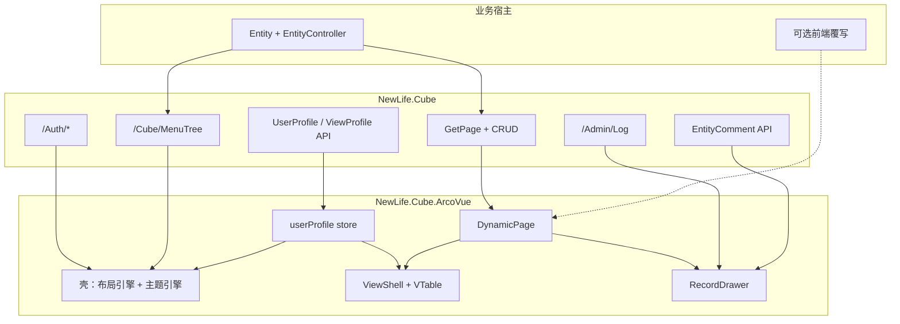

# NewLife.Cube.ArcoVue 企业中后台迁移与产品化方案

> 版本：2026-08-02（修订：看板分组字段取值修复；`EntityViewProfile`→`ViewProfile` 前后端统一重构；§8 收敛为「固定 CRUD 容器 + 有限用户运行时自定义」）
> 版本：2026-08-19（复审：§3.1 矩阵现状列按代码实测刷新；§10.4 差距表补 OSC-26081903c0 启停/填色/AI 浮窗）
> 版本：2026-08-21（增补 §8.5：自定义工作台、页面仪表盘与流程引擎；改写 §5.1 / §8.2 与「搜索 / 一张图 / FlowGram 样例」终态表述。口径与 [架构分享-预读.md](./架构分享-预读.md) 一致）
> 版本：2026-08-29（复审：OSC-2608280e9e / OSC-26082815a1 归档后刷新 §1.1 完成度、§3.1 矩阵、§10.3 总验收、§10.4 差距表与附录归档表；工作台全屏与暗色叠底已合入）
> 版本：2026-08-29b（筛选下推路径实测：XCode `FindAll(Expression, PageParameter)` 自动合并 `page.State`，18 个重写 Search 的控制器已全部透明下推，无需改控制器；§8.5.4 补实施路径，§10.4 #14 刷新）
> 版本：2026-08-30（多维视图专项：对照飞书/钉钉官方六视图刷新 §7.1/§7.4 完成度；§10.4 划掉已落地右冻结/`NamedViewsToolbar`/`__check`，补日历/看板/甘特只读增强与多级排序）
> 版本：2026-08-30c（对照 Cube + XCode + NewLife.X：行级/字段权限、GetPage 计算列、值集侧信道；增补 §8.6 企业级权限与审计合规 Issue 清单）
> 版本：2026-08-30d（增补 §0 愿景；§1.2 按愿景补齐必须达成目标）
> 版本：2026-08-30e（增补 §12 业务功能插件开发：ArcoVue 默认皮肤下业务包怎么做）
> 版本：2026-09-02（OSC-260902ef43 命名工作台归档：系统角色可把默认工作台「另存为/发布」为命名工作台并挂系统菜单，配置落 Parameter `Workbench.Named`；`/Workbench/{slug}` 只读命名槽、「系统看板」菜单组永远第一组、默认工作台禁重命名/删除）
> 版本：2026-09-22（复审：查询收口 OSC-260830a1b2、行权与脱敏 OSC-2608273d95、流程引擎 OSC-26090347f1 已归档；OSC-260922201a 六选人/多分支/就地审批/效率页代码已落地、待浏览器验收。刷新 §1.1、§3.1、§8.5.1、§8.5.5、§8.6.5、§10.3、§10.4）
> 版本：2026-09-27（OSC-26092694a1：甘特只读分组、多级排序 `sorts` 白名单。画册布局已撤回。刷新 §7.4、§10.3、§10.4 #19–#21）
> 版本：2026-09-27b（OSC-260926c2b8：值集 `entity:`/BatchLabel 行权、日历 `+N` 当日弹出与有权点空白新建、看板列折叠、评论提及前端接线。刷新 §3.1、§7.4、§8.5.1、§8.6.5、§10.3、§10.4 #17/#18/#23）
> 版本：2026-09-29c（OSC-260926c2b8 补记：看板恢复分页器；日历固定加载 1000 条并附带当前日/周/月区间（用户筛选 logic=any 且已有条件时不附带）、月导航移入工具栏「添加记录」后）
> 版本：2026-09-29d（OSC-260926c2b8 补记：日历 日/周/月 模式（周/日时间轴网格）与导航简化）
> 版本：2026-09-29e（OSC-260926c2b8 补记：日/周时间轴点击空白新建（整点）；日历导航移至工具栏右侧「关键字」前）
> 版本：2026-10-04（OSC-261004d7f4 实体地图散点视图落地（第 7 视图）：系统级单服务商 GetMapConfig + 适配层（高德/百度/腾讯 + 桩）+ 视口渐进加载 + 玻璃工具条/悬停卡/分类图标；刷新 §3.1、§7.1 与目录结构）
> 状态：可落地执行稿  
> 适用范围：以 NewLife.Cube（WebAPI）为后端，将 NewLife.Cube.ArcoVue 建设为默认企业中后台皮肤；复用 NewLife.Cube.Vue 能力成果，对接字节官方组件栈，支持用户级呈现配置与 AI（OpenSpec）协作。

---


## 0. 愿景

把 NewLife.Cube.ArcoVue 做成 **.NET 企业中后台的默认皮肤**：实体 + `EntityController` + 菜单即可得到完整管理页；交互吸收飞书/钉钉多维表的「同源数据、多种呈现」，权限与审计仍走 Cube / XCode，而不是再造一张云协作表。

**一句话**：元数据驱动的企业实体工作台——零配置 CRUD、六视图舞台、右侧记录抽屉、权限内的工作台与洞察、服务端自动化；对标成熟中后台的开箱能力，吸收多维表体验，不复刻飞书云。

### 0.1 我们是谁 / 不是谁


| 是                                             | 不是                              |
| --------------------------------------------- | ------------------------------- |
| 自有数据的 **实体管理界面**（表格即管理页）                      | 飞书多维表格 / 钉钉 AI 表格那种「表格即产品」的云协作库 |
| Cube WebAPI 的默认皮肤；与 Cube.Vue 并存，能力对齐、栈不搬运     | 低代码整页画布、第三方 Widget 市场、插件商店      |
| 固定 DefaultList 容器 + 有限用户运行时自定义（命名视图、列、筛选、洞察槽） | 用户脚本公式、浏览器跑流程、双向链接写回            |


相对若依 / Jeecg / Ant Design Pro / Arco Pro：领先应落在 **树表一等、ViewProfile、六视图、删除触发自动化、权限内 Widget/工作台**；不拼生态模板数量。相对飞书/钉钉：不追云端实时协同、互联网分享、按月自动化套餐。

### 0.2 为谁成立


| 角色       | 愿景体验                                                   |
| -------- | ------------------------------------------------------ |
| 业务研发     | 新模块 = 新 .NET 项目 + 实体控制器；80% 管理页零前端；特殊页才 Section / 整页覆写 |
| 最终用户     | 同一实体可切表格/树/卡片/看板/日历/甘特；筛选即查询、翻页完整；点行在右侧抽屉改、看历史、讨论该条记录  |
| 管理员 / 安全 | 菜单动作、租户、行范围、字段可见可写由后端强制；导出与列表同一套；操作可审计                 |
| 平台演进     | OpenSpec 小步变更；AI 协助实现与浮窗问答，不把字段 Agent 市场当皮肤职责          |


### 0.3 产品北极星（对应 §1.2）

1. **开箱即后台**：登录（含 MFA/SSO/租户）、菜单、用户角色、日志、值集，宿主 `UseArcoVue` 即可用。
2. **元数据即页面**：`GetPage` 是字段权威；FormJson / 命名视图只改呈现，不能增字段、改可写、也不能当 ACL。
3. **多维呈现、同一结果集**：六视图舞台齐全，只读完成度向飞书看齐（溢出列表、列折叠、甘特分组、画册布局）；查询只留筛选且必须下推服务端。看板跨列拖放只写回分组字段（OSC-260926c2b8）；日历/甘特默认不做拖拽写回。
4. **记录为协作单元**：讨论留在 RecordDrawer，不做成工具栏「权限范围内全部讨论」；收件箱承接推送到我的消息；实体自动化按 `TypePath`（+ 租户）共享，不是个人规则。
5. **呈现分层 ≠ 数据权限**：壳与首页工作台用户 > 主角色 > 系统；实体视图个人 > 全局模板 > 系统。行权接角色 `DataScope`，列权后端裁剪并在写入/导出对称。
6. **可读与可算在服务端**：值集翻译关联名；计算列是可序列化的 C# 属性；禁止浏览器公式与 `GetValue` 当 SPA 通道。
7. **可运营、可审计**：列表/详情/导出/值集反查/部件查询同一套 CanAccess；敏感字段脱敏；权限变更可追溯（§8.6）。
8. **可扩展、可协作交付**：业务覆写与 Cube.Vue 能力（富文本、LOV、CronJob POST、i18n、组件测试）可借；微前端多应用与 Element 页不搬。交付用 OpenSpec + 单测门禁。


### 0.4 成功时的系统面貌

业务人员打开任意已授权实体：工具条干净、视图可记、筛选即全量结果、洞察跟筛选走。点开一行，不离开列表上下文即可改字段、看谁改过、在本记录下讨论。管理员改角色数据范围或列权限后，列表、详情、导出立刻一致，前端藏列骗不过接口。新实体上线不先写 Vue。流程若立项，是 Cube 独立模块 + FlowGram 设计器，不是把自动化换成画布执行器。

### 0.5 与后文的关系

§1.2 是愿景的**必须达成清单**；§1.3 是边界；§7.4 / §8.5 / §8.6 是完成度与后端 Issue。未写入 §1.2 的项（如拖拽写回、对外表单、用户公式）维持非目标，除非先修订本节。

---


## 1. 背景与目标


### 1.1 背景


| 现状                   | 说明                                                                                                                                                                                                        |
| -------------------- | --------------------------------------------------------------------------------------------------------------------------------------------------------------------------------------------------------- |
| NewLife.Cube         | WebAPI 主线已具备认证、菜单、权限、`GetPage` 元数据驱动 CRUD；另含 UserProfile / ViewProfile / EntityComment、Workbench、Widget、Automation、Inbox、AI，以及 `Workflow` 审批运行时（定义/实例/待办/超时，OSC-26090347f1；选人与就地办理见 OSC-260922201a，待验收）   |
| NewLife.Cube.Vue     | 产品能力参照系（Element Plus + 微前端 + Section 覆写），仍是默认皮肤之一，非 Arco 栈                                                                                                                                                |
| NewLife.Cube.ArcoVue | 默认企业中后台皮肤主线：P0 壳/六视图/抽屉/自动化已齐；**页面仪表盘 Widget（OSC-2608280e9e）、用户>主角色>系统工作台（OSC-26082815a1）、查询收口（OSC-260830a1b2）已归档**；FlowGram 只做审批设计器，运行时在 Cube `Workflow`。相对 Cube.Vue 主要差在微前端多应用、技能/覆写广度、Cypress 全量与 i18n |
| 共享包 `@newlifex/*`    | api-core / auth-logic / page-logic / field-mapping / page-utils 可跨皮肤复用                                                                                                                                    |


### 1.2 产品目标（必须达成）

对应 §0 北极星。已落地的仍保留为回归门禁，未完成的不得用「舞台已有」代替。

1. **零配置自动 CRUD**：宿主仅 `UseArcoVue` 时，内置 Admin/Cube 与新增业务 `EntityController` 自动获得完整管理界面。
2. **开箱即企业后台**：登录（密码 / 短信 / MFA / SSO）、菜单权限、用户/角色/部门/租户、审计日志、值集、文件与作业等内置模块可用；不依赖为每个实体手写 Vue。
3. **飞书式多维数据工作台（舞台 + 只读完成度）**：table / **tree** / card / kanban / calendar / gantt 可切换、默认可记。记录以**右侧抽屉**编辑（飞书为左侧记录栏，本实现按 §8.1 用右侧），含表单、修改历史、**该条记录**的评论。只读完成度见 §7.4（日历溢出、空白新建与 日/周/月 模式、看板列折叠与跨列写回分组字段、甘特分组、卡片画册布局、多级排序）。日历/甘特拖拽写回和看板列内排序仍不是本目标。
4. **查询单一入口**：只留筛选构建器，条件必须编译为后端 Where；退役 SearchDrawer，保留并升级预定义查询（QueriesJson v2）；翻页、导出、统计、Insight、非表格大加载（日历/甘特） **共用同一结果集**（§8.5.4）。
5. **可配置呈现（不是第二套 ACL）**：导航布局、主题、密度禁止写死。实体视图 **个人 > 全局模板 > 系统默认**；**首页工作台** **用户 > 主角色 > 系统**（不做租户层工作台）。FormJson / ColumnsJson 只能调顺序、显隐、分组，不能增字段、改 `ReadOnly`/`ItemType`、也不能授权写入。
6. **实体页洞察 + 首页工作台**：实体洞察槽为授权范围内的指标卡/迷你图，随筛选联动；`/home` 与 `/Admin/Index` 监控页分离。
7. **服务端自动化与站内信**：线性 GraphJson + C# 执行器（含删除触发）；规则按实体类型（+ 租户）共享，创建人仅审计。通知进 Inbox；评论 @ 与提及通知可增强，讨论面仍以抽屉为准。
8. **行级与字段权、审计合规**：角色 `DataScope` 成为行权事实源（与租户 AND）；列表/详情/导出/PATCH/值集 `entity:` / Widget 查询同一套 `CanAccess`。字段可见/可写由后端裁剪，GetPage 按登录用户输出；计算列与 lookup 只读、不进 `CopyFrom`。缺口与 Issue 见 §8.6。
9. **值集与只读投影**：ENUM/LIST/`Entity.` 翻译显示名；SPA 计算列 = 可序列化 C# 属性 + GetPage 声明，禁止浏览器公式与 MVC `GetValue` 当 API。
10. **现代扁平视觉**：参考苹果 Human Interface / 飞书与 [Arco Design](https://arco.design/) 的扁平、留白、低噪点风格。
11. **业务增量开发模型**：新业务 = 新 .NET 项目 + 实体控制器；仅特殊页覆写前端。操作手册见 **§12**。可复用 Cube.Vue 已验证的控件与约定（富文本/图标、LOV、CronJob POST、改密、i18n、组件测试），不搬 Element 页与微前端运行时。
12. **AI 协作可落地**：复用现有 GitHub Copilot 指令；OpenSpec 轻量变更；同时适配 VS Code Copilot 与 Cursor。产品内 AI 浮窗（含附件）服务当前页，不把字段 Agent 市场当交付物。
13. **质量门禁**：关键逻辑单测 + 构建无错；补齐 i18n 与组件测试（矩阵已列、尚未交付）。流程设计器（FlowGram）与审批运行时按 §8.5.5 独立模块，不阻塞上述目标。


### 1.3 非目标（明确不做）

- 不做飞书云 OpenAPI / 多维表格云同步（交互范式对齐，非云产品对接）。
- 不整仓搬运 Cube.Vue 的 Element Plus 组件与微前端工程。
- 不改写已有 `.github/instructions` 组织级指令正文（只增量新增）。
- Cube.Vue 微前端多应用运行时、Cypress 全量套件、Element 主题体系等：见 §3.1 能力矩阵中目标为「➖」的项。
- 不做整页画布、第三方 Widget 市场、用户脚本公式；洞察槽内允许跨实体**平台部件**（须授权查询），见 §8.5。
- 不做把 ViewProfile / 筛选 / 藏列当数据权限或字段 ACL；列权限必须后端裁剪并在写入/导出对称强制，见 §8.6。
- 不做把 FlowGram 当流程执行器、不让浏览器跑流程；运行时若立项则在 Cube 独立模块。
- 不做租户层首页工作台；实体 ViewProfile 首期仍无角色层（与首页分层分开）。
- 演化后不再保留独立「搜索」抽屉（SearchDrawer）；保留工具栏 `Q` 与预定义查询（升级 QueriesJson v2），见 §8.5.4。


### 1.4 与 [功能清单.md](../功能清单.md) 的关系

本方案是 **SPA-7（ArcoVue）产品化 + 必要后端扩展** 的执行稿，不替代功能清单。对齐约定：


| 功能清单编码                         | 与本方案关系                                                                                                                           |
| ------------------------------ | -------------------------------------------------------------------------------------------------------------------------------- |
| SPA-1～3、SPA-7、SPA-15           | ArcoVue 宿主嵌入、回退路由、图表；本方案深化 SPA-7                                                                                                 |
| SPA-4                          | Cube.Vue：能力对标与验收参照，非迁移源码目标                                                                                                       |
| AUTH-1～12、OAUTH-*              | 前端对接；MFA 见 [认证接口设计.md](./认证接口设计.md)（`/Mfa/`*），非 [核心接口架构.md](./核心接口架构.md) 最小集                                                     |
| DATA-1～11、SYS-3、SYS-16～20（LOV） | 元数据 CRUD / 审计 / 值集；ArcoVue 消费这些已有后端                                                                                              |
| PERM-*                         | 菜单驱动路由与按钮权限位；数据权限/多租户以后端为准，皮肤透传                                                                                                  |
| **拟新增**（需回写功能清单）               | `UserProfile`、`ViewProfile`、`EntityComment` — 写入 [Cube.xml](../../NewLife.Cube/Entity/Cube.xml) 后由 XCode 协作指令生成，见 §5.2.1 / §10.2 |


实施时：每个 OpenSpec 变更的 `design.md` 应标注触及的功能清单编码；归档后视情况更新 [功能清单.md](../功能清单.md) 实现/测试列。

---


## 2. 三视角需求


### 2.1 产品视角


| 能力         | 描述                                              | 优先级 |
| ---------- | ----------------------------------------------- | --- |
| 开箱即用后台     | 登录、菜单、权限（角色抽屉授权树已接线，不改容器模型）、用户/角色/菜单/日志等内置模块可用  | P0  |
| 元数据驱动业务页   | 新实体配置字段与菜单后自动出页                                 | P0  |
| 多视图工作台     | table / tree / card / gantt 可切换，默认视图可记          | P0  |
| 记录抽屉       | 右抽屉：表单 / 历史 / 评论                                | P0  |
| 个性化工作台     | 壳：布局/主题；首页槽位：用户 > 主角色 > 系统                      | P0  |
| 实体页小仪表盘    | InsightPanel：指标卡 / 只读迷你看板 / 筛选联动；可绑已授权其它实体      | P1  |
| 查询收口       | 只留筛选构建器，条件必须后端查询；退役搜索抽屉，保留预定义查询（QueriesJson v2） | P1  |
| 覆写扩展       | Section / 整页；流程设计器页（非执行器）                       | P1  |
| 流程引擎       | Cube 独立模块：定义 / 实例 / 待办；FlowGram 仅设计器            | P1  |
| 字段级变更 diff | 结构化历史（相对 Log.Remark）                            | P2  |


**成功标准（产品）：**

- 业务研发零前端即可交付 80% 管理页。
- 不同用户打开同一系统，壳与首页工作台按用户覆盖主角色；实体列表视图仍按个人覆盖全局模板。
- 视觉与交互达到「现代扁平、低干扰、高信息密度可控」。


### 2.2 用户视角


| 场景      | 期望体验                                                 |
| ------- | ---------------------------------------------------- |
| 首次进入    | 清晰品牌区 + 简洁侧栏/顶栏；默认浅色扁平主题，可选深色                        |
| 日常列表    | 飞书多维表感觉：工具条干净、视图切换明显、列可拖拽显隐；大数据不卡顿（VTable）           |
| 编辑记录    | 右侧抽屉滑入，不丢列表上下文；表单分区清晰；可看历史与评论                        |
| 个性化     | 「外观设置」中切换布局（侧栏/顶栏/混合）、主题（浅/深/跟随系统）、密度（舒适/紧凑）；立即生效并记住 |
| 树/项目类数据 | 一键切树表或甘特（有日期字段时）；无能力时禁用并提示原因                         |
| 权限不足    | 按钮隐藏或禁用，文案友好，不出现空白报错页                                |


**可用性约束：**

- 主操作路径 ≤ 3 次点击到达常用实体。
- 列表首屏有意义内容；空态有引导。
- 动效克制（200–300ms 级），符合扁平产品习惯，避免炫光与厚重阴影。


### 2.3 技术视角


| 维度   | 决策                                                                                                     |
| ---- | ------------------------------------------------------------------------------------------------------ |
| 后端契约 | 最小集见 [核心接口架构.md](./核心接口架构.md)；MFA 见 [认证接口设计.md](./认证接口设计.md) `/Mfa/*`（AUTH-10）；Profile/Comment 见独立后端任务 |
| UI 栈 | Arco Design Vue（壳/表单）+ VisActor VTable（多维视图）+ FlowGram.AI（流程**设计器**，运行时见 §8.5.5）                       |
| 逻辑复用 | `@newlifex/*`；接线模板优先对照 NaiveUI，能力验收对照 §3.1 矩阵                                                          |
| 呈现配置 | `UserProfile` + `ViewProfile`（后端独立交付，前端消费，见 §5 / §10.1）                                                |
| 扩展   | `registerSection` + `apps/` 整页覆写                                                                       |
| 协作   | 恢复 `.github` Copilot 指令；OpenSpec（`openspec/`，新号 `OSC-YYMMDDxxxx`）；测试要求见 §9.3                           |
| 测试   | 对齐 `development.instructions.md`：实现功能默认同步补充测试                                                          |

**前端性能量测（OSC-261004e6ee）**：开发者工具 Network **总资源数**含 Vite 开发模式 ESM 模块，**不等于**业务 API 次数；断言壳层/列表请求时须勾选 **Fetch/XHR**（或等价过滤）。壳层稳定元数据（`LoginConfig` / `GetAiConfig` / `GetMapConfig` / `UserProfile` / `Tenants`）在 Pinia 会话内成功后复用，并做 in-flight 去重；`force` 作废本资源进行中请求后重取；登出/注销清缓存。站内信未读与审批 Meta **仅** in-flight 去重，不做会话缓存。实体列表普通刷新只走 `loadData()`，不重跑 `bootstrap`/`GetPage`/`ViewProfile`。

---


## 3. 可行性结论与能力矩阵

**可行。** 迁移本质是「能力对齐 + Arco/VTable 重做 UI + 偏好配置层」，不是复制 Cube.Vue。


| 维度        | 判断                                                                    |
| --------- | --------------------------------------------------------------------- |
| API/认证/菜单 | ArcoVue 已走 `@newlifex/api-core` / auth-logic；最小集对齐核心接口架构；MFA 对齐认证接口设计 |
| 自动 CRUD   | 后端完备；ArcoVue 需接入 `usePageLogic` 并产品化                                  |
| 多视图/抽屉    | 前端新建；**UserProfile / ViewProfile / EntityComment 为 Cube 核心后端扩展**，独立排期 |
| 工作量       | 后端独立 OSC + 前端 M0–M6（约 2–3 个迭代月，视人力浮动）                                 |


**为何接线阶段对标 NaiveUI、能力对标 Cube.Vue：**

- NaiveUI 与 ArcoVue 同为 Gen-2 薄皮肤，DynamicPage / 路由 / FieldMapping 同构，适合做「怎么接」。
- Cube.Vue 是能力与验收清单来源（见下表），Element Plus 实现不可直接搬。


### 3.1 Cube.Vue ↔ ArcoVue 能力矩阵

图例：✅ 完整　🟠 基础/部分　❌ 无　➖ 本方案不做（非目标）


| 能力                               | 功能清单/说明            | Cube.Vue                       | ArcoVue 现状                                                                                              | 目标                | 优先级  |
| -------------------------------- | ------------------ | ------------------------------ | ------------------------------------------------------------------------------------------------------- | ----------------- | ---- |
| 动态 CRUD（GetPage 列表/表单）           | DATA-1/4/5/6，SPA-7 | ✅                              | ✅                                                                                                       | ✅                 | P0   |
| 菜单驱动路由 + 鉴权守卫                    | PERM-3，SPA-1       | ✅                              | ✅                                                                                                       | ✅                 | P0   |
| 登录（密码/验证码/OAuth）                 | AUTH-2/6/8，OAUTH-1 | ✅                              | ✅（含公开页 `/activate` 激活：链接 `token`/`account` 与验证码，OSC-261001909b）                                                                                                       | ✅                 | P0   |
| Token 刷新 / 登出                    | AUTH-3             | ✅                              | ✅（账号安全页可注销：`POST /Auth/CloseAccount`，OSC-261001909b）                                                                                                       | ✅                 | P0   |
| MFA 二步验证 UI                      | AUTH-10，`/Mfa/*`   | ✅                              | ✅（登录二步屏 + 安全设置开启/关闭，`/Mfa/*`）                                                                           | ✅                 | P1   |
| Challenge / 验证码登录增强              | AUTH-4/5           | ✅                              | ✅（needChallenge + getChallenge 加密提交 + 图形验证码）                                                            | ✅                 | P1   |
| 导入导出                             | DATA-9             | ✅                              | ✅                                                                                                       | ✅                 | P0   |
| 批量删除                             | DATA-10            | ✅                              | ✅                                                                                                       | ✅                 | P0   |
| 批量其它操作（启用/禁用等）                   | 工具条扩展              | ✅                              | ✅（OSC-26081903c0 高级菜单批量启用/禁用；批量改字段见 e483）                                                               | 🟠                | P2   |
| ListField.Url / dataAction 自定义链接 | 单元格 + 操作列分流        | ✅（Bootstrap 单元格 / Metronic 更多） | ✅（OSC-2608178bdb 方案 E；OSC-2610011cd6：dataAction 为 POST，`/api/` 单元格发 GET 不导航）                                                                                  | 🟢                | Done |
| 图表 / 页面仪表盘                       | SPA-15             | ✅                              | ✅（OSC-2608280e9e：`DashboardJson` + WidgetHost；metricCard/miniChart；GetChartData 仅旧 insight 只读合成）        | ✅                 | P1   |
| 首页自定义工作台                         | §8.5.2             | 🟠 Index 监控                    | ✅（OSC-26082815a1：`/home` Widget 墙；用户 HomeJson > 主角色 Parameter > 系统种子；`/Admin/Index` 仍监控页）               | ✅                 | P0   |
| 字段控件矩阵（含上传/JSON/富文本等）            | DATA-11 等          | 🟠～✅                           | ✅（20+ 控件，FieldInput）                                                                                    | ✅                 | P0   |
| LOV 选择器                          | SYS-16～20          | ✅                              | ✅（LovSelect + lov-api）                                                                                  | ✅                 | P1   |
| 多页签 TagsView                     | 壳                  | ✅                              | ✅                                                                                                       | ✅                 | P0   |
| 多布局（侧/顶/混合）可配置                   | → UserProfile      | ✅ 多布局                          | ✅ 配置化（RootLayout 动态组件）                                                                                  | ✅ 配置化             | P0   |
| 主题/密度/i18n                       | 壳                  | ✅                              | 🟠 主题/密度/预置色板 ✅（OSC-0017）；i18n ❌                                                                        | ✅                 | P0   |
| UserProfile 持久化                  | **后端新建**           | ➖/局部                           | ✅（localStorage + 后端双通道；`workspace.defaultView/pageSize` 已消费：无 ViewProfile 回落默认视图、页面级 PageSize，OSC-0012） | ✅                 | P0   |
| ViewProfile（列/视图）                | **后端新建**           | ➖/局部                           | ✅（直接后端权威：命名视图/列/sort/chrome/mapping + 筛选记忆 + 受限表单布局 FormJson + 全局只读模板 + 实体级预定义查询；分组/排序/筛选/填色及查询应用按视图隔离，只有完整 GetList 请求签名一致才复用原始行，OSC-0012~0016、OSC-261004e6ee）         | ✅                 | P0   |
| VTable 表格+自定义列                   | 本方案增强              | 🟠 DOM 表                       | ✅                                                                                                       | ✅                 | P0   |
| 树表视图                             | DATA-3             | 🟠 部分页                         | ✅（treeBuilder 组装 + VTable hierarchy）                                                                    | ✅                 | P0   |
| 卡片视图                             | Vue 有未接线 stub      | ❌                              | ✅ 卡片流（CardList/RecordCard；标准/偏大/整行 + 可选封面；**非**飞书画册）                                                    | ✅ 卡片；画册布局见 §7.4   | P0   |
| 看板 / 日历                          | 本方案新建              | ❌                              | ✅ 看板分列 + **列折叠** + **跨列拖放写回分组字段** + 底部普通分页器（OSC-260926c2b8）；日历 `+N` 当日弹出 + 有 Insert 权点空白新建 + 固定加载 1000 条（请求附带当前日/周/月区间；用户筛选 logic=any 且已有条件时不附带）+ **日/周/月模式**（OSC-260926c2b8）；日历不做拖改日期                                         | ✅ 看板可改分组字段；日历只读。完成度见 §7.4  | P0   |
| 甘特视图                             | 本方案新建              | ❌                              | ✅ 只读（vtable-gantt 计划/实际双条重叠对比 + 任务条定位图标 + 表宽拖拽持久化 + 固定色，OSC-0019；`moveable:false`）                      | ✅ 只读；分组/依赖线见 §7.4 | P0   |
| 地图散点视图                          | 本方案新建              | ❌                              | ✅ 系统级单服务商（高德/百度/腾讯三选一，OSC-261004d7f4）：视口渐进加载（首批 1000 → 异步续页，上限 100 万）+ 玻璃工具条（放大/缩小/查询/填色）+ 悬停卡片 + 分类值图标/颜色 + 点击详情；离线桩 `__mapStub=1` 供 E2E | ✅ 只读散点；点聚合/暗色底图见 §7.4 | P1   |
| 右侧记录抽屉                           | 本方案                | ❌ 多为弹层                         | ✅ 右抽屉（表单/历史/评论全接线，OSC-0008）                                                                             | ✅                 | P0   |
| 修改历史（Log 筛选）                     | SYS-3              | 🟠 独立日志页                       | ✅（抽屉 timeline：分页 + 动作筛；Remark 前端启发式字段 diff，无后端结构化审计）                                                    | ✅ 抽屉 Tab          | P0   |
| 实体评论 EntityComment               | **后端新建**           | ❌                              | ✅（OSC-0008 接线：api-core comment API + 抽屉评论 Tab 顶层/回复/删除本人）                                               | ✅                 | P0   |
| Section 页面覆写                     | Vue skills         | ✅                              | ✅ 机制（useSections，仅 `_demo` 案例）                                                                          | ✅                 | P1   |
| apps 自定义业务页                      | cube-admin 等       | ✅                              | 🟠 机制 + `_demo` + Admin/Db、Admin/File、**值集管理页 /Admin/Lov**（OSC-2610019c9d）；Db 支持实体、数据字典与压缩（OSC-2610012e35；表、差异出口已移除） | 🟠 机制+高频页         | P1   |
| 微前端多应用运行时                        | Vue microApp       | ✅                              | ➖（未做）                                                                                                   | ➖                 | —    |
| FlowGram 工作流画布                   | 本方案                | ❌                              | ✅ 设计器已接定义 API（OSC-26090347f1；OSC-260922201a 补六选人/依次/多分支/办理人，待验收）。运行时是 Cube `Workflow` 状态机，不是画布执行器       | ✅ 设计器；运行时见 §8.5.5 | P1   |
| 字段级变更 diff                       | 相对 Log             | ❌                              | ❌                                                                                                       | ➖ 一期 / P2 二期      | P2   |
| 单元/组件测试体系                        | Vue Vitest 等       | ✅                              | 🟠（逻辑单测约 93 个 `*.spec.ts`；组件测试仍缺 `@vue/test-utils`）                                                     | ✅ 关键路径            | P0   |
| E2E（Cypress 级）                   | Vue                | ✅                              | 🟠 Playwright 冒烟 3 spec（认证/实体表单/对象主页，OSC-2608139feb）                                                    | 🟠 冒烟即可           | P2   |
| AI 助手浮窗                          | AI-7 / SPA-7       | ✅                              | ✅（OSC-26081903c0：右侧停靠 + FAB；流式对话；无会话持久化/搭建）                                                             | ✅                 | P1   |
| 嵌入分享                             | UserToken          | 🟠                             | ✅（`?embed=1&token=` EmbedLayout；ShareView 短令牌；隐藏壳与 AI）                                                  | ✅                 | P1   |
| 站内通知 Inbox                       | Automation         | 🟠                             | ✅（顶栏未读 + InboxDrawer；可解析 `target` 跳实体详情，OSC-261001909b；工作台 inbox 部件）                                                                    | ✅                 | P1   |
| 嵌入 NuGet / UseArcoVue            | SPA-2/3/7          | ✅ UseVue                       | ✅                                                                                                       | ✅                 | P0   |


> **实体自动化 ≠ 流程引擎 ≠ FlowGram。** OSC-260815fa86 已交付线性「自动化」（GraphJson + C# `AutomationExecutor`）。FlowGram 只做设计器；审批/待办运行时若立项则在 Cube `IModule`（§8.5.5），**禁止**把自动化实现成浏览器画布执行器。

> 注：以上「ArcoVue 现状」列已于 **2026-09-22** 对照代码复审刷新（查询收口、行权脱敏、FlowGram 设计器与审批运行时）。**2026-09-27** OSC-26092694a1 交付甘特分组与多级排序，画册布局已撤回；OSC-260926c2b8 交付日历 `+N` 弹出/有权点空白新建与看板列折叠。日历议程仍见 §7.4。刷新依据见 §10.4。

矩阵随里程碑更新「ArcoVue 现状」列；目标为 ➖ 的项不得在 OSC 中膨胀为必做范围。

---


## 4. 架构设计


### 4.1 总体架构


```mermaid
flowchart TB
  subgraph host [业务宿主]
    BizEntity["Entity + EntityController"]
    Override["可选前端覆写"]
  end
  subgraph cube [NewLife.Cube]
    Auth["/Auth/*"]
    Menu["/Cube/MenuTree"]
    Page["GetPage + CRUD"]
    PrefApi["UserProfile / ViewProfile API"]
    CommentApi["EntityComment API"]
    LogApi["/Admin/Log"]
  end
  subgraph arco [NewLife.Cube.ArcoVue]
    Shell["壳：布局引擎 + 主题引擎"]
    Dynamic["DynamicPage"]
    ViewShell["ViewShell + VTable"]
    Drawer["RecordDrawer"]
    PrefStore["userProfile store"]
  end
  BizEntity --> Page
  BizEntity --> Menu
  Auth --> Shell
  Menu --> Shell
  PrefApi --> PrefStore
  PrefStore --> Shell
  PrefStore --> ViewShell
  Page --> Dynamic
  Dynamic --> ViewShell
  Dynamic --> Drawer
  LogApi --> Drawer
  CommentApi --> Drawer
  Override -.-> Dynamic
```


### 4.2 前端目录（目标 → 2026-08-29 现状）

```
NewLife.Cube.ArcoVue/web/src/
├── api/                      # createCubeApi 薄封装 → @newlifex/api-core
├── stores/                   # user / app / tagsView / userProfile / viewProfile / tenant
├── router/                   # 菜单动态路由 + 守卫 + keep-alive
├── layouts/                  # side / top / mix / EmbedLayout（UserProfile + embed）
├── theme/                    # Design Token + Arco 主题注入
├── components/               # FieldInput / LovSelect / TagsView 等
├── features/
│   ├── views/                # card / kanban / calendar / gantt / map / RecordCard
│   ├── vtable/               # ListTable / 冻结线
│   ├── search/               # SearchDrawer / InsightPanel（→ WidgetHost）
│   └── widget/               # 平台 Widget 注册、宿主、配置抽屉
├── views/
│   ├── home/                 # Workbench（/home）
│   ├── crud/                 # DefaultList + RecordDrawer + 自动化
│   ├── object/ / dynamic/ / account/ / settings/ / inbox/ / ai/
│   └── admin/                # Db / File 专用页
├── apps/_demo/               # Section / 整页覆写样例
└── i18n/                     # 目标位；尚未落地
```

> 历史规划中的 `multi-view/`、`record-drawer/`、`flowgram/` 目录名已演化为上表；FlowGram 仍未创建。


### 4.3 官方组件栈分工（强制）


| 层级            | 技术                                                      | 职责                                      |
| ------------- | ------------------------------------------------------- | --------------------------------------- |
| 设计系统 / 壳 / 表单 | [Arco Design Vue](https://arco.design/)                 | 布局容器、导航、页签、登录、抽屉、表单控件、反馈                |
| 多维数据视图        | [VisActor VTable](https://visactor.com/vtable)（+ gantt） | 表格列布局、树表、卡片式布局、甘特；禁止长期以 `a-table` 做主多维表 |
| 工作流设计器        | [FlowGram.AI](https://flowgram.ai/)                     | 只读写流程定义；运行时禁止放在浏览器（§8.5.5）              |
| 领域逻辑          | `@newlifex/*`                                           | API、认证、列表状态机、字段映射                       |


---


## 5. 用户呈现配置（核心：禁止硬编码）

导航布局、主题、列表视图等必须走 **配置 → 引擎渲染**，使不同用户可有不同呈现。

### 5.1 配置分层

两套读取顺序，不要混用。


| 对象                    | 读取顺序                          | 说明                                                                                                                                                                                                                            |
| --------------------- | ----------------------------- | ----------------------------------------------------------------------------------------------------------------------------------------------------------------------------------------------------------------------------- |
| **首页工作台**（平台槽位）       | **用户 > 主角色 > 系统默认**           | OSC-26082815a1 已落地。用户 `UserProfile.HomeJson` 合法（含空 `widgets`）则整份采用，改角色默认不覆盖已个性化用户。角色层只看会员体系 **主角色**（`RoleId`），附加 `RoleIds` 不合并。管理员写 Parameter `Workbench.Role`；用户只写自己的 HomeJson。`GET /Cube/Workbench` 按当前用户解析下发。**不做租户层工作台。** |
| **实体视图**（ViewProfile） | **个人 > 全局模板（UserId=0）> 系统默认** | 已交付（OSC-0014）。**不做角色层**，除非另立。                                                                                                                                                                                                 |
| 壳布局 / 主题              | 仍走 UserProfile 个人配置           | 与首页槽位同实体，但字段不同                                                                                                                                                                                                                |


壳布局/主题仍在 UserProfile（`LayoutJson`/`ThemeJson`/`WorkspaceJson`）；首页槽位单独走 `HomeJson`。角色工作台用 Parameter `UserID=0` + `Category=Workbench.Role` + `LongValue`，**不**新建 `RoleWorkspace` 表。详情见 §8.5.2。

### 5.2 对象模型

两个持久化对象分工明确（另加评论实体）：


| 对象                | 作用域                  | 职责                    |
| ----------------- | -------------------- | --------------------- |
| **UserProfile**   | 按用户一条（或按用户+应用）       | 导航布局、主题样式、工作台全局默认     |
| **ViewProfile**   | 按用户 + 实体（typePath）多条 | 视图类型、列布局、甘特/卡片映射、筛选记忆 |
| **EntityComment** | 按实体记录多条              | 用户评论                  |


#### 5.2.1 建模与代码生成（Cube.xml + 已有协作指令）

三个实体**必须**落入魔方实体模型文件，**禁止**手写整份实体类绕过生成器：


| 步骤       | 说明                                                                                                                                                                                           |
| -------- | -------------------------------------------------------------------------------------------------------------------------------------------------------------------------------------------- |
| 1. 改模型   | 在 `[NewLife.Cube/Entity/Cube.xml](../../NewLife.Cube/Entity/Cube.xml)` 的 `<Tables>` 中新增三张 `Table`（沿用文件内 `Option`：`Namespace=NewLife.Cube.Entity`、`ConnName=Cube`、`ModelClass={name}Model` 等） |
| 2. 触发生成  | 按已有 **XCode 协作指令**（`.github/instructions/xcode.instructions.md`，由 `copilot-instructions.md` 路由命中「XCode/实体生成/Model.xml」等信号）：在 `Entity` 目录执行 `xcode` / `xcodetool`，生成实体与 `Models/*Model`       |
| 3. API 层 | 生成完成后，再按 **Cube 协作指令**（`cube.instructions.md`）为三实体补齐 API 控制器与测试——同属 **OSC-0002**，**不在 ArcoVue 工程内**                                                                                          |


Agent / Copilot 实施约定：OSC-0002 的 `tasks.md` 首项应为「编辑 Cube.xml（三表）→ 运行实体生成 → 再写三套 API」，`verify.md` 核对生成物与 xml 一致、无大段手写实体骨架。

**Cube.xml 表结构建议（实施时由 Agent 按此写入并微调）：**


| Table         | 关键列（示意）                                                                                                                                                                         | 索引                                                                                                                                                               |
| ------------- | ------------------------------------------------------------------------------------------------------------------------------------------------------------------------------- | ---------------------------------------------------------------------------------------------------------------------------------------------------------------- |
| UserProfile   | Id；UserId；LayoutJson / ThemeJson / WorkspaceJson（或单一 ProfileJson）；Version；Enable；Create*/Update*                                                                                | Unique(UserId)                                                                                                                                                   |
| ViewProfile   | Id；UserId；TypePath；View；ColumnsJson；**ViewsJson**；**ActiveViewId**；GanttJson；CardJson；FiltersJson；QueriesJson；**FormJson**；**DashboardJson**（演化，§8.5.3）；Version；Create*/Update* | Unique(UserId, TypePath)；命名视图存 ViewsJson；`UserId=0` 为全局只读模板；FormJson 存受限表单布局；QueriesJson 为 OSC-0016 预定义查询（**演化升级 v2 保留**，§8.5.4）；DashboardJson 为实体级页面仪表盘，不跟命名视图走 |
| EntityComment | Id；Category；LinkId；**ParentId / RootId / ReplyUserId / ReplyUser**；Content；CreateUser/Id/IP/Time；Update*                                                                        | (Category, LinkId)；ParentId；RootId；CreateUserID                                                                                                                  |


嵌套配置（layout/theme/columns 等）以 **JSON 文本列** 落库，与 §5.2 逻辑模型对应；API 层序列化为前端 TypeScript 形状。

逻辑模型（API/前端契约，对应上述 JSON 或展开字段）：

```ts
/** 用户级外观与工作台 — 实体 UserProfile */
interface UserProfileDto {
  version: 1
  userId: number | string
  layout: {
    mode: 'side' | 'top' | 'mix'
    siderCollapsed: boolean
    siderWidth: number
    showTabs: boolean
    contentWidth: 'standard' | 'wide' | 'fluid' // 旧 fixed → standard
  }
  theme: {
    appearance: 'light' | 'dark' | 'system'
    primaryColor: string
    radius: 'sm' | 'md' | 'lg'
    density: 'comfortable' | 'compact'
    fontScale: 'normal' | 'large'
  }
  workspace: {
    defaultView: 'table' | 'tree' | 'card' | 'kanban' | 'calendar' | 'gantt'
    pageSize: number
  }
}

/** 命名视图内类型映射（存于 ViewsJson，不写 ganttJson/cardJson） */
type ViewMapping =
  | { kind: 'card'; titleField: string; imageField?: string; layout: 'standard' | 'large' | 'row' }
  | { kind: 'kanban'; groupField: string; titleField: string; imageField?: string }
  | { kind: 'gantt'; startField: string; endField: string; titleField: string; colorField?: string }
  | { kind: 'calendar'; startField: string; endField?: string; titleField: string; colorField?: string }

/** 实体视图自定义 — 实体 ViewProfile；唯一键 userId + typePath */
interface ViewProfileDto {
  version: 1
  userId: number | string
  typePath: string
  view: 'table' | 'tree' | 'card' | 'kanban' | 'calendar' | 'gantt'
  /** 权威：多命名视图 JSON 字符串（ViewsJson）；元素含 mapping? */
  viewsJson?: string
  activeViewId?: string
  columns?: Array<{
    key: string
    visible: boolean
    width?: number
    frozen?: 'left' | 'right' | false
    title?: string
  }>
  /** 预留列；OSC-0006 前端不读写，映射以 NamedView.mapping 为准 */
  gantt?: { startField?: string; endField?: string; titleField?: string }
  card?: { titleField?: string; subtitleField?: string; statusField?: string; coverField?: string }
  /** 仅字段顺序、显隐与元数据 Category 分组的折叠偏好；不改变字段类型、校验、权限 */
  form?: {
    fields?: Record<string, { visible?: boolean; order?: number }>
    collapsedGroups?: string[]
  }
  filters?: Record<string, unknown>
}
```


### 5.3 存储与 API


| 阶段       | 策略                                                                                          |
| -------- | ------------------------------------------------------------------------------------------- |
| 前端可先行    | `localStorage`：`cube.arco.userProfile.{userId}`、`cube.arco.viewProfile.{userId}.{typePath}` |
| **后端权威** | **OSC-0002**：一次改 **Cube.xml**（三表）并经 XCode 指令生成，再挂齐三套 API；**非 ArcoVue 内实现**                  |
| 冲突       | 服务端成功拉取后覆盖本地；本地脏写防抖保存（300–500ms）                                                            |


**建议 API（由后端 OSC 定稿，名称可按 Cube Area 惯例微调）：**

```
GET    /Cube/UserProfile
PUT    /Cube/UserProfile                 # body: UserProfile 字段子集

GET    /Cube/ViewProfile?typePath=Admin/User
PUT    /Cube/ViewProfile           # body: ViewProfile（含 typePath）
DELETE /Cube/ViewProfile?typePath=Admin/User   # 恢复该实体默认视图

GET    /Cube/ViewProfile/Template?typePath=Admin/User
PUT    /Cube/ViewProfile/Template  # 仅管理员；服务端固定 UserId=0
DELETE /Cube/ViewProfile/Template?typePath=Admin/User

GET    /Cube/EntityComment?category=&linkId=&parentId=
POST   /Cube/EntityComment               # body 可含 parentId 表示回复
DELETE /Cube/EntityComment?id=
```

`EntityComment` **同表回复**（不新增表）：`ParentId`（0=顶层）、`RootId`（线程根）、`ReplyUserId` / `ReplyUser`（被回复作者）。`GET` 的 `parentId` 可选：缺省/负数=全部，`0`=仅顶层，`>0`=该父评论的直接回复。

**实现约束：**

- `layouts/*` 只注册实现，**不在路由里写死唯一布局**；根布局读 `userProfile.layout.mode` 动态 `<component :is>`。
- 主题通过 CSS Variables + Arco `ConfigProvider` 注入，**禁止**在业务组件写死主色/背景。
- `DynamicPage` / ViewShell 读当前用户的 `ViewProfile`（按 `typePath`）；后续模板能力按 §8.2.4 将个人配置与 `UserId=0` 模板字段级合并；无则回落 `UserProfile.workspace.defaultView`，再回落系统默认。
- 列布局、视图切换的保存写入 **ViewProfile**；外观设置页写入 **UserProfile**。
- 提供「外观设置」页与顶栏快捷入口（主题、密度）；支持「恢复默认」（删或重置对应 Profile）。


### 5.4 与权限的关系

- `UserProfile` 布局/主题属个人配置，不占用菜单权限位。
- `ViewProfile` 视图切换不绕过 `canAdd/Edit/Delete/Export/Import`。
- 甘特拖拽改期必须受 `canEdit` 约束。

---


## 6. 视觉与交互规范（苹果 / 飞书扁平风）


### 6.1 设计原则

1. **扁平与层级靠留白/分割线**，避免多层厚重阴影与炫光。
2. **中性背景 + 单一品牌强调色**（默认接近飞书/Arco 蓝；可由 `UserProfile.theme` 覆盖）。
3. **信息密度可调**：舒适 / 紧凑两档，影响表行高、表单项间距。
4. **动效克制**：抽屉/页签切换短时缓动；列表滚动性能优先（Canvas 表）。
5. **图标线性、字重克制**：标题与正文层级清晰，避免装饰性插画挤占首屏。


### 6.2 Design Token（示例，实施时落入 `theme/tokens.css`）

```css
:root {
  --cube-color-bg: #f5f6f7;
  --cube-color-surface: #ffffff;
  --cube-color-border: rgba(0, 0, 0, 0.06);
  --cube-color-text: rgba(0, 0, 0, 0.88);
  --cube-color-text-secondary: rgba(0, 0, 0, 0.45);
  --cube-color-primary: #3370ff; /* 可由用户偏好覆盖 */
  --cube-radius-sm: 6px;
  --cube-radius-md: 8px;
  --cube-space-page: 16px 20px;
  --cube-font: "SF Pro Text", "PingFang SC", "Segoe UI", "Helvetica Neue", Arial, sans-serif;
}
[data-theme="dark"] { /* 对应 token 反色，保持扁平 */ }
```

与 Arco 主题变量映射，保证组件与自研壳一致。

### 6.3 关键界面结构（默认 side 布局）

- 顶栏：产品名/Logo、全局搜索（可后期）、主题切换、用户菜单——扁平、低分隔。
- 侧栏：图标 + 文案；激活态用浅底或左边线，避免厚重选中块。
- 内容区：页签（可关）+ 工具条 + VTable 主舞台。
- 抽屉：自右侧推入（宽度可配，默认 480–640），遮罩轻量。

---


## 7. 多视图与抽屉（飞书多维表范式）


### 7.1 ViewShell


| 视图       | 实现                       | 启用条件                                                      |
| -------- | ------------------------ | --------------------------------------------------------- |
| table    | VTable ListTable + 列布局偏好 | 默认                                                        |
| tree     | VTable tree              | 实体为树或存在 Parent 字段 / EntityTree 数据（扁平列表由 treeBuilder 自动组装） |
| card     | 卡片流（CardList/RecordCard） | 配置了 card 字段映射或可自动推断 title                                 |
| kanban   | 看板只读分列（KanbanBoard）      | 存在可分组字段（枚举/布尔/选项）                                         |
| calendar | 月历视图（CalendarMonth）      | 存在 DateTime 字段作为开始日期                                      |
| gantt    | VisActor 甘特（只读，无拖拽写回）    | 存在可映射的起止日期字段                                              |
| map      | 地图散点（MapView + 高德/百度/腾讯适配层） | 存在坐标字段（分列经/纬度或合并坐标）且系统已配置地图服务商（`/Cube/GetMapConfig`） |


> 7 种视图均已落地（OSC-0006 六视图 + OSC-261004d7f4 地图）；「看板/甘特/日历无拖拽写回」为设计内「不做」项。结构齐之后的**只读完成度**见 §7.4，差距编号见 §10.4 #17–#22。

视图切换器绑定当前 `typePath` 的 **ViewProfile.view**，切换即持久化该 Profile。分组/排序/筛选/填色及未保存查询按命名视图隔离；仅当完整 GetList **请求签名**（实体、租户、页码、页大小、排序、关键字、`viewFilter`/日历窗等）一致时才复用当前原始行本地重绘，否则必须重新请求（OSC-261004e6ee）。权限仍以后端为准。

### 7.2 右侧 RecordDrawer


| Tab | 数据                                 | 说明                    |
| --- | ---------------------------------- | --------------------- |
| 表单  | `getDetail` + add/edit fields      | 校验、LOV、高级控件；保存刷新视图    |
| 历史  | `GET /Admin/Log?category=&linkid=` | 筛时间/用户/动作；一期展示 Remark |
| 评论  | **新建** EntityComment API           | 列表/发表/删（本人或管理员）       |


### 7.3 后端新建（评论）

建议 `EntityComment`：`Category`、`LinkId`、`Content`、**ParentId / RootId / ReplyUserId / ReplyUser**（同表回复）、创建人信息等。  
API：`GET/POST/DELETE /Cube/EntityComment`；POST 传 `parentId` 即可回复，不另建回复表。
供所有皮肤复用，不绑死 ArcoVue。

### 7.4 多维视图完成度（2026-08-30 专项，对照飞书/钉钉）

飞书官方六视图为表格 / 看板 / 日历 / 甘特 / **画册** / **表单**；钉钉 AI 表格同级。ArcoVue 为 table / **tree** / card / kanban / calendar / gantt。对标交互范式，不复刻云协作。树表为一等视图（飞书/钉钉官方无），保持优势。


| 视图       | 已交付                                                      | 待完善（只读，不改「无拖拽写回」）                         | 明确不做                                          |
| -------- | -------------------------------------------------------- | ----------------------------------------- | --------------------------------------------- |
| table    | VTable；列显隐/序/宽；左右冻结；分组 ≤3；条件填色；表头单列与工具栏多级排序（≤3，`sorts` 白名单，OSC-26092694a1） | 行高档；表内拖列（配置抽屉已可拖） | 单元格任意公式                                       |
| tree     | `treeBuilder` + hierarchy；无 Parent 禁创建；禁止分组；工具栏多级排序与表格相同 | 展开层级记忆、大树懒加载（P2）                          | 把树改成画册                                        |
| card     | 标准/偏大/整行 + 可选 `imageField`；标准/偏大封面贴边，整行封面圆角 2px | 「画册」布局：图大字段少（P1）                          | 对外附件相册产品                                      |
| kanban   | 枚举分列；`dataSource` 空列仍展示；列内懒加载；**列折叠**向上收起（写入当前视图 `collapsedColumns`）；**跨列拖放**写回分组字段（`PATCH` + `FindData`，OSC-260926c2b8） | 封面字段约定（`imageField` 已有）               | 列内排序持久化；日历/甘特拖拽写回 |
| calendar | **日/周/月**（月 42 格；周/日时间轴网格）；点事件开详情；每天最多 3 条 + `+N` 弹出当日列表；有权点空白开新增（月：空白日；日/周：时间轴整点）（OSC-260926c2b8） | 议程（`+N` 弹出、空白新建与 日/周 已交付）      | 拖事件改日期                                        |
| gantt    | 计划/实际双条；缩放 5 级；`tableWidth` 持久化；`taskBar.moveable=false`；按字段只读分组（父节点不进详情，OSC-26092694a1） | 只读依赖线（须前置任务模型，见竞品缺口 D）              | 拖条改期、进度条可调、里程碑写回                              |
| 表单视图     | 无；列表有 ShareView embed                                    | —                                         | 对外问卷收集（独立站点 + 同一实体 API）                       |


**跨视图壳（已齐 / 待补）**

- 已齐：命名视图 Tab（建/改名/复制/删除/存模板）；`canCreateViewKind` 门禁；mapping 按类型；筛选 AND/OR 且 `viewFilter` 下推；ShareView 短令牌；个人 ViewProfile > 全局模板。
- 待补：视图 Tab **不能拖排序**；无飞书「保护视图」（不做视图级 ACL，最多只读模板）；表格分组不作用于看板/日历/甘特（看板用 `mapping.groupField`）。查询双轨已由 OSC-260830a1b2 收口（筛选为唯一入口）。

落地顺序：查询收口已完成。甘特分组与多级排序已由 OSC-26092694a1 交付，画册布局已撤回；日历溢出/空白新建、看板列折叠与跨列拖放写回分组字段已由 OSC-260926c2b8 交付；看板恢复分页器、日历固定加载 1000 条（请求附带当前日/周/月区间；用户筛选 logic=any 且已有条件时不附带）、日/周/月模式与导航简化同为该号 2026-09-29 补记。列内排序与日历/甘特拖拽写回仍不做。

---


## 8. 零配置 CRUD 与业务扩展


### 8.1 自动生成路径

1. 菜单来自 `/Cube/MenuTree`。
2. **B3 叶路由**：有 `url` 的节点扁平 `addRoute` 到 Layout（文件夹不嵌套子路由）；`props: { type, authId }`；优先 `apps/*/src/views/**/index.vue` 整页覆写，否则 `DynamicPage`。`visible=false` 的隐藏菜单不进这条动态路由；用户在线、用户统计、令牌、用户链接、OAuth、访问规则、短信、邮件、字典参数、租户用户、应用日志，以及流程效率页，改为静态子路由直达，不改 Menus 的 Visible，侧栏是否显示仍由管理员在菜单管理里修改。
3. **DynamicPage** 为薄宿主：解析 Section `DefaultListPage` 覆写，否则挂载 **DefaultList** 微内核（GetPage → fieldControl → 列表/搜索/LOV → **右侧**抽屉）。
4. 点击行打开 **右侧 RecordDrawer**（`placement="right"`；表单 / 历史 / 评论）；微内核**不读**布局/主题 store（契约隔离）。
5. 多视图 ViewShell / VTable 已由 **OSC-0005/0006** 落地（6 视图 + 命名视图 Tab + 配置抽屉）；在此基础上向「视图/表单容器 + 用户运行时自定义」演进，见 §8.2。


### 8.2 固定视图/表单容器与有限用户运行时自定义（飞书应用模式）

> 研究依据：飞书帮助中心「应用模式」及其列表、标签页、尺寸文档。飞书的应用页可以自由编排跨表组件；其前提是完整的数据源、页面、权限和自动化平台。ArcoVue 的定位是 **Cube 的默认 CRUD 皮肤**，而非低代码平台，因此只借鉴“同源数据多种呈现、配置与使用分离、用户可恢复默认”的体验，不复制整页画布与第三方组件市场。洞察槽内的页面级小仪表盘、首页工作台与流程引擎见 **§8.5**（演化目标）；本节 8.2.2–8.2.6 先记录 **e483 已交付上限**，避免把现状写成终点。


#### 8.2.1 评审结论与边界


| 飞书能力                             | 本方案处理                               | 原因                                                                      |
| -------------------------------- | ----------------------------------- | ----------------------------------------------------------------------- |
| 同一数据源的列表、卡片、详情、筛选、排序             | **采用**：复用命名视图、6 类视图、右侧 RecordDrawer | 当前 `DefaultList` 已具备，用户收益直接                                             |
| 固定区域展示统计/图表                      | **已交付有限采用**；**演化**为页面级小仪表盘（§8.5.3）  | e483：`GetList.stat` + 一张 `insight.chartOption`；第一期改为指标卡 / 只读迷你看板 / 筛选联动 |
| 字段显示与表单组织                        | **采用**：仅顺序、显隐、按现有 Category 分组折叠     | 不改变 Cube 元数据、字段控件、校验和权限                                                 |
| 管理员发布默认界面                        | **采用**：每实体一个全局只读模板，个人可覆盖            | 实体视图不做角色层；**首页工作台**按用户 > 主角色（§5.1 / §8.5.2）                             |
| 任意整页画布、拖拽增删页面区块、嵌套标签页、第三方 Widget | **不做**                              | 会新增 Widget 生命周期、布局引擎、移动端和性能问题                                           |
| 跨实体文本/图片/按钮块、用户脚本、浏览器跑流程         | **不做**                              | 脱离 GetPage 与 Cube 权限契约                                                  |
| 洞察槽内跨实体平台部件                      | **演化允许**（§8.5.3）                    | 每张源表走已授权 GetList；禁止前端拼 SQL                                              |


#### 8.2.2 容器契约（复用而非重建）

每个实体路由默认仍是一个固定的 **DefaultList 容器**：

1. `GetPage` 是字段、权限、表单和统计的唯一元数据来源；`GetList`、`GetDetail` 与 CRUD API 仍是唯一数据/写入通道。
2. 容器固定顺序为：可选**洞察槽** → 命名视图 Tab/工具栏 → 当前数据视图 → 分页 → 右侧 `RecordDrawer`。不允许用户新增、删除、拖动或嵌套**页面**区块；只允许在洞察槽**内部**增删/排序平台部件（§8.5.3）。
3. **已交付（OSC-260819e483）**：洞察区统计标签与一张图表（`insight.showStat` / `showChart`）；`chartOption` 写在当前 NamedView；数据来自当前列表，保存时不写入 `series.data`/`dataset.source`。开发者 `OnGetChartData` 非空仍优先。当时搜索由工具栏「搜索」打开的 `SearchDrawer` 承载；InsightPanel 不含搜索表单。**此为 e483 已交付上限，不是演化终点**——演化见 §8.5.3 / §8.5.4。2026-09-22：搜索抽屉已由 OSC-260830a1b2 退役。
4. NamedView 继续承载 table/tree/card/kanban/calendar/gantt 的列、映射、排序和工具栏外观；现有 `widthMode` / `heightMode` 只表示当前视图的容器尺寸，不升级为通用 Widget 尺寸系统。**看板视图 ≠ InsightPanel**：前者是六视图之一，只呈现当前实体当前筛选；后者是页面级小仪表盘。


#### 8.2.3 受限配置模型


| 配置        | 存储                                           | 允许用户改变                                              | 明确禁止                           |
| --------- | -------------------------------------------- | --------------------------------------------------- | ------------------------------ |
| 命名视图      | `ViewsJson` / `ActiveViewId` / `ColumnsJson` | 视图类型、列显隐/顺序/宽度/标题、排序、已有 mapping/chrome              | 自定义 SQL、跨实体数据源、绕过字段权限          |
| 筛选记忆      | `FiltersJson`                                | 当前实体筛选条件，保存为该命名视图默认（演化后为**唯一**查询入口）                 | 用户脚本/SQL；把筛选当成数据权限             |
| 洞察区（已交付）  | `ViewsJson` 中当前 NamedView 的 `insight`        | `showStat` / `showChart`；可选一张 `chartOption`         | option 内脚本/函数、把列表快照写进 Profile  |
| 页面仪表盘（演化） | ViewProfile 实体级 `DashboardJson`              | 平台部件：指标卡、只读迷你看板；可绑已授权 `sourceTypePath`              | 第三方 Widget、迷你表格/多图（第一期不做）、拖拽写回 |
| 表单布局      | `FormJson`                                   | add/edit/detail 的字段顺序、显隐、按 GetPage `Category` 的分组折叠 | 新字段、字段类型/控件、默认值、校验、必填、权限、提交动作  |


`FormJson` 仅是前端呈现偏好；字段是否存在、是否可编辑、是否必填以及提交载荷仍由 GetPage 与 `prepareSubmitPayload` 判定。配置中出现已删除字段时静默忽略；元数据中新字段按所属分组追加且默认可见，保证升级后仍能操作。

#### 8.2.4 模板与优先级

实体 ViewProfile 仍是两层（OSC-0014 已交付），**不做角色/租户模板**：

1. **个人 ViewProfile**：`UserId = 当前用户`，可编辑，优先级最高。
2. **全局只读模板**：`UserId = 0`，由具备管理权限的管理员发布；普通用户仅可“基于模板开始自定义”，首次保存时创建个人 Profile。
3. **系统默认**：没有模板或个人配置时，由 GetPage 和 `seedDefaultView` 生成。

读取为“个人配置覆盖模板，模板覆盖系统默认”的字段级合并。首页工作台分层见 §5.1 / §8.5.2，不要套用本小节。

开发者扩展优先级保持不变：整页 `apps/*/index.vue` 覆写直接接管页面；未整页覆写时，Section 可局部替换容器插槽；只有默认容器才消费上述用户配置。业务覆写不必兼容通用配置协议，避免运行时互相干扰。

#### 8.2.5 实施切片（评论接线后）


| OSC      | 内容           | 出口                                                                                                                   |
| -------- | ------------ | -------------------------------------------------------------------------------------------------------------------- |
| OSC-0012 | 筛选记忆 + 单一洞察区 | `FiltersJson` 按命名视图保存；`insight.showStat`/`showChart` 双开关独立（可同时），始终使用当前实体与筛选条件                                        |
| OSC-0013 | 受限表单布局       | ViewProfile 增 `FormJson`；RecordDrawer 支持字段顺序、显隐、Category 分组折叠与恢复默认                                                   |
| OSC-0014 | 全局只读模板       | `UserId=0` 模板读写 API、权限与审计；个人覆盖/恢复模板；不做角色、租户与协同编辑                                                                     |
| OSC-0015 | 筛选构建器 + 多级分组 | **已交付**：条件组保存到 `NamedView.filter`；e483 起可下推 `viewFilter`，无法下推则忽略服务端过滤（前端当前页兜底，**已知限制**）。**演化**：必须后端查询，禁止假筛选，见 §8.5.4 |
| OSC-0016 | 通用查询 + 预定义查询 | **已交付**后由 OSC-260830a1b2 退役 `SearchDrawer`，预定义查询升级为 `QueriesJson` v2（`q`+`filter`）并保留                                |


#### 8.2.6 验收与非目标

- 新实体仍只需实体 + `EntityController` + 菜单即可获得完整页面；没有任何 Profile 时与当前行为一致。
- 用户可以保存一个命名视图的筛选、洞察展示和表单呈现；恢复默认后回落全局模板或系统默认。
- 管理员发布模板后，未个性化用户立即使用；已个性化用户不被覆盖。
- 图表（OSC-260819e483 **已交付**）：当前 NamedView 允许持久化**一张**用户 ECharts option（`insight.chartOption`，≤32KB）；数据来自当前列表；开发者 `OnGetChartData` 非空仍优先。**演化**见 §8.5.3，单图保留兼容，不当第一期主交付。
- 查找展示沿用现有 `MapField` / `DataSourceMap` / `lovCode` 字段配置（`fetchBatchLabel` 已接线），不新增查找协议；只读公式使用 C# 扩展属性（与 Map 扩展同类），禁止用户 JS/SQL、双向写回。
- 不新增整页画布、第三方 Widget 注册表、页内标签容器、跨实体文本/图片/按钮块、用户脚本公式。洞察槽跨实体平台部件、首页槽位、流程运行时按 §8.5 立项，不混进本小节的「已交付验收」。


### 8.5 自定义工作台、页面仪表盘与流程引擎

> 2026-08-21 产品口径；**2026-08-29**：OSC-2608280e9e / 15a1 已归档，下表「要补」项以代码为准刷新。L0 仍是零配置实体 CRUD（§8.1–8.2）。往上只加三类后端，不要并成「再做一个飞书」。值集消费契约（含 `entity:` ListData）未收口前，跨实体选表与仪表盘实现应一并看待。口径长文见 [架构分享-预读.md](./架构分享-预读.md)。

三条产品边界必须分开：


| 表面               | 对标         | 不是什么                                                                                                   | 落地               |
| ---------------- | ---------- | ------------------------------------------------------------------------------------------------------ | ---------------- |
| **看板视图**         | 飞书看板视图     | DefaultList **六视图之一**；只呈现当前实体、当前筛选；列=分组字段；只读、无拖拽写回。不承担跨表看数。                                            | ✅ OSC-0006       |
| **InsightPanel** | 飞书仪表盘（缩小版） | 挂在实体页**固定洞察槽**，不是独立菜单、不是整页画布。每 `typePath` 一份 `DashboardJson`；平台部件可绑**已授权**其它实体。实现为 `WidgetHost`（非旧单图）。 | ✅ OSC-2608280e9e |
| **首页工作台**        | 「我的工作台」    | 平台槽位（待办、快捷入口、KPI）。`/Admin/Index` 仍是监控页；自定义墙在静态 `/home`。支持全屏（盖住壳层；暗色须不透明叠底）。                            | ✅ OSC-26082815a1 |


```
DefaultList 固定容器
  InsightPanel（页面仪表盘：指标卡 / 只读迷你看板）
  → 命名视图与工具栏（查询入口只留筛选）
  → 六视图（含看板视图）
  → 分页 → 右侧 RecordDrawer

数据：当前实体 GetList ──筛选联动──► 仪表盘部件
      其它 typePath 授权 GetList ──────────► 仪表盘部件
```

用户不能增删整页区块；只在洞察槽内部增删、排序平台部件。

#### 8.5.1 分层（后端已有 vs 要补）


| 层           | 内容                                                                                                                                    |
| ----------- | ------------------------------------------------------------------------------------------------------------------------------------- |
| L0 实体内核     | GetPage / CRUD / 行级权限 / 值集。四档 `DataScope` 已并入列表与详情（OSC-2608273d95）；值集 `entity:`/BatchLabel 行权由 OSC-260926c2b8 收口。**仍开放**：字段矩阵 ACL、GetPage 匿名（§8.6 BE-B2）。 |
| L1 呈现       | UserProfile 壳；ViewProfile 命名视图；**首页槽位用户>主角色**；**Insight DashboardJson**。                                                              |
| L2 协作       | 实体自动化（线性 GraphJson + `AutomationExecutor`）；站内信 Inbox。                                                                                 |
| L3 流程引擎（已建） | 定义、实例、待办、超时已由 OSC-26090347f1 并入 `NewLife.Cube/Workflow`。FlowGram **仅设计器**。OSC-260922201a 补六选人、多分支、就地办理与效率页，代码已落地、待浏览器验收。              |


基础设施（认证、RBAC、多租户、`IModule`、通知、AI）复用，不平行造会话。

#### 8.5.2 首页工作台：用户 > 主角色（OSC-26082815a1 已实现）

不是 Widget 市场：named 目录为 CubeNC 13 个预定义部件的 SPA 对等实现（`ICubeWidget`，不引用 Razor `IWidget`）加 Inbox。读取**整份**配置：

1. 用户 `UserProfile.HomeJson` 合法（含 `widgets:[]`）→ `source=user`。
2. 否则主角色 `Parameter(UserID=0, Category=Workbench.Role, Name={roleId})` 的 **LongValue** → `source=role`；附加 `RoleIds` 不参与、不合并。
3. 否则系统种子（`IsSystem` → admin 六 KPI+Monitor 等；否则 member）→ `source=system`。

写入：`PUT /Cube/Workbench` 只写当前用户 HomeJson（空串清除并继承）；`PUT /Cube/Workbench/Role/{id}` 仅系统角色。`WorkspaceJson` 仍是列表偏好，**禁止**塞首页布局。与 `/Admin/Index` 监控页分离。不做租户层、不做整页画布。

洞察槽（§8.5.3）仍禁用 miniKanban、上限 12、`w∈{3,4,6,12}`。工作台开放看板，上限 16，`w∈{2,3,4,6,8,12}`。

#### 8.5.2a 命名工作台：另存为、切换与菜单挂载（OSC-260902ef43 已实现）

> 个人墙之上叠加**发布层**：系统角色在 `/home` 编辑态可把当前墙「另存为」成命名工作台，配置落 Parameter `Workbench.Named`（`Value`=标题、`LongValue`=归一化配置），并自动挂一条系统菜单（Url=`/Workbench/{slug}`）；普通用户按菜单进入只读命名页。

- **slug 语义**：无 slug（`/home`）=「默认工作台」，user>role>system 个人墙不变；有 slug（`/Workbench/{slug}`）= 只读命名槽。
- 读取：`GET /Cube/Workbench/Named/{slug}` 按对应菜单行权限 fail-closed（不存在 404 / 无权 403）；列表 `GET /Cube/Workbench/Named` 仅系统角色。
- 写入/删除：`PUT /Cube/Workbench/Named/{slug}`（upsert 槽 + 菜单，仅系统角色；标题≤40）、`DELETE /Cube/Workbench/Named/{slug}`（下架：删槽 + 删菜单）。空 `homeJson` 400（清空请 DELETE）。
- **菜单置顶**：`Workbench` 父分组 `Sort` 每次发布时顶置为根级最大 +1（XCode `BigSort=true`、`Root.Childs` 按 Sort 降序）→ 命名工作台所在的「系统看板」组（Name=Workbench，显示名=系统看板）在左侧菜单**永远第一组**；父分组无子项时随下架移除（下次发布重建）。
- 前端交互：`Workbench` 标题栏「编辑（左）+ `▾`（右）」组合按钮（样式对齐查询簇 `QueryComboButton`）；`▾` = `发布 / 重命名 / 删除 / 分隔符 / 默认工作台 / 命名工作台1…N`（当前项打勾）。默认工作台仅可编辑与「发布…」，**禁止重命名/删除**；命名工作台仅系统角色可编辑/发布/重命名/删除，普通用户只读。
- 约束沿用：单份 ≤16 张 / 64KiB / 禁 legacyChart；**不做共享命名工作台上的个人覆盖**（只读发布）；不做租户层命名工作台。


#### 8.5.3 页面仪表盘 Widget 协议（OSC-2608280e9e）

洞察槽是 **Widget 运行时**，不是单图开关。配置落 `ViewProfile.DashboardJson`（实体级，与 `ViewsJson` 分域；个人有效整份 > 模板 UserId=0 > 未配置）。


| 部件                | 数据                                                                     | 约束                                 |
| ----------------- | ---------------------------------------------------------------------- | ---------------------------------- |
| 指标卡 `metricCard`  | `POST /Cube/Widget/Query` aggregate（count/sum/avg/min/max）             | 源 `typePath` 须 Detail；禁止 SQL/脚本    |
| 迷你图表 `miniChart`  | 同上；平台模板 sparkline/line/bar/pie（时间分桶：SQLite/MySQL/SQLServer/PostgreSQL） | 禁止把用户自由 ECharts option 当新编         |
| 迷你看板 `miniKanban` | Query `mode=list` + `KanbanBoard compact`                              | **洞察槽禁用**；首页工作台 OSC-26082815a1 已开放 |
| 筛选联动              | 宿主 **筛选构建器** `hostFilter`；不绑 SearchDrawer                              | 同源 AND；跨实体须 `linkFilter`，无映射则「未联动」 |


协议：`ICubeWidget` + `registerWidget`（C# 扫描 named；Vue `features/widget/registry.ts`）。聚合走 Query，禁止前端 N×GetList。上限 12 张 / 64KiB。`PUT dashboardJson: ""` 清除个人域并继承模板；显式 `{"version":1,"widgets":[]}` 表示用户清空、不继承。旧 `NamedView.insight` 仅在 DashboardJson 未配置时只读合成（`legacyChart` 禁止 PUT）。首页工作台不在本号。视图分享：embed 短令牌（`LoadToken` 接受非 JWT + Url 白名单）。

安全：每部件单独鉴权 + `DataPermission` + 租户 Where（与 CreateWhere 同等）；无法翻译的 extraFilter → 400。Sources 只含 Detail 实体。未知 kind 占位；Query 403 → 锁卡，不跳登录。

#### 8.5.4 查询演化：只留筛选，全部走后端（OSC-260830a1b2 已归档）


| 今日双轨                                                                                 | 演化                                                                                                                                |
| ------------------------------------------------------------------------------------ | --------------------------------------------------------------------------------------------------------------------------------- |
| `SearchDrawer` + `Q` / `dtStart`/`dtEnd` / GetPage `Search` 字段 + `QueriesJson` 预定义查询 | **退役**独立搜索抽屉；查询簇化（工具栏 `Q` + `查询 / 自定义 / ▾` 连体组）：关键字走 `Q`，字段条件走 `viewFilter`，预定义查询升级为 `QueriesJson` v2（同时保存 `q` + `filter`）**并保留** |
| `NamedView.filter` / `viewFilter`：能下推则并入查询，不能则忽略服务端、只滤当前页                            | **唯一入口**；条件必须编译成后端 Where；无法下推则返回 null 改内存过滤（当前页），**不再有当前页假筛选提示**                                                                  |


翻页、导出、统计、Insight 部件、看板视图共用同一结果集。`GetList` 以结构化筛选为权威参数。GetPage `Search` 分区改为可筛字段元数据，值集远程候选仍给筛选控件。筛选不是权限：`DataPermission` 与租户 Where 先于用户筛选。

**实施路径发现（2026-08-29 实测）**：「全控制器可靠下推」**无需改造任何重写 Search 的控制器**。机制：① `SearchData` 已把 `p.State = CreateWhere() & viewExp`（权限表达式与 viewFilter 一同入 State）；② XCode `Entity.FindAll(Expression, PageParameter)` 源码自动把 `page.State`（Expression/WhereBuilder）AND 进 where；③ Areas 内 18 个重写 `Search` 的控制器（User/Log/Role/Department/Tenant 等）无论直接 `FindAll(exp, p)` 还是经实体静态 `Search(...)`，终点全部落在 `FindAll(exp, page)`——与 DataPermission 行权同一条透明通道。例外：`id>0` 单条直达分支（语义合理）、`EntityTreeController` 走缓存内存 `Match`（已专门处理）、`LovController.ListData` 值集场景（非实体列表）。因此该号收口工作（已归档）为：`AutomationFilter` 字段白名单（`GetPage search ∪ list`，未下发字段 400）+ 复杂度上限（条件 >10 / `any` >5 → 400）+ `startswith`/`notstartswith`；时序实体（分表 / `*Log`*）无时间条件时自动时间窗（`FilterWindowDays`，默认 30、0 关闭，`X-Cube-Filter-Narrowed` 响应头 / Widget `filterNarrowed`）；透明下推回归单测；前端退役 `SearchDrawer` 并查询簇化（`Q` + `查询 / 自定义 / ▾` 连体组）；预定义查询升级 `QueriesJson` v2（同时保存 `q` + `filter` 并保留）。

#### 8.5.5 流程引擎 ≠ 实体自动化


|     | 实体自动化（已有）               | 流程引擎（要补）                        |
| --- | ----------------------- | ------------------------------- |
| 触发  | 增删改 / 定时 / 按钮 / Webhook | 人工提交、节点到达、超时                    |
| 状态  | 跑完即终态                   | 实例持久化：进行中 / 驳回 / 撤销             |
| 人   | notify                  | 待办：候选人、认领、转办、会签                 |
| 图   | 线性 GraphJson            | 网关/分支/回退；设计器可用 FlowGram         |
| 与实体 | OnUpdate 钩子入队           | 绑定 `typePath+id`；节点锁字段（依赖字段级权限） |


企微 `ApprovalInfo` 只是 OAuth 补卡 DTO，不是魔方审批引擎。最小集合建议独立 `IModule`：定义 JSON（禁止任意 SQL）、实例、任务（与 Inbox 打通）、服务端状态机 + Job 超时。未引用模块时皮肤隐藏待办槽与设计器入口（能力探测类似 `GetAiConfig`）。OSC-0010 从「样例页」升级为「设计器对接定义 API」，仍不是把自动化换成画布执行器。

> **落地（2026-09-03，OSC-26090347f1）**：按上表「方案 A（最小增量）」交付——流程引擎随 WebAPI 核心库并入 `NewLife.Cube/Workflow`（命名空间 `NewLife.Cube.Workflow(.Entity)`，非独立 NuGet、非皮肤仓）；提供定义 JSON、实例/主体/任务/意见五表、服务端状态机与超时 Job；实体列表**零改业务表**接入（GetPage/GetList 注入 workflow 块与 `__wf`*，提交→写锁→审批通道 PATCH）；设计器用 FlowGram.AI 固定布局、运行时为 C# 引擎（浏览器不执行）；CubeNC/CubeDemoNC 不 Link 该目录、MVC 无入口。验证见 OSC-26090347f1 tasks/verify。
>
> **加法（2026-09-22，OSC-260922201a，代码已落地、待验收归档）**：设计器六种选人（成员/角色/部门/直属部门负责人/提交人自选/实体上的用户或部门字段）、依次审批可新建、条件多分支从左到右命中第一条且末支为「其他情况」、空人策略（自动通过/转部门负责人/指定人/缺省停住）、办理人节点（只「已办理」、不能驳回）、同一审批人自动跳过、禁用用户改派部门负责人、在途占用表（与进程锁并存）、待办行气泡就地办理、意见附件、效率页（流程/部门/用户/节点/年/月）。仍不做：并加签/减签、连续多级负责人、抄送箱、独立手机端、子流程与 BPMN。`level` 不是 1 则发布失败。浏览器 AC 见该号 `verify.md`。


#### 8.5.6 建议立项切分

首页「用户 > 主角色」已由 OSC-26082815a1 落地（`HomeJson` + Parameter `Workbench.Role` + `/Cube/Workbench`）。

### 8.6 企业级权限、计算列与审计合规（后端增强）

> 2026-08-30 对照：`NewLife.Cube` WebAPI、`NewLife.XCode` Membership、`NewLife.X` `SystemJson`/`DataMemberResolver`、`Doc/PERM-*.md` / `DATA-字段元数据.md`。权威代码优先于 Doc（`PERM-数据权限.md` 仍写三字段 `DataPermission` 构造器，与现码不符）。
>
> 2026-09-12 更新：行权与脱敏已按 **OSC-2608273d95** 落地（见 8.6.1b）；下面 8.6.1 的「缺口」列保留当时实测记录，供对照。

企业中后台审计合规要求：**同一套策略**覆盖列表、详情、导出、导入、PATCH、Widget 查询、值集反查；藏列与筛选不是安全边界。皮肤只消费裁剪后的 GetPage / 行 JSON。

#### 8.6.1 现状：分层权限（代码实测）

```
菜单 PermissionFlags（EntityAuthorize：Detail/Insert/Update/Delete/…）
  → 租户 CreateWhere（ITenantScope + TenantContext；无上下文 Enforce 则 1=0）
  → 行权：仅 DataPermissionAttribute 固定表达式（如 User 的 ID={#userId}）
      XCode Role.DataScope / DataScopeHelper.GetFilter 已实现，Cube CreateWhere **未调用**
  → 字段：无角色×字段矩阵；IFieldScope + MaskSensitiveFields 存在，控制器 **从未调用**
  → 写入：CopyFrom 脏字段；ValidPermission 默认恒 true
```


| 层        | 已有                                                                                   | 缺口                                                                                                                                                          |
| -------- | ------------------------------------------------------------------------------------ | ----------------------------------------------------------------------------------------------------------------------------------------------------------- |
| 操作       | `EntityAuthorize` + 角色菜单位                                                            | 不覆盖「能看哪些列」                                                                                                                                                  |
| 租户       | `CreateWhere` + TenantInterceptor                                                    | 与行权 AND 已具备；无租户上下文 fail-closed                                                                                                                              |
| 行        | `DataPermission(systemRoles, expression)` + `FindData` 的 `builder.Eval`              | **忽略** `Role.DataScope`。`DataScopeMiddleware` 只灌 `DataScopeContext`，列表不消费。OSC-2608273d95 仍 Draft（↓ 8.6.1b 已交付）                                              |
| 行（XCode） | `GetFilter` / `CanAccess` / `DataScopeInterceptor.OnQuery`                           | ① `Role.Valid` 把 `DataScope==0`（全部）改写成「本部门」；② `OnValid` catch 后 **return true**（越权仍保存）；③ User/Department/Log **未** `Add<DataScopeInterceptor>()`（User 已有接口） |
| 字段脱敏     | `IFieldScope.GetSensitiveFields` + `ViewSensitive`                                   | 未接到 Index/Detail/Export；GetPage 无 `sensitive`（↓ 8.6.1b 已交付）                                                                                                 |
| 字段 ACL   | `DataField.Authority` 序列化但 Fill 不赋值、无人消费                                             | 角色看不见薪资只能 `RemoveField`（全局）或前端藏列                                                                                                                            |
| 元数据      | GetPage / GetFields `[AllowAnonymous]`                                               | 未登录可读字段名、类型、LOV 码、枚举字典；做列权限时必须按用户裁剪                                                                                                                         |
| 旁路       | `ExportFile` 用 `Factory.AllFields`；`LovController.FetchEntityList` 直调 `fact.FindAll` | 不走 GetPage 分区、不走 `SearchData`/`CreateWhere`；实体未挂拦截器则无行权                                                                                                     |
| 文档       | 功能清单 PERM-6 标已实现                                                                     | `Doc/PERM-数据权限.md` 示例 API 与 `DataPermissionAttribute` **不一致**                                                                                               |


**契约（不可破坏）**

1. 行过滤只在服务端：`viewFilter` / ViewProfile / ColumnsJson **不是** ACL。
2. 租户 Where 与行权 **AND**；`logic=any` 不得放大 `CreateWhere`。
3. 不把 `DataPermission` 表达式下发浏览器。
4. 字段矩阵另号；不要把 OSC-2608273d95 的 `IFieldScope` 脱敏当成列 ACL。


#### 8.6.1b 已交付：四档行权与控件脱敏（OSC-2608273d95，2026-09-12）

**策略**：不改 XCode 仓库、不给实体挂 `DataScopeInterceptor`、不写 `DataScopeContext.Current`；行权在接口层显式构造上下文后调用 XCode 现成 API。

```
菜单 PermissionFlags
  → 租户 CreateWhere（不变）
  → 行权：GetDataScopeContext()（真实用户，不写 Current）
        列表/导出/聚合：DataScopeHelper.GetFilter AND 进 SearchData.p.State
        详情/写入：DataScopeHelper.CanAccess（FindData 越权拒；ValidPermission 新增放行）
  → 字段：GetPage DataField.sensitive（真实 ctx 无 ViewSensitive 时标记）
        列表/详情/导出返回前 FieldScopeHelper.MaskSensitiveFields → ***
  → 前端：rejectSensitiveColumns 藏列（藏列 ≠ 授权）；角色表单数据范围=自定义 才显示「数据部门」
```


| 项      | 结论                                                                                                                                                                                                                          |
| ------ | --------------------------------------------------------------------------------------------------------------------------------------------------------------------------------------------------------------------------- |
| 覆盖实体接口 | User（`IDataScope`）；UserToken / UserOnline / UserConnect / OAuthLog / NotificationRecord → `IUserScope` + `IDataScopeFieldProvider`                                                                                          |
| 拆除特性   | User / Log / UserToken / UserOnline / UserConnect / OAuthLog（双栈）+ CubeNC NotificationRecord；Department 保留 `ManagerID` 特性（无需归属接口表达）                                                                                          |
| 保留特性   | Department（`ManagerID`）、Parameter、Attachment、PrincipalAgent（无法用归属接口表达）                                                                                                                                                      |
| 新增写入   | `ValidPermission` 新增不再无条件放行：非系统角色声称为他人归属时拒绝（归属为 0 交由保存链路，与审计字段一致）                                                                                                                                                           |
| 实体层    | 仍不承担行权；`DecouplingTests` 前两条守护不变                                                                                                                                                                                            |
| 排障备注   | `UserController.Search` 的 `?id=` 分支已改走 `FindData`（含 CanAccess），不得回退为 `FindByID`                                                                                                                                             |
| 测试     | 后端 `DataScopeRowPermissionTests` / `DataPermissionArchitectureTests` / `DataScopeDecouplingTests` / `DataScopeSensitiveMvcTests` / `UserScopeQueryBypassGuardTests`；前端 Vitest `dataScopeForm` / `listColumns` / `iamGuards` |


**契约补充（叠加 8.6.1 四条）**：
5. `GetDataScopeContext()` 不得写 `DataScopeContext.Current`；宿主系统态继续休眠。
6. 行权表达式与 `viewFilter` 同时存在时先保行权；仅当租户/特性 `WhereBuilder` 自身不可解析时保留该 WhereBuilder（行权退让，已在 `tasks.md` 残留 R1 登记）。
7. 前端藏列/筛选不改变服务端行集与脱敏结果。
8. Map 外键候选必须落在 `dataSource` 上：SPA 元数据出口是 `DataField.ToDictionary()`，`DataSourceMap`（`MapCandidateFiller` 小表内联分支）此前不被输出，导致 `mapField` 非空的外键字段（`RoleID`/`DepartmentID`/`CreateUserID`）在表单与详情退化为数字输入框。现按「`DataSource` 委托 → 枚举反射 → `DataSourceMap`」回退输出；`list`/`allList`/`GetFields(List)` 同步接入候选填充（仅 `ListField` 且非 String 的编号列）。`mapField` 只表示「映射到某物理外键列」，不驱动控件。

#### 8.6.2 计算列能否经 GetPage 给前端

`GetPage.list` 来自 `OnGetFields(List)` → 静态 `ListFields`（`factory.Fields` 表列 + `SetRelation` 用 `[Map]` 替换外键 + 控制器 `AddListField`）。`AddDataField(name)` 从 `Factory.AllFields` 取，**可以**加入 Biz 扩展属性。


| 写法                                                                                   | GetPage 元数据                                     | 行 JSON（GetList/GetDetail）                                                      | SPA                                                       |
| ------------------------------------------------------------------------------------ | ----------------------------------------------- | ------------------------------------------------------------------------------ | --------------------------------------------------------- |
| 表列（Model.xml）                                                                        | ✅                                               | ✅                                                                              | 标准列                                                       |
| `AddListField("Log")` + `Url`（无实体属性）                                                 | ✅ name/url/header                               | ❌                                                                              | 仅操作链（OSC-2608178bdb `__ops`）                              |
| `ListField.GetValue` / `GetClass` / `DataVisible`                                    | ❌ `[JsonIgnore]`                                | ❌                                                                              | **仅 MVC Razor**；SPA 拿不到单元格计算值                             |
| Biz `[Map]`（如 `RoleName`）                                                            | ✅ `SetRelation` 把 FK 换成 Map 名                   | ❌ `[XmlIgnore, IgnoreDataMember]`；`SystemJson.Apply` → `DataMemberResolver` 剥掉 | 列表显示靠 **Map 名列 +** `BatchLabel`**/**`DataSourceMap`，值仍是外键 |
| Biz 计算属性（**无** Ignore，且 `AddField` / `ShowIn` 进分区）                                   | ✅                                               | ✅ 进 JSON                                                                       | 值必须已在实体上；前端 **禁止** JS/SQL 求值                              |
| `Doc/DATA-字段元数据.md` 的 `AddDataField(new ListField{ DataSource = e => Price*Stock })` | 与现码不符（`AddDataField` 吃字段名；`DataSource` 是下拉字典委托） | —                                                                              | 勿按该示例做 SPA                                                |


**前端计算列（ArcoVue 已冻结）**：`itemType ∈ {formula, compute, computed}` 只展示**已在行 JSON 的值**，不进提交体；lookup = Map + `BatchLabel` 显示关联**名称**。禁止 GetPage `projections`、浏览器公式、双向写回（e483 P5 / harness）。

落地约定：要给 SPA 看的计算列 = **C# 扩展属性（可序列化）+ GetPage 声明** `ReadOnly` **+ 不进 add/edit/**`CopyFrom`。`GetValue` 只服务 MVC，不要作为企业皮肤的计算列通道。

#### 8.6.3 值集机制


| 类型        | 元数据                                                                       | 数据                                                                 | 权限                                                                                                        |
| --------- | ------------------------------------------------------------------------- | ------------------------------------------------------------------ | --------------------------------------------------------------------------------------------------------- |
| ENUM      | GetPage `DataSourceMap`；无手工 LovCode 时 `PrepareForApi` 填 `Enum.{FullName}` | 内联，不必再打 Meta                                                       | 字典本身无行权                                                                                                   |
| LIST      | 字段 `LovCode`；`GET /Admin/Lov/Meta`                                        | `POST ListData`（HTTP / `entity:`）                                  | **Meta/ListData/BatchLabel 仅** `EntityAuthorize(Detail)`**（值集菜单）**，不是目标实体菜单                               |
| 大表 FK     | `FillMapCandidates`：行数 > `MaxDropDownList` → `LovCode=Entity.{FullName}`  | 远程搜索                                                               | 同 LIST                                                                                                    |
| `entity:` | LovListConfig.Source                                                      | `FetchEntityList`：`EntityFactory.FindAll(exp)`，**不经** `SearchData` | 无 `DataPermission`、无租户 `CreateWhere`；仅当目标实体已挂 `DataScopeInterceptor`/`TenantInterceptor` 且上下文有效才有 ORM 层过滤 |


`BatchLabel` 按 value 反查 label：可对不可见行做存在性/标签推断（布尔侧信道）。筛选白名单见 OSC-260830a1b2（`search ∪ list`），与列 ACL 分开。

#### 8.6.4 目标架构（审计合规）

```
请求
  EntityAuthorize（动作）
  → CreateWhere = Tenant AND DataScope.GetFilter AND DataPermission(可选额外 AND)
  → Search / FindData / Export / Widget Query / entity: ListData 共用同一表达式或 CanAccess
  → 字段：GetPage 按用户裁剪分区；行 JSON / 导出剥离或脱敏不可见列
  → 写入：CopyFrom / PATCH / 导入只接受 editForm ∩ 可写矩阵；计算列/lookup 剔除
  → 审计：LogOnChange（已有 Field=old→new）+ 导出/权限变更/越权拒绝记失败日志
```

原则：fail-closed；多角色 DataScope 取 **Min**（已有 `GetMergedDataScope`）；`IsSystem` 仍等于全部；无接口实体（Menu/Role/多数配置）不加行权，只靠菜单。列权限变更本身必须可审计。

#### 8.6.5 Issue 清单（按功能分组，便于开 OSC）

编号 `BE-*` 仅本方案使用。已有 Draft 号写在「承接」列，不要平行再造一套模型。

**A. 行级权限（先于列 ACL）**


| ID    | 内容                                                                                                                       | 改哪里                                             | 承接 / 依赖                                                              |
| ----- | ------------------------------------------------------------------------------------------------------------------------ | ----------------------------------------------- | -------------------------------------------------------------------- |
| BE-A1 | `Role.Valid` 勿把 `DataScope==0`（全部）当未设置；仅 Insert 且未脏时写默认                                                                  | XCode `角色.Biz.cs`                               | OSC-2608273d95 XCode Issue 问题 1                                      |
| BE-A2 | `DataScopeInterceptor.OnValid` 失败 **return false**（或抛出），禁止 catch 后 true                                                  | XCode `DataScopeModule.cs`                      | 问题 2；**修好再挂实体**                                                      |
| BE-A3 | User 挂拦截器；Department 补 `IDepartmentScope`；Log 补 `IUserScope`→`CreateUserID`                                              | XCode 实体静态构造                                    | 问题 3；仅 IUserScope 不要按部门扩权                                            |
| BE-A4 | `IDepartmentScope` +「仅本人」= 本部门 ID，禁止 `Equal(-1)` 空集                                                                      | XCode `GetFilter`                               | 问题 4                                                                 |
| BE-A5 | 部门缓存键含 `userId+deptId+scope`                                                                                             | XCode `DataScopeContext`                        | 问题 6                                                                 |
| BE-A6 | Cube `CreateWhere` **合并** `DataScopeHelper.GetFilter`；拆掉会压成仅本人的 `DataPermission`（User/Log/Token/Online 等）；特性类保留作可选额外 AND | Cube `ReadOnlyEntityController2` 双栈             | ✅ OSC-2608273d95（§8.6.1b）；租户 AND 顺序不变。BE-A1～A5 仍是 XCode 侧，本号未改 XCode |
| BE-A7 | 详情 / 导出 / PATCH / 启停 / Widget Query 与列表同一 `CanAccess`                                                                    | Cube FindData / ExportFile / WidgetQueryService | 禁止只滤列表                                                               |
| BE-A8 | 重写 `Doc/PERM-数据权限.md` 与现码一致；功能清单 PERM-6 区分「特性表达式」与「角色 DataScope」                                                         | Doc                                             | 与 BE-A6 同号收口                                                         |


**B. 字段权限与脱敏**


| ID    | 内容                                                                                           | 改哪里                                      | 承接 / 依赖                                                |
| ----- | -------------------------------------------------------------------------------------------- | ---------------------------------------- | ------------------------------------------------------ |
| BE-B1 | Index/Detail/Export 调用 `MaskSensitiveFields`；GetPage 打 `sensitive`；无 ViewSensitive 且非本人密码类脱敏 | Cube PrepareFieldsForApi + SearchData 出口 | ✅ OSC-2608273d95；**不是**矩阵 ACL。导出与列表是否全程同一裁剪仍随 BE-E1 复核 |
| BE-B2 | 角色×字段 可见/可写矩阵：GetPage 按用户裁剪五分区；写入/导出/导入对称剥离                                                  | 新 OSC（建议独立）                              | 须先 **取消或收紧** GetPage `[AllowAnonymous]`                |
| BE-B3 | `CopyFrom` / PATCH / 导入忽略不可见且不可写列；计算列与 lookup 永不进写通道                                         | `EntityController`                       | 与 BE-B2 同号或紧随                                          |
| BE-B4 | 勿用 `Authority`/`Extended*` 偷语义；显式 `Sensitive` / 可写位，并在写入路径强制                                 | `DataField`                              | 竞品 §7 契约 7                                             |


**C. 计算列与只读投影**


| ID    | 内容                                                                            | 改哪里         | 承接 / 依赖                 |
| ----- | ----------------------------------------------------------------------------- | ----------- | ----------------------- |
| BE-C1 | 文档化：SPA 计算列 = 可序列化 C# 属性 + GetPage `itemType` + ReadOnly；废弃把 `GetValue` 当 API | Doc + 控制器技能 | 修订 `DATA-字段元数据.md` 错误示例 |
| BE-C2 | 需要进列表的 Map 显示名：要么行 JSON 去掉 Ignore（或另投影 DTO），要么维持 FK + BatchLabel（现状）          | 择一写进 design | **不**新增 projections 协议  |
| BE-C3 | 只读查找多列（Customer.Level）：可选 `LookupDisplays[]`，GetList **附加**只读键；禁止双向写回         | 须重开 §8.2.6  | 竞品缺口 B；非本迭代承诺           |


**D. 值集与查询侧信道**


| ID    | 内容                                                                            | 改哪里                             | 承接 / 依赖                                                   |
| ----- | ----------------------------------------------------------------------------- | ------------------------------- | --------------------------------------------------------- |
| BE-D1 | `AutomationFilter` 字段 ∈ GetPage `search ∪ list`                               | `AutomationFilter` + SearchData | ✅ OSC-260830a1b2 已归档                                      |
| BE-D2 | `entity:` ListData 并入目标实体菜单 Detail + 与 `CreateWhere` 同等的租户/行权（或强制走已挂拦截器且单测钉死） | `LovController.FetchEntityList` | ✅ OSC-260926c2b8：无 Detail 403；租户/行权 AND 进查询（fail-closed） |
| BE-D3 | `BatchLabel`：仅翻译调用方已有权看见的 value；或对目标实体 `CanAccess` 后再回 label                  | `LovController.BatchLabel`      | ✅ OSC-260926c2b8：按主键集合 + `CanAccess` + 租户，不可见键省略（防枚举探测） |
| BE-D4 | 查询收口：退役 SearchDrawer；筛选唯一入口                                                   | 前端 + GetPage Search 定位          | ✅ OSC-260830a1b2 已归档（`QueryComboButton` + QueriesJson v2） |


**E. 审计与合规门禁**


| ID    | 内容                                       | 改哪里                      | 承接 / 依赖                    |
| ----- | ---------------------------------------- | ------------------------ | -------------------------- |
| BE-E1 | 导出走与列表相同的行权 + 字段裁剪（停止裸 `AllFields`）      | `OnExportExcel/Csv/Json` | 与 BE-A7 / BE-B2            |
| BE-E2 | 角色 DataScope / 字段矩阵 / 菜单权限变更写审计（谁改了谁的范围） | Role/Menu 控制器 + Log      | SYS-3；失败拒绝也写 success=false |
| BE-E3 | 业务用户不可改删操作日志（已有则核对外露 Action）             | Log 控制器                  | 合规保留                       |
| BE-E4 | GetPage 匿名范围成文：登录后按用户裁剪；分享令牌用分享者身份裁剪     | GetPage / ShareView      | 与 BE-B2 绑定                 |


**建议落地顺序**（2026-09-27）：BE-A6 / BE-B1 / BE-D1 / BE-D4 已交付；BE-D2/D3（值集旁路）由 OSC-260926c2b8 交付。接下来 BE-B2/B3/E1（字段 ACL + 导出对称）→ BE-A1～A5（若仍要修 XCode 拦截器）→ BE-C* / BE-E2 按合规节奏。

**明确不做**：ViewProfile 当数据权限；用户脚本公式；把拦截器 fail-open 上生产；菜单/角色表按 DataScope 过滤。

### 8.3 业务侧日常开发

**完整操作手册见 §12。** 此处只留四步备忘：新建类库 → 实体 + `EntityController` + Area 菜单 → 宿主 `AddCube` / `UseCube` / `UseArcoVue` → 默认零前端；不够再 Section / `apps/` 整页。不要为每个实体手写 Vue，也不要用 `AppModule` 表当发布模型。

### 8.4 Cube.Vue 成果复用边界


### 8.4 Cube.Vue 成果复用边界


| 复用                                               | 重写                                             |
| ------------------------------------------------ | ---------------------------------------------- |
| `@newlifex/*`、菜单路由思想、LOV/密码规则等逻辑、Section 概念、能力清单 | 全部 Element Plus UI、Vue `core/views`、旧 layout 壳 |


---


## 9. AI 协作与 OpenSpec（Copilot + Cursor）


### 9.1 资产位置与复用原则


| 原则               | 说明                                                                                                    |
| ---------------- | ----------------------------------------------------------------------------------------------------- |
| 组织资产             | 优先**编排** NewLife.Skills 已有 instructions / skills / agents，**不改**其正文                                   |
| 增量资产             | **暂不**写入 NewLife.Skills；统一放在 `[NewLife.Cube.ArcoVue/openspec/](../../NewLife.Cube.ArcoVue/openspec/)` |
| Cube 仓 `.github` | 仍可从 `origin/x-master` **原样恢复**指令副本（若本机未安装 Skills）；禁止为 ArcoVue 改写已有 instructions 正文                    |
| Cube.Vue/skills  | 仅作行为对照；执行 Arco 时禁止照抄 Element Plus                                                                     |


### 9.2 轻量变更结构与状态机

变更根目录：`NewLife.Cube.ArcoVue/openspec/`。

**新变更编号** `OSC-YYMMDDxxxx`（`YYMMDD` = 创建日 Asia/Shanghai；`xxxx` = 4 位随机小写 hex，紧接日期、中间无 `-`）。创建时在 `changes/` 与 `archive/` 查前缀唯一；冲突则重抽 hex。**禁止** `max+1`、按落地顺序递增、为依赖预留空洞号。历史 `OSC-0001` … `OSC-0019` 永不改名。

```
NewLife.Cube.ArcoVue/openspec/
├── README.md
├── agents/                   # 薄壳编排 Agent（openspec-*）
├── harness/                  # lessons.md（教训＋条目索引）+ verify-lessons.ps1（索引校验）
└── changes/
    ├── OSC-260813c3e9 页面TS抽离与协作编号/  # 新号：OSC-YYMMDDxxxx + 空格 + 中文简述
    │   ├── status.md
    │   ├── proposal.md / design.md / tasks.md / verify.md / retro.md
    │   └── ui/               # 可选
    ├── OSC-0018 实体界面自定义设计方案/       # 历史 OSC-00xx 豁免
    └── archive/
        └── OSC-0001 协作基线与通路/
```

进行中与归档目录均使用 `{OSC-ID} <简洁中文描述>`（禁止仅编号或英文 slug）。


| 产物                                         | 必选                |
| ------------------------------------------ | ----------------- |
| `status.md`                                | **是**             |
| proposal / design / tasks / verify / retro | **是**             |
| `ui/`                                      | **否**（有 UI/UX 才建） |


**状态流转：**

```
Draft → Accepted → Implementing → Validating → Done
  ↘ Rejected
```


| 状态             | 含义           | 阶段     | 推进方                                                                            |
| -------------- | ------------ | ------ | ------------------------------------------------------------------------------ |
| `Draft`        | 草案已创建        | 创建后    | `openspec-create`                                                              |
| `Accepted`     | 已批准，允许执行     | 批准后    | `openspec-approve`（通过时）                                                        |
| `Rejected`     | 批准未通过 / 明确拒绝 | 批准分支   | `openspec-approve`（不通过或「拒绝 OSC-」）                                              |
| `Implementing` | 执行中（含测试）     | **执行** | `openspec-apply`                                                               |
| `Validating`   | 验收中/验收通过待复盘  | **验收** | `openspec-verify`（进入验收写 Validating；通过后保持 Validating 直至复盘，或注明 checklist passed） |
| `Done`         | 已复盘归档        | **复盘** | `openspec-retro`                                                               |


说明：执行阶段状态名为 `Implementing`（不再使用 InProgress）。验收阶段为 `Validating`。终态为 `Done`（不再使用 Archived/Verified）。

**硬门禁：**

- 仅当 `status` 为 `Accepted`（首次执行）或 `Implementing`（续跑）时，才允许 `openspec-apply` 改业务代码。
- `Draft` / `Rejected` / `Validating` / `Done` 禁止执行（`Validating` 未通过需回到 Implementing 修复时，由 verify 明确回写 Implementing）。
- **测试与构建（强制）：** 凡本 OSC 触及**前端或后端代码**修改：
  1. **执行（Implementing）**：必须按 `dev-loop` **跑单元测试**（并同步补测）；不得以「无业务逻辑」跳过跑测（仅纯文档 / 纯 OpenSpec 文案变更可在 proposal 声明 N/A）。
  2. **验收（Validating）**：**本阶段新增的单元测试必须全部通过**；相关工程 **构建成功且无错误抛出**。任一项失败 → 验收不通过，回写 `Implementing`。

批准**不手写**：用户说「批准 OSC-0001」「推进 OSC-0001 到 Accepted」时，由 `openspec-approve` 自动更新 `status.md`。不通过或「拒绝 OSC-0001」→ `Rejected`。

### 9.3 五阶段薄壳 Agent（编排 NewLife.Skills）

路径：`NewLife.Cube.ArcoVue/openspec/agents/`，命名 `openspec-*`。薄壳只做编排与写 OSC 产物；实现委托 Skills。共享规则（编号/门禁/补录/测试/目标愿景/`status.md` 写法/SFC/框架文档）收敛在 `openspec/README.md` 作为单一事实源，五壳只写阶段动作并引用之。


| 阶段     | Agent              | 触发示例                                     | 编排的 NewLife.Skills                                                          | 状态动作                                |
| ------ | ------------------ | ---------------------------------------- | --------------------------------------------------------------------------- | ----------------------------------- |
| **创建** | `openspec-create`  | `创建 OSC-0001：…`                          | development + `development-process`                                         | → `Draft`                           |
| **批准** | `openspec-approve` | `批准 OSC-0001` / `推进 OSC-0001 到 Accepted` | 对照方案矩阵/清单/依赖                                                                | 通过 → `Accepted`；不通过/拒绝 → `Rejected` |
| **执行** | `openspec-apply`   | `执行 OSC-0001`                            | 先校验 Accepted；委托 **dev-loop**（**含单元测试**）                                     | → `Implementing`                    |
| **验收** | `openspec-verify`  | `验收 OSC-0001`                            | ① implementation-audit → ② code-review → ③ doc-sync；**核对本阶段新增单测全过 + 构建无错误** | → `Validating`；失败可回 `Implementing`  |
| **复盘** | `openspec-retro`   | `复盘 OSC-0001`                            | development-process 回顾                                                      | 归档 → `Done`                         |


不设独立测试 Agent。确有需要再新增 Agent。

### 9.4 五件套中的测试要求

对齐 Skills 的 development / `testing-strategy` 与 `dev-loop`：proposal/design/tasks/verify/retro 均须含测试相关段落。


| 场景                  | 执行阶段                 | 验收阶段                                                         |
| ------------------- | -------------------- | ------------------------------------------------------------ |
| 改前端和/或后端代码          | 必须跑相关单元测试；实现功能默认同步补测 | **本 OSC 新增单测全部通过**；`dotnet build` / `pnpm build`（触及侧）**无错误** |
| 仅文档 / 仅 openspec 文案 | proposal 可写测试 N/A    | 无强制单测；仍核对文档 AC                                               |


最低水位：后端 XUnitTest；Arco 逻辑 Vitest；UI 关键路径自动化或 verify 冒烟（冒烟**不能替代**上述单元测试与构建门禁）。

### 9.5 design.md 必含：核心文档影响


| 文档路径                               | 影响类型    | 说明                 |
| ---------------------------------- | ------- | ------------------ |
| NewLife.Cube.ArcoVue/web/README.md | 新增/修改/无 | …                  |
| NewLife.Cube.ArcoVue/web/docs/**   | …       | …                  |
| Doc/Api/内置前端皮肤.md 等                | …       | …                  |
| Doc/功能清单.md                        | 若新增后端能力 | 回写编码与测试列           |
| Doc/Api/核心接口架构.md                  | 若新增 API | 补路径；MFA 交叉引用认证接口设计 |


`openspec-apply` 必须按表改文档；`openspec-verify` 经 doc-sync 核对。

### 9.6 双工具入口


| 工具              | 入口                                                           |
| --------------- | ------------------------------------------------------------ |
| VS Code Copilot | 安装 NewLife.Skills；使用 openspec/agents 薄壳 + 触发语；批准用语自动改 status |
| Cursor          | 读 NewLife.Cube.ArcoVue/openspec/README.md；同等状态机门禁            |
| 未来 Agent        | 只认 openspec README + status.md + 五壳职责                        |


---


## 10. 分期里程碑与验收

工作拆为两条线：**Cube 核心后端（独立 OSC）** 与 **ArcoVue 前端（依赖后端接口就绪）**。前端可用 localStorage 先行，但总验收以服务端 Profile/Comment 为准。

### 10.1 编号与切片原则

1. **禁止抢号**：新变更用 `OSC-YYMMDDxxxx` 随机后缀，不按 `max+1`、不为 FlowGram 等预留空洞号。历史 `OSC-0001` … `OSC-0019` 保持原号。依赖关系写在 proposal「依赖」表，不用编号大小表达先后。
2. **依赖在前**：被依赖的 Cube 后端变更须已 `Done`（或联调条件已满足）后，消费方前端变更才可批准执行。
3. **范围适中**：单 OSC 聚焦一条可验收主线（例如「只做 UserProfile API」或「只做 VTable 表格+列布局」）；四视图、抽屉三 Tab 等拆开，避免一个变更塞满整个里程碑。


### 10.2 后端独立任务（NewLife.Cube，排在消费方之前）

以下为 **Cube 核心扩展**，单独 OSC、单独测、回写功能清单与核心接口架构；**禁止**塞进 ArcoVue UI 变更顺带实现。

**统一建模路径（单一变更 OSC-0002）：** 编辑 `[NewLife.Cube/Entity/Cube.xml](../../NewLife.Cube/Entity/Cube.xml)` 一次加入三表 → **xcode.instructions / Agent** 生成实体与 Model → **cube.instructions** 补齐三套 API 与测试（见 §5.2.1）。


| OSC                | 交付物                                                                          | 范围控制                                       | 测试最低要求                                               |
| ------------------ | ---------------------------------------------------------------------------- | ------------------------------------------ | ---------------------------------------------------- |
| **OSC-0002** ✅ 已完成 | Cube.xml：**UserProfile** + **ViewProfile** + **EntityComment** → 生成 → 三套 API | 仅 NewLife.Cube + 测试/文档；**不含**任何 ArcoVue UI | XUnitTest 覆盖三实体：鉴权、读写、唯一约束、Comment 按 category+linkId |


### 10.3 前端与协作里程碑（对应顺序 OSC）


### M0 — 协作基线与通路 → **OSC-0001** ✅ 已完成

- 落地 `NewLife.Cube.ArcoVue/openspec/`（五壳 Agent + harness；见 §9）；用 `openspec-create` 建 OSC-0001。
- ArcoVue 代理 `/Auth` + `/Mfa`；`UseArcoVue` 冒烟；依赖 spike 写入 design。
- **出口：** 状态机可跑通「创建→批准→…」；登录通路通。


### M1 — 零配置 CRUD → **OSC-0003** ✅ 已完成（加宽 A2；可与 OSC-0002 并行，评论 Tab 合并顺序 0002 优先）

- 动态路由 B3、`DynamicPage` + Cube.Vue 同构微内核（fieldControl / LOV / Section·apps / 树表 / GetChartData / **右侧**抽屉表单+历史）。
- Arco 本地控件适配；Vitest 关键路径。
- **不含**布局引擎/主题持久化/多页签产品化（→ OSC-0004）；**不含** VTable 多视图（→ OSC-0005+）。
- **出口：** 冒烟 Admin/User·Role·Menu·Log；元数据 CRUD + LOV/树/图表/覆写/抽屉可用。


### M2 — 壳 + 消费 UserProfile → **OSC-0004** ✅ 已完成（依赖 **OSC-0002**）

- 布局/主题/密度/页签 + 外观设置；对接 UserProfile。
- **不含** VTable 多视图。
- **出口（OSC-0004）：** ArcoVue `RootLayout` 动态 `side`/`top`/`mix`；主题 `light`/`dark`/`system` + 密度；TagsView；`/settings/appearance`；`GET/PUT /Cube/UserProfile`（线缆字段 `layoutJson`/`themeJson`/`workspaceJson`）；CRUD 微内核不读壳偏好。


### M3a — VTable 表格 + 列布局 → **OSC-0005** ✅ 已完成（依赖 **OSC-0002**）

- ListTable、列显隐/顺序/宽度/左冻结、表头排序、写 ViewProfile。
- **多命名视图**（仅 `table`）：`ViewsJson` + `ActiveViewId`；默认种子「默认列表」（兼容旧种子「列表」）。
- **不含** tree/card/gantt 类型切换（下一号）；列表扁平（树启发式已移除）。
- **出口（OSC-0005）：** DefaultList 主表为 VTable；命名视图工具条 + 字段设置；`GET/PUT/DELETE /Cube/ViewProfile`。


### M3b — 多视图类型 + Tab 工作台 → **OSC-0006** ✅ 已完成（依赖 OSC-0005）

- `ViewKind`：`table | tree | card | kanban | calendar | gantt`；`NamedView.mapping` 存类型映射。
- Tab + `···` + `+` 新建（门禁：无树元数据禁止创建 tree）；配置抽屉「列表区」按类型替换。
- 看板只读分列（底部普通分页器翻页）；日历开始必选/结束可选；日历固定一次加载 1000 条（请求附带当前日/周/月区间；用户筛选 logic=any 且已有条件时不附带）、含 日/周/月 模式（周/日时间轴网格）；甘特 GetList 大 pageSize 200~1000。
- 卡片/看板左下操作与表一致：有权则详情+编辑+删除。
- **出口（OSC-0006）：** ViewTabsToolbar + Card/Kanban/Calendar/Gantt 舞台；映射只写 `viewsJson`。
- **OSC-0006 增补（已并入）：** 树形组装工具 `treeBuilder`（ParentID/id、Path/ParentPath 组装）+ 修复 VTable `hierarchyExpandLevel`（≥2 根节点才默认展开）。


### M4a — Log 历史增强 → **OSC-0008 已实现**

- 编辑/历史 Tab 随 OSC-0003 落地（右抽屉）；OSC-0008 增强：历史 Tab **分页（20/页）+ 操作类型筛选（新增/更新/删除）+ 展示增强**（绝对时间、操作人、成功/失败徽章、Remark 换行）。
- **字段 diff 未做**：`Log` 无结构化字段变更数据（`WriteLog("Update", entity)` 仅写实体 ToString），需后端记录变更字段另起变更。


### M4b — 评论 Tab → **OSC-0008 已实现**（依赖 **OSC-0002** + OSC-0003）

- 消费 EntityComment。后端 OSC-0002 已就绪（`GET/POST/DELETE /Cube/EntityComment`，同表回复）：api-core 增 `createCommentApi`（`cubeApi.comment.*`）+ `RecordDrawer` 评论 Tab 真实实现（顶层 + 一层回复缩进、发表/回复/删除本人）。


### M5 — 流程设计器 → **OSC-26090347f1 已归档**（原口径 OSC-0010，2026-08-21 修订；未单独建 OSC-0010）

- **实体自动化已由 OSC-260815fa86 交付**（GraphJson + C# 执行器）。不得把自动化实现成 FlowGram 运行时。
- FlowGram **设计器**已对接流程定义 API；运行时在 Cube `Workflow`（实例/待办/驳回/超时），见 §8.5.5。
- **OSC-260922201a** 在其上加法（六选人、多分支、就地审批、效率页）：任务已勾、门禁已绿，浏览器验收未完成，尚未归档。


### M6 — 硬化 → **OSC-0011**（收口）

- 矩阵现状列、功能清单回写、冒烟、harness；无大功能开发。另清理 §10.4 所列占位/死代码。


### 总验收清单（2026-08-02 刷新；2026-09-22 复审）

- [x] 仅 `UseArcoVue`：Admin + 新业务实体自动 CRUD  
- [x] **OSC-0002** 三实体后端已合并且带 XUnitTest  
- [x] 布局/主题来自 UserProfile（OSC-0004）；列表视图/列来自 ViewProfile（OSC-0005+）  
- [x] 六视图（table/tree/card/kanban/calendar/gantt）✅；右抽屉表单/历史/评论 ✅（OSC-0008）
- [x] **页面仪表盘 Widget 协议**（OSC-2608280e9e）与 **首页用户>主角色>系统工作台**（OSC-26082815a1）已归档  
- [x] 实体自动化（OSC-260815fa86）+ 站内信 Inbox + AI 浮窗（OSC-26081903c0）+ embed 分享短令牌  
- [ ] §3.1 矩阵 P0 目标残留：i18n、组件测试（2026-09-22 仍缺，未做书面豁免；逻辑单测约 93 个）  
- [x] §8.5.4 查询收口（退役 SearchDrawer；查询簇化；预定义查询升级 QueriesJson v2 保留；筛选全后端）— OSC-260830a1b2 已归档  
- [ ] §7.4 多维视图只读完成度：日历议程、卡片画册仍开放（日历溢出/空白新建、日/周/月 模式与看板列折叠已由 OSC-260926c2b8 交付）。甘特分组、多级排序已由 OSC-26092694a1 交付（依赖线与 Tab 拖序仍不做在本号）  
- [x] §8.6 行权 DataScope 接线 + 字段脱敏（BE-A6 / BE-B1，OSC-2608273d95 已归档）  
- [ ] §8.6 字段矩阵 ACL（BE-B2）；GetPage 仍 `[AllowAnonymous]`（值集旁路 BE-D2 / BE-D3 已由 OSC-260926c2b8 交付）  
- [x] 流程设计器（FlowGram）与 §8.5.5 运行时 — OSC-26090347f1 已归档；OSC-260922201a 代码已落地、待验收  
- [ ] OSC-0011 收口；OSC-0018 设计方案仍 Draft  
- [x] 功能清单可追溯；已归档 OSC（含 2608280e9e / 15a1）均有 verify；编号规则见 §9.2  


### 10.4 代码审查结论（2026-08-02；2026-09-22 复审）

对照本方案对 NewLife.Cube / NewLife.Cube.ArcoVue 全量审查。「ArcoVue 现状」列按实测刷新（§3.1）。**2026-08-29** 起工作台与页面仪表盘已合入。**2026-08-30** 多维视图专项（§7.4）的只读缺口仍在。**2026-09-22** 划掉已落地的查询双轨（#14）、DataScope Draft（#15 前半）、FlowGram/运行时未建（#10），并把 #23 拆成「行权与脱敏已解决 / 字段矩阵与值集旁路仍开放」。

**达成度**：零配置 CRUD、六视图**舞台**、UserProfile / ViewProfile、右抽屉三 Tab、实体自动化、条件填色与批量启停、AI 浮窗、**页面仪表盘 WidgetHost**、**三级自定义工作台（含全屏与命名工作台）**、查询收口、四档行权与敏感列脱敏、embed 分享、站内信、**FlowGram 审批设计器 + Cube Workflow 运行时**均已落地。非表格视图完成度见 §7.4。**2026-09-22 实测：约 93 个** `web/src/**/*.spec.ts`（组件测试仍为 0，无 `@vue/test-utils`）。

**差距与后续规划**：


| #   | 差距                                                                                                                            | 定位    | 建议后续                                                                                         |
| --- | ----------------------------------------------------------------------------------------------------------------------------- | ----- | -------------------------------------------------------------------------------------------- |
| 1   | ~~评论 Tab 前端未接线~~（OSC-0008）                                                                                                    | P0    | ✅ 已解决                                                                                        |
| 2   | `UserProfile.workspace.defaultView / pageSize` ~~未消费~~（OSC-0012）                                                              | P0    | ✅ 已解决                                                                                        |
| 3   | ~~筛选记忆 / 分组占位~~（OSC-0012 / 0015）                                                                                              | P1    | ✅ 已解决                                                                                        |
| 4   | ~~列无右冻结~~                                                                                                                     | P1    | ✅ `ColumnFrozen: left|right` + `rightFrozenColCount`（竞品 §6.2 #11）                            |
| 5   | ~~首页工作台角色层未实现~~（OSC-26082815a1）                                                                                               | P1    | ✅ 已解决                                                                                        |
| 6   | 组件测试缺失（仅纯逻辑单测；组件测试仍为 0）                                                                                                       | P1    | `@vue/test-utils` + happy-dom 覆盖关键组件                                                         |
| 7   | `NamedViewsToolbar.vue` ~~死代码~~                                                                                               | P2    | ✅ 已删；活 UI 为 `ViewTabsToolbar`                                                                |
| 8   | ~~树列排除写~~ `__check`                                                                                                           | P2    | ✅ 代码已用 `__checked`                                                                           |
| 9   | i18n 未实现（矩阵目标 ✅ 但无文案外置）                                                                                                       | P1    | 文案外置                                                                                         |
| 10  | ~~FlowGram 设计器未做；流程运行时未建~~（OSC-26090347f1）                                                                                    | P1    | ✅ 设计器 + `Workflow` 运行时已归档。OSC-260922201a（六选人/多分支/就地审批/效率页）代码已落地、待验收。抄送箱、并加签/减签、连续多级主管、手机端仍不做 |
| 11  | ~~通用实体表单/列表/搜索元数据治理~~（OSC-0009）                                                                                               | P0    | ✅ 已解决；查询收口见 §8.5.4                                                                           |
| 12  | ~~批量启停、AI 浮窗、条件填色~~（OSC-26081903c0）                                                                                           | P2    | ✅ 已解决                                                                                        |
| 13  | ~~Insight 单图上限~~（OSC-2608280e9e）                                                                                              | P1    | ✅ 已解决                                                                                        |
| 14  | ~~查询双轨（SearchDrawer + 筛选）~~（OSC-260830a1b2）                                                                                   | P1    | ✅ 已退役搜索抽屉；查询簇 + QueriesJson v2；筛选经 `page.State` 下推                                           |
| 15  | OSC-0018 实体界面自定义仍为 Draft；~~OSC-2608273d95 角色 DataScope 仍为 Draft~~                                                             | P1    | DataScope 行权与脱敏已归档（§8.6.1b）。0018 仍 Draft。字段矩阵另号 BE-B2                                        |
| 16  | ~~工作台无全屏 / 暗色全屏顶栏透出~~（2026-08-29：全屏按钮 + bg-1 叠 fill-2；列表全屏同步）                                                                 | P2    | ✅ 已解决                                                                                        |
| 17  | ~~日历 `+N` 不可展开；不能点空白新建~~（OSC-260926c2b8）。日历含 日/周/月 模式（议程仍不做）                                                                                                      | P1    | ✅ `+N` 当日列表、有 Insert 权开新增（含日/周整点）；✅ 日/周/月 模式（补记）；不做议程视图与拖改日期                                                |
| 18  | ~~看板无列折叠、不能拖卡片改分组~~（OSC-260926c2b8）；封面依赖实体 `imageField` 约定                                                                                                 | P1    | ✅ 列头向上折叠（写入当前视图配置）；✅ 跨列拖放 PATCH 分组字段；✅ 底部恢复普通分页器。封面约定与列内排序仍不做                                                                          |
| 19  | ~~甘特无按字段分组~~（OSC-26092694a1）。无依赖线仍开放                                                                                        | P1/P2 | 分组只读已交付；依赖线须任务模型（竞品缺口 D），写回仍不做                                                         |
| 20  | 卡片非画册（图不主导）。画册布局已撤回                                                                                                    | P2    | `CardMapping.layout` 若再做画册须另开；当前仅标准/偏大/整行                                              |
| 21  | ~~表头仅单列排序~~（OSC-26092694a1）                                                                                                  | P1    | ✅ `sorts` 白名单最多 3 列；单列仍走 `sort`/`desc`；不读客户端 `orderby`                                    |
| 22  | 视图 Tab 不能拖排序；无保护视图                                                                                                            | P2    | Tab 拖序纯呈现；保护视图不做（会变成第二套 ACL）                                                                 |
| 23  | ~~行权未接 Role.DataScope；脱敏未接线~~（OSC-2608273d95）；~~值集 `entity:` 绕过 `SearchData`、BatchLabel 侧信道~~（OSC-260926c2b8）。仍开放：字段矩阵、GetPage `[AllowAnonymous]` | P0/P1 | 已交付 BE-A6 / BE-B1 / BE-D2 / BE-D3。下一步 BE-B2。BE-A1～A5（XCode 拦截器）本方案未改 XCode，不作为挂实体的前置         |


**文档一致性修正**：§7 与 §6.3 的「左侧抽屉」表述与本方案 §8.1 契约（`placement="right"`）及实际实现（右侧抽屉）不一致，统一为「右侧抽屉」，并保留「飞书多维表为左抽屉」的范式差异说明。开篇「深度 15%–35%」已于 2026-08-29 废止。

---


## 11. 风险与缓解


| 风险                | 缓解                                                    |
| ----------------- | ----------------------------------------------------- |
| 硬编码回潮             | Code Review / rule：禁止写死 layout/theme；UserProfile 读取单测 |
| 后端与前端耦在同一 OSC     | §10.1 强制拆分；前端可先 localStorage，总验收等 API                 |
| `/Mfa` 与核心接口架构不一致 | 代理仍转发；文档交叉引用；认证细节以认证接口设计为准                            |
| VTable 集成复杂       | 单一 `features/vtable` 适配层                              |
| 有实现无测试            | §9.3 五件套强制测试段落；CI 跑相关用例                               |
| 文档/功能清单漂移         | design 影响表 + 功能清单回写任务                                 |
| 旧 Copilot 指令被改    | 白名单只增不改                                               |


---


## 12. 业务功能插件开发（ArcoVue 已是默认皮肤）

> 写给业务研发：读完应能独立交出一个可上菜单的管理模块。平台实现细节见 §8；权限与计算列约束见 §8.6。对照样例：`CubeDemo/Areas/School`。


### 12.1 先记住三句话

1. **皮肤已经做好。** 宿主 `UseArcoVue` 之后，新实体不写 Vue 也能出列表、筛选、六视图、右侧抽屉。
2. **功能插件 = 被宿主引用的业务类库**（实体 + Area + 控制器）。不是再做一个皮肤，也不是往「应用插件」表里丢 zip。
3. **WebAPI 的** `IModule` **管管道（服务/中间件），不管菜单。** 菜单来自 Area 扫描。纯 CRUD 甚至不必实现 `IModule`。


| 你要做的事           | 正确做法                          | 不要做                                                 |
| --------------- | ----------------------------- | --------------------------------------------------- |
| 学生/订单/设备管理页     | `EntityController` + `[Menu]` | 为每个实体写 `index.vue`                                  |
| 后台 Worker、独立中间件 | `AddXxx()` 扩展方法；可选 `IModule`  | 依赖管理页「启用插件」才启动（WebAPI **没有** `AppModuleController`） |
| 某页工具条不够         | `apps/` 下 Section 文件          | 复制整套 Layout                                         |
| 驾驶舱、设计器         | `apps/.../index.vue` 整页覆写     | 把 FlowGram 嵌进 DefaultList 当执行器                      |
| 行权 / 藏薪资列       | 等平台 DataScope / 字段 ACL（§8.6）  | ViewProfile 藏列、前端筛选当权限                              |


### 12.2 宿主里已经有什么（不要再做一遍）

```csharp
services.AddCube();                    // 认证、菜单、GetPage、CRUD、AI 等
app.UseCube(env);
app.MapControllers();
app.UseArcoVue(env);                   // 必须在 MapControllers 之后（SPA 回退）
```

开发期前端 `pnpm dev`（端口 5183）会把 `/Admin`、`/Auth`、`/Cube` 以及 **大写字母开头的业务 Area**（如 `/School/Student/GetPage`）代理到后端。改代理后重启 Vite。

浏览器打开的是菜单 url（`/School/Student`）；数据请求是 `/api/{Area}/{Controller}/...`。

### 12.3 第一种（90%）：零前端业务包


#### 仓库怎么摆

```text
Your.Biz.School/                 // 类库，引用 NewLife.Cube
  Entity/                        // Model.xml → XCode 生成
  Areas/School/SchoolArea.cs
  Areas/School/Controllers/StudentController.cs
Host/                             // 网站，引用 Your.Biz.School + NewLife.Cube.ArcoVue
  Program.cs
```

宿主 **只要引用插件程序集**。控制器类型被加载后，`AreaBase` 会扫菜单。不必改 ArcoVue 源码。

#### Area

```csharp
[DisplayName("教务系统")]
[Menu(123)]
public class SchoolArea : AreaBase
{
    public SchoolArea() : base(nameof(SchoolArea).TrimEnd("Area")) { }
}
```


#### 控制器

```csharp
[SchoolArea]
[DisplayName("学生")]
[Menu(0, true, Mode = MenuModes.Admin | MenuModes.Tenant)]
public class StudentController : EntityController<Student, StudentModel>
{
    static StudentController()
    {
        ListFields.RemoveField("CreateUserID", "UpdateUserID");
        // 操作链：无实体属性、只设 Url → ArcoVue 进 __ops，不要指望行 JSON 有 "Log" 字段
        var df = ListFields.AddListField("Log", "Enable");
        df.DisplayName = "日志";
        df.Url = "/Admin/Log?category=学生&linkId={Id}";
    }
}
```

树形实体用 `EntityTreeController<T>`。列表/搜索/表单分区由 `ShowIn` 与 `OnGetFields` 决定，前端 GetPage 原样消费。

#### 字段怎么给 SPA 看


| 需求    | 做法                                                                                                  |
| ----- | --------------------------------------------------------------------------------------------------- |
| 隐藏列   | `ListFields.RemoveField` / Model.xml `ShowIn`                                                       |
| 外键显示名 | `[Map]` + 大表 `LovCode=Entity.*`；列表靠 BatchLabel，不要指望 `RoleName` 一定在 JSON 里（常被 `IgnoreDataMember` 剥掉） |
| 计算列   | Biz **可序列化**属性 + `AddField`/`ShowIn` 进 list；`ReadOnly`，不进 add/edit。禁止 `ListField.GetValue`（仅 MVC）   |
| 值集下拉  | 字段 `LovCode`；ENUM 会内联 `DataSourceMap`                                                               |


自定义 Action 加 `[EntityAuthorize(PermissionFlags.Update)]` 等，列表用 `Url` 或 `DataAction` 调用。`DataAction` 走 ajax，须与后端动词一致（如 CronJob 执行是 POST，不要用 GET）。

#### 验收（十分钟）

1. 启动宿主，日志里出现「注册权限管理区域[School]」。
2. 管理员登录，菜单有「教务系统 / 学生」。
3. 打开后是 DefaultList（表格），点行右侧抽屉能看详情。
4. 浏览器网络里 `GetPage`、`GetList`（或 Index）返回 200，不是 404。


### 12.4 第二种：管道级能力（Worker / 中间件 / 可选引擎）

适合流程引擎、独立 Job、与列表无关的服务。CRUD 菜单仍按 §12.3 做。

```csharp
public static class WorkflowServiceExtensions
{
    public static IServiceCollection AddCubeWorkflow(this IServiceCollection services)
    {
        services.AddSingleton<IWorkflowEngine, WorkflowEngine>();
        return services;
    }
}

[Module("Workflow")]
[DisplayName("流程引擎")]
public class WorkflowModule : IModule
{
    public void Add(IServiceCollection services) => services.AddCubeWorkflow();
    public void Use(IApplicationBuilder app, IWebHostEnvironment env) { /* 中间件可选 */ }
}
```

宿主写 `services.AddCubeWorkflow()`。用配置开关决定是否注册，**不要指望**「魔方管理 → 应用插件」：该页只在 CubeNC；WebAPI 启动 **不会** `ScanAllModules`，空表则 `LoadAll` 为 0。

约束：

- `IModule.Use` 的 `IApplicationBuilder` **不能** `MapFallbackToFile`；SPA 只由 `UseArcoVue` 负责。
- 禁止再次 `AddCubeAI()`（`AddCube` 已注册）。
- 未引用模块时皮肤应隐藏入口（能力探测，类似 `GetAiConfig`），见 §8.5.5。

`PluginServer` 只下载驱动/资源，**不是**应用插件市场。

### 12.5 第三种：默认页不够时再写 Vue

文件放在皮肤仓 `NewLife.Cube.ArcoVue/web/src/apps/{包名}/src/views/...`。`main.ts` 已 `import.meta.glob` 扫描，**不用改路由表**。

路径对应菜单 typePath（`/School/Student`）：

```text
apps/school/src/views/school/student/index.vue          // L3 整页，替换 DynamicPage
apps/school/src/views/school/student/ListPageHeader.vue
apps/school/src/views/school/student/ListToolbar.vue
apps/school/src/views/school/student/FormContent.vue
```

Section 文件名必须是槽位名（PascalCase），且在下表中。`index.vue` 不会当 Section 注册。


| 槽位                                                       | 用途                            |
| -------------------------------------------------------- | ----------------------------- |
| `DefaultListPage`                                        | 整页换成自定义列表壳（少用；优先 `index.vue`） |
| `ListPageHeader` / `ListSearchBar` / `ListToolbar`       | 列表上区                          |
| `ListTableContent` / `ListPagination` / `ListPageFooter` | 列表中下区                         |
| `FormPageHeader` / `FormContent` / `FormActions`         | 抽屉表单                          |
| `PageNotFound`                                           | 该 typePath 专用空态               |


原则：**能改 GetPage / 字段控件就不要 L3。** 角色授权树这类走字段控件（L2），不要整页覆写。流程设计器才用 L3；运行时待办走独立模块页，不把画布当执行器。

自定义洞察 kind：在 `registerPlatformWidgets()` 之后 `registerWidget({ kind, title, component, ... })`。跨实体必须已授权 GetList，禁止前端拼 SQL。

样例：`web/src/apps/_demo/src/views/demo/echo/`（整页 + `ListPageHeader`）。

### 12.6 推荐目录（后端 NuGet + 可选前端）

```text
Your.Plugin.Workflow/
  Areas/Workflow/...
  WorkflowServiceExtensions.cs
Host/Program.cs          → AddCubeWorkflow(); UseArcoVue();
ArcoVue/web/src/apps/workflow/   // 仅 L2/L3 或自定义 Widget 时需要
```

只发后端 NuGet 也可以：引用即出管理页。自定义 UI 要么进皮肤仓 `apps/`，要么单独包并纳入皮肤的 glob 扫描约定。

### 12.7 禁止清单

- 为每个实体手写 Element / Arco 整页（Cube.Vue 旧习惯）。
- 再 `UseXxx` 抢 `index.html`（变成第二个皮肤）。
- 把 `AppModule` 的 zip / Javascript / Lua 当发布方式（实现只认 **dll + Type=**`Module`**/**`Adapter`）。
- 用 ViewProfile、筛选、藏列当行权或列权。
- 在插件里复制登录、菜单树、GetPage。
- 用 `GetValue` 委托冒充 SPA 计算列。


### 12.8 对照清单（做一个「学生」量级的包）

- [ ] 实体 + Model.xml / Biz；计算列可序列化；密码类不进列表。
- [ ] `XxxArea` + `EntityController` + `[Menu]`；宿主引用该程序集。
- [ ] 启动日志出现区域注册；`/Cube/MenuTree` 能看到该区。
- [ ] 打开菜单是 DefaultList，点行有右抽屉。
- [ ] 仅当默认工具条/表单不够时再加 Section 或 `index.vue`。
- [ ] 需要 Job/中间件时加 `AddXxx`，并写 XUnit；不要只测 Razor。
- [ ] 自定义 Action 带 `EntityAuthorize`；`dataAction` 动词与后端一致。

流程/审批类包额外：定义与待办 API 独立；皮肤无模块则无入口；FlowGram 只出现在设计器页（§8.5.5）。

---


## 13. 核心文档同步清单（实施时维护）


| 文档                                                                             | 用途                                         |
| ------------------------------------------------------------------------------ | ------------------------------------------ |
| 本方案 **§12**                                                                    | 业务功能插件操作手册（Area / IModule / apps 覆写）       |
| [NewLife.Cube.ArcoVue/web/README.md](../../NewLife.Cube.ArcoVue/web/README.md) | 皮肤开发入口                                     |
| `[NewLife.Cube/Entity/Cube.xml](../../NewLife.Cube/Entity/Cube.xml)`           | 三实体 Table 定义（生成源）                          |
| 拟建 `NewLife.Cube.ArcoVue/web/docs/`                                            | Pref 消费、多视图、覆写、测试约定                        |
| [架构分享-预读.md](./架构分享-预读.md) / [架构分享-开场.md](./架构分享-开场.md)                        | 技委会口径；与 §8.5 同步                            |
| [内置前端皮肤.md](../Doc/Api/内置前端皮肤.md)                                              | SPA-7 能力矩阵                                 |
| [前端对接指南.md](../Doc/Api/前端对接指南.md)                                              | Profile / Comment 对接                       |
| [核心接口架构.md](../Doc/Api/核心接口架构.md)                                              | 高级接口：UserProfile、ViewProfile、EntityComment |
| [认证接口设计.md](../Doc/Api/认证接口设计.md)                                              | `/Mfa/*` 权威定义（AUTH-10）                     |
| [功能清单.md](../功能清单.md)                                                          | 新增 Profile/Comment 编码；更新 SPA-7/测试列         |
| 根 README 皮肤表/端口                                                                | 若脚本或默认皮肤变化                                 |


---


## 14. 附录：首批 OpenSpec 变更顺序表

下表为 **历史** `OSC-00xx` **落地记录**（豁免，不改名）。自 `OSC-260813c3e9` 起新变更使用 `OSC-YYMMDDxxxx`，不再连续占号。被依赖项须已 Done。每号必选五件套（§9.3）；有界面则加 `ui/`。单号范围见「范围」列，避免回潮成「大而全」变更。


| 编号               | 主题                                                                                                                                                     | 范围（控制）                                                | 依赖                      |
| ---------------- | ------------------------------------------------------------------------------------------------------------------------------------------------------ | ----------------------------------------------------- | ----------------------- |
| OSC-0001 ✅       | 协作基线：openspec 五壳就绪、代理 `/Auth` `/Mfa`、核心接口架构 MFA 交叉引用                                                                                                   | 无业务功能大改                                               | —                       |
| OSC-0002 ✅       | 后端三实体：**UserProfile** + **ViewProfile** + **EntityComment**（Cube.xml → xcode → 三套 API）                                                                 | 仅 NewLife.Cube + 测试/文档；无 Arco UI                      | —                       |
| OSC-0003 ✅       | ArcoVue **零配置 CRUD 微内核**（B3 路由 + DynamicPage + fieldControl/LOV/树/图表/Section·apps + **右侧**抽屉表单/历史）                                                     | 不含壳主题/TagsView；不含 VTable；评论 Tab 预留                    | OSC-0001；评论接线软依赖 0002   |
| OSC-0004 ✅       | 布局/主题引擎 + **消费** UserProfile                                                                                                                           | 不含 VTable                                             | OSC-0002                |
| OSC-0005 ✅       | VTable **表格** + 列布局 + **消费** ViewProfile                                                                                                               | 不含 tree/card/gantt；可替换 0003 默认 a-table Section        | OSC-0002、建议 OSC-0003    |
| OSC-0006 ✅       | 卡片 / 甘特等视图增强；**增补已并入**：树形组装 `treeBuilder`（ParentID/id、Path/ParentPath）+ VTable `hierarchyExpandLevel` 修复                                               | 不含抽屉                                                  | OSC-0005                |
| OSC-0007 ✅       | 视图工具栏与卡片布局：图表入口按钮暂移除（图表区留待后续 OSC）、「高级」菜单（导入/导出/批量删除 + 表格全选门禁）、工具栏精简（去添加记录/自定义按钮）、卡片三布局/正文列数与排版、字体 Token                                                | 不含图表区完善、抽屉评论；列表/树拖拽排序未纳入本号                            | OSC-0003/0005/0006      |
| OSC-0008 ✅       | 表单提交归一化（枚举/Lov 字符串→number，对齐 MVC 版 System.Text.Json 绑定）+ 抽屉历史增强（分页/筛选/展示）+ 评论 Tab 接线                                                                   | 不含字段 diff、恢复版本、评论附件                                   | OSC-0002 ✅、OSC-0003     |
| OSC-0009 ✅       | 实体元数据表单、列表与搜索治理：GetPage 分区统一回退与回填同源；静态字典优先控件；Int64 精度保护；LIST LOV 按 `valueField/labelField` 权威反查（后端 `BatchLabel` 增强）；详情/搜索/六视图共享 label resolver；字段级错误映射 | 仅 ArcoVue + `LovController.BatchLabel`；不含 Cube.Vue 前端 | OSC-0003、OSC-0008       |
| OSC-0010         | FlowGram **设计器**对接流程定义 API                                                                                                                             | 非运行时；无流程模块则隐藏入口。运行时见 §8.5.5                           | —                       |
| OSC-0011         | 收口：矩阵/功能清单/冒烟/harness + 清理 §10.4 占位/死代码                                                                                                                | 无新功能                                                  | 建议前述 P0 已完成             |
| OSC-0012 ✅       | 筛选记忆与单一洞察区：无 ViewProfile 回落默认视图、页面级 PageSize、查询洞察面板（GetChartData）                                                                                      | 仅 ArcoVue                                             | OSC-0002、OSC-0005       |
| OSC-0013 ✅       | 受限表单布局（FormJson 系统全局唯一、仅管理员可写）                                                                                                                         | 仅 ArcoVue                                             | OSC-0002、OSC-0012       |
| OSC-0014 ✅       | 全局只读模板（UserId=0、仅管理员、个人>模板>系统默认解析与来源展示）                                                                                                                | 仅 ArcoVue                                             | OSC-0002                |
| OSC-0015 ✅       | 筛选构建器与多级分组（条件组保存 NamedView.filter 纯前端过滤；≤3 字段 NamedView.group，table VTable groupBy、树视图禁分组；搜索面板折叠）                                                      | 仅 ArcoVue                                             | OSC-0012                |
| OSC-0016 ✅       | 通用查询与预定义查询（右抽屉「高级搜索」；实体级个人预定义查询 QueriesJson）                                                                                                           | 仅 ArcoVue                                             | OSC-0012、OSC-0015       |
| OSC-0017 ✅       | 主题预置色与图标体系统一（13 个 Arco 官方预置色板；IconPark 全局注册）                                                                                                           | 仅 ArcoVue                                             | OSC-0004                |
| OSC-0019 ✅       | 甘特图视图增强（计划/实际双条重叠对比、任务条定位图标、表宽拖拽持久化、固定色）                                                                                                               | 仅 ArcoVue                                             | OSC-0006                |
| OSC-260813397e ✅ | 飞书风登录 SSO 与多租户隔离                                                                                                                                       | 仅 ArcoVue                                             | —                       |
| OSC-2608139feb ✅ | 表单值集级联与通用对象主页（DefaultObject/DefaultHome、Cascader path-mode、Playwright E2E）                                                                             | 仅 ArcoVue                                             | OSC-0003                |
| OSC-260813c3e9 ✅ | 页面 TS 抽离与协作编号（OSC-YYMMDDxxxx 规则）                                                                                                                       | 协作治理                                                  | —                       |
| OSC-260815fa86 ✅ | 实体增删改自动化（GraphJson + C# AutomationExecutor；非 FlowGram 运行时）                                                                                             | Cube + ArcoVue                                        | OSC-0003                |
| OSC-2608178bdb ✅ | 列表自定义链接分流放置（方案 E：Url/dataAction 按单元格 vs 操作列分流）                                                                                                         | 仅 ArcoVue                                             | OSC-0007                |
| OSC-26081903c0 ✅ | AI 助手浮窗 + 批量启停 + 条件填色                                                                                                                                  | Cube + ArcoVue                                        | OSC-0004                |
| OSC-260819e483 ✅ | 元数据契约与只读投影（Required/stat/筛选 AST 复用/PATCH 等）                                                                                                            | Cube + ArcoVue                                        | OSC-0009                |
| OSC-26082097c1 ✅ | 字段控件规范化                                                                                                                                                | 仅 ArcoVue                                             | OSC-0003                |
| OSC-260824fc7c ✅ | 用户角色菜单角色授权                                                                                                                                             | Cube + ArcoVue                                        | —                       |
| OSC-2608280e9e ✅ | 页面仪表盘 Widget 协议（DashboardJson + WidgetHost）                                                                                                            | Cube + ArcoVue                                        | OSC-0016                |
| OSC-26082815a1 ✅ | 首页自定义工作台（用户 > 主角色 > 系统）                                                                                                                                | Cube + ArcoVue                                        | OSC-0002、OSC-2608280e9e |
| OSC-2608273d95 ✅ | 角色数据范围行权与敏感列脱敏                                                                                                                                         | Cube + ArcoVue                                        | —                       |
| OSC-260830a1b2 ✅ | 查询收口与筛选服务端化（退役 SearchDrawer；QueriesJson v2）                                                                                                            | Cube + ArcoVue                                        | OSC-0015、OSC-0016       |
| OSC-260902ef43 ✅ | 命名工作台发布与菜单挂载                                                                                                                                           | Cube + ArcoVue                                        | OSC-26082815a1          |
| OSC-26090347f1 ✅ | Cube OA 审批流程引擎（FlowGram 仅设计器）                                                                                                                          | Cube + ArcoVue                                        | —                       |
| OSC-260903e2a4 ✅ | 实体部件查询条件与宿主联动                                                                                                                                          | Cube + ArcoVue                                        | OSC-2608280e9e          |


截至 **2026-09-27**：上表及此前归档号已合入。0001～0019 中 **0010 / 0011 从未创建**（设计器与运行时由 OSC-26090347f1 交付，不补开 0010），**0018 仍为 Draft**。进行中：`OSC-260922201a`（任务已勾、待浏览器验收）、`OSC-260926c2b8`（值集行权/日历看板/评论提及，实现完成待验收）。剩余待办：**OSC-0011** 收口、§7.4 多维只读完成度（议程、画册）、i18n、组件测试、字段矩阵（§8.6 BE-B2）。

---


## 15. 小结

本方案将 NewLife.Cube.ArcoVue 定位为 **WebAPI 版企业中后台默认皮肤**。截至 2026-09-22：登录/多租户/MFA、side·top·mix·embed 壳、六视图列表、右抽屉、实体自动化与站内信、AI 浮窗、页面仪表盘、用户>主角色>系统工作台、查询收口、四档行权与敏感列脱敏、FlowGram 审批设计器与 Cube `Workflow` 运行时均已归档。主要未收口项为 **§7.4 多维只读完成度**、字段矩阵与值集旁路、i18n 与组件测试；OSC-260922201a 代码已落地、待验收。协作增量在 `NewLife.Cube.ArcoVue/openspec/`（五壳 `openspec-`*；状态机与测试门禁见 §9）；三实体 OSC-0002 写入 Cube.xml 生成；新变更编号 `OSC-YYMMDDxxxx`（历史 `OSC-00xx` 豁免）。