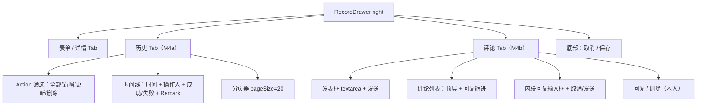
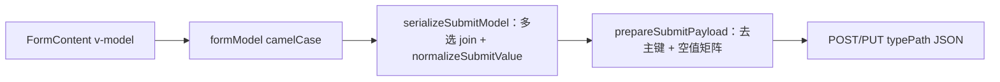

# OSC-0008 UI 信息架构

## 记录抽屉（右）

```mermaid
flowchart TB
  Drawer[RecordDrawer right] --> FormTab[表单 / 详情 Tab]
  Drawer --> HistoryTab[历史 Tab（M4a）]
  Drawer --> CommentTab[评论 Tab（M4b）]
  Drawer --> Footer[底部：取消 / 保存]
  HistoryTab --> HistoryFilter[Action 筛选：全部/新增/更新/删除]
  HistoryTab --> Timeline[时间线：时间 + 操作人 + 成功/失败 + Remark]
  HistoryTab --> Pager[分页器 pageSize=20]
  CommentTab --> Editor[发表框 textarea + 发送]
  CommentTab --> List[评论列表：顶层 + 回复缩进]
  CommentTab --> Reply[内联回复输入框 + 取消/发送]
  CommentTab --> Ops[回复 / 删除（本人）]
```

## 新建（mode=add）/ 只读实体

- 无历史、无评论 Tab（`showSideTabs=false`），仅表单或详情。

## 表单提交数据流

```mermaid
flowchart LR
  Form[FormContent v-model] --> Model[formModel camelCase]
  Model --> Serialize[serializeSubmitModel：多选 join + normalizeSubmitValue]
  Serialize --> Payload[prepareSubmitPayload：去主键 + 空值矩阵]
  Payload --> POST[POST/PUT typePath JSON]
```
