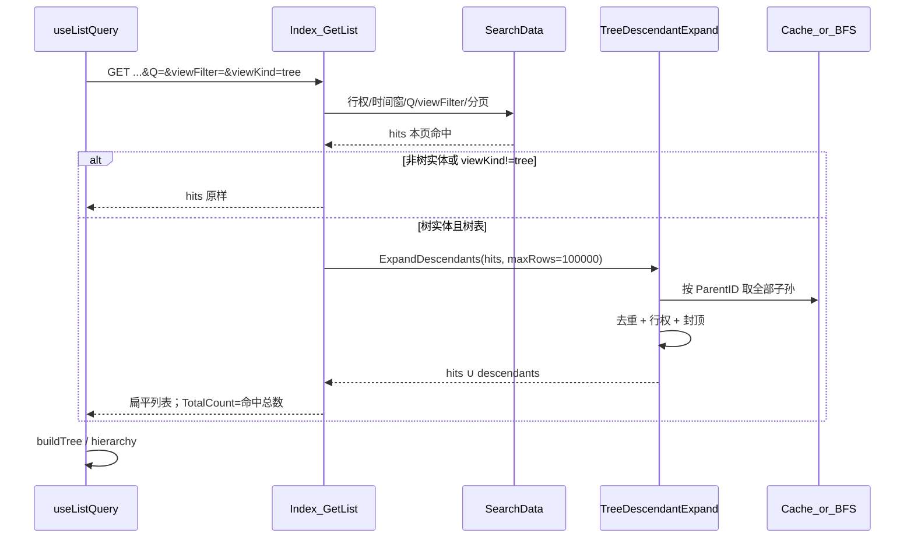

# OSC-26100514b7 Design — 树表命中扩子孙

## 1. 语义与时序



**命中行扩子孙**：先 `SearchData` 得种子，再并入每个种子的全部子孙；子孙不要求再匹配 `Q`/`viewFilter`；不补祖先。

## 2. 文件地图

| 文件 | 职责 |
| --- | --- |
| `NewLife.Cube/Common/TreeDescendantExpand.cs`（新） | 纯逻辑：索引/BFS、去重、环、行权回调、`maxRows=100000` |
| `NewLife.Cube/Common/ReadOnlyEntityController.cs` | `Index`：`SearchData` 后条件扩 |
| `NewLife.Cube/Common/ReadOnlyEntityController2.cs` | 复用 `GetTreeParentFieldName`；可选 `IsTreeEntity`/`IsTreeViewRequest` |
| `NewLife.Cube/Common/ReadOnlyEntityController.cs` GetPage | `setting.isTreeEntity` |
| `NewLife.Cube/Common/EntityTreeController.cs` | 已全树返回时短路（控制器类型或结果集策略） |
| `web/src/views/crud/useListQuery.ts` | 树表传 `viewKind:'tree'`；树表跳过会裁掉扩入行的 `matchesViewFilter` |
| `web/src/core/utils/listRequestSignature.ts` / spec | 签名含 `viewKind` |
| `web/src/core/utils/viewMapping.ts` | 创建树视图可优先读 `isTreeEntity`（保留路径启发式兜底） |
| XUnit `TreeDescendantExpandTests`（或等价） | 图用例 |
| 迁移方案 / 功能清单 | TotalCount vs Data.Count、封顶 100000 |

## 3. 探测与门控

### 3.1 `IsTreeViewRequest`

- `p["viewKind"]` 或 Query `viewKind` EqualIgnoreCase `"tree"`。
- 其它值 / 缺省 → 不扩。

### 3.2 `IsTreeEntity`

- `typeof(TEntity).As<IEntityTree>()`，或
- `GetTreeParentFieldName()` 非 null（`ParentID`/`ParentId` + 与主键同 TypeCode）。

### 3.3 EntityTreeController 短路

- 控制器为 `EntityTreeController<,>` 派生，或 Search 已返回 `Root.AllChilds` 全量路径 → **不调用** Expand（避免无谓二次遍历）。
- 实现上优先：`this is EntityTreeController<,>` 反射/虚方法 `ShouldExpandTreeDescendants()` 默认 true，EntityTree 覆写 false。

## 4. TreeDescendantExpand 算法

**输入**：命中列表 `hits`、主键字段、父级字段、`Func<TEntity,bool> canView`、`maxRows`（默认 **100000**）、取子数据源。

**输出**：扁平列表。

**顺序**：先保持 `hits` 原序；再按 BFS 层级追加未见过的子孙。

**步骤**：

1. 用主键建 `seen`；将 `hits` 中 `canView` 通过者加入结果与队列种子。
2. 数据源：
   - `Meta.Session.Count < MaxCacheCount`：`FindAllWithCache` 建 `parentId → List<child>`；
   - 否则：每层 `ParentID IN (batch)` 查库，批大小与现有列表习惯对齐（如 200）。
3. BFS：出队节点 → 取直接子 → 未在 `seen` 且 `canView` → 追加结果并入队；触达 `maxRows` 停止并 `XTrace` 警告。
4. 环：`seen` 防死循环。

**冻结**：不修改命中行字段；不写嵌套 `children` 到实体扩展（除非既有填充逻辑已做）。

## 5. Index 挂钩（伪代码）

```csharp
var list = SearchData(p).ToList();
if (ShouldExpandTreeDescendants(p))
    list = TreeDescendantExpand.Expand(list, Factory, GetTreeParentFieldName(), CanViewEntity, maxRows: 100_000);
OnFillListValues(list);
// … 流程覆盖 / 脱敏 / ApiListResponse；Page 仍来自 p（命中 TotalCount）
```

`CanViewEntity`：与详情/列表同源（`CanAccess` / 数据权限），禁止扩入越权子孙。

## 6. 分页与封顶口径

| 指标 | 含义 |
| --- | --- |
| `pageIndex` / `pageSize` | 仅约束 **SearchData 命中种子** |
| `Page.TotalCount` | 命中行总数（扩前） |
| `Data.Count` | 种子 ∪ 子孙，**可大于 pageSize**，≤ 100000 |
| 截断 | 达 100000 停止扩；不抛错；日志含 typePath/命中数/截断 |

常量建议：`TreeDescendantExpand.DefaultMaxRows = 100_000`；若挂 `CubeSetting` 则默认值同为 100000，本号不要求必须进设置页。

## 7. 前端

1. `activeViewKind === 'tree'` → GetList params 含 `viewKind: 'tree'`。
2. `listRequestSignature` 含 `viewKind`（与 Q、viewFilter 并列）。
3. `loadData` 内 `matchesViewFilter`：树表时**跳过**对本页的裁剪（或仅过滤种子），避免把扩入子孙裁掉。证据：今日注释仍写「纯前端筛选」，须与后端扩协同。
4. `GetPage.setting.isTreeEntity`：`canCreateViewKind('tree')` 优先用服务端标志，无则保留 `preferTreeByType` / 行探测。

## 8. 与关键字 / 自定义搜索

| 阶段 | 行为 |
| --- | --- |
| SearchData | 不变：`Q`→`SearchWhereByKeys`；`viewFilter`→`TryBuildWhere`；行权/时间窗 |
| Expand | 仅扩种子子孙；子孙不再套用 Q/viewFilter |
| 前端复核 | 树表不裁扩入行 |

## 9. 测试矩阵

| 用例 | 期望 |
| --- | --- |
| 图：根→A→A1，根→B；种子 `[A]` | `{A,A1}`，无 B |
| 种子 `[根]` | 全树（受封顶） |
| 环 ParentID | 不无限循环 |
| `canView` 拒 A1 | 结果无 A1 |
| 结果行数 > 100000 潜力 | 截断到 100000 |
| 无 `viewKind` | 不扩 |
| `viewKind=tree` + ParentID 实体 | 扩 |
| EntityTree 菜单路径 | 短路不双扩 |
| 前端非 tree | 请求无 viewKind |

## 10. 风险

- 宽树 + 高命中：响应体变大；靠 100000 封顶与行权收敛。
- 大表无缓存：分层 BFS 往返次数 = 深度；可接受，日志可观测。
- 子类 `Search` 重写：扩仍在 Index 层，与 Search 解耦，只要最终走 Index 即生效。
