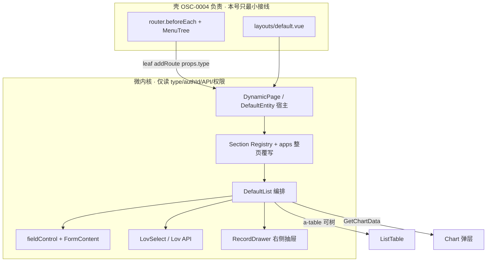

# OSC-0003 Design

## 0. 澄清锁定（输入）

| # | 决策 |
|---|------|
| A1 | 能力对标 **Cube.Vue A2** |
| A2 | LOV / 树 / GetChartData / Section·apps / 记录抽屉 **不豁免** |
| A3 | 冒烟：`Admin/User`、`Admin/Role`、`Admin/Menu`、`Admin/Log` |
| B4 | **DynamicPage** 宿主 + **Cube.Vue 微内核**（非「仅接线 NaiveUI + usePageLogic」） |
| B5 | 路由 **B3**（叶 `addRoute` + props；文件夹不嵌套子路由） |
| B6 | 字段 **Arco 本地适配**；控件优先 Arco 原生，缺则 `web/src/components` 自研 |
| C7 | **契约隔离**：壳换肤不影响 CRUD 功能契约 |
| C8 | 壳最小菜单/守卫可动；**仅** `NewLife.Cube.ArcoVue` |
| D9 | OpenSpec Draft 本号 |

## 1. 目标架构



**契约（硬约束）：**

- 微内核模块 **禁止** `import` / 读取 `useAppStore` 的 layout/theme/density、UserProfile。
- 对外稳定 props：`type: string`（控制器路径，如 `/Admin/User`）、可选 `authId`。
- 权限：菜单节点 `permissions` + GetPage `setting`（enableAdd / isReadOnly 等）。
- 使用 `@cube/page-utils` 的 `checkAuth` + 数字 `Auth` 码；**不**依赖 `@cube/page-logic` 内错误的 `'Add'/'Edit'` 字符串启发式（避免改共享包）。
- API：`@cube/api-core`（GetPage / list / detail / CRUD / import / export / chart）；LOV 客户端在 ArcoVue 内实现（对齐 Cube.Vue `/Admin/Lov/*`）。

## 2. 微内核落地（对标 Cube.Vue，重写 UI）

在 `NewLife.Cube.ArcoVue/web/src/` 建立与 Cube.Vue `web/core` **同构、无 Element** 的目录（名称可微调，职责对齐）：

| ArcoVue 目标 | Cube.Vue 参照（只读） | 说明 |
|--------------|----------------------|------|
| `core/types/field.ts`, `lov.ts` | `core/types/*` | 控件/LOV 类型 |
| `core/utils/fieldControl.ts` | `utils/fieldControl.ts` | resolveControl / Search / List + serialize |
| `core/utils/lov-api.ts` | `utils/lov-api.ts` | Meta / ListData / BatchLabel |
| `core/utils/url.ts` | `utils/url.ts` | route ↔ API 前缀 |
| `core/utils/menuRoutes.ts` | `utils/menuRoutes.ts` | 叶路由 + apps 解析（B3） |
| `core/composables/useSections.ts` | `composables/useSections.ts` | 同名 SectionKey |
| `core/composables/useRecordDrawer.ts` | （产品化）+ Cube form dialog 思路 | **右侧**抽屉代替 ElDialog 主路径 |
| `views/dynamic/DynamicPage.vue` | `pages/DefaultEntity` + `views/index` | 宿主：解析 Section / 整页覆写后挂 DefaultList |
| `views/crud/*` | `views/components/*` | Search/Toolbar/Table/Pagination/Form — **全 Arco** |
| `components/LovSelect.vue` 等 | `components/Lov*` | Arco 实现 |
| `components/*` | Uploader/Json/Rich/Color/Icon… | Arco 有则封装；无则自研 |

**DynamicPage 职责（薄宿主）：**

1. 取 `type`（props 优先，否则 route）。
2. 查 `PageSectionRegistry[type]` / apps `index.vue` → 有则整页覆写。
3. 否则渲染 DefaultList（可被 `DefaultListPage` Section 替换）。
4. 不承载主题/布局逻辑。

**与 `@cube/page-logic`：** 本号 **不以** `usePageLogic` 为编排中枢（用户要求 Cube 微内核）。列表状态机可在 DefaultList 内联（对齐 Cube.Vue `index.vue`），必要时抽 `core/composables/useEntityPage.ts`。仍可用 api-core 方法，避免重复 HTTP 细节。

## 3. 路由 B3

```
beforeEach:
  无 token → login
  !routesLoaded → getMenuTree → registerLeafRoutes → replace

registerLeafRoutes(menus):
  仅对「有 url 且无可见业务子叶 / 或明确为控制器叶」注册：
    path = normalize(url)
    component = resolvePageComponent(path) // apps 优先 else DynamicPage
    props = { type: apiPath, authId: id }
    meta = { title, icon, hidden }
  纯文件夹（仅组织子菜单、自身无实体 url）→ 不 addRoute，只出现在侧栏
```

- 去掉（或降级）当前 catch-all `:type+` 作为主路径，避免与 menu 双轨；可保留开发期 fallback 但生产以菜单注册为准。
- `layouts/default.vue`：侧栏绑定 `userStore.menus`；`<router-view>` 可 `keep-alive`（可选，不算主题引擎）。

## 4. 字段与组件策略

1. **规则引擎**：移植 `fieldControl`（含 lovCode、search 区间、list 展示、提交序列化）→ `core/utils/fieldControl.ts`。
2. **渲染**：`FormContent` / `FieldInput` 按 `ControlType` 映射：
   - 优先 `@arco-design/web-vue` 原生；
   - 无对应能力 → `web/src/components/`（如 `RichEditor`、`JsonEditor`、`IconSelector`、`LovSelectTable`）。
3. **不强制**改 `@cube/field-mapping`；若未来收敛到共享包，另开 OSC。

## 5. LOV / 树 / 图表 / Section / 抽屉

### 5.1 LOV

- API：`GET /Admin/Lov/Meta`、`POST /Admin/Lov/ListData`、BatchLabel（与 Cube.Vue 一致）。
- UI：`LovSelect`（ENUM/下拉）、`LovSelectTable`（LIST 弹层选行）。
- 列表列：BatchLabel 缓存显示名。

### 5.2 树（零配置）

Cube.Vue DefaultList **本身无树**；Menu/Area 靠 apps 覆写。本号要求冒烟 **Admin/Menu**，故微内核需：

- 检测：`pageSetting` / 首屏数据含 `children`、或类型名/约定标记为 TreeEntity；
- `a-table` `:data` + tree 属性（`children`）；工具条「展开/折叠」可选。
- 仍支持 apps 整页覆写加强交互。

### 5.3 GetChartData

- Toolbar「图表」→ 拉取 `getChartData(type)` → ECharts 弹层（Arco `a-modal`/`a-drawer` 均可；与主题无关）。

### 5.4 Section + apps

- SectionKey 与 Cube.Vue **同名**（`ListSearchBar`、`FormContent`…），便于技能/文档迁移。
- 约定扫描：`web/src/apps/**/views/**/{SectionName}.vue` 与可选 `web/src/sections/**`。
- 整页：`.../views/**/index.vue` 匹配菜单 path → 替换 DynamicPage。
- **不做** Cube.Vue micro-frontend 运行时。

### 5.5 右侧记录抽屉（产品语义）

| Tab | M1 本号 | 说明 |
|-----|---------|------|
| 表单（查看/编辑） | **必做** | 替代主路径 Modal；**`placement="right"` 从右边弹出** |
| 历史 | **必做（最小）** | 调已有日志接口按 category+id 筛选（对齐 SYS-3 思路）；无数据则空态 |
| 评论 | **接线预留** | UI Tab + 空态；**OSC-0002 Done 后**接 EntityComment API（同号可并行开发，合并顺序 0002 优先） |

与 OSC-0007 关系：本号交付 **可用的右侧抽屉表单+历史骨架**；0007 若仍保留，改为增强（更完整 Log 筛选/UX），避免重复造轮子——批准时在迁移表回写。

复杂表单仍可用「字段数阈值 → 抽屉全屏宽度」启发式（Cube.Vue `fieldCount>10`），但 **行点击默认右侧抽屉**。

## 6. 权限与 pageSetting

```
canAdd    = checkAuth(perms, Auth.ADD)    && setting.enableAdd !== false && !setting.isReadOnly
canEdit   = checkAuth(perms, Auth.EDIT)   && !setting.isReadOnly
canDelete = checkAuth(perms, Auth.DELETE) && !setting.isReadOnly
canExport / canImport 同理
```

- `perms` 空：与 Cube.Vue 工具条偏宽松 vs page-logic 默认允许——**本号采用：无权限节点配置时允许（开发友好），有配置则严格 checkAuth**。
- 主键：`GetPage` list 中 `primaryKey`，禁止写死 `id`。
- 编辑/详情：必须 `getDetail`，禁止仅用行快照提交。

## 7. 壳改动边界（C2）

| 允许 | 禁止 |
|------|------|
| `router/index.ts` 守卫与动态注册 | 多布局 / 主题 token 体系 / UserProfile |
| `layouts/default.vue` 菜单数据源与 router-view | 改 NaiveUI/Cube.Vue |
| `stores/user.ts` 拉菜单（若尚未） | 在 DynamicPage 读 darkMode |

## 8. 测试设计

| 用例组 | 断言 | 落点 |
|--------|------|------|
| menuRoutes | 叶注册、文件夹不注册子路由、props.type | Vitest |
| fieldControl | itemType/lovCode/boolean/date/textarea 推断；serialize 多选 | Vitest |
| checkAuth 门闩 | Auth 数字键 | Vitest |
| url | `/admin/user` → `/Admin/User` | Vitest |
| 构建 | 无错误 | `pnpm build` |
| 冒烟 | 四实体 CRUD + Menu 树 + 抽屉打开 | verify 手工 |

组件测试：优先纯函数；Vue 组件测可选（Lov 映射一层即可）。

## 9. 分阶段实施（单号内）

便于执行 Agent 增量合并，**不改变验收总出口**：

1. **P0** 路由 B3 + DynamicPage 宿主 + DefaultList 基础 CRUD + 权限 + pk/getDetail  
2. **P1** fieldControl 全矩阵 + Arco Field 组件补齐 + 导入导出/批量删  
3. **P2** LOV + Chart  
4. **P3** 树表 + Admin/Menu 冒烟  
5. **P4** Section/apps + RecordDrawer（表单+历史；评论预留）  
6. **P5** Vitest 补齐、文档回写、四实体冒烟勾选  

## 规格与界面

- 见同目录 [`ui/`](./ui/)：列表区 + 右抽屉信息架构示意。

## 核心文档影响（必填）

| 文档路径 | 影响类型 | 说明 |
|----------|----------|------|
| Doc/Api/ArcoVue企业中后台迁移方案.md | 修改 | §8.1、§10.3 M1、§13 OSC-0003/0007/0011 范围与本号对齐 |
| Doc/功能清单.md | 核对/修改 | SPA 动态页/LOV 等测试列随实现回写 |
| Doc/Api/核心接口架构.md | 核对 | 消费既有 GetPage/Lov；无新后端路径则仅交叉引用 |
| NewLife.Cube.ArcoVue/web/README.md | 可选 | 微内核目录与覆写约定 |

## 风险与注意

- **范围大于原 OSC-0003**：批准前确认不拆号（见 proposal §5）。
- Admin/Menu 树：若后端列表非 `children` 结构，需对照 EntityTreeController 实际 JSON 调检测逻辑。
- 导入须带 Token（custom-request / api-core），禁止裸 `action` URL。
- Icon/富文本组件体积：按字段按需异步加载。
- 与 OSC-0005：本号 `ListTableContent` 日后可整 Section 换成 VTable，契约（字段/事件）预先稳定。
