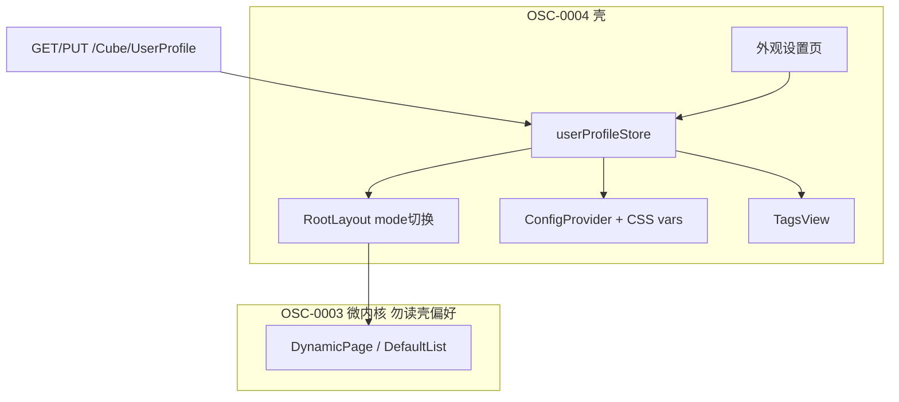

# OSC-0004 Design — 壳引擎 + UserProfile

## 1. 架构概览



| 模块 | 路径（规划） | 职责 |
|------|----------------|------|
| Store | `web/src/stores/userProfile.ts` | 加载/合并/防抖保存；系统默认常量 |
| RootLayout | `web/src/layouts/RootLayout.vue` | 按 `layout.mode` 挂载 Side / Top / Mix |
| 布局 | `layouts/side.vue` / `top.vue` / `mix.vue` | 从现有 `default.vue` 拆分；菜单复用 `SidebarMenuNodes` |
| 主题 | `web/src/theme/` | CSS 变量；`arco-theme`；密度 class |
| TagsView | `web/src/components/TagsView.vue` | 路由页签；`showTabs`；关签 prune keep-alive |
| 设置页 | `web/src/views/settings/appearance.vue` | 布局/主题/密度/页签表单 |
| API | `api/profile.ts` 或 `api-core` 薄封装 | `getUserProfile` / `putUserProfile` |

路由：Layout 父级改为 `RootLayout`；静态子路由增加 `/settings/appearance`（无需菜单权限位）。

## 2. 契约：壳 vs CRUD（硬约束）

- CRUD（`core/`、`views/crud/`）**禁止** import `userProfileStore`，禁止按 `layout.mode` / `theme.*` 做业务分支。
- 壳只通过 CSS 变量与 Arco `ConfigProvider` 影响视觉。
- 记录抽屉继续 **`placement="right"`**（见 `.cursor/rules/arcovue-record-drawer.mdc`）。
- `workspace.defaultView` / `pageSize`：本号只存读，**不驱动** VTable 或多视图。

## 3. UserProfile 数据与 API

后端（OSC-0002）：`LayoutJson` / `ThemeJson` / `WorkspaceJson` + `GET/PUT /Cube/UserProfile`（当前用户 upsert）。

前端 DTO（对齐迁移方案 §5.2.1）：

```ts
layout: {
  mode: 'side' | 'top' | 'mix'
  siderCollapsed: boolean
  siderWidth: number
  showTabs: boolean
  contentWidth: 'fluid' | 'fixed'
}
theme: {
  appearance: 'light' | 'dark' | 'system'
  primaryColor: string
  radius: number
  density: 'default' | 'compact'
  fontScale: number
}
workspace: {
  defaultView: string  // 本号只存
  pageSize: number     // 本号只存，可不接列表
}
```

### 3.1 同步策略

1. 登录后 `GET` → 与系统默认 deep-merge → 写入 store；成功则覆盖 localStorage。
2. 变更防抖 300–500ms `PUT`；失败保留本地脏标记并 toast。
3. 「恢复默认」：PUT 系统默认完整对象（字段语义以 API 为准；优先写默认 JSON，非必须清空）。
4. `appearance === 'system'`：监听 `prefers-color-scheme`，映射到实际 light/dark 再注入 DOM。

### 3.2 系统默认（建议常量）

| 字段 | 默认 |
|------|------|
| layout.mode | `side` |
| layout.showTabs | `true` |
| layout.contentWidth | `fluid` |
| theme.appearance | `light` |
| theme.density | `default` |
| theme.radius | `4`（或与 Arco 默认对齐） |
| theme.fontScale | `1` |

## 4. 布局与 TagsView

### 4.1 Mix 最小可用

- 顶栏：一级菜单（或顶栏入口）。
- 侧栏：当前一级下的二级/叶子。
- 允许 Side/Top 完整、Mix 最小可用先合入，但三者均可切换。

### 4.2 TagsView + keep-alive

- 打开路由时 push 页签（去重 path）。
- 关闭页签：导航到相邻签；从 keep-alive include 列表移除对应 name/key。
- `showTabs === false`：隐藏 TagsView，不强制清历史（可选清）。

## 5. 主题注入

- `html` / `body`：`arco-theme="dark"`（暗色时）。
- CSS 变量：主色、圆角、字号比例。
- 密度：根 class 如 `cube-density-compact`，缩小间距/控件高度。
- 顶栏快捷：主题切换、密度、跳转外观设置；去掉「只改本地 darkMode、不落库」的半成品语义。

## 6. 测试设计

| 用例簇 | 断言要点 |
|--------|----------|
| mergeProfile | 缺字段回落默认；非法 mode → side |
| savePayload | PUT body 形状含 layout/theme/workspace |
| themeTokens | appearance/system 解析；density class 名 |
| layoutMode | Root 选择器映射（纯函数） |

构建：`pnpm build`。冒烟见 `verify.md`。

## 7. 文档影响

- `Doc/Api/ArcoVue企业中后台迁移方案.md`：M2 出口勾选说明。
- `Doc/Api/前端对接指南.md`：UserProfile 消费约定（若缺）。
- ArcoVue `README.md`：壳偏好与设置页入口。
- 功能清单：若有 SPA 壳相关编码则回写。

## 8. UI / 信息架构（见 `ui/`）

- 壳：顶栏 + 侧栏/顶栏菜单 + 内容区 + 可选 TagsView。
- 设置：外观页分组（布局 / 主题 / 密度 / 页签）。
- 不在本号做业务页改版。
