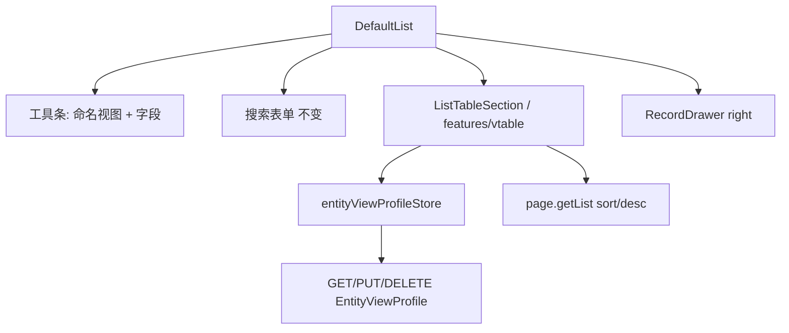

# OSC-0005 Design — VTable + 命名视图（table only）

## 1. 飞书对齐（本号切片）

| 飞书表格视图 | 本号 | 不做（后续） |
|--------------|------|--------------|
| 列拖拽/显隐/宽 | ✅ | — |
| 冻结列 | ✅ 左冻结 | 右冻结可选后续 |
| 表头排序 | ✅ `sort`/`desc` | 多列复合排序 |
| 多命名视图 | ✅ 仅 `view=table` | 看板/甘特等类型 |
| 视图类型切换 | ❌ | OSC-0006 |
| 筛选/分组 | ❌ | 筛选条 / filtersJson |
| 行内编辑 | ❌ | 右侧抽屉 |
| 树/层级 | ❌ 扁平 | OSC-0006 |

信息架构见 `ui/`。

## 2. 架构



| 模块 | 路径（规划） | 职责 |
|------|----------------|------|
| VTable 适配 | `web/src/features/vtable/` 或 `components/ListTable.vue` | columns↔VTable option；事件：resize/drag/click/select |
| Profile store | `stores/entityViewProfile.ts` | 按 typePath 加载；命名视图 CRUD；防抖 PUT |
| 列工具 | `core/utils/entityViewProfile.ts` | merge 列、默认视图、wire parse（**可单测；非业务分支读 store**） |
| api-core | `createProfileApi` 扩或 `entityView` | get/put/delete EntityViewProfile |
| DefaultList | 替换 a-table；移除 tree 启发式 | 分页恢复常规 pageSize |

**契约延续：** `core/` 纯函数可处理 Profile DTO；`views/crud` 可通过 store 读**当前实体**视图偏好（与壳 userProfile 隔离不同——此处是实体呈现，允许）。**禁止**读 `userProfileStore` 做布局分支。抽屉仍 `placement="right"`。

## 3. 多命名视图数据模型

保持 **Unique(UserId, TypePath)** 一行，避免拆唯一索引；在行内存视图集合：

### 3.1 后端扩展（本 OSC 含）

`Cube.xml` → EntityViewProfile 新增：

| 列 | 类型 | 说明 |
|----|------|------|
| `ViewsJson` | String/-1 | 命名视图数组 JSON |
| `ActiveViewId` | String/50 | 当前激活视图 id |

既有字段语义：

- `View`：活跃视图的类型（本号恒为 `table`；0006 可改）。
- `ColumnsJson`：**与活跃视图 columns 同步**（兼容旧客户端/简读）；以 `ViewsJson` 为权威。
- `FiltersJson` / Gantt / Card：本号不写（null 跳过）。

### 3.2 逻辑 DTO

```ts
interface ColumnPref {
  key: string
  visible: boolean
  width?: number
  frozen?: 'left' | false  // 本号仅 left | false
}

interface NamedView {
  id: string           // uuid 或 `default`
  name: string         // 显示名，默认「列表」
  view: 'table'        // 0005 创建时强制 table；读到非 table 仍展示但不可新建该类型
  columns: ColumnPref[]
  sort?: { field: string; desc: boolean } | null
}

// 行内
views: NamedView[]
activeViewId: string
```

### 3.3 默认种子

无 Profile 或 `ViewsJson` 空：

1. 用 GetPage.list 字段生成 columns（全部 visible，无 width）。
2. 种子 `[{ id: 'default', name: '列表', view: 'table', columns }]`，`activeViewId='default'`。
3. 首次用户改列/新建视图再 PUT。

### 3.4 命名视图操作

| 操作 | 行为 |
|------|------|
| 切换 | 改 `activeViewId`，同步 `View`/`ColumnsJson`，应用列+sort，防抖 PUT |
| 新建 | 仅允许 `view:'table'`；深拷贝当前 columns 或从元数据重置；唯一 name 校验（同实体内） |
| 重命名 | 改 name |
| 删除 | 至少保留 1 个；删当前则激活另一个 |
| 恢复默认 | DELETE Profile 或重置为单「列表」种子后 PUT |

## 4. 列与冻结

- **操作列**：固定右侧（或左冻结区外的 right frozen 1 列）；**不进入** `columns` 偏好数组（或 key=`__ops` 且不可隐藏）。
- **左冻结**：用户可对字段列设 `frozen:'left'`；实现映射 `frozenColCount`（含选择列若有 checkbox）。
- 列顺序 = `columns` 数组顺序；`visible:false` 不渲染（或 width=0，优先不渲染）。
- 拖宽 → 写 `width`；`keepColumnWidthChange` 防 Vue 刷新丢宽。

## 5. 排序

- VTable 表头排序 → `PageParams.sort` + `desc`（api-core 已有字段）。
- 写入**当前命名视图**的 `sort`，防抖随 Profile PUT。
- 若某实体后端忽略 sort：列表仍请求参数；verify 标明「服务端不排序时仅参数落盘」。

## 6. 与树表

- 删除/停用 DefaultList 中 `detectTreeData` / `preferTreeByType` 主路径。
- 一律分页扁平 ListTable；树能力明确推迟 OSC-0006。

## 7. 测试设计

| 簇 | 断言 |
|----|------|
| mergeColumns | 元数据∪偏好；未知 key 丢弃；新字段默认 visible |
| namedViews | 种子默认「列表」；删光保护；切换同步 active |
| sortPayload | sort/desc 形状 |
| frozenMap | frozen left → frozenColCount |
| XUnit | ViewsJson/ActiveViewId upsert；UserId+TypePath 隔离 |

## 8. 核心文档影响

- 迁移方案 §5.2.1 / M3a：命名视图 + ViewsJson；树改 0006。
- 前端对接指南：EntityViewProfile 消费与多命名视图。
- ArcoVue README：VTable 列表说明。
- 功能清单：若有 SPA 列表/VTable 编码则回写。

## 9. 风险

- VTable + Vue 响应式列宽：必须 `keepColumnWidthChange` + 稳定 column key。
- 包体变大：动态 import ListTable 分段。
- ViewsJson 与 ColumnsJson 双写一致性：PUT 前由 FE/Biz 同步活跃列。
