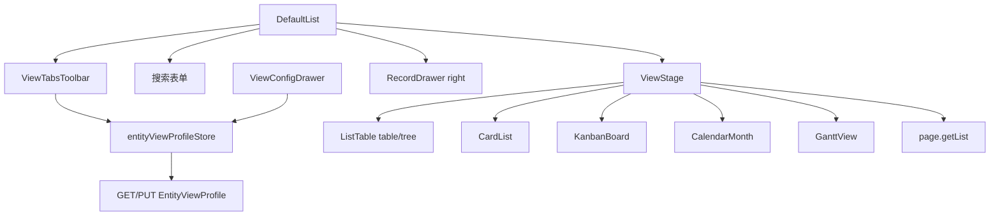

# OSC-0006 Design — 多视图类型与 Tab 工作台

## 1. 飞书对齐（本号切片）

| 飞书 | 本号 | 不做 |
|------|------|------|
| 表格视图 | `table` VTable | — |
| 树（层级） | `tree` VTable hierarchy | 无元数据时禁止创建 |
| 画册/卡片流 | `card` 竖向卡片（图1） | — |
| 看板 | `kanban` 按字段分列 + 列内卡片 | 拖拽改分组写回 |
| 日历 | `calendar` 月视图为主 | 日/周复杂轴、拖拽改期 |
| 甘特 | `gantt` VisActor Gantt | 里程碑、拖拽写回 |
| Tab + `···` + `+` | `ViewTabsToolbar` | 保护视图、分享 |
| 筛选/分组持久化 | ❌ | 后续号 |

信息架构见 `ui/`。

## 2. 架构



| 模块 | 路径（规划） | 职责 |
|------|----------------|------|
| 视图模型 | `core/utils/entityViewProfile.ts` | ViewKind、mapping normalize、创建门禁、pageSize 策略 |
| Tab 工具条 | `views/crud/ViewTabsToolbar.vue` | Tab / 菜单 / `+` 新建 |
| 配置抽屉 | `ViewConfigDrawer.vue` | 按 kind 替换「列表区」 |
| 卡片/看板 | `features/views/CardList.vue`、`KanbanBoard.vue` | 图1 卡片 + 左下操作；看板分列 |
| 日历 | `features/views/CalendarMonth.vue` | 月格 + 色条 |
| 甘特 | `features/views/GanttView.vue` | `@visactor/vtable-gantt`（async chunk） |
| 舞台 | `DefaultList.vue` | 按 `active.view` 挂载；非表视图放大 pageSize |

**契约：** CRUD 不读 `userProfileStore`；抽屉仍 `placement="right"`。

## 3. 数据模型

### 3.1 ViewKind 与 NamedView

```ts
type ViewKind = 'table' | 'tree' | 'card' | 'kanban' | 'calendar' | 'gantt'

interface NamedView {
  id: string
  name: string
  view: ViewKind
  columns: ColumnPref[]
  sort?: ViewSort | null
  chrome?: ViewChrome
  mapping?: ViewMapping
}

type ViewMapping =
  | { kind: 'card'; titleField: string; imageField?: string }
  | { kind: 'kanban'; groupField: string; titleField: string; imageField?: string }
  | { kind: 'gantt'; startField: string; endField: string; titleField: string; colorField?: string }
  | { kind: 'calendar'; startField: string; endField?: string; titleField: string; colorField?: string }
```

- 线缆：`viewsJson` 权威；`activeViewId`；顶层 `view` = 活跃类型；`columnsJson` 同步活跃列。
- **不写** `ganttJson`/`cardJson`（避免双源；文档注明预留列本号不用）。
- 旧数据：无 `mapping` 的非 table 视图在打开配置时要求补全，或创建时种子默认字段。

### 3.2 字段候选（仅元数据）

| 用途 | 候选规则 |
|------|----------|
| 文本标题 | 非主键优先的 String/文本控件字段 |
| 图片 | `itemType === 'image'`（或文件且可预览 URL） |
| 分组依据 | boolean / select / lov / Enum（有离散取值） |
| 日期 | `typeName === 'DateTime'` |
| 颜色 | 同徽章字段；色值走 `fieldBadge`；空则主色 |

### 3.3 创建门禁

| kind | 条件 |
|------|------|
| table | 始终 |
| tree | 存在树信号：`preferTreeByType(typePath)` **或** 字段名启发式 Parent/ParentId **或** 近期列表曾含 `children`；否则禁用 |
| card | ≥1 标题候选 |
| kanban | ≥1 分组候选 + ≥1 标题候选 |
| calendar | ≥1 DateTime |
| gantt | ≥2 DateTime |

### 3.4 pageSize 策略

| kind | pageSize |
|------|----------|
| table / tree / card | 用户分页器（chrome.showPager） |
| kanban / calendar / gantt | 进入时强制 `Math.min(500, viewPageSize \|\| 200)`；UI 文案提示上限 |

## 4. 自定义配置「列表区」替换

| kind | 区块内容 |
|------|----------|
| table / tree | 分页器 / 允许详情 / 允许删除 / 展开 |
| card | 卡片标题、卡片图片 |
| kanban | **分组依据**、卡片标题、卡片图片 |
| gantt | 开始/结束/标题/颜色 |
| calendar | 开始/结束(可空)/标题/颜色 |

顶栏与背景色各类型共用。

## 5. 渲染与交互

### 5.1 卡片 / 看板卡片单元

- 顶：标题（mapping.titleField）。
- 可选图：mapping.imageField。
- 中：`columns` 中 visible 且非 title/image/(kanban 的 groupField) 的字段，两列标签值；枚举/布尔可用徽章。
- 底左：操作按钮——`canViewDetail`→详情，`canEdit`→编辑，`canDelete`→删除（确认框）；样式参考图1 描边按钮。

### 5.2 看板

- 列 = `groupField` 取值；有 dataSource 按选项序，另附「未分组」。
- 列内纵向堆卡片；板横向滚动。
- **禁止**拖拽写回。

### 5.3 日历

- 月视图；事件落在 `[start, end\|\|start]`。
- 条文本=titleField；颜色=colorField→badge 色。
- 点击→详情抽屉。

### 5.4 甘特

- `@visactor/vtable-gantt`（或等价）绑定起止/标题/颜色。
- 点击→详情；不拖拽写回。
- 独立 async chunk。

### 5.5 树

- 有 `children` → hierarchy；否则提示「当前数据无树结构」并允许退回表格视图。

## 6. 核心文档影响

| 文档 | 变更 |
|------|------|
| `Doc/Api/ArcoVue企业中后台迁移方案.md` M3b | 扩展 calendar/kanban；出口含 Tab 工作台 |
| `Doc/Api/前端对接指南.md` | ViewKind + mapping；大 pageSize 约定 |
| `NewLife.Cube.ArcoVue/web/README.md` | 多视图说明 |
| 迁移方案 TS DTO | `view` 联合类型含新 kind；NamedView.mapping |

## 7. 测试设计

| 用例 | 断言 |
|------|------|
| normalizeMapping | 非法字段名丢弃/回落；kind 与 view 不一致时纠正 |
| canCreateViewKind | tree 无元数据 false；kanban 缺 group 候选 false |
| bucketKanban | dataSource 序 + 未分组桶 |
| resolveViewPageSize | 非表 200/500；表用 pager size |
| chrome 分区 | 配置抽屉按 kind 暴露正确表单项（组件测或纯函数「可见项」） |

执行期：`pnpm test` + `pnpm build`。验收：新增单测全过 + 构建无错误。

## 8. 风险与残留

- 大 pageSize 仍非全库；超 500 截断需文案。
- 树完全依赖后端是否吐 `children`/Parent 元数据。
- 甘特包体积：延续 VTable manualChunks。
