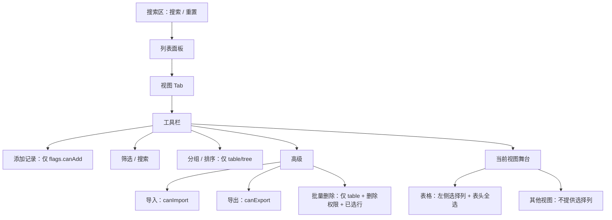
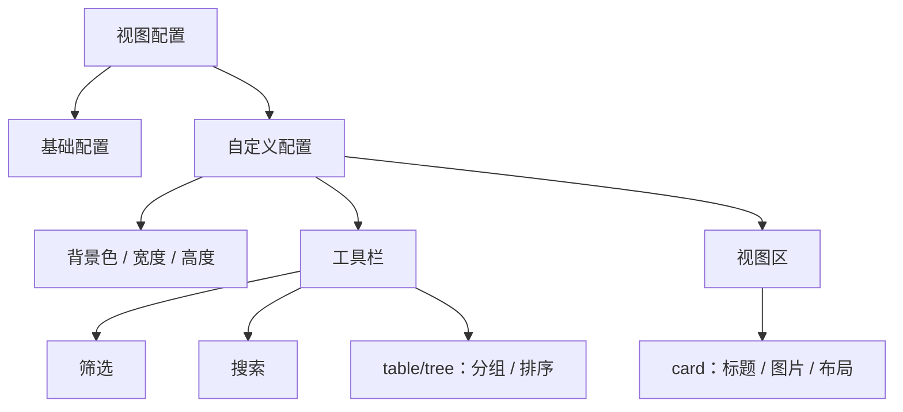

# OSC-0007 UI 信息架构

## 列表页

```mermaid
flowchart TB
  Search[搜索区：搜索 / 重置] --> Surface[列表面板]
  Surface --> Tabs[视图 Tab]
  Tabs --> Toolbar[工具栏]
  Toolbar --> Add[添加记录：仅 flags.canAdd]
  Toolbar --> Common[筛选 / 搜索]
  Toolbar --> TableOnly[分组 / 排序：仅 table/tree]
  Toolbar --> Advanced[高级]
  Advanced --> Import[导入：canImport]
  Advanced --> Export[导出：canExport]
  Advanced --> BatchDelete[批量删除：仅 table + 删除权限 + 已选行]
  Toolbar --> Stage[当前视图舞台]
  Stage --> Table[表格：左侧选择列 + 表头全选]
  Stage --> Other[其他视图：不提供选择列]
```

- 图表入口按钮不在搜索区或工具栏显示；图表 Modal 实现保留，属于后续独立变更。
- 「高级」中所有操作仅作用于当前 `typePath` 实体。

## 配置抽屉

```mermaid
flowchart TB
  Drawer[视图配置] --> Basic[基础配置]
  Drawer --> Custom[自定义配置]
  Custom --> Appearance[背景色 / 宽度 / 高度]
  Custom --> Toolbar[工具栏]
  Toolbar --> Filter[筛选]
  Toolbar --> Search[搜索]
  Toolbar --> TableTools[table/tree：分组 / 排序]
  Custom --> Area[视图区]
  Area --> Card[card：标题 / 图片 / 布局]
```

- 工具栏不包含添加记录、按钮文字、自定义按钮。
- 卡片布局选择为标准、偏大、整行；图片位置由布局自动决定，见 `design.md` §5.4。
