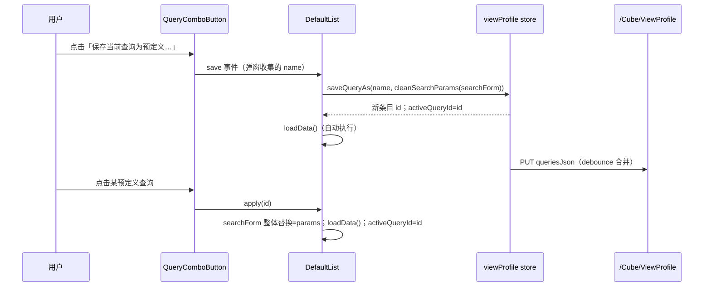

# OSC-0016 UI 信息架构 — 查询面板第一行与查询组合按钮

> 文字信息架构（无位图）。组件库：Arco Design Vue；实现前查阅官方文档。

## 1. QueryInsightPanel 第一行布局（自上而下第一行）

```
┌─ QueryInsightPanel ───────────────────────────────────────────────────────────┐
│ [字段1控件] [字段2控件] [字段3控件] … [展开更多 N]                             │
│                                        [主时间范围] [关键字] [查询 ▾]          │ ← 固定三项
│ [搜索] [重置] [保存到此视图] [清除默认筛选]   来源：URL/已保存                  │ ← 既有操作区不变
├───────────────────────────────────────────────────────────────────────────────┤
│ 洞察区（统计标签 + 图表，不变）                                                 │
└───────────────────────────────────────────────────────────────────────────────┘
```

- 固定三项排在字段网格**末尾**（第一行尾部），不参与溢出测量，永远可见。
- 窄屏换行时三项仍保持相对顺序（主时间范围 → 关键字 → 查询按钮）。

## 2. 固定三项控件规格

| 控件 | 组件 | 宽度 | 标签/占位 | 备注 |
| --- | --- | --- | --- | --- |
| 主时间范围 | `a-range-picker` show-time | ≥280px | 标签=MasterTime DisplayName，缺省「时间范围」 | value-format `YYYY-MM-DDTHH:mm:ss`；写 `dtStart/dtEnd` |
| 关键字 | `a-input` allow-clear | ≥180px | 标签「关键字」；placeholder「全字段模糊搜索」 | 回车执行查询；写 `Q` |
| 查询组合按钮 | `a-button(primary)` + `a-dropdown` | 自适应 | 文案「查询」+ 下拉箭头 | trigger=click |

## 3. 查询组合按钮下拉菜单

```
┌──────────────────────────────┐
│ 🔍 执行查询                   │  恒可用；等同面板「搜索」
├─ 预定义查询 ──────────────────┤  分组标题（灰字）
│ ✓ 昨日新增客户            🗑  │  ✓=应用且参数一致；hover 显示删除图标（popconfirm）
│   本月大额订单                │  点击=整体回填并执行
│   （空列表：暂无预定义查询）    │  灰字占位，不可点击
├──────────────────────────────┤
│ 💾 保存当前查询为预定义…       │  参数空则禁用
│ ✏️ 重命名当前查询             │  无应用条目禁用
│ 🗑 删除当前查询               │  无应用条目禁用；popconfirm
│ 🧹 清空查询参数               │  全空禁用；清除含 Q/dt 全部键并执行
└──────────────────────────────┘
```

- 条目区 max-height 320px，超出滚动；条目数上限不在前端限制（超长名称截断 + tooltip）。
- 命名弹窗（保存/重命名共用）：`a-modal` 单输入框，maxlength 50，trim 空禁用确认。

## 4. 交互时序



## 5. 状态可见性约定

| 状态 | 呈现 |
| --- | --- |
| 已应用且参数一致 | 条目前 ✓ |
| 已应用但参数被改动 | 无 ✓（应用标记保留，重命名/删除仍可用） |
| 未应用（刷新后/URL 初始化） | 无 ✓ |
| 保存/删除后 | Message 轻提示「已保存」「已删除」 |
