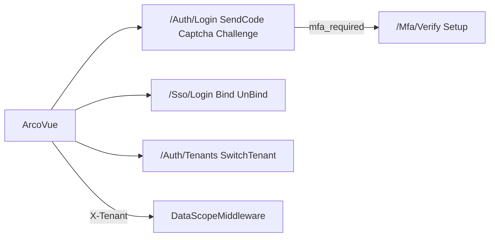

# OSC-260813397e Design — 飞书风登录 SSO 与多租户隔离

## 0. 适用框架与官方资料

| 场景 | 框架 | 资料 |
| --- | --- | --- |
| 登录/设置表单、Tab、验证码图、步骤条 | Arco Design Vue | https://arco.design/vue/docs/start ；Form / Tabs / Input / Button / Modal |
| 图标 | IconPark | 先查站点再写入 `iconRegistry.ts` |
| 对标体验 | 飞书/Lark 登录与账号绑定 | 左品牌右表单、SSO 图标行、「账号绑定」列表；**不**复制飞书扫码协议 |

SFC：`.vue` 薄脚本，业务进 `useXxx.ts`。

## 1. 后端事实（本号不改协议，只补缺口）



| 能力 | 契约 | 本号后端是否改 |
| --- | --- | --- |
| 登录 | `POST /Auth/Login`；失败 MFA 为 `code=-1` `message=mfa_required:{token}` | 否 |
| 配置 | `GET /Auth/LoginConfig?tenant=` 嵌套 `login/register/oauth/security` | 否 |
| SSO | `GET /Sso/Login/{name}?source=front-end&r=` → 回跳 `url#token=` | 否 |
| 绑定 | 已登录 `GET /Sso/Bind/{id}` 浏览器跳转；`GET /Sso/UnBind/{id}` JSON | 否 |
| MFA | `/Mfa/Setup|Activate|Disable|Status|Verify`；字段 `totpUri` | 否 |
| 租户上下文 | `X-Tenant` Code → `TenantContext` | 否 |
| 租户管理齐平 | Tenant/TenantUser/User/Department/菜单 | **是** |
| 租户切换 API | 无 SPA 接口 | **新增** `/Auth/Tenants`、`/Auth/SwitchTenant` |
| 当前绑定列表 | 可用 `GET /api/Admin/UserConnect`（DataPermission UserID） | 仅确认过滤；缺则加 `GET /Auth/Binds` |

**禁止**：改 JWT 塞 TenantId；实现 OAuthPending。

## 2. 登录页（飞书风）

### 2.1 视觉与 DOM 顺序

左栏（`min-width: 0`，`≥992px` 占 50%）：`loginBackground` 为背景；居中 `loginLogo`/`logo`；`name`；`loginTip`；底部 `copyright` + `registration`（copyright 允许后端已替换的 HTML，用 `v-html` **仅此字段**，来自受信 API）。

右栏：标题「登录」；Tabs（仅显示 `login.*===true` 的通道）；表单；主按钮「登录」；「忘记密码」「注册」按 `register.enabled`；分隔文案「第三方登录」+ `oauth[]` 徽标（`logo`，悬停 Tooltip=`remark`/`nickName`）。

> **勘误（T8 / 2026-08-17）**：初版「可选租户 Code → getLoginConfig(tenant)」已取消；多租户改登录后用户菜单切换，更贴近飞书「先登录再选组织」。

`<992px`：隐藏左栏或缩为顶 logo，右栏全宽。

空数据：无任何 login 通道且无 oauth → `a-empty`「未开放登录」。

### 2.2 能力矩阵

| LoginConfig | UI |
| --- | --- |
| `login.password` | 密码 Tab：用户名+密码 |
| `login.sms` | 短信 Tab：手机+验证码+发送 |
| `login.mail` | 邮箱 Tab：邮箱+验证码+发送 |
| `login.captcha` | 密码登录展示 SVG，提交带 `captchaId/captchaCode`（CaptchaScene 位 1） |
| `login.sendCodeCaptcha` | 发短信/邮件验证码前展示 SVG（CaptchaScene 位 4，防轰炸） |
| `register.enabled` | 显示注册链到 `/register` |
| `oauth[]` | 底栏「第三方登录」图标；**仅**可见 OAuthConfig；与 `EnableOAuthServer`（Cube 作 OAuth 服务端）无关 |
| `enableOAuthServer` | 信息字段；**不**控制登录页第三方入口 / 账号绑定列表 |
| `enableTenant` | 关则全局隐藏租户 UI；开则用户菜单提供租户分组切换 |
| `startPage` | 登录成功落地（优先 `?redirect=`；过滤 `/Admin*` 等 MVC 路径，回退 `/home`） |
| `security.challengeRequired` | 密码登录先 `getChallenge`，用公钥加密后再 `login(..., challengeId)` |
| `security.mfaAvailable` | 不单独出入口；登录遇 `mfa_required` 进二步 |
| `security.passwordStrength` | 注册/重置客户端提示与校验；服务端仍为准 |

默认 Tab：第一个为 true 的 password → sms → mail。

### 2.3 登录状态机（唯一来源 `useLoginPage`）

| 状态 | 屏幕 | 成功 | 失败 |
| --- | --- | --- | --- |
| `form` | 账号表单 | 有 accessToken → 落 token+refresh → afterLogin → `resolveStartPage(cfg, redirect)` | `mfa_required` → `mfa`；其它 Message.error |
| `mfa` | 6 位/备用码 | `/Mfa/Verify` 得 token → 同成功 | 错码停留 mfa |
| `oauth` | 整页跳转 | 回站 `#token=` | 无 token 回 form |

`oauthStart(name)`：

```
/Sso/Login/{name}?source=front-end&r={encodeURIComponent(origin + '/login' + (redirect? '?redirect='+redirect : ''))}
```

`router/index.ts`：在 `beforeEach` 解析 `location.hash` 的 `token=`（及可选 `refreshToken`），写入 tokenManager 后 `replace` 去掉 hash。

### 2.4 文件

| 文件 | 动作 |
| --- | --- |
| `views/login/index.vue` | 重做左右栏模板 |
| `views/login/useLoginPage.ts` | 读 `login/oauth/security`；禁 `providers/allowLogin` |
| `views/login/loginConfig.ts` | `resolveLoginTabs(cfg)`、`buildSsoLoginUrl(name, redirect)` 纯函数 |
| `views/login/register.vue` + `useRegisterPage.ts` | 同视觉；`register.password/sms/mail/captcha` |
| `views/login/forgot-password.vue` | 同视觉 |
| `router/index.ts` | hash token |
| `stores/user.ts` / tokenManager | 存 refreshToken；401 → Refresh（`userName` 用上次登录名） |

Challenge 实现：优先复用 `@cube/auth-logic` 已有加密；若包内缺 WebCrypto 封装，在 `loginCrypto.ts` 用 `subtle.importKey` + RSA-OAEP，失败则 Message「加密失败」且 **不回退明文**（challengeRequired 时）。

## 3. 第三方绑定与 MFA 设置

入口：用户菜单「账号安全」→ `views/account/SecuritySettings.vue` + `useSecuritySettings.ts`（或扩现有 UserProfile 抽屉加 Tab，**不得**再做一个平行设置中心）。

**绑定列表**

| 列 | 来源 |
| --- | --- |
| 提供商 | `OAuthConfig.NickName` / UserConnect.Provider |
| 昵称/OpenId | UserConnect |
| 状态 | Enable |
| 操作 | 未绑：打开 `/Sso/Bind/{id}`（需登录 cookie/token，同窗或新窗）；已绑：`UnBind` 确认后刷新 |

`id`/`name`：跳转 `/Sso/Bind/{name}`（与后端 `GetClient` 按 **OAuthConfig.Name** 解析一致；列表项优先 `name`，缺省回落 `id`）。列表 = 可见 OAuth 配置 ⟕ 当前用户 UserConnect。

若 `GET /api/Admin/UserConnect` 因菜单权限对普通用户 403：新增 `GET /Auth/Binds` 返回 `{ providers: [{ id, name, nickName, logo, bound, connectId }] }`（仅当前用户）。优先走此接口以免租户用户看不到 Admin 菜单。

**MFA 块**（`security.mfaAvailable` 或 Status.available）

1. Status.enabled=false：按钮「开启」→ Setup 展示 `totpUri`（二维码用第三方库或 `` otpauth 文本+复制密钥）→ 输入 6 位 Activate → 展示 10 条 backupCodes（只显示一次，提供复制）。
2. enabled=true：输入验证码 Disable。

## 4. 多租户

### 4.1 请求头（ArcoVue）

`web/src/api/index.ts`（或 axios 封装）每个请求：

- 若 `tenantStore.code` 非空：`X-Tenant: {code}`
- 平台管理员选择「全部/平台」：不带头或带头空，对应 `TenantId=0`（与 `ValidateTenant` 一致：仅系统用户允许 0）

登录后 `ChooseTenant` 已写 cookie；SPA 仍以 header 为准，避免跨端口丢 cookie。

### 4.2 新 API（AuthController）

| 方法 | 路径 | 权限 | 行为 |
| --- | --- | --- | --- |
| GET | `/Auth/Tenants` | 已登录 | `{ currentId, currentCode, items:[{ id, code, name }] }`；管理员额外可含 `{ id:0, code:'', name:'平台' }` |
| POST | `/Auth/SwitchTenant` | 已登录 | body `{ tenantId }`；校验 TenantUser 或管理员；`SetTenant`+`SaveTenant`；返回与 GET 相同形 |

前端：用户弹出菜单分组（`a-dgroup`，在「账号安全」之上）。切换成功后 `reload` 菜单+当前页（`fetchMenus` + `router.go(0)`）。

> **勘误（T8）**：初版「顶栏下拉」已迁入用户菜单，避免与通知/外观工具条抢位。

### 4.3 WebAPI 齐平 MVC（必须改的 C#）

| 文件 | 改动 |
| --- | --- |
| `NewLife.Cube/Areas/Admin/Controllers/TenantController.cs` | `OnInsert`/`OnUpdate`：ManagerId 默认当前用户；确保存在 Enable 的 `TenantUser`（对标 NC） |
| `TenantUserController.cs` | `Search`：若 `TenantContext.CurrentId>0` 强制该 tenantId；`Valid` insert 盖章 TenantId |
| `UserController.cs` | `Search` 走 `SearchWithTenant`（与 NC 同条件）；`OnInsert` 调 `EnsureTenantUser` |
| `DepartmentController.cs` | insert 盖章 TenantId；`[Menu(..., Mode=Admin\|Tenant)]` 若尚无 |
| `Menu` 用户/部门/租户用户 | WebAPI 控制器 Menu 补 `MenuModes.Tenant`，使租户管理员可见 |

`CreateWhere` / `Valid` 已有 `ITenantScope` 逻辑：**不改算法**。平台 `TenantId=0` 不加过滤。

### 4.4 新实体隔离（开发规范 + 基类）

文档：`NewLife.Cube.ArcoVue/web/docs/多租户新实体接入.md`

清单（缺一则列表可能串租户）：

1. 表字段 `TenantId` Int32。
2. 实体实现 `XCode.Membership.ITenantScope`（不要只加字段）。
3. 控制器继承 `EntityController<T>`，查询走 `SearchData`/`FindAll(exp,p)`。
4. `[Menu(..., Mode = MenuModes.Admin | MenuModes.Tenant)]`。
5. 非控制器写入加 `TenantInterceptor`。
6. 自定义 Search 调用 `ApplyTenant<T>()` 或依赖 `p.State`。

基类 `OnGetFields`：当 `EnableTenant && CurrentId>0 &&` 字段名为 `TenantId` → 从 Add/Edit 移除（租户用户不可改隔离键）。平台管理员可见。

CubeDemo `Class`/`Student` 已是 `ITenantSource`：文档引用为样例，不强制改名。

**不做**：Expired 定时任务、MaxUsers 拦截、按 Domain 选租户。

## 5. 文件地图（前端其余）

| 文件 | 改动 |
| --- | --- |
| `packages/api-core/src/api.ts` | `listTenants`、`switchTenant`、`listBinds`（若走 /Auth/Binds） |
| `packages/api-core/src/types.ts` | TenantItem；LoginConfig 已有 v2，登录页改用嵌套字段 |
| `stores/tenant.ts` | current + items；persist sessionStorage `cube.tenant.code` |
| `layouts/*` + `useShellAuth.ts` | 租户下拉 |
| `views/account/SecuritySettings.vue` | MFA + 绑定 |

保留：`/Auth/Login` 字段名、`IssueLoginToken`、`DataScopeMiddleware` 解析顺序。

## 6. UI 不做的交互

- 登录页不做扫码、不做「记住密码」超 7 天（`remember` 可传但 TTL 仍后端）。
- 绑定不做拖拽排序。
- 租户下拉不在登录成功前强制（登录页 Code 只影响 LoginConfig 品牌与注册租户）。

## 7. 测试设计

| 文件 | 用例 |
| --- | --- |
| `loginConfig.spec.ts` | 仅 password；三通道；无通道；oauth 不绑 EnableOAuthServer；sendCodeCaptcha；passwordStrength；startPage 过滤 MVC；oauth URL 含 `source=front-end` |
| `mfaMessage.spec.ts` | `mfa_required:abc` 提取；普通错误不提取 |
| `tenantHeader.spec.ts` | 有 code 带头；平台空 |
| 后端 | Tenant insert 后存在 TenantUser；非管理员 Search User 不含外租户（能构造则测） |

手工：`EnableTenant=true` 建租户 A/B，两用户列表互不可见；User.AreaId 级联不受本号破坏。
