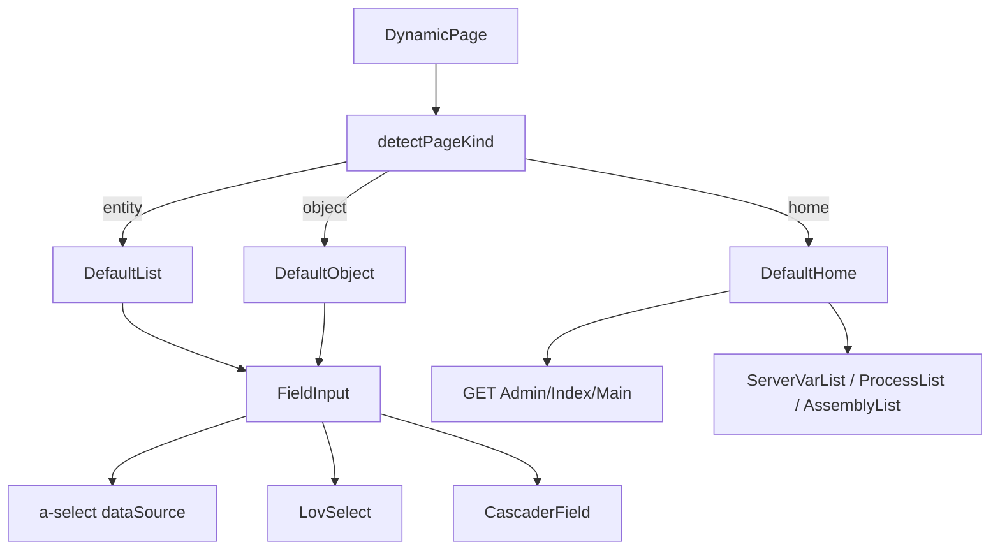

# OSC-2608139feb Design — 表单值集级联与通用对象主页

## 0. 适用框架与官方资料

| 场景 | 框架 | 官方资料 |
| --- | --- | --- |
| 表单、抽屉、页头、描述列表、Tab、级联、开关、下拉 | Arco Design Vue | https://arco.design/vue/docs/start ；Cascader：https://arco.design/vue/component/cascader |
| 图标 | IconPark `@icon-park/vue-next` | 先查站点再注册 `iconRegistry.ts` |
| 实体列表（本号不改列引擎） | VisActor VTable | https://visactor.com/vtable/option/ListTable |
| E2E | Playwright | https://playwright.dev/docs/intro |

SFC：新增/改动的 `.vue` 只留构薄 script；业务进同目录 `useXxx.ts`。

## 1. 问题与目标架构

## 2. 文件级改动地图

### 2.1 级联与表单显示（必须改）

| 文件 | 改什么 | 保留不动 |
| --- | --- | --- |
| [CascaderField.vue](../../../web/src/components/CascaderField.vue) | `:path-mode="true"`（与 `pathValue` 数组一致）；增加 `:load-more` | props：`modelValue` 仍为叶子 ID；placeholder 默认「请选择地区」 |
| [useCascaderField.ts](../../../web/src/components/useCascaderField.ts) | `onChange`：仅当 `Array.isArray(val)` 时取末段为叶子；空/null 发 `undefined`。导出 `loadMore(option, done)`：`ensureChildren` 后 `done(option.children \|\| [])`。叶子判定：子列表空则 `isLeaf=true` | `loadChildren` 仍 `GET /Cube/Area?parentid=&pageSize=500`；`resolvePath` 向上 `getDetail` |
| [fieldControl.ts](../../../web/src/core/utils/fieldControl.ts) | `normalizeSubmitValue`：`isEnumLikeTypeName(field)` 时与 `typeName==='Enum'` 相同（纯数字字符串 → Number） | `resolveControl` 优先级：itemType → Boolean → dataSource → lovCode → Enum → enum-like → CLR |
| [detailFormat.ts](../../../web/src/core/utils/detailFormat.ts) | `detailText` 在 lookup 未命中且 `isCascaderField` 时读可选 `areaLabelCache`；LIST 无 dataSource 时读可选 `labelCache[lovCode]` | 禁止 `v-html`；Boolean 仍「是/否」 |
| [fieldFormat.ts](../../../web/src/core/utils/fieldFormat.ts) | 保持 `areaLabelCache` 分支 | 签名不删 `areaLabelCache` |
| [listContext.ts](../../../web/src/views/crud/listContext.ts) | `renderCell` 传入 `{ labelCache, areaLabelCache }` | `formatFieldValue` 调用点 |
| [useListQuery.ts](../../../web/src/views/crud/useListQuery.ts) | 新增 `hydrateAreaLabels`：对 list 中 cascader 字段收集叶子 ID，批量 `getDetail('/Cube/Area', id)`（已缓存跳过），写入 `areaLabelCache`。`hydrateLovLabels` 同时作用于 `detailFields`/`editFields`/`addFields` 中同名 lov 字段（回写 dataSource） | GetPage 五分区解析 |
| [useRecordDrawer.ts](../../../web/src/views/crud/useRecordDrawer.ts) | 打开详情/编辑前：对当前行跑 area + LIST 标签补齐 | 抽屉 `placement="right"` |

新增纯函数（便于单测，无组件）：

| 文件 | 职责 |
| --- | --- |
| `web/src/core/utils/areaLabels.ts` | `mergeAreaLabel(cache, id, name)`；`collectCascaderIds(fields, rows)` |
| `web/src/core/utils/cascaderValue.ts` | `leafFromCascaderChange(val)`：`null/''/[]` → `undefined`；数组取末段；标量（防御）当叶子 |

### 2.2 页面种类探测与分发（必须改）

| 文件 | 改什么 |
| --- | --- |
| **新增** `web/src/core/utils/pageKind.ts` | `detectPageKind(typePath, probes)` 纯函数 + `isValidEntityPageMeta(meta)` |
| **新增** `web/src/core/utils/pageKind.spec.ts` | 见 §6 |
| [useDynamicPage.ts](../../../web/src/views/dynamic/useDynamicPage.ts) | 无 Section 覆写时调用探测，暴露 `pageKind: 'entity' \| 'object' \| 'home' \| 'unknown'` |
| [DynamicPage.vue](../../../web/src/views/dynamic/DynamicPage.vue) | 按 `pageKind` 挂 DefaultList / DefaultObject / DefaultHome；`unknown` 显示 `a-empty`「无法识别页面类型」 |
| [home/index.vue](../../../web/src/views/home/index.vue) | 改为薄壳，直接复用 DefaultHome（或 `component :is`），去掉四个硬编码 0 统计 |

**探测真值表（穷尽）**

| 输入 typePath | GetPage | GET type + GetFields | 输出 |
| --- | --- | --- | --- |
| `Admin/Index`（忽略大小写） | 不请求 | 不请求 | `home` |
| 其它 | 有效实体元数据（见下） | — | `entity` |
| 其它 | 404 / HTML / 无 list·search·addForm·setting | GetFields 为数组 **且** GET body 为对象且 **不是** `{ data: any[], page: object }` | `object` |
| 其它 | 失败 | GetFields 非数组或 GET 为分页列表形 | `unknown` |

`isValidEntityPageMeta(meta)` 为真当且仅当：`meta` 为非 null 对象且下列至少一项成立：`Array.isArray(meta.list)`、`Array.isArray(meta.search)`、`Array.isArray(meta.addForm)`、`meta.setting` 为对象。字符串 / 数组根 / `code`+`message` 且无 data 结构 → 假。

探测顺序：home 短路 → GetPage →（失败）Object 双探。结果按 `typePath` 会话内缓存，避免抽屉多次探测。

### 2.3 通用 Object 页（必须新增）

| 文件 | 职责 |
| --- | --- |
| `web/src/views/object/DefaultObject.vue` | 薄模板：页头标题=菜单名；`a-tabs` 按 Category；每字段 `FieldInput`；主按钮「保存」 |
| `web/src/views/object/useDefaultObject.ts` | 加载 GET + GetFields；`toFieldMetas` + `enrichFieldsWithEnumDataSource` + `enrichFieldsWithLookup`；`groupByCategory`；保存 PUT |
| `web/src/core/utils/objectForm.ts` | `groupFieldsByCategory(fields)`：空 Category →「基本」；稳定顺序=字段原序；`mergeObjectModel(original, form)`：只覆盖字段名键，保留未建模嵌套属性 |

**Object API（api-core）**

在 [packages/api-core/src/api.ts](../../../../packages/api-core/src/api.ts) `createPageApi` 增加：

| 方法 | HTTP | 说明 |
| --- | --- | --- |
| `getObject(type)` | `GET {type}` | 单例对象，不是分页列表 |
| `update` 已有 | `PUT {type}` | Object 保存复用，body 为完整 TObject |

**后端** [ObjectController.cs](../../../../NewLife.Cube/Common/ObjectController.cs)：

`GetFields` 在 `GetMembers` 之后对每个 `DataField` 调用 `PrepareForApi()`，使 Boolean/枚举带 `DataSourceMap`。不改 `Index`/`Update` 路由。`GetMembers` 缓存键仍是 Type。

**Object 表单行为矩阵**

| 条件 | 行为 |
| --- | --- |
| GetFields 空数组 | 空状态「无字段」；保存按钮禁用 |
| GET 失败 / 无 Update 权限 | 表单 `disabled`；保存隐藏；`a-alert` 说明 |
| 字段 Boolean | switch |
| 字段有 dataSource | select，显示标签 |
| 字段 lovCode 无 dataSource | LovSelect |
| 字段 enum-like typeName | select；Lookup 补选项 |
| 保存成功 | Message.success；用返回对象刷新 model |
| 保存失败 | Message.error；不清空表单 |

**UI 顺序（DefaultObject）**：页头标题 → 错误 Alert（若有）→ Tabs（仅当 Category 种类 > 1，否则单栏）→ 字段（label=displayName）→ 底部「保存」。断点：`a-form` `label-width=160px`；字段纵向堆叠，不强制 4 列。不做：导入导出、历史评论、多对象列表。

不做的交互：不提供「恢复默认」、不拆分子对象为独立页。

### 2.4 主页仪表盘（必须改/新增）

| 文件 | 职责 |
| --- | --- |
| `web/src/views/home/DefaultHome.vue` | 薄模板：系统信息 descriptions + 三块可刷新卡片 |
| `web/src/views/home/useDefaultHome.ts` | 拉 Main / ServerVarList / ProcessList / AssemblyList；MemoryFree / Restart |
| `web/src/views/home/index.vue` | 仅渲染 DefaultHome |
| api-core | `getIndexMain`、`getServerVarList`、`getProcessList`、`getAssemblyList`、`memoryFree`、`restart` → `/Admin/Index/...` |

**Main 展示**：把返回对象的 **全部自有可枚举键** 填入 `a-descriptions`（与 Cube.Vue 一致，不写死字段白名单）。值为对象则 `JSON.stringify`；`null/undefined` 跳过。空对象 → `a-empty`「暂无系统信息」。

**ServerVarList**：期望 `{ server: [{name,value}], request: [{name,value}] }`；缺键当 `[]`。用 `a-collapse` 两栏：服务器 Headers / 请求信息。

**ProcessList / AssemblyList**：`GET` 带可选 `model` 查询串（与后端签名一致，默认不传）。表格列：若行是 `{name,value}` 用这两列；否则把对象键摊成「属性/值」两列（每行一个顶层键）。数组空 → empty。

**危险操作**

| 按钮 | 权限不足 / 接口 403 | 确认 | 成功 |
| --- | --- | --- | --- |
| 刷新（各块独立） | 该块 empty + 错误文案 | 无 | 替换该块数据 |
| MemoryFree | 隐藏按钮（`canUpdate` 为假时） | `a-modal`「确认释放工作集？」 | 成功提示后刷新 Main |
| Restart | 同上 | `a-modal`「确认重启应用？未保存数据将丢失」 | 成功提示；不自动登出（与 Vue 一致） |

`canUpdate`：`userStore.getMenuPermission('Admin/Index')` 含 Update；无菜单权限时仍允许看 Main（Detail），隐藏 MemoryFree/Restart。

**`/Admin/Index`**：`detectPageKind` → `home`，与 `/home` 同一组件。不要为 Index 走 DefaultList。

### 2.5 核心文档影响

- [web/README.md](../../../web/README.md)：登记 DynamicPage 三种宿主、Object/Home API。
- 迁移方案若有「首页占位 / 配置页缺口」行，最小增量改为本号能力（执行期核对，无则不改）。

### 2.6 Admin/Db 与 Admin/File 专用页（必须新增）

**路由与探测**：`/Admin/Db`、`/Admin/File` 由 `detectPageKind` 探测：Db/File 的 `GetPage` 必然失败（非实体控制器），随后 Object 双探：`GET {type}` 返回数组（Db 是列表数组）→ 既不是对象也不是实体 → `unknown`。故 Db/File 不能依赖探测分发，而应在 `DynamicPage.vue` 的 `pageKind` 分发中新增 `custom` 分支：对 `Admin/Db`、`Admin/File` 短路挂专用页，其余 unknown 保持 `a-empty`。探测表新增一行：`Admin/Db`/`Admin/File`（忽略大小写）→ `custom`。

| 文件 | 职责 |
| --- | --- |
| `web/src/views/admin/db/index.vue` | 薄模板：数据库卡片列表 + 操作区 |
| `web/src/views/admin/db/useDbPage.ts` | 拉 `GET /api/Admin/Db`；备份/备份并压缩 POST；下载架构走 blob（后端 `Download` 是 `[HttpGet]` 返回 `application/xml`） |
| `web/src/views/admin/file/index.vue` | 薄模板：面包屑当前路径 + 文件表格 + 操作栏 + 剪切板提示 |
| `web/src/views/admin/file/useFilePage.ts` | 拉 `GET /api/Admin/File?r=&sort=`；目录导航（点目录进入、`../` 回上一级）；排序 name/size/lastwrite；上传 FormData；下载/压缩/解压/复制/粘贴/移动/取消复制/清空剪切板/删除 |
| api-core `createPageApi` | `getDbList`、`backupDb`、`backupAndCompressDb`、`downloadDbSchema`、`getFileList`、`uploadFile`、`downloadFile`、`compressFile`、`decompressFile`、`copyFile`、`pasteFile`、`moveFile`、`cancelCopyFile`、`clearClipboard`、`deleteFile` |

**后端 FileController 最小修复（Cube 与 CubeNC 同步）**：

| 动作 | 现状 | 修复后 |
| --- | --- | --- |
| `Index(r, sort)` | `return Json(0, "ok")`，不返回数据 | `return Json(0, null, new { current, list })`（current=当前相对路径，list=FileItem[]） |
| `Delete/Compress/Decompress/Upload/Copy/CancelCopy/Paste/Move/ClearClipboard` | `RedirectToAction("Index", ...)` | `Json(0, null, ...)`（返回操作后新列表或动作结果） |

**File 页行为矩阵**：

| 条件 | 行为 |
| --- | --- |
| 行是目录 | 点击进入；操作隐藏「下载」 |
| 行是 `../` | 回到上一级 |
| 下载 | `POST /Admin/File/Download`（后端 `[HttpPost]` 返回文件流）→ blob 保存，文件名取 Content-Disposition 或行名 |
| 上传 | FormData（`file` + `r`）POST `/Admin/File/Upload` |
| 删除 | `a-popconfirm` 确认；目录整删提示递归 |
| 压缩/解压 | `a-popconfirm` 确认后 POST，成功后刷新当前目录 |
| 复制/粘贴/移动 | 复制后顶部显示剪切板条目与「粘贴到当前目录」「取消复制」「清空剪切板」；移动=粘贴后删除源 |

**Db 页行为矩阵**：

| 条件 | 行为 |
| --- | --- |
| 列表 | 每库一卡片：名称、类型、版本、备份数；不展示连接字符串 |
| 备份 | 确认后 POST `Backup(name)`；备份并压缩 POST `BackupAndCompress(name)`；成功后刷新列表 |
| 下载架构 | 按钮触发 `GET Download(name)` → blob 保存 `{name}.xml` |
| 权限 | 动作按钮按菜单权限（Insert/Detail）显隐，与 DefaultHome 的 canUpdate 思路一致 |

**Star 验证**：`/Admin/Star` 无菜单（`[Menu(0,false)]`），直接访问 URL 验证 DefaultObject 渲染 StarSetting 字段并 PUT 保存；不新增专用页。

## 3. Cascader 条件矩阵

| 事件 | path-mode | val | 结果 |
| --- | --- | --- | --- |
| 清空 | true | `undefined` / `[]` | emit `undefined`；pathValue=`[]` |
| 选中路径 | true | `[省,市,区]` | emit 区 ID；pathValue=该数组 |
| 展开节点 | load-more | option | 拉 `parentid=option.value`；无子则 isLeaf |
| 编辑回填 | — | modelValue=叶子 ID | resolvePath 后 pathValue=全路径；选项树沿路径展开 |
| 防御：path-mode 误关 | false | 标量叶子 | `leafFromCascaderChange` 仍 emit 该标量，不清空 |

地区数据源固定 `/Cube/Area`。`itemType=cascader` 非 Area 实体本号仍走 Area（与 OSC-0009 一致）。

## 4. 标签补齐

| 场景 | 数据 | 展示 |
| --- | --- | --- |
| 列表/卡片 cascader | `areaLabelCache[id]` | 地区 Name；未命中显示原始 ID |
| 详情 cascader | 同上 | 同上 |
| LIST lov 无 dataSource | BatchLabel → dataSource + labelCache | 标签 |
| 枚举已 PrepareForApi | dataSource | 标签；选项按 label 去重、优先数字键（搜索已有逻辑，表单 select 复用 `normalizeDataSource`） |

`hydrateAreaLabels`：每页最多请求去重后的 ID 集合；单 ID 失败忽略，不阻断列表。

## 5. 系统/魔方实体 E2E 范围（2C）

**可写实体（添加抽屉打开 + 关键控件断言 + 详情标签；编辑打开不强制改库）：**

| typePath | 必查控件 |
| --- | --- |
| Admin/User | 性别/角色枚举或 LOV；AreaId 级联；Enable 类开关 |
| Admin/Role | 启用/状态类 Boolean 或字典 |
| Admin/Menu | 可见/必要 Boolean；图标等文本 |
| Admin/Department | 启用/可见；管理者或父级（有 dataSource/LOV 则下拉） |
| Admin/Tenant | 启用 |
| Admin/Parameter | 值类型/分类若为枚举则下拉 |
| Admin/OAuthConfig | 启用 |
| Admin/MailConfig | 启用 |
| Admin/SmsConfig | 启用 |
| Cube/App | 启用 |
| Cube/Area | 父级数值或级联（按 GetPage） |
| Cube/Attachment | 分类/内容类型若字典则下拉 |
| Cube/CronJob | 启用 |
| Cube/PrincipalAgent | 启用 |

**只读列表（只断言列表打开且无 GetPage 报错，不点添加）：**  
`Admin/Log`、`Admin/OAuthLog`、`Admin/UserStat`、`Admin/UserOnline`、`Cube/AppLog`

**有则测、无菜单则 skip（test.skip）：**  
`Admin/TenantUser`、`Admin/AccessRule`、`Admin/UserConnect`、`Admin/UserToken`、`Admin/NotificationRecord`、`Admin/Lov`、`Cube/AppModule`、`Cube/ModelTable`、`Cube/ModelColumn`

**对象页 E2E：** `Admin/Cube`、`Admin/Sys`（必测）；`Admin/Core`、`Admin/XCode` 有菜单则测。断言：不是表格「添加记录」；存在「保存」；至少一个 switch 或 input。

**主页 E2E：** `/home` 与 `/Admin/Index`：系统信息 descriptions 至少 3 项非空（后端可达时）；刷新按钮存在。

默认账号：`admin` / `admin`（可用 `E2E_USER`/`E2E_PASSWORD` 覆盖）。`PLAYWRIGHT_BASE_URL` 默认 `http://localhost:5183`。后端须已启动且 Vite 代理命中 `/api`。

## 6. 测试设计

| 文件 | 用例 |
| --- | --- |
| `pageKind.spec.ts` | Admin/Index→home；有效 list 元数据→entity；GetPage 失败 + 对象 GET→object；分页 GET→unknown |
| `cascaderValue.spec.ts` | 数组/空/标量/null |
| `fieldControl.spec.ts` | enum-like 提交 `"1"` → `1` |
| `detailFormat.spec.ts` | cascader + areaLabelCache；无缓存回退 ID |
| `fieldFormat.spec.ts` | render 传入 areaLabelCache |
| `objectForm.spec.ts` | 空 Category→基本；merge 保留未建模键 |
| `areaLabels.spec.ts` | collect 去重 |
| Playwright | `e2e/auth.setup.ts`、`e2e/entity-forms.spec.ts`、`e2e/object-home.spec.ts` |
| 后端 | 若可引用 ObjectController：GetFields 后 Boolean 字段含 DataSourceMap；否则 `dotnet build` |

Playwright 配置：`NewLife.Cube.ArcoVue/web/playwright.config.ts`；`package.json` 增 `test:e2e`。`webServer` 为 `pnpm dev`，`reuseExistingServer: true`。依赖 `@playwright/test`。

## 7. 暂缓（验收不得误删）

- 非 Area 的任意 URL 级联。
- Cube.Vue 手工配置页字段文案级 1:1 复制。
- 本号不删除 `CascaderField`、`FieldInput`、`LovSelect`、`DefaultList`、`GetPage` 五分区。
- `Admin/Star` 专用页（复用 DefaultObject，不写手工表单）。
