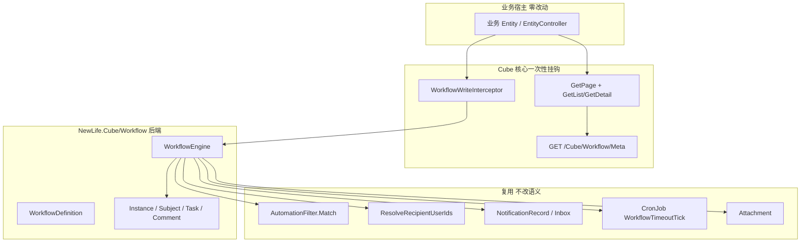
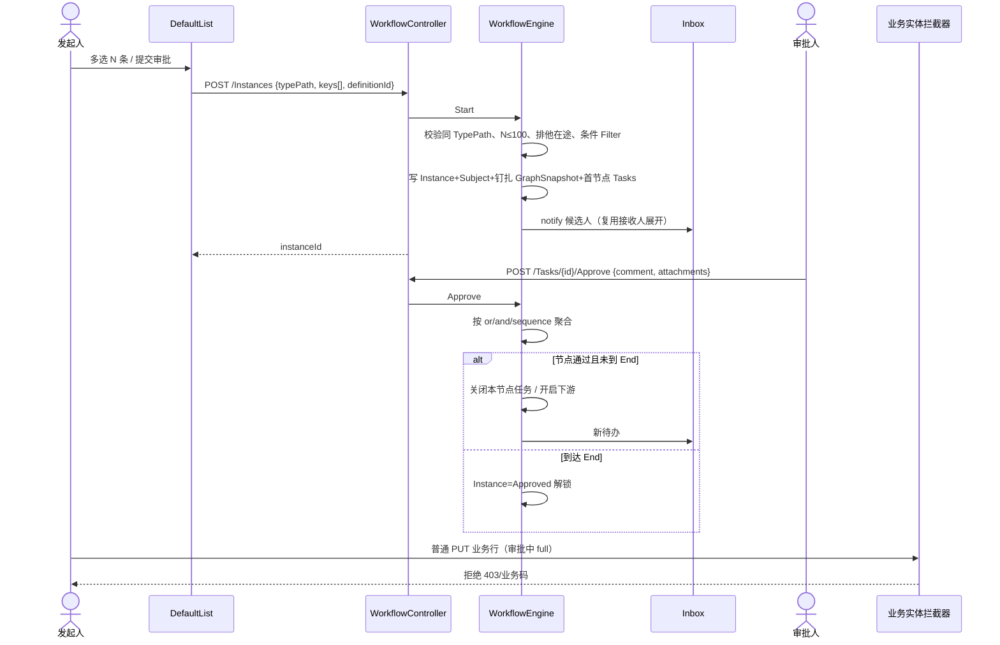
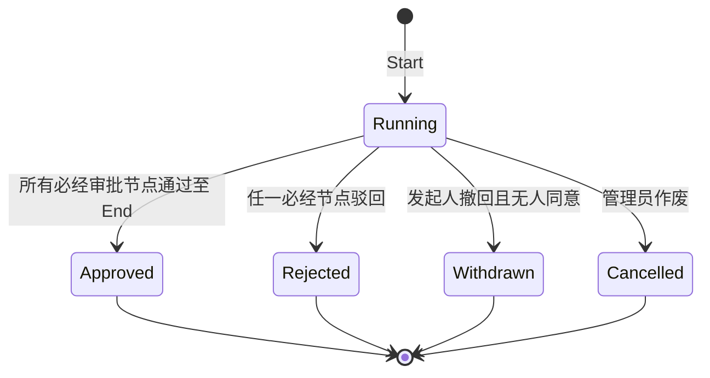
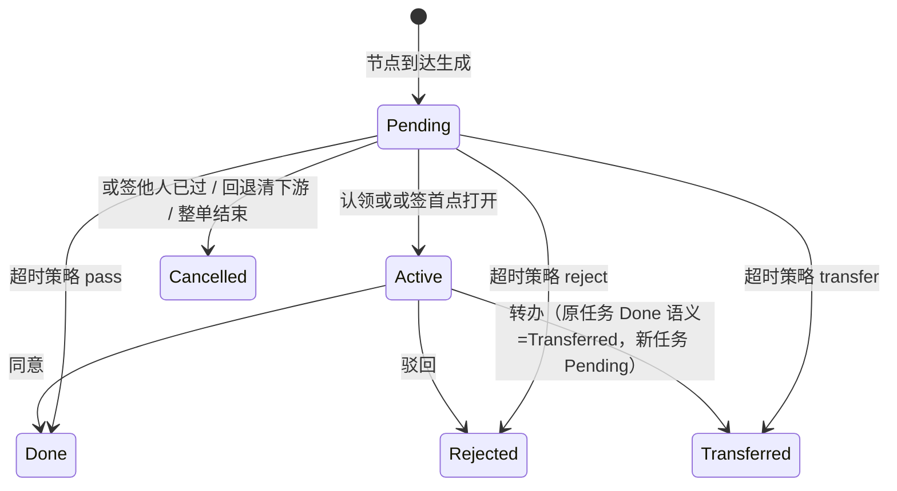

# OSC-26090347f1 Design — Cube OA审批流程引擎

> **复用、不升级自动化（强制）**  
> OSC-260815fa86 的 `EntityAutomation` / `AutomationExecutor` / `AutomationPersistence` / `AutomationRun` **产品语义不变**。  
> 本号只**调用** `AutomationFilter.Match`、接收人展开、`NotificationRecord`/`Inbox`、`CronJob`、Attachment 上传。  
> 禁止给自动化图增加人工等待节点；禁止把审批实例塞进 `AutomationRun` 内存队列。

> **Amd-3（2026-09-19）**：对照飞书审批管理员/成员手册与当前 ArcoVue 实现，补充**流程设计器**与**审批界面**（见 §13 与 `ui/process-and-approval.md`）。不改变方案 A（自研 OA 状态机）、不引入飞书独立表单设计器。引擎 V1 能力保持；界面按飞书「节点可读 + 详情左单右流」收口。

## 0. 适用框架与官方资料

| 场景 | 框架 | 资料 | 本号用法 |
| --- | --- | --- | --- |
| 壳/抽屉/表单/空态 | Arco Design Vue | https://arco.design/vue/docs/start | 提交抽屉、待办、意见 |
| 列表操作列 | VisActor VTable | https://visactor.com/vtable/option/ListTable ；https://visactor.com/vtable/api/Methods | `__wfStatus` 列 + 行操作 |
| 工作流设计器 | FlowGram.AI **固定布局** | https://flowgram.ai/guide/getting-started/introduction.html ；https://flowgram.ai/examples/index.html ；https://flowgram.ai/api/index.html | 只读写 `GraphJson`；**不是运行时** |
| 图标 | IconPark | 先查站点再写入 registry | 待办 `approve`；提交 `send` |
| 对标 | 飞书/钉钉 OA 审批 | 或签/会签/依次、加签、知会、回退 | 不是 BPMN |

SFC：新 `.vue` 薄脚本，业务进同目录 `useXxx.ts`。

## 1. 总览



**状态唯一来源**

| 状态 | 来源 | 禁止 |
| --- | --- | --- |
| 定义 | `WorkflowDefinition` 行（含 Published GraphJson + Version） | 前端另存运行时图 |
| 在途图 | 实例行 `GraphSnapshot`（发起时钉扎） | 运行中读定义最新草稿 |
| 实例 | `WorkflowInstance.Status` | 业务表 ApprovalStatus |
| 任务 | `WorkflowTask.Status` | 前端假候选人 |
| 记录审批态 | GetList `__wfStatus` 服务端计算 | 前端拼实例 |
| 模块开关 | `WorkflowMeta.Enabled` | 前端写死菜单 |
| 字段可写 | GetDetail 记录级 `writable` 三元组 | 匿名 GetPage 下发可写字段名 |

## 2. 时序与状态

### 2.1 提交 → 待办 → 办结



### 2.2 实例状态



终态（Approved/Rejected/Withdrawn/Cancelled）后同一 `(TypePath, EntityKey)` 允许再次发起。  
**禁止**从 Approved 直接回到 Running（要重新提交）。

### 2.3 任务状态



会签：节点内全部（或达 `quorum`）`Done` 才向下游。  
依次签：`SequenceIndex` 升序，前一人未 Done 则后一人保持不可见（Status 仍 Pending 但 `Visible=false` 直至轮到）。

## 3. 数据模型

位于 WebAPI 核心库 `NewLife.Cube/Workflow/Entity/Workflow.xml`（Amd-2：并入 NewLife.Cube，命名空间保留 `NewLife.Cube.Workflow.Entity`），`ConnName=Workflow`，`ChineseFileName=True`，`ModelClass={name}Model`。在该目录执行 `xcode` **只生成本 xml 的表**。禁止写入 `NewLife.Cube/Entity/Cube.xml`（避免与自动化表混生成）。

主键一律 `Int64` + `DataScale=time` 雪花（实例/任务量大）。

### 3.1 WorkflowDefinition

| 列 | 类型 | 约束 | 默认 | 说明 |
| --- | --- | --- | --- | --- |
| Id | Int64 | PK DataScale=time | 雪花 | |
| TenantId | Int32 | 索引 | 0 | 0=平台 |
| TypePath | String(100) | 非空 | | 与 GetPage 一致；**禁止**空=全部实体 |
| Name | String(50) | 非空 | | trim 1–50 |
| Enable | Boolean | | true | |
| Published | Boolean | | false | 仅 Published 可发起 |
| Version | Int32 | | 1 | 每次发布 +1 |
| LockPolicy | String(16) | | `full` | `full` \| `nodeFields` |
| StartFilter | String(-1) | JSON | `{}` | ViewFilter 同构；空=全记录可发起 |
| GraphJson | String(-1) | JSON | | 设计草稿 |
| PublishedGraphJson | String(-1) | JSON | | 发布快照；发起时再拷到实例 |
| Remark | String(200) | | | |
| Create*/Update* | 扩展 | | | |

索引：`(TenantId, TypePath, Enable)`。同一 TypePath 允许多定义；发起时必须显式 `definitionId`（仅一条已发布时可前端默认选中）。

### 3.2 WorkflowInstance

| 列 | 类型 | 说明 |
| --- | --- | --- |
| Id | Int64 PK | |
| TenantId | Int32 | 拷贝定义 |
| DefinitionId | Int64 | |
| DefinitionVersion | Int32 | 钉扎 |
| TypePath | String(100) | |
| GraphSnapshot | String(-1) | **发起时**复制 PublishedGraphJson，之后只读 |
| Status | String(16) | Running/Approved/Rejected/Withdrawn/Cancelled |
| StarterId | Int32 | |
| Title | String(200) | **Amd-3 已落地**：发起时可选显示标题，进度抽屉展示 |
| StartComment | String(500) | |
| Summary | String(-1) | **Amd-3 已落地**：发起 Markdown 摘要，审批人只读 |
| FinishTime | DateTime | |
| Create*/Update* | | |

### 3.3 WorkflowSubject

| 列 | 类型 | 说明 |
| --- | --- | --- |
| Id | Int64 PK | |
| InstanceId | Int64 | 索引 |
| TypePath | String(100) | 必须等于实例 TypePath |
| EntityKey | String(50) | 见 §3.8 |
| Title | String(100) | 发起时快照显示名 |

唯一索引：`(TypePath, EntityKey)` **过滤** `Instance.Status=Running` 无法用 SQL 部分唯一时：启动事务内 `SELECT … Status=Running` + 插入；并发第二笔 409。另建普通索引 `(TypePath, EntityKey)`。

### 3.4 WorkflowTask

| 列 | 类型 | 说明 |
| --- | --- | --- |
| Id | Int64 PK | |
| InstanceId | Int64 | 索引 |
| NodeId | String(64) | 图节点 id |
| Mode | String(16) | or/and/sequence |
| AssigneeId | Int32 | 0=未认领（候选人集在 CandidateJson） |
| CandidateJson | String(-1) | `number[]` 用户 Id |
| SequenceIndex | Int32 | 依次签序号，从 0 |
| Visible | Boolean | 依次签未轮到 false |
| Status | String(16) | Pending/Active/Done/Rejected/Cancelled/Transferred |
| DueTime | DateTime | 可空 |
| TimeoutAction | String(16) | pass/reject/transfer |
| TimeoutTransferTo | String(-1) | 复用 to schema |
| ClaimTime / FinishTime | DateTime | |
| Create* | | |

索引：`(AssigneeId, Status)`；`(InstanceId, NodeId)`。

### 3.5 WorkflowComment

| 列 | 类型 | 说明 |
| --- | --- | --- |
| Id | Int64 PK | |
| InstanceId | Int64 | |
| TaskId | Int64 | 0=发起意见 |
| Action | String(16) | start/approve/reject/addSign/cc/rollback/withdraw/transfer/timeout |
| Content | String(1000) | |
| CreateUser/Id/IP/Time | | |

附件：**不**新建表。`Attachment.Category='WorkflowComment'`。

**Amd-3 产品决策（已落地，覆盖原「Key=CommentId + 审批节点上传」）**：

| 时机 | Key | 谁上传 | 谁可见 |
| --- | --- | --- | --- |
| 发起成功后 | 实例 Id 十进制字符串 | 发起人 | 后续审批人（进度「发起附件」） |
| 审批同意/驳回 | **禁止** | — | — |

兼容历史：列表仍识别 `Key=instanceId` 或 `instanceId:taskId` 前缀。新上传拒绝 `taskId`。

### 3.6 常用语

不新建表。`Parameter`：`Category=Workflow.Phrase`，`Name=tenant:{TenantId}`，`Value`=JSON 数组 `[{id,text}]`。非法项丢弃；空则回落内置 `["同意","请补充材料","驳回"]`。

### 3.7 自审补丁：定义版本钉扎

- 保存草稿只写 `GraphJson`，不改 `PublishedGraphJson`。
- 发布：校验图（§5）→ 拷贝到 `PublishedGraphJson` → `Version++` → `Published=true`。
- 停用：`Enable=false` 或 `Published=false`，**不影响**已在途实例（读 `GraphSnapshot`）。
- 在途实例禁止热切换定义图。

### 3.8 EntityKey 格式

| 主键 | EntityKey | 例子 |
| --- | --- | --- |
| 单列 Int32/Int64 | 十进制不变文化 | `42` |
| 单列 String | 原值 trim，长度 ≤50，禁止含 `\n` | `A-01` |
| 复合主键 | **V1 不支持发起**，API 400「复合主键实体不支持审批」 | |

归一化：`Convert.ToString(key, CultureInfo.InvariantCulture)`。GetList 批量查主体时用同一格式，禁止 `42` 与 `042` 并存（Int 主键一律无前导零）。

## 4. GraphJson schema（与自动化外形同构、type 命名空间分离）

```json
{
  "version": 1,
  "nodes": [
    { "id": "start", "type": "oa.start", "data": {} },
    {
      "id": "n1",
      "type": "oa.approve",
      "data": {
        "name": "主管审批",
        "mode": "or",
        "quorum": null,
        "to": { "kind": "roles", "roles": [2] },
        "fields": { "visible": ["*"], "writable": [] },
        "timeoutHours": 24,
        "timeoutAction": "pass",
        "timeoutTransferTo": null,
        "allowAddSign": true,
        "allowRollback": true
      }
    },
    {
      "id": "g1",
      "type": "oa.xor",
      "data": {
        "name": "金额分流",
        "cases": [
          { "filter": { "logic": "all", "filters": [{ "field": "Amount", "op": "gt", "value": 10000 }] }, "target": "n2" }
        ],
        "defaultTarget": "n3"
      }
    },
    { "id": "cc1", "type": "oa.cc", "data": { "to": { "kind": "users", "users": [1] } } },
    { "id": "end", "type": "oa.end", "data": {} }
  ],
  "edges": [
    { "source": "start", "target": "n1" },
    { "source": "n1", "target": "g1" },
    { "source": "g1", "target": "n2" },
    { "source": "g1", "target": "n3" },
    { "source": "n2", "target": "end" },
    { "source": "n3", "target": "end" }
  ]
}
```

### 4.1 节点 type

| type | V1 | 说明 |
| --- | --- | --- |
| `oa.start` | 必须恰好 1 | 入边 0 |
| `oa.approve` | ≥1 | 人工节点 |
| `oa.cc` | 可选 | 知会：写通知 + 无待办阻塞 |
| `oa.xor` | 可选 | 互斥网关；`cases` 按序第一个 Match 命中；全不命中走 `defaultTarget`；无 default **发布失败** |
| `oa.end` | 必须恰好 1 | 出边 0 |
| 自动化 type（`start`/`filter`/`notify`/…） | 禁止 | 发布与运行均失败 |
| `oa.and` 并行汇聚 / loop / subprocess | 不做 | 发布拒绝 |

`to` 与自动化 notify 的 `to` **同一 JSON**（kind=users\|roles\|departments 三选一）。展开调用现有方法，租户裁剪规则一致。候选人展开为空：该节点到达即失败，实例保持 Running，记 Comment action=`error`，通知发起人（不自动驳回）。

### 4.2 未知字段

保存 GraphJson：未知节点字段 **保留**（向前兼容）。未知 `type`：**拒绝发布**。运行时遇未知 type：**失败停止**，不静默跳过。

### 4.3 加签（自审补丁）

前加签：在当前节点前插入**临时** `oa.approve`（只写入 `GraphSnapshot` 运行时节点表内存结构 / 或 Task.NodeId=`{nodeId}#addsign#{taskId}`），原任务挂起（Status=Pending Visible=false），加签任务完成后恢复。  
后加签：当前人 Done 后插入临时节点，再进原下游。  
临时节点不回写 `WorkflowDefinition`。超时与加签同时存在：超时只作用于**当前可见**任务。

### 4.4 条件求值主体

XOR 与 StartFilter 的 Filter 针对 **Subject 列表的第一条实体快照**（发起时加载）。V1 一批 N 条视为同质单据；若 N>1 且 StartFilter 非空，**每条都要 Match**，任一失败整批 400。XOR 在运行中重新读**第一条**主体当前行（不锁字段则可能变；full 锁下与发起时一致）。

## 5. 发布校验（穷尽）

| 规则 | 失败 |
| --- | --- |
| 恰好 1 start、1 end | 400 |
| 所有 type 属于 oa.* V1 集合 | 400 |
| 图连通：从 start 能到 end；无环（V1 禁止回边，回退是运行时跳转不是边） | 400 |
| approve.to 可解析且非空数组 | 400 |
| xor 必须 defaultTarget 且 target 存在 | 400 |
| timeoutHours>0 时 timeoutAction ∈ pass\|reject\|transfer；transfer 必须 timeoutTransferTo | 400 |
| mode=and 时 quorum 空=全部；quorum 为 (0,1] 比例或正整数 ≤ 候选人数 | 400 |
| fields.writable ⊆ 该 TypePath GetPage editForm 字段名或 `[]`；`*` 仅允许 visible | 400 |

## 6. Cube 挂钩

### 6.1 文件级改动地图

| 文件 | 改什么 | 禁止动 |
| --- | --- | --- |
| **新建** `NewLife.Cube/Workflow/*`（Amd-2：并入 WebAPI 核心库，不建独立 csproj、不进皮肤仓） | 随 NewLife.Cube 多目标 net6.0–net10.0；命名空间 `NewLife.Cube.Workflow(.Entity)`；与 Automation 同模式 | 不要引用 Elsa |
| **新建** `NewLife.Cube/Workflow/Entity/Workflow.xml` + xcode 生成 | 五表 | 不改 Cube.xml |
| **新建** `NewLife.Cube/Workflow/WorkflowModule.cs` | `[Module("Workflow")]` Add/Use；WebAPI 核心注册，MVC(CubeNC) 不 Link 无副作用 | Use 内不 MapFallbackToFile |
| **新建** `NewLife.Cube/Workflow/WorkflowEngine.cs` | 状态机 | 不调用 AutomationExecutor.Run |
| **新建** `NewLife.Cube/Workflow/WorkflowWriteInterceptor.cs` | `IEntityInterceptor.Valid` | Query/Filter 不做行藏 |
| **新建** `NewLife.Cube/Workflow/Controllers/WorkflowController.cs` | API | |
| **新建** `NewLife.Cube/Workflow/Jobs/WorkflowTimeoutJob.cs` | `[CronJob("WorkflowTimeoutTick", "0 */5 * * * ?")]` | 不改 EntityAutomationTick |
| 项目引用（Amd-2） | Workflow 即 NewLife.Cube 源码；`NewLife.Cube.Tests` 直接引用 NewLife.Cube；CubeNC/CubeDemoNC 不 Link `NewLife.Cube/Workflow` 目录 | 不把工作流塞进 CubeNC / MVC Demo |
| `NewLife.Cube/Common/ReadOnlyEntityController.cs` `GetPage` | PrepareFieldsForApi **之后**调用 `WorkflowPageOverlay.ApplyType(data, Factory, user)` | 不取消 `[AllowAnonymous]`；不改 PrepareFieldsForApi 本体 |
| 同文件 GetList/GetDetail 序列化出口 | `WorkflowPageOverlay.ApplyRows` | 不改 Search 条件当 ACL |
| ~~CubeNC 双栈~~（Amd-1） | **不做**：MVC 侧（CubeDemoNC/CubeNC）不引用工作流，无需双栈改动与实体 Link | 不把设计器塞 MVC |
| `NewLife.Cube/Automation/*` | **不改** | 可 `internal` 改 `public` 仅当接收人方法当前不可见——若必须暴露，加 `AutomationRecipients.Resolve` 薄包装 **或** 把 Resolve 提成 `NewLife.Cube/Membership/RecipientResolver.cs` 供两边调用。**首选**抽公共 Resolver，自动化改为调用它（行为单测对齐，不算升级执行器） |
| ArcoVue `web/src/views/crud/DefaultList*.ts` | 工具栏按钮 + 列 | 不改自动化抽屉 |
| **新建** `web/src/views/workflow/*` | designer/todo | FlowGram 固定布局 |
| `@newlifex/api-core` | workflow 客户端 | |
| `Doc/功能清单.md`、迁移方案 §8.5.5 一行本号 ID | 事实回写 | 禁止同义大段改写 |

**保留不动：** `AutomationExecutor` 节点表、`EntityAutomation` 列、GetPage AllowAnonymous、`PermissionFlags` 枚举、业务 Area 控制器。

### 6.2 拦截器矩阵

`Init(entityType)`：

| 实体 | Init |
| --- | --- |
| WorkflowDefinition/Instance/Subject/Task/Comment | **false**（禁止自锁） |
| EntityAutomation / Automation 相关 | false |
| Attachment / NotificationRecord / Log / Parameter | false |
| 其它实体 | true（模块已注册时） |

`Valid(entity, method)`：

| LockPolicy | method | 当前用户 | 结果 |
| --- | --- | --- | --- |
| 无 Running 主体 | 任意 | 任意 | true |
| full | Insert | 任意 | true（新行不在途） |
| full | Update/Delete | 非流程通道 | **false**，消息「审批中不可修改」 |
| full | Update | `WorkflowWriteScope.IsActive` 且字段 ⊆ 节点 writable | true |
| nodeFields | Update | 普通 CRUD | 脏字段若 ⊆ 节点 writable **且** 用户为当前任务候选人 → true；否则 false |
| nodeFields | Delete | 任意普通 | false |
| 任意 | 流程自有表 | — | 不进入（Init false） |

流程通道：`WorkflowEngine` 内 `using WorkflowWriteScope.Enter(instanceId, fieldNames)` 再 `entity.Update()`。Scope 用 `AsyncLocal`。

删除在途主体：普通 Delete 一律 false；管理员作废实例后解锁再删。

### 6.3 GetPage / GetList 匿名与登录（自审补丁）

GetPage **保持** `[AllowAnonymous]`。

| 调用者 | workflow 块 |
| --- | --- |
| 匿名 / 无用户 | `{ enabled: bool }` **仅此键**。enabled=模块引用且该 typePath 存在 Enable+Published 定义。**无** canStart、无 fields |
| 登录 | `{ enabled, canStart, definitionCount, lockPolicy }`。canStart=enabled 且用户对该实体 `PermissionFlags.Detail`（发起不要求 Update，避免无改权不能呈报）且 StartFilter 不在类型级求值（类型级只给开关；行级再判） |
| 分享 embed | 同匿名：enabled 可 true，前端仍按 IA 隐藏提交 |

GetList 行覆盖（登录且 enabled）：

| 字段 | 含义 |
| --- | --- |
| `__wfStatus` | none/running/approved/rejected/withdrawn |
| `__wfInstanceId` | 当前或最近一条；none 则 0 |
| `__wfCanStart` | 无在途 且 类型 canStart 且 StartFilter Match 该行 |

GetDetail（登录）：在 fields 上附 `wfVisible` / `wfWritable`（bool）。匿名 GetDetail 本身需授权，不走匿名 GetPage。  
**禁止**把节点 writable 字段名数组放进匿名 GetPage。

批量：GetList 一页最多典型 50–200 行，用 `TypePath + EntityKey IN (...)` 一次查 Running 主体，禁止 N+1。

### 6.4 权限

- 定义 CRUD：Workflow 区域菜单 `EntityAuthorize` 标准四位。
- 发起：实体 **Detail**（不是 Update）。无 Detail 不能选该行（FindData 已拦）。
- 审批动作：不新增 PermissionFlags；`POST /Tasks/{id}/Approve` 校验 `User.ID ∈ CandidateJson` 或 `AssigneeId`。管理员（流程定义 Update 权）可「指定节点跳转」「作废」。
- 撤回：仅 `StarterId==当前` 且 Status=Running 且 **不存在** Action=approve 的 Comment。
- 知会：不产生任务，只 NotificationRecord。

## 7. API 清单

前缀 `/Cube/Workflow`。统一 `ApiResponse<T>`。未引用模块：Meta 可用（enabled:false）；其它 404。

| 方法 | 路径 | 权限 | 说明 |
| --- | --- | --- | --- |
| GET | `/Meta` **与** `GET /Cube/Workflow` | 匿名 | `{ enabled }`；登录加 `todoCount`。Amd-3：必须同时挂 `HttpGet("Meta")`，仅裸 `[HttpGet]` 会导致前端 `/Cube/Workflow/Meta` 404 |
| GET/POST/PUT | `/Definitions` | 定义菜单 | CRUD；PUT 草稿 |
| POST | `/Definitions/{id}/Publish` | Update | 校验+钉扎 |
| POST | `/Instances` | 登录 | body: `{ typePath, keys: string[], definitionId, comment, title?, summary? }`；成功后前端再 `POST /Attachments?instanceId=` |
| POST | `/Instances/{id}/Withdraw` | 发起人 | |
| POST | `/Instances/{id}/Cancel` | 定义 Update | 作废 |
| GET | `/Instances/{id}` | 发起人/候选人/实体 Detail | 含 tasks/comments |
| POST | `/Tasks/{id}/Claim` | 候选人 | 或签认领 |
| POST | `/Tasks/{id}/Approve` | 候选人 | `{ comment }`（Amd-3：审批节点不传附件） |
| POST | `/Tasks/{id}/Reject` | 候选人 | 整单 Rejected |
| POST | `/Tasks/{id}/AddSign` | 候选人且 allowAddSign | `{ before: bool, to }` |
| POST | `/Tasks/{id}/Transfer` | 候选人 | `{ to }` 单用户 |
| POST | `/Tasks/{id}/Cc` | 候选人 | `{ to }` |
| POST | `/Tasks/{id}/Rollback` | 候选人且 allowRollback | `{ targetNodeId }` 必须已办节点 |
| POST | `/Instances/{id}/Jump` | 定义 Update | `{ targetNodeId }` |
| POST | `/Tasks/BatchApprove` | 各任务候选人 | `{ ids: number[≤50], comment }` 部分成功 |
| GET | `/Todo` | 登录 | 当前用户可见 Pending/Active |
| GET | `/Started` | 登录 | |
| GET | `/Done` | 登录 | 我已办 |
| PUT | `/Phrases` | 定义 Update | |
| POST | `/Attachments` | 可查看该实例 | multipart；`instanceId` 必填；**禁止** `taskId` |
| POST | `/Entities/{key}/Patch?typePath=` | 流程通道 | 审批中改 writable 字段 |

错误码：400 校验；401 未登录；403 非候选人；404 无模块或无记录；409 排他在途或定义 Version 冲突。

## 8. 引擎行为矩阵（实施不得猜测）

### 8.1 或签 / 会签 / 依次

| mode | 一人同意 | 一人驳回 | 全员同意 |
| --- | --- | --- | --- |
| or | 节点通过；其余任务 Cancelled | 整单 Rejected；其余 Cancelled | — |
| and | 等 | 整单 Rejected | quorum 空=全部 Done 才通过；quorum=0.6 则 ⌈n*0.6⌉ |
| sequence | 仅当前 Visible 可操作；同意则下一 Visible=true | 整单 Rejected | 最后一人同意 → 节点通过 |

并发：Approve 使用任务行乐观锁 `UpdateTime` 或 `WHERE Status in (Pending,Active)` 更新；第二人 409。

### 8.2 回退

- target 必须是本实例**已经到达过**的 `oa.approve` NodeId。
- 目标节点之后（含当前）任务全部 Cancelled。
- 目标节点按原 mode 重新生成任务（候选人重新展开，人员变动生效）。
- GraphSnapshot 不变。

### 8.3 超时 Cron

每 5 分钟：`DueTime<now && Status in (Pending,Active)`。  
pass：视同同意（Comment action=timeout）。reject：视同驳回。transfer：按 timeoutTransferTo 展开，原任务 Transferred。  
加签临时任务同样扫描。

### 8.4 撤回 / 作废

撤回与作废均 Cancelled/Withdrawn 全部未完成任务并解锁主体。已发出的知会不收回。

## 9. 前端文件地图

| 文件 | 职责 |
| --- | --- |
| `web/src/views/crud/useWorkflowList.ts` **新建** | 读 GetPage.workflow / 行 __wf*；提交抽屉状态 |
| DefaultList 薄接入 | 按钮 DOM 顺序见 IA |
| `web/src/views/workflow/designer/WorkflowDesignerPage.vue` | 薄 |
| `web/src/views/workflow/designer/useWorkflowDesigner.ts` | FlowGram 固定布局绑定 |
| `web/src/views/workflow/todo/TodoPage.vue` + `useTodo.ts` | |
| `packages/api-core` `workflow.ts` | 路径常量单测 |

断点：待办表 `<768` 卡片；设计器 `<1024` 禁用编辑并 Message「请使用桌面宽度」。

## 10. 核心文档影响

| 文档 | 动作 |
| --- | --- |
| `ArcoVue企业中后台迁移方案.md` §8.5.5 | **一句**回写本号 ID 与方案 A；禁止重写整节 |
| `Doc/功能清单.md` | 增 WF-* 行，三维未完成直至落地 |
| `Doc/Api/核心接口架构.md` | 增 `/Cube/Workflow/*` 表 |
| `前端框架分享-开场.md` | 可选一句「运行时已立项 OSC-26090347f1」 |
| FAQ 41.9 | 加「平台级请用 Workflow 模块，勿在业务表加 ApprovalStatus」一句 |

## 11. 测试设计

| 类 | 覆盖 |
| --- | --- |
| `WorkflowEngineTests` | §8 矩阵每格；回退清下游；加签前后；XOR 无 default 发布失败；空候选人 |
| `WorkflowLockTests` | full/nodeFields/自有表跳过/Scope |
| `WorkflowExclusiveTests` | 并发双提交仅一条 Running |
| `WorkflowPageOverlayTests` | 匿名 GetPage 仅 enabled；登录 canStart；GetList IN 查询 |
| `Osc260815` 回归 | 抽 2 个自动化测试确保未改执行器 |
| Vitest `useWorkflowList.spec.ts` | IA 按钮矩阵 |
| 构建 | `dotnet build NewLife.Cube`（含 NewLife.Cube/Workflow 源码）；`pnpm -C web test` 相关 spec |

## 12. 自审记录（创建时已闭合）

| 缺口 | 处理 |
| --- | --- |
| 同一主体多在途 | §3.3 排他 + 409 |
| 定义热更新打到在途 | GraphSnapshot 钉扎 |
| GetPage 匿名泄漏 writable | §6.3 |
| 拦截器锁死流程表 | Init false |
| 加签 vs 超时 | 只作用于可见任务 |
| 复合主键 | V1 拒绝 |
| 混 TypePath | 400 |
| 候选人空 | 不自动通过 |
| PermissionFlags.Approve | 不做，候选人校验 |
| 并行网关 AND-join | V1 不做 |
| Cube.sln / Demo 引用（Amd-2） | 后端并入 NewLife.Cube：WebAPI 宿主（CubeDemo）天然生效；CubeNC/CubeDemoNC 不 Link 无影响；Tests 直接引用 NewLife.Cube |
| 接收人代码重复 | 抽 RecipientResolver，自动化改调用 |
| N=100 / 批量任务 50 | 硬上限 |
| OSC-0010 | 不复活 |

**仍待批准后实现，本号不写 C#。**（历史句；Amd-2 起已在执行。Amd-3 起界面补齐见 §13。）

## 13. Amd-3：对照飞书审批的设计补充（2026-09-19）

权威界面稿：[ui/process-and-approval.md](./ui/process-and-approval.md)。本节只锁**架构结论**与**和飞书的差异**，避免把 SaaS 审批应用误当成 Cube 皮肤的终态。

### 13.1 表单 vs 流程

飞书审批定义 = 表单设计 + 流程设计。Cube **禁止**第二套表单画布：单据 = 实体行（GetPage / FormJson / RecordDrawer）。流程定义只绑定 `TypePath` + GraphJson。发起是「勾选已有记录」，不是「填写请假单控件」。

### 13.2 节点集合（相对飞书）

| 飞书节点 | Cube V1 | 说明 |
| --- | --- | --- |
| 提交 / 结束 | `oa.start` / `oa.end` | 固定各 1 |
| 审批人 | `oa.approve` | 会签=and、或签=or、依次=sequence |
| 抄送人 | `oa.cc` | 通知、不阻塞 |
| 条件分支 | `oa.xor` | 必须 defaultTarget；**设计器必须可视化 cases**（现状仅占位文案） |
| 办理人 | **不做** | 财务打款/盖章属 V2 |
| 自动通过/拒绝节点 | 不做独立 type | 用超时 pass/reject 近似 |

加签：飞书前/并/后 + 减签。Cube V1 **仅前加签、后加签**（引擎已有）。并加签/减签另号。

接收人：飞书上级/部门负责人/角色/指定/自选/表单内联系人。Cube V1 **仅** users / roles / departments。N 级上级依赖组织关系字段，不在本号展开。

### 13.3 实例页信息架构

飞书：左单据、右流程、底同意/驳回/更多。  
Cube 映射：

- 实体入口：RecordDrawer 表单 + Tab「审批」内嵌进度（单据已在）。
- 待办入口：宽屏左记录摘要 + 右节点流程（现状缺左栏）。
- 操作：同意/驳回主按钮；更多 = 加签/转办/知会/**回退**（回退 API 已有、进度面板无入口）。
- 附件：仅发起时；审批弹层不出现上传。

进度默认按**节点 + 候选人状态**渲染，意见时间轴降为「全部动态」折叠。禁止只靠 Comment 列表冒充流程。

### 13.4 已落地、需回写设计的实现偏差

| 项 | 原 design | 实现 / Amd-3 采纳 |
| --- | --- | --- |
| 实例 Title / Summary | 无列 | 已加列；发起抽屉可填 |
| 附件 Key | Comment.Id | 实例 Id；审批节点禁止上传 |
| 雪花 Id | 前端易 Number() | 全程 string |
| Meta 路由 | `/Cube/Workflow/Meta` | 必须 `[HttpGet("Meta")]`，根路径可保留 |
| 待办口径 | 候选人可见 | `FindTodoByUser`：认领人或或签未认领候选；角标同一口径 |
| 已通过再发起 | 终态可再提 | **已通过不可再提**（产品收紧，与「审批中不可重复」一起） |
| 工具栏文案 | 提交审批 | 批量提交，且仅表格视图 |
| 菜单 | 流程 / … | 一级「流程审批」+ 中文叶子 |

### 13.5 设计器 / 审批界面补齐（本号后续实现，不新开 OSC）

见 `ui/process-and-approval.md` §3 D1–D10。其中 **D1 XOR 可视化**与 **D6 回退入口**为办理闭环阻塞项。

### 13.6 明确不做（飞书有也不做）

独立表单设计器、办理人节点、并加签/减签、委托授权、消息卡片秒批、发起/结束节点内置抄送、审批人去重、空候选人转上级、移动端审批应用。
