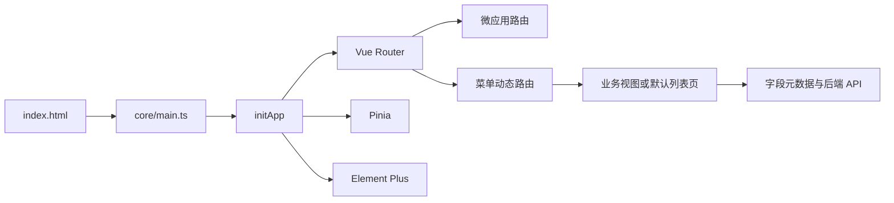

# 架构概览

## 定位

`web/` 是 NewLife.Cube 的 Vue 3 默认前端模板与微应用宿主。后端下发菜单与实体字段元数据；前端据此注册业务路由并渲染默认 CRUD 页面。业务应用可以按约定提供页面或局部 Section 覆盖。

该架构服务于“控制器即 CRUD”的产品方向：先由控制器、菜单和字段元数据提供可用 CRUD，再按需覆盖 Section 或完整页面，并将重复能力回流默认引擎。方向与阶段优先级见 [愿景与路线图](../product/vision-and-roadmap.md)。

## 当前运行入口

```text
index.html
  -> /core/main.ts
  -> core/initApp.ts
  -> Vue + Pinia + Router + i18n + Element Plus
  -> core/App.vue
```

根 `src/` 是未被 `index.html` 引用的旧演示壳，不属于默认模板运行路径。架构边界见 [ADR 0001](../decisions/0001-core-first-application-model.md)。

## 核心分层

| 层       | 路径                             | 职责                                                 |
| -------- | -------------------------------- | ---------------------------------------------------- |
| 框架引擎 | `core/`                          | 默认页面、布局、路由、状态、请求、主题、插件与初始化 |
| 业务应用 | `apps/<app>/`                    | 各应用的路由、视图、Section 覆盖                     |
| 配置     | `configs/`                       | 基础、环境、微应用运行配置                           |
| 构建     | `vite.config.ts`、`core/plugin/` | Vite 配置与虚拟模块生成                              |
| 测试     | `core/__tests__/`、`e2e/`        | Vitest 单元/组件测试与 Playwright E2E                |

## 关键运行链



- 路由与菜单见 [routing.md](./routing.md)。
- 状态、请求和元数据页面见 [state-and-data.md](./state-and-data.md)。
- 构建、环境和运行时配置见 [build-and-runtime.md](./build-and-runtime.md)。
