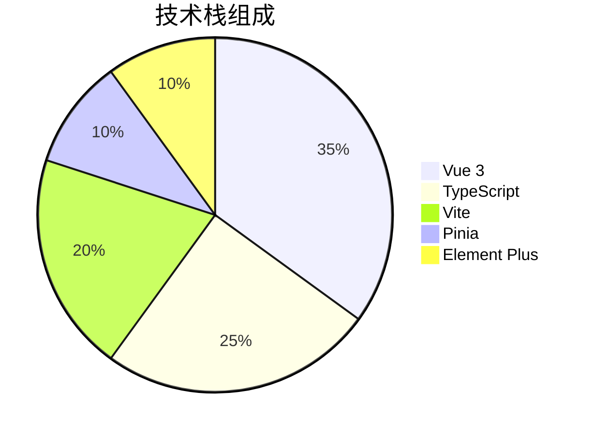
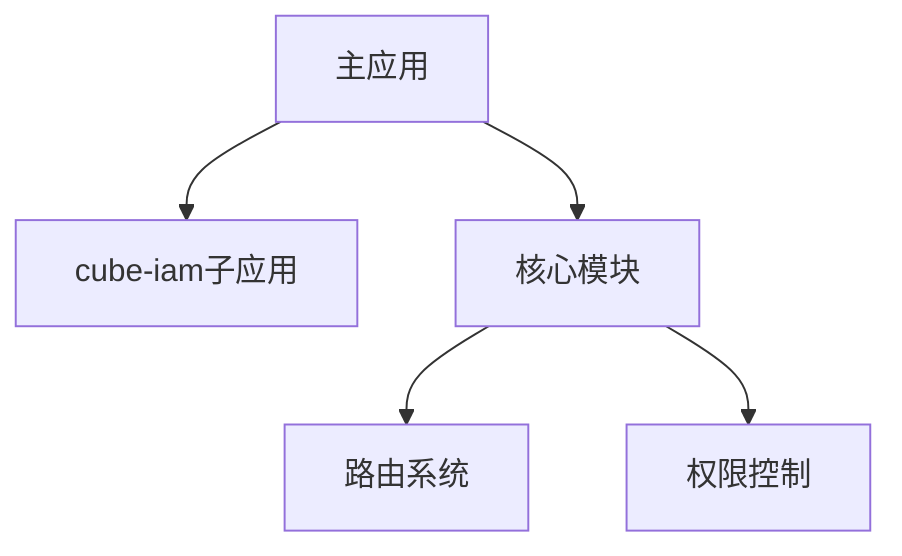

# 项目架构文档

## 技术栈


## 核心架构
### 微前端架构


### 目录结构
```
core/         # 核心业务逻辑
  stores/     # 状态管理
  layouts/    # 布局系统
  configs/    # 应用配置
src/          # 主应用代码
configs/      # 微前端配置
```

## 模块分析
### 路由系统
- **文件位置**： 
  - `src/router/index.ts` (基础路由)
  - `core/routes/index.ts` (微前端路由)
- 特点：
  - 动态路由加载
  - 权限路由过滤

### 状态管理
```typescript
// core/stores/user.ts
interface UserState {
  token: string
  roles: string[]
}
```

### 权限控制
- 基于角色的访问控制
- 动态菜单生成
- 路由守卫拦截

## 开发规范
1. 组件命名：大驼峰式
2. 状态管理：严格使用Pinia
3. 代码风格：ESLint + Prettier

## 待办优化
1. [ ] 完善环境变量类型定义
2. [ ] 提取公共工具函数
3. [ ] 增强菜单组件类型