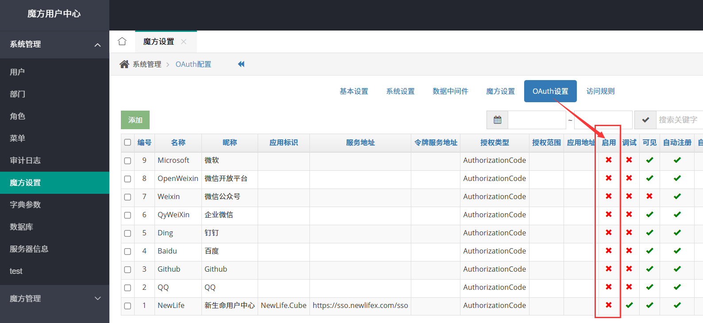

# 魔方 NewLife.Cube


魔方是一个快速 Web 开发平台，面向“数据驱动 + 快速迭代 + 可深度定制”场景。几分钟内即可把实体 / 数据库表转为带权限、列表、详情、增删改、导出、统计的完整后台界面，并开放标准 API 给 Vue / Blazor / Antd / 移动端或第三方系统调用。默认模板已在真实项目中经历单表 100 亿数据增删改查考验。

演示站点：<https://cube.newlifex.com> `CentOS7 + CDN`  
SSO中心：<https://sso.newlifex.com> `OAuth 服务端`  
Swagger：[https://cube3.newlifex.com](https://cube3.newlifex.com)

魔方教程：<https://newlifex.com/cube>  
XCode教程：<https://newlifex.com/xcode>  
核心库教程：<https://newlifex.com/core>  

---
## 目录索引
- [核心价值](#核心价值)
- [总体架构](#总体架构)
- [项目结构与子工程说明](#项目结构与子工程说明)
- [核心概念](#核心概念)
- [快速拥有](#快速拥有)
- [最小示例（.NET 8/9 Minimal Hosting）](#最小示例net-89-minimal-hosting)
- [字段与界面定制示例](#字段与界面定制示例)
- [API 与前后端分离](#api-与前后端分离)
- [权限与安全](#权限与安全)
- [主题 / 皮肤 / UI 扩展](#主题--皮肤--ui-扩展)
- [多数据库与大数据支持](#多数据库与大数据支持)
- [性能特性](#性能特性)
- [部署方式](#部署方式)
- [SSO 用户中心快速部署](#快速部署用户中心)
- [第三代魔方与路线图](#第三代魔方)
- [常见使用场景](#常见使用场景)
- [贡献指南](#贡献指南)
- [FAQ 速览](#faq-速览)
- [魔方特性](#魔方特性)
- [ASP.NET Core 安装](#aspnet-core-安装)
- [ASP.NET MVC 安装](#aspnet-mvc-安装)
- [新生命项目矩阵](#新生命项目矩阵)
- [新生命开发团队](#新生命开发团队)

---
## 核心价值
1. 极速“数据到界面”生产力：实体类 + 控制器 = CRUD / 统计 / 导出 / 权限 即刻可用。  
2. 全维权限：用户 / 角色 / 菜单 / Action 粒度，支持 SSO + OAuth + JWT。  
3. 多前端共存：Vue / Blazor / AntDesign / 传统 Razor 可渐进迁移。  
4. 多数据库 + 自动建表 + 自动分表 + 读写分离（依赖 XCode）支持超大规模数据。  
5. 可扩展：字段元数据、视图覆写、主题插件、IModule 模块化。  
6. 长期演进 & 多目标框架，易升级、稳定可控。  

---
## 总体架构
```
+-------------------------------------------------------------+
|         前端 (Vue / Blazor / Antd / 传统 Razor UI)           |
+----------------------+------------------+-------------------+
|  皮肤视图(Razor)     |  API Controllers | Swagger 分组文档  |
+----------------------+------------------+-------------------+
|  EntityController / ReadOnlyEntityController 基础能力        |
+------------------+---------------------+--------------------+
| 权限(EntityAuthorize) | 过滤(ApiFilter) | 统一响应(ApiResponse)|
+-------------------------------------------------------------+
|            实体 & 业务逻辑 (XCode ORM + 扩展)                |
+-------------------------------------------------------------+
| 数据访问：MySql/SqlServer/SQLite/Oracle/PostgreSQL/达梦等    |
+-------------------------------------------------------------+
| NewLife.Core(日志/配置/缓存/序列化/追踪) + 生态组件          |
+-------------------------------------------------------------+
```

---
## 项目结构与子工程说明
- NewLife.Cube：核心（实体控制器、权限、菜单、字段元数据、API）。
- NewLife.CubeNC：旧版 MVC / Razor 兼容层。
- 皮肤主题：AdminLTE / Metronic / Metronic8 / Tabler / LayuiAdmin / ElementUI / Blazor（各独立包）。
- NewLife.Cube.Swagger：按区域自动分组的 Swagger 文档。 
- CubeDemo / CubeDemoNC：示例。  
- CubeSSO：统一用户中心 & OAuth 服务端。  
- NewLife.Cube.Blazor：Blazor 前端实验。  
- Test / XUnitTest：测试与验证。  

---
## 核心概念
- EntityController：通过静态构造器配置字段、操作按钮、关联跳转、统计、导出。  
- 字段元数据接口：`GetFields?kind=List|Detail|AddForm|EditForm` 驱动动态前端生成。  
- 菜单树：`/Admin/Index/GetMenuTree` 根据权限生成多级菜单。  
- 权限模型：用户 -> 角色 -> 菜单(Action 集合)。首个用户抢管理员，`admin` 被禁用。  
- ApiResponse：标准响应包装 code / data / page / stat。  
- IModule：启动模块注入服务和静态资源（主题、Swagger 等）。  

---
## 快速拥有
通过 NuGet 引入 `NewLife.Cube.Core`。MIT 协议，可私有化替换字符串“NewLife”。支持 VS 与 CLI。`newlife.snk` 已公开便于强命名一致性。  

命令行体验：
```
dotnet new install NewLife.Templates
dotnet new cube --name CubeWeb
dotnet new xcode --name Zero.Data
cd CubeWeb
dotnet build
start http://localhost:6080
dotnet run
```

---
## 最小示例（.NET 8/9 Minimal Hosting）
```csharp
var builder = WebApplication.CreateBuilder(args);
builder.Services.AddCube(); // 注册权限、菜单、实体控制器扫描
var app = builder.Build();
app.UseMetronic(app.Environment); // or UseAdminLTE / UseTabler ...
app.UseCube(app.Environment);      // 路由 & 静态资源 & 中间件
app.Run();
```
访问 `/` 登录后台；Swagger 查看接口；前端可调用标准 CRUD API。

---
## 字段与界面定制示例
```csharp
public class AppController : EntityController<App, AppModel>
{
    static AppController()
    {
        LogOnChange = true;                 // 修改日志
        ListFields.RemoveField("Secret");   // 隐藏敏感列
        var log = ListFields.AddListField("Log", "UpdateUserId");
        log.DisplayName = "修改日志";
        log.Url = "/Admin/Log?category=应用系统&linkId={ID}";
        log.Target = "_blank";
    }
}
```
前端：`/Cube/App/GetFields?kind=1` 获取列表字段定义，无需硬编码。

---
## API 与前后端分离
- 登录：`/Admin/User/Login` -> JWT Token（Header/Cookie/Query）。
- 菜单：`/Admin/Index/GetMenuTree`。
- 字段：`/{Area}/{Controller}/GetFields?kind=1..4`。
- 查询：主路由 + 动态参数（支持分页、排序、条件拼装）。
- CRUD：`Detail` / `Insert` / `Update` / `Delete`。
- 统计：返回 `stat`；分页信息：`page`。

---
## 权限与安全
- EntityAuthorize：登录 + 角色 + 菜单 Action 校验。  
- 首个用户自动管理员，原 `admin` 禁用。  
- 支持外部 OAuth / SSO / JWT，多端统一身份。  
- 建议生产：关闭未用第三方登录、启用 HTTPS、加强密码策略。  

---
## 主题 / 皮肤 / UI 扩展
- 主题内嵌静态资源：`CubeEmbeddedFileProvider`。  
- UIService 注册皮肤：`AddTheme/AddSkin`。  
- 自定义：仿照 `MetronicModule` 实现 IModule 并在 Use 阶段挂载。  
- 视图覆写：子项目同路径同名 `.cshtml` 覆盖父级。  

---
## 多数据库与大数据支持
- XCode：实体同步建表、字段演进、自动分表、读写分离、二级缓存。  
- 三库分离示例：Membership(权限) / Cube(业务) / Log(日志)。  
- 支持 MySql / SQLite / SqlServer / Oracle / PostgreSql / SqlCe / Access / 达梦。  
- PluginServer 自动下载数据库驱动 & 前端资源。  

---
## 性能特性
- 过滤器统一记录耗时，易接入 Stardust APM。  
- 日志判级避免无谓字符串拼接。  
- 多 TFM 架构允许在高版本启用 Span/ValueTask 优化。  

---
## 部署方式
- 单机：`dotnet publish` 后拷贝 dll + 配置即可。  
- 服务：结合 `NewLife.Agent` 安装为 Windows Service 或 systemd。  
- 集群：发布后打zip包，通过星尘代理`StarAgent`拉起守护，或通过星尘平台发布。  
- 容器：简单 Dockerfile（复制发布目录，设置环境变量）。  
- 横向扩展：无状态多实例，共享数据库 & 缓存。  

---
## 快速部署用户中心
(下方为原始详尽步骤，保持一致)

1. 拉取源码并编译 CubeSSO 项目…… 详见下节。

---
### 快速部署用户中心
1. 拉取[源码](https://github.com/NewLifeX/NewLife.Cube)并编译CubeSSO项目，切换到输出目录Bin/SSO，按需修改appsettings.json配置，打包exe/dll/appsettings.json/CubeSSO.runtimeconfig.json等文件，并发布到服务器。
```json
{
  "Logging": {
    "LogLevel": {
      "Default": "Information",
      "Microsoft.AspNetCore": "Warning"
    }
  },
  "AllowedHosts": "*",
  "Urls": "http://*:8080;https://*:8081",
  //"StarServer": "http://star.newlifex.com:6600",
  "ConnectionStrings": {
    "Membership": "Data Source=..\\Data\\Membership.db;provider=sqlite",
    "Cube": "Data Source=..\\Data\\Cube.db;provider=sqlite",
    "Log": "Data Source=..\\Data\\Log.db;provider=sqlite"

    //"Membership": "Server=.;Port=3306;Database=Membership;Uid=root;Pwd=root;provider=mysql",
    //"Cube": "Server=.;Port=3306;Database=Membership;Uid=root;Pwd=root;provider=mysql",
    //"Log": "Server=.;Port=3306;Database=Membership;Uid=root;Pwd=root;provider=mysql"
  }
}
```
2. 启动并访问SSO系统，首次登录可以用admin/admin进去，也可以使用第三方登录（新生命用户中心），第一个用户将会作为系统管理员，同时禁用admin。  
3. 作为用户中心正式部署时，需要关闭SSO的第三方登录，魔方设置->OAuth设置->禁用所有。  
     
4. 修改系统名称为新生命用户中心，魔方设置->系统设置->显示名称。  

---
## 第三代魔方
第三代聚焦“前后端分离 + 多前端生态 + 最小侵入”。后端接口合并在 master，前端仓库独立（Vue / QuickVue / Antd / Blazor）。  

Vue版：https://vue.newlifex.com, https://quickvue.newlifex.com  
Antd版：https://antd.newlifex.com  
Swagger：https://cube3.newlifex.com/swagger/index.html  

### 项目参与须知
1. 加入 NewLifeX 团队，向 dev 分支提交。  
2. WebApi 后台：`NewLife.Cube`；MVC 保留在 `NewLife.CubeNC`。  
3. 新前端独立仓库（如 `NewLife.CubeAntd`）。  
4. 文档/代码标注负责人。  
5. 待办任务：https://github.com/orgs/NewLifeX/projects/1 。  

### 目标蓝图
1. 现代化 UI + 保留覆写机制。  
2. 多框架前端：Vue/React/Angular/Blazor。  
3. NuGet 引包即得默认皮肤。  
4. 移动端 & 小程序 & 混合应用。  
5. 数据大屏增强。  

### 春雨计划（里程碑摘录）
- [*] 新建 WebApi 项目 `NewLife.Cube`  
- [*] 迁移 NetCore 专属代码到 `NewLife.CubeNC`  
- [*] 新版 `EntityController` / `EntityReadonlyController`  
- [*] 接口文档 & Vue 登录主页  
- [] Vue 用户/角色列表与表单  

前端仓库：  
https://github.com/NewLifeX/NewLife.CubeVue  
https://github.com/NewLifeX/NewLife.QuickVue  
https://github.com/NewLifeX/NewLife.CubeAntd  
https://github.com/NewLifeX/NewLife.CubeBlazor  

### WebApi 接口说明（节选）
1. 地址 https://cube3.newlifex.com/swagger/index.html  
2. 登录 `/Admin/User/Login` 测试账号 `admin/admin` `test/test`  
3. JWT：Header / Cookie / Query(token)  
4. 菜单 `/Admin/Index/GetMenuTree`  
5. 字段 `/{Area}/{Controller}/GetFields?kind=1` (`1=List 2=Detail 3=AddForm 4=EditForm`)  
6. 列表：主路由 + 动态查询参数  
7. `page`：分页信息  
8. `stat`：统计行  
9. 详情 `Detail` | 新增 `Insert` | 修改 `Update` | 删除 `Delete`  

---
## 常见使用场景
- 企业/部门内部管理后台、SaaS 管理面。  
- IoT 设备/点位/日志/告警管理与数据导出。  
- 数据中台快速发布标准查询接口。  
- 统一身份认证与授权中心（SSO/OAuth）。  
- 运营支撑系统（订单、配置、任务调度、版本发布）。  

---
## 贡献指南
- 规范：参考 `.github/copilot-instructions.md`。  
- Issue / PR：描述场景、期望、复现；性能类附数据规模。  
- 新主题：独立仓库 + README 说明构建方式。  
- 优先复用 NewLife 生态，避免不必要依赖。  
- 多 TFM 编译通过后再提交。  

---
## FAQ 速览
Q: 隐藏字段?  
A: 控制器静态构造：`ListFields.RemoveField("字段")`。  
Q: 自定义统计?  
A: 重写搜索逻辑，填充返回集合的 `stat`。  
Q: 切换主题?  
A: 引入主题包并 `app.UseXXX(env)`，后台可配置默认。  
Q: 数据库驱动来源?  
A: 首次运行自动从 `PluginServer` 下载，可自定义。  
Q: 集成自定义前端?  
A: 依靠字段元数据 + 标准 CRUD/JWT 登录。  

---
## 魔方特性
* 通用权限管理，用户、角色、菜单、权限，支持控制器Action权限控制
* 多数据库，支持 `MySql / SQLite / Sql Server / Oracle / PostgreSql / SqlCe / Access`
* 免部署，系统自动创建数据库表结构，以及初始化数据，无需人工干涉
* 强大的视图引擎，支持子项目视图重写父项目相同位置视图，任意覆盖修改默认界面

---
## ASP.NET Core 安装
* 在 *Visual Studio* 中新建`ASP.NET Core Web`项目
* 通过 *NuGet* 引用`NewLife.Cube.Core`，或自己编译最新的[魔方 NewLife.CubeNC](http://github.com/NewLifeX/NewLife.Cube)源码
* 在`appsettings.json`的`ConnectionStrings`段设置名为`Membership`的连接字符串，用户角色权限菜单等存储在该数据库
* 系统自动识别数据库类型，默认`Data Source=..\Data\Membership.db`
* 编译项目，项目上点击鼠标右键，`查看`，`在浏览器中查看`，运行魔方平台
* 系统为`MySql`/`SQLite`/`Oracle`/`SqlCe`数据库自动下载匹配（`x86/x64`）的数据库驱动文件，驱动下载地址可在`Config\Core.config`中修改`PluginServer`
* 系统自动下载脚本样式表等资源文件，下载地址可在`Config/Cube.config`中修改`PluginServer`
* 默认登录用户名是`admin`，密码是`admin`，也可以使用`NewLife`等第三方OAuth登录，首个进入系统的用户抢得管理员，原`admin`禁用
* 项目发布时只需要拷贝`*.dll`、`appsettings.json`、`*.deps.json`、`*.runtimeconfig.json`，以及其它自己添加的资源文件

---
## ASP.NET MVC 安装
* 在 *Visual Studio* 中新建`ASP.NET MVC`项目
* 通过 *NuGet* 引用`NewLife.Cube`，或自己编译最新的[魔方 NewLife.Cube](http://github.com/NewLifeX/NewLife.Cube)源码
* 在`Web.config`的`<connectionStrings>`段设置名为`Membership`的连接字符串，用户角色权限菜单等存储在该数据库
* 系统自动识别数据库类型，默认`<add name="Membership" connectionString="Data Source=..\Data\Membership.db" providerName="Sqlite"/>`
* 编译项目，项目上点击鼠标右键，`查看`，`在浏览器中查看`，运行魔方平台
* 系统为`MySql`/`SQLite`/`Oracle`/`SqlCe`数据库自动下载匹配（`x86/x64`）的数据库驱动文件，驱动下载地址可在`Config\Core.config`中修改`PluginServer`
* 系统自动下载脚本样式表等资源文件，下载地址可在`Config/Cube.config`中修改`PluginServer`
* 默认登录用户名是`admin`，密码是`admin`，也可以使用`NewLife`等第三方OAuth登录，首个进入系统的用户抢得管理员，原`admin`禁用
* 推荐安装 *Visual Studio* 插件 *Razor Generator*，给`.cshtml`文件设置`自定义工具`为`RazorGenerator`，可以把`.cshtml`编译生成到`DLL`里面
* 项目发布时只需要拷贝`Bin`、`web.config`、`Global.asax`，以及其它自己添加的资源文件

## 新生命项目矩阵
各项目默认支持net9.0/netstandard2.1/netstandard2.0/net4.62/net4.5，旧版（2024.0801）支持net4.0/net2.0  

|                               项目                               | 年份  | 说明                                                                                        |
| :--------------------------------------------------------------: | :---: | ------------------------------------------------------------------------------------------- |
|                             基础组件                             |       | 支撑其它中间件以及产品项目                                                                  |
|          [NewLife.Core](https://github.com/NewLifeX/X)           | 2002  | 核心库，日志、配置、缓存、网络、序列化、APM性能追踪                                         |
|    [NewLife.XCode](https://github.com/NewLifeX/NewLife.XCode)    | 2005  | 大数据中间件，单表百亿级，MySql/SQLite/SqlServer/Oracle/PostgreSql/达梦，自动分表，读写分离 |
|      [NewLife.Net](https://github.com/NewLifeX/NewLife.Net)      | 2005  | 网络库，单机千万级吞吐率（2266万tps），单机百万级连接（400万Tcp长连接）                     |
| [NewLife.Remoting](https://github.com/NewLifeX/NewLife.Remoting) | 2011  | 协议通信库，提供CS应用通信框架，支持Http/RPC通信框架，高吞吐，物联网设备低开销易接入        |
|     [NewLife.Cube](https://github.com/NewLifeX/NewLife.Cube)     | 2010  | 魔方快速开发平台，集成了用户权限、SSO登录、OAuth服务端等，单表100亿级项目验证               |
|    [NewLife.Agent](https://github.com/NewLifeX/NewLife.Agent)    | 2008  | 服务管理组件，把应用安装成为操作系统守护进程，Windows服务、Linux的Systemd                   |
|     [NewLife.Zero](https://github.com/NewLifeX/NewLife.Zero)     | 2020  | Zero零代脚手架，基于NewLife组件生态的项目模板NewLife.Templates，Web、WebApi、Service        |
|                              中间件                              |       | 对接知名中间件平台                                                                          |
|    [NewLife.Redis](https://github.com/NewLifeX/NewLife.Redis)    | 2017  | Redis客户端，微秒级延迟，百万级吞吐，丰富的消息队列，百亿级数据量项目验证                   |
| [NewLife.RocketMQ](https://github.com/NewLifeX/NewLife.RocketMQ) | 2018  | RocketMQ纯托管客户端，支持Apache RocketMQ和阿里云消息队列，十亿级项目验                     |
|     [NewLife.MQTT](https://github.com/NewLifeX/NewLife.MQTT)     | 2019  | 物联网消息协议，MqttClient/MqttServer，客户端支持阿里云物联网                               |
|      [NewLife.IoT](https://github.com/NewLifeX/NewLife.IoT)      | 2022  | IoT标准库，定义物联网领域的各种通信协议标准规范                                             |
|   [NewLife.Modbus](https://github.com/NewLifeX/NewLife.Modbus)   | 2022  | ModbusTcp/ModbusRTU/ModbusASCII，基于IoT标准库实现，支持ZeroIoT平台和IoTEdge网关            |
|  [NewLife.Siemens](https://github.com/NewLifeX/NewLife.Siemens)  | 2022  | 西门子PLC协议，基于IoT标准库实现，支持IoT平台和IoTEdge                                      |
|      [NewLife.Map](https://github.com/NewLifeX/NewLife.Map)      | 2022  | 地图组件库，封装百度地图、高德地图、腾讯地图、天地图                                        |
|    [NewLife.Audio](https://github.com/NewLifeX/NewLife.Audio)    | 2023  | 音频编解码库，PCM/ADPCMA/G711A/G722U/WAV/AAC                                                |
|                             产品平台                             |       | 产品平台级，编译部署即用，个性化自定义                                                      |
|         [Stardust](https://github.com/NewLifeX/Stardust)         | 2018  | 星尘，分布式服务平台，节点管理、APM监控中心、配置中心、注册中心、发布中心                   |
|           [AntJob](https://github.com/NewLifeX/AntJob)           | 2019  | 蚂蚁调度，分布式大数据计算平台（实时/离线），蚂蚁搬家分片思想，万亿级数据量项目验证         |
|      [NewLife.ERP](https://github.com/NewLifeX/NewLife.ERP)      | 2021  | 企业ERP，产品管理、客户管理、销售管理、供应商管理                                           |
|         [CrazyCoder](https://github.com/NewLifeX/XCoder)         | 2006  | 码神工具，众多开发者工具，网络、串口、加解密、正则表达式、Modbus、MQTT                      |
|           [EasyIO](https://github.com/NewLifeX/EasyIO)           | 2023  | 简易文件存储，支持分布式系统中文件集中存储。                                                |
|           [XProxy](https://github.com/NewLifeX/XProxy)           | 2005  | 产品级反向代理，NAT代理、Http代理                                                           |
|        [HttpMeter](https://github.com/NewLifeX/HttpMeter)        | 2022  | Http压力测试工具                                                                            |
|         [GitCandy](https://github.com/NewLifeX/GitCandy)         | 2015  | Git源代码管理系统                                                                           |
|          [SmartOS](https://github.com/NewLifeX/SmartOS)          | 2014  | 嵌入式操作系统，完全独立自主，支持ARM Cortex-M芯片架构                                      |
|          [SmartA2](https://github.com/NewLifeX/SmartA2)          | 2019  | 嵌入式工业计算机，物联网边缘网关，高性能.NET8主机，应用于工业、农业、交通、医疗             |
|                          FIoT物联网平台                          | 2020  | 物联网整体解决方案，建筑、环保、农业，软硬件及大数据分析一体化，单机十万级点位项目验证      |
|                        UWB高精度室内定位                         | 2020  | 厘米级（10~20cm）高精度室内定位，软硬件一体化，与其它系统联动，大型展厅项目验证             |


## 新生命开发团队
  

新生命团队（NewLife）成立于2002年，是新时代物联网行业解决方案提供者，致力于提供软硬件应用方案咨询、系统架构规划与开发服务。  
团队主导的80多个开源项目已被广泛应用于各行业，Nuget累计下载量高达400余万次。  
团队开发的大数据中间件NewLife.XCode、蚂蚁调度计算平台AntJob、星尘分布式平台Stardust、缓存队列组件NewLife.Redis以及物联网平台FIoT，均成功应用于电力、高校、互联网、电信、交通、物流、工控、医疗、文博等行业，为客户提供了大量先进、可靠、安全、高质量、易扩展的产品和系统集成服务。  

我们将不断通过服务的持续改进，成为客户长期信赖的合作伙伴，通过不断的创新和发展，成为国内优秀的IoT服务供应商。  

`新生命团队始于2002年，部分开源项目具有20年以上漫长历史，源码库保留有2010年以来所有修改记录`  
网站：https://newlifex.com  
开源：https://github.com/newlifex  
QQ群：1600800/1600838  
微信公众号：  
